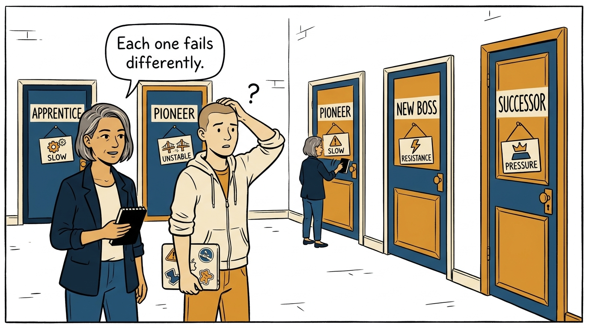
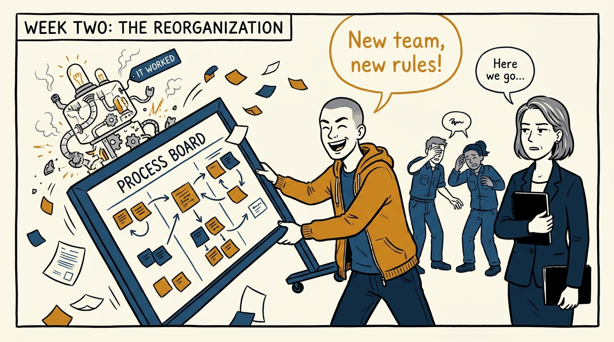
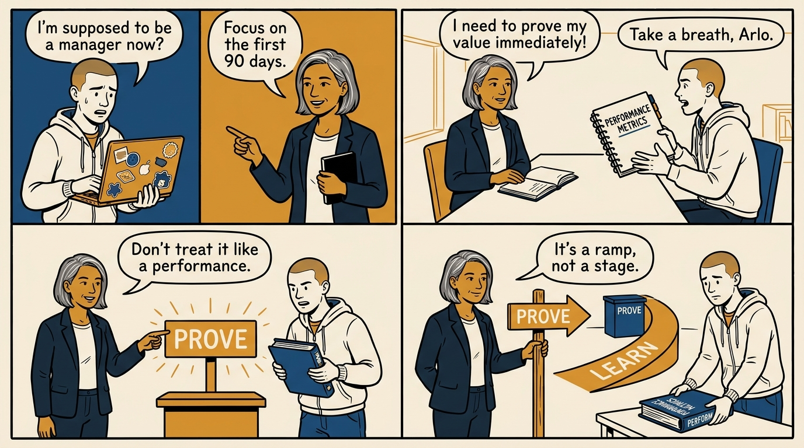
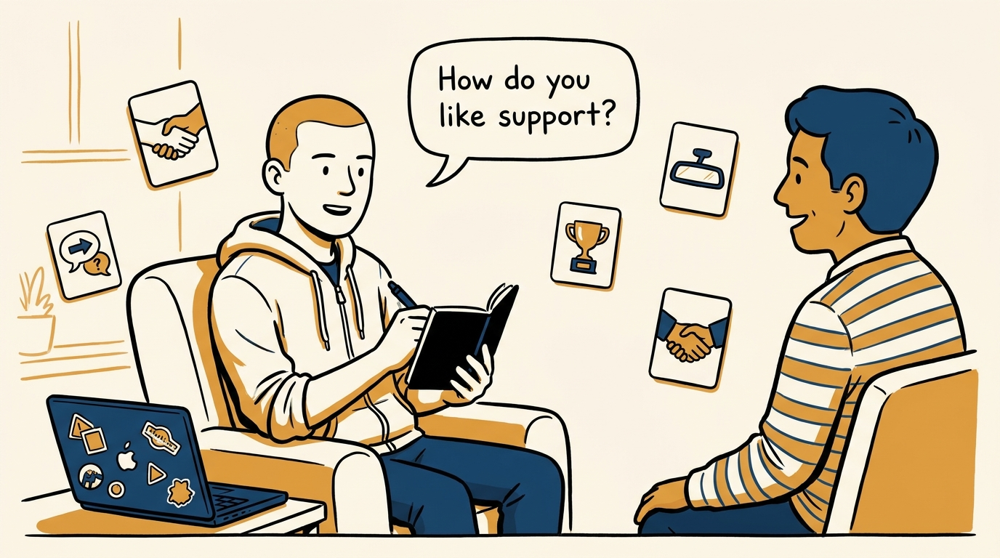
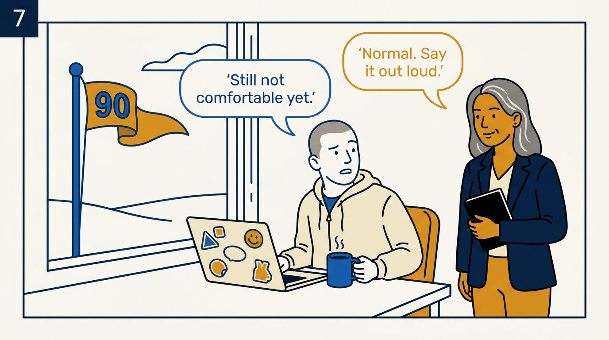
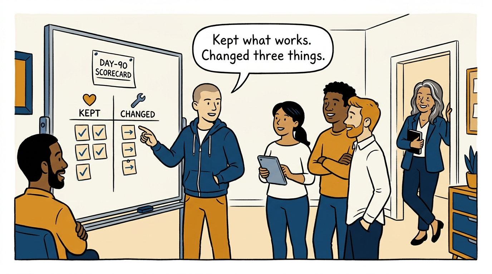

Why the first three months of a new management role are a ramp-up, not a proving period — in eight panels.

<!-- comic-style
{
  "cast": "VERA: a calm, seasoned engineering executive, short gray-streaked hair, dark blazer over a plain t-shirt, carries a small black notebook. ARLO: an engineer newly stepping into management, buzz-cut hair, zip-up hoodie with rolled sleeves, sticker-covered laptop under one arm.",
  "style": "Clean two-tone explainer comic, thick ink outlines, flat colors with deep blue and amber accents on a light background, generous white space, hand-lettered speech bubbles with SHORT readable text, no photorealism."
}
-->

**Panel 1:** *The hook: day one arrives with the urge to prove the promotion was justified.*

**Panel 2:** *The problem: there are four ways into the role — Apprentice, Pioneer, New Boss, Successor — and each path has its own traps.*

**Panel 3:** *The wrong way: the mark-leaver — reorganizing in week two to show impact, and breaking what the team silently depended on.*

**Panel 4:** *The principle: the first three months are a ramp-up, not a proving period — and acting otherwise is the fastest way to fail them.*

**Panel 5:** *How it runs: ask every report the five relationship questions — support, feedback, recognition, past managers, the ideal relationship — while questions are still free.*

**Panel 6:** *The mechanic: the 30-60-90 arc — listen and learn, clarify and strengthen, then make a few targeted, evidence-based changes and review them.*

**Panel 7:** *The cost: comfort lags competence — feeling at home may take far longer than three months, and pretending otherwise corrodes trust.*

**Panel 8:** *The closer: at day 90 the ramp has a verdict — a written scorecard, a few targeted changes, the good things explicitly preserved, and a team that trusts you.*
