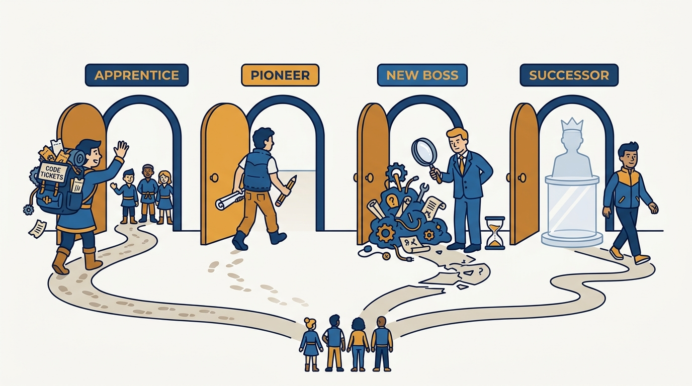
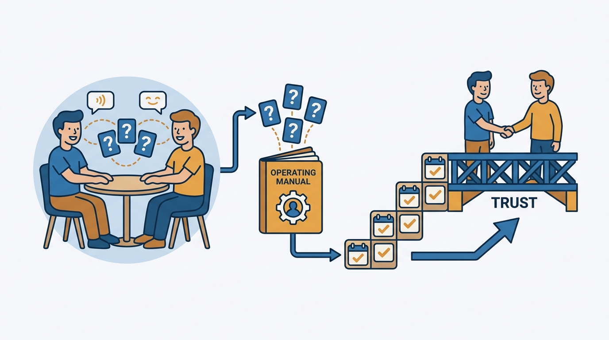
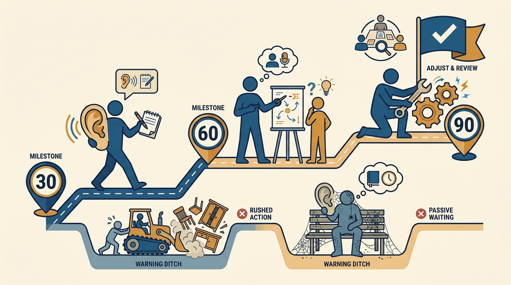

> **Status**: DRAFT
>
> **Principle**: The first three months of a new management role are a ramp-up period, not a proving period — and the fastest way to fail them is to act like they aren't. I start by naming which of the four entry paths I'm on — Apprentice, Pioneer, New Boss, or Successor — because each path has its own traps and its own advantages. Then I run the same core discipline regardless of path: ask lots of questions before trying to prove myself, learn how the team works before changing much, build trust through 1:1s and consistency, and move through a simple 30-60-90 arc — listen, then clarify and strengthen, then make targeted changes. Feeling fully comfortable may take much longer than three months, and I say so out loud.

## Statement

My operating model for entering a management role:

- **I name my starting path first.** Apprentice (managing part of my existing team), Pioneer (building a new team or function), New Boss (joining an established team as its leader), or Successor (taking over for a departing manager). The diagnosis comes before the plan, because the traps differ by path.
- **I treat the first three months as a ramp-up, explicitly.** I ask lots of questions before trying to prove myself, learn how the team works before changing too much, am open about my learning curve, and resist the urge to act like I already know everything.
- **Trust is built through 1:1s and consistency, deliberately.** I build a one-on-one relationship with each report and ask each of them directly: how do you like to be supported, what feedback is most helpful, how do you like to be recognized, what worked well with your previous manager, what would an excellent manager–report relationship look like to you?
- **I define success for the first 3 and 6 months in writing** and align with my own manager on ownership and expectations — so the ramp has a scorecard, not just a vibe.
- **I learn the system, not just the people.** How decisions get made, what "good" looks like in this team's context, the unwritten rules, current priorities and active projects, where the team is strong and weak, and who influences outcomes beyond the org chart — kept as a running list of observations, questions, and risks.
- **I change things on evidence, not to leave a mark.** I review processes for friction, decide what to preserve versus change, and hold changes until the 61–90 day window unless something is actively burning.
- **I run the 30-60-90 arc.** First 30 days: listen, learn, meet everyone, understand priorities and norms. Days 31–60: clarify expectations, strengthen relationships, start coaching more actively, identify a few key improvements. Days 61–90: make targeted changes, reinforce team standards, shift fully into manager mode, and review progress with my manager and team.

## How to Read This

This journal is my engineering-management operating model. This record distills the new-manager transition chapter of Julie Zhuo's *The Making of a Manager* (Portfolio/Penguin, 2019): the four entry paths, the listen-first ramp-up, and the questions that build the manager–report relationship from day one. It is the first-line counterpart to [[first-90-days]] in my executive journal — same arc, different altitude. The runnable version, including the path-specific checklists, lives in the **Checklist** tab of this post.

## Rationale

**Naming the entry path matters because each path fails differently.** The Apprentice has context and ramps fast, but inherits awkwardness with former peers, people who share less with them than before, and IC work that quietly becomes unsustainable. The Pioneer has total freedom and no inheritance, but must write down how decisions get made, define what good work means, and design a team's values from scratch — while resisting the pull to keep doing all the IC work alone. The New Boss gets a "new person" window to ask basic questions and reset their identity, but knows nothing about what is normal here versus what is a real issue. The Successor inherits a working team and increased responsibility, and the trap is trying to be a copy of the previous manager instead of leading differently. A generic ramp-up plan misses the trap that is actually pointed at me.

**Figure 1:** *Four entry paths, four different traps: the diagnosis comes before the plan, because a generic ramp misses the trap actually pointed at you.*

**Questions build more credibility in month one than answers do.** The instinct in a new role is to prove myself quickly — to demonstrate that the promotion or hire was justified. But early strong opinions delivered without context read as arrogance, and early changes made without understanding break things the team silently depended on. Asking lots of questions, being open about my learning curve, and giving people the benefit of the doubt is not weakness; it is calibration. The window in which basic questions are free closes fast — I use it.

**The relationship questions are the highest-leverage minutes of the whole quarter.** Asking each report how they like to be supported, what feedback helps them, how they want to be recognized, and what worked with their previous manager does two things at once: it gives me an operating manual for each person, and it signals that this manager relationship will be built around them, not around me. Trust compounds from consistency after that — showing up to the 1:1s, doing what I said, and being willing to have the direct, awkward conversation when it is needed.

**Figure 2:** *The relationship questions produce an operating manual for each person — and trust compounds from consistency afterward: showing up, doing what you said.*

**Changing nothing is a decision too — the arc ends in targeted change.** Listen-first is not change-never. The point of the first sixty days of learning is to earn the right, and gather the evidence, to make a few targeted changes in days 61–90 — and to know which existing processes to explicitly preserve. The failure modes are symmetric: the new manager who reorganizes everything in week two to leave a mark, and the new manager still "just listening" in month five. The 30-60-90 arc exists to prevent both, and the review with my manager and team at day 90 is where I check which failure I drifted toward.

**Figure 3:** *The arc — listen, then clarify and strengthen, then targeted change reviewed at day 90 — exists to prevent both symmetric failures: the week-two mark-leaver and the month-five listener.*

**Comfort lags competence, and pretending otherwise corrodes trust.** Feeling fully comfortable in the role may take much longer than three months. Saying that openly — to my manager, and in honest form to my team — costs little and buys the permission to keep asking questions. The Successor variant is the sharpest: acknowledge the increased responsibility openly, warn the team there may be bumps, and be honest about the ramp while still showing ownership.

## What This Means in Practice

| What this record says | What it does **not** say |
| --- | --- |
| Name the entry path and use its specific checklist. | The paths need different values — the core discipline (listen, trust, learn) is the same on all four. |
| Ask lots of questions before trying to prove myself. | Have no opinions — I keep a running list of observations, questions, and risks from day one. |
| Learn how the team works before changing too much. | Change nothing — days 61–90 exist precisely to make targeted changes on evidence. |
| Build trust through 1:1s and consistency. | Trust arrives with the title — for former peers and inherited teams it must be deliberately re-earned. |
| Define success for the first 3 and 6 months with my manager. | The ramp is finished at day 90 — feeling fully comfortable may take much longer, and that is normal. |
| Be open about my learning curve. | Perform uncertainty — the Successor stance is honesty about the ramp *with* visible ownership. |

Concretely: within the first week I can name my path and its top two traps; within the first month I have met every report and key stakeholder, asked each report the five relationship questions, and written the 3- and 6-month success definition with my manager; by day 90 I have made a small number of evidence-based changes, explicitly preserved what works, and reviewed the ramp with my manager and my team.

## Anti-Patterns

- **Proving instead of learning.** Arriving with answers, offering strong opinions before context, and acting like I already know everything — burning the one window when questions are free.
- **The mark-leaver.** Reorganizing processes in the first weeks to demonstrate impact, fixing things that were not broken, and breaking the things the team silently relied on.
- **The generic ramp.** Running the same plan regardless of path — coaching former peers like strangers, or joining an established team like a founder.
- **The Apprentice who never dropped the IC load.** Keeping the old individual workload next to the new management job until both are done badly; the plan to reduce IC work has to exist before it becomes unsustainable.
- **The Successor as tribute act.** Trying to be a copy of the departed manager instead of leading differently and focusing on what the team needs now.
- **Listening forever.** Still "just observing" in month five — the arc ends in targeted change and a progress review, not in permanent calibration.
- **The undefined ramp.** No written success definition for months 3 and 6, no alignment with my manager on ownership — so nobody, including me, can say whether the transition worked.

## Related Records

- [[first-90-days]] (executive journal) — the executive-level counterpart: the same listen-then-change arc run at organization scope rather than team scope.
- [[what-is-management]] — the job definition this ramp is entering: outcomes through the group, judged by results, not activity.
- [[management-101]] — the per-report contract; the five relationship questions in this record are how that contract gets negotiated on day one.
- [[leading-a-small-team]] — what the day-to-day looks like once the ramp ends: trust, useful 1:1s, and performance clarity.
- [[managing-yourself]] — the inner game of the transition; the discomfort this record says to expect is managed there.

## Scope and Revisiting

This record is `draft`. It governs how I enter any new management role and how I coach every new manager reporting to me through their first three months. I revisit it if a new-manager transition I ran or supervised reaches day 90 without a written success definition and review, if I catch a new manager (or myself) making structural changes in the first month without evidence, or if a path shows up in practice that the four-path model fits badly.

## Authoritative References

- Julie Zhuo, *The Making of a Manager: What to Do When Everyone Looks to You* (Portfolio/Penguin, 2019) — the "Your First Three Months" chapter this record distills, including the Apprentice / Pioneer / New Boss / Successor framing.
