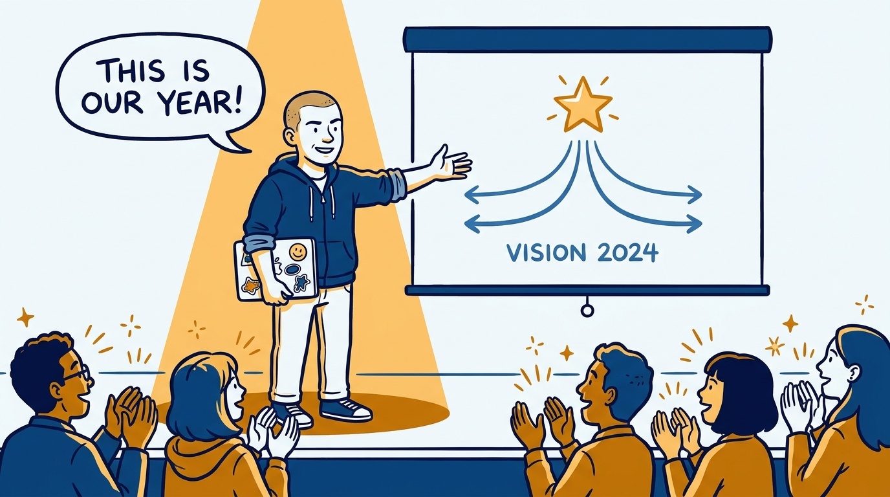
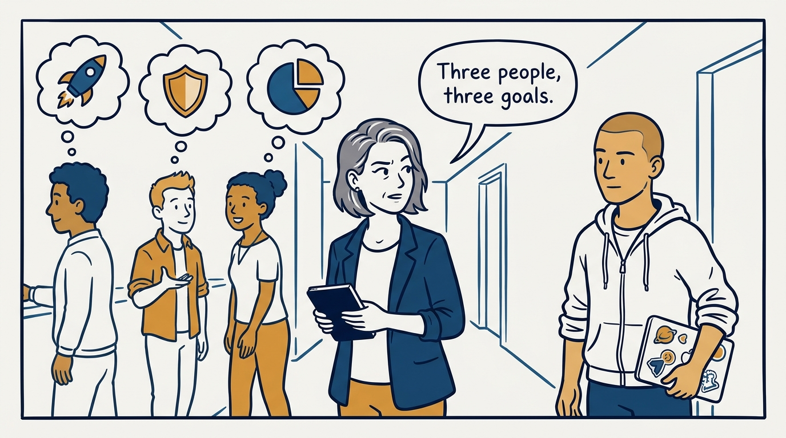
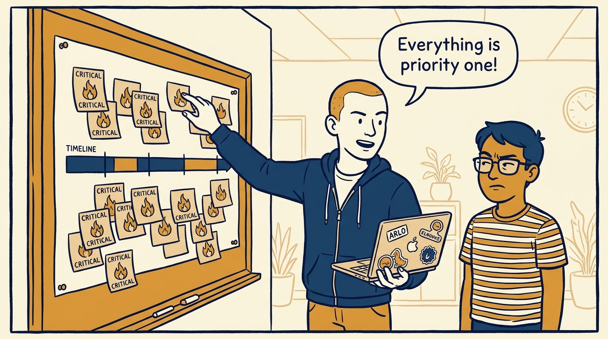
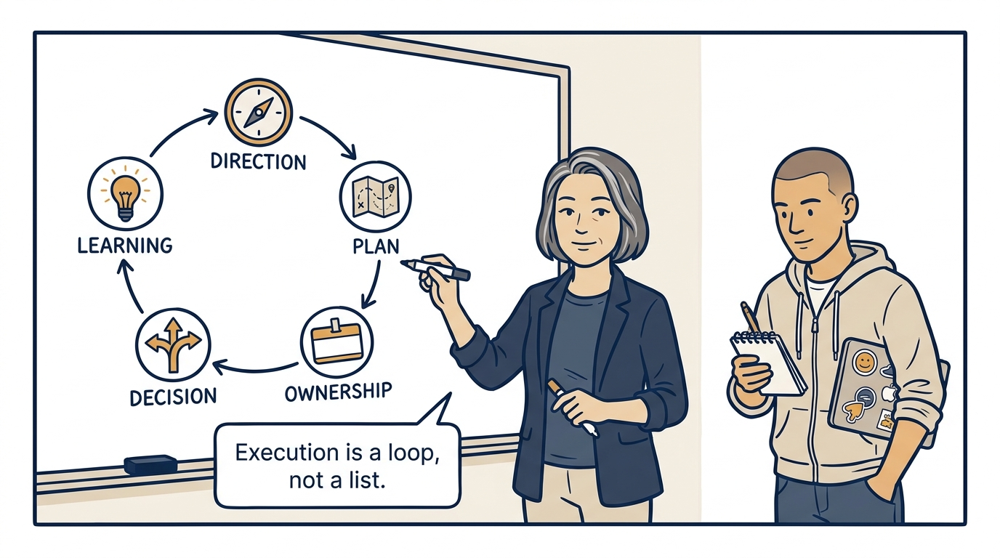
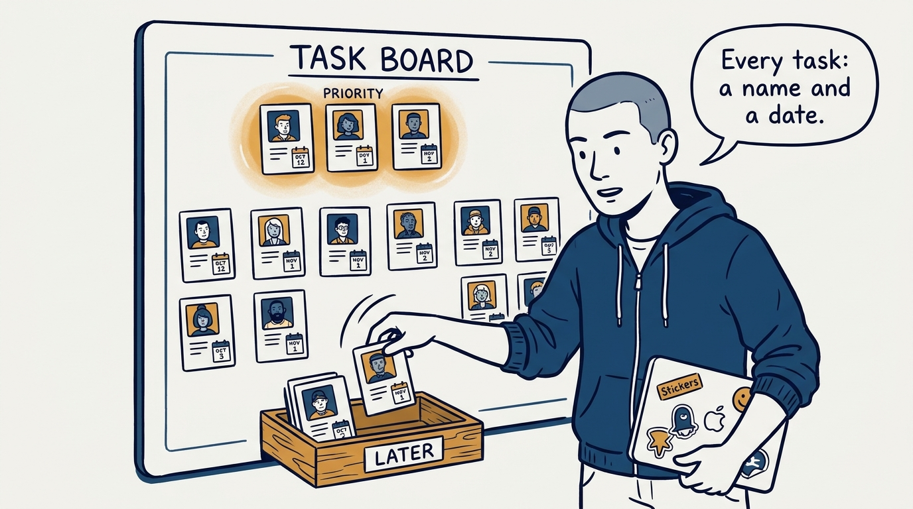
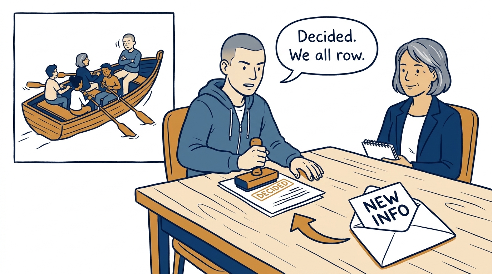
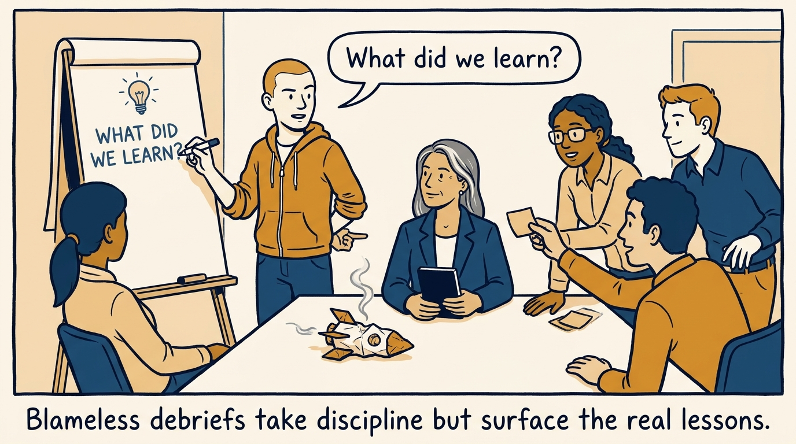
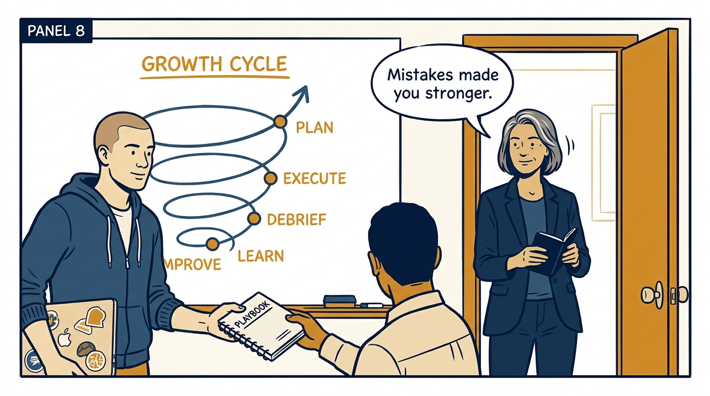

Why execution is a loop — direction, plan, ownership, decision, learning — in eight panels.

<!-- comic-style
{
  "cast": "VERA: a calm, seasoned engineering executive, short gray-streaked hair, dark blazer over a plain t-shirt, carries a small black notebook. ARLO: an eager early-career engineer climbing the ladder — in some strips a new lead or manager, in others the engineer being coached — buzz-cut hair, zip-up hoodie with rolled sleeves, sticker-covered laptop under one arm.",
  "style": "Clean two-tone explainer comic, thick ink outlines, flat colors with deep blue and amber accents on a light background, generous white space, hand-lettered speech bubbles with SHORT readable text, no photorealism."
}
-->

**Panel 1:** *The hook: the vision lands beautifully in the all-hands — or seems to.*

**Panel 2:** *The problem: asked separately, three people describe three different goals — the vision does not survive retelling.*

**Panel 3:** *The wrong way: every priority critical, zero buffer, no names — a plan written for the team you wish you had.*

**Panel 4:** *The principle: execution is a loop — direction, plan, ownership, decision, learning — and the whole loop has to run.*

**Panel 5:** *How it runs: a portfolio across time horizons, few priorities with real buffer, lower-value work cut on purpose — and every task carrying a name and a date.*

**Panel 6:** *The mechanic: decide fast when there is enough information, commit even after disagreeing — and reassess promptly when the facts change.*

**Panel 7:** *The cost: failures get dissected in the open — asking what we learned, not who failed, because blame would buy silence next time.*

**Panel 8:** *The closer: lessons become playbooks, playbooks close the loop — and the team comes out of every mistake stronger.*
