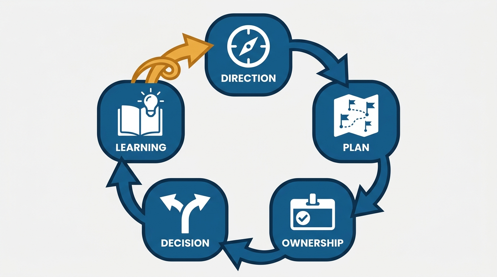
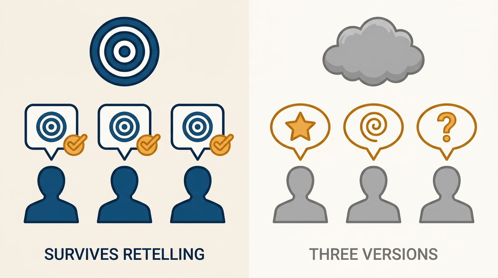
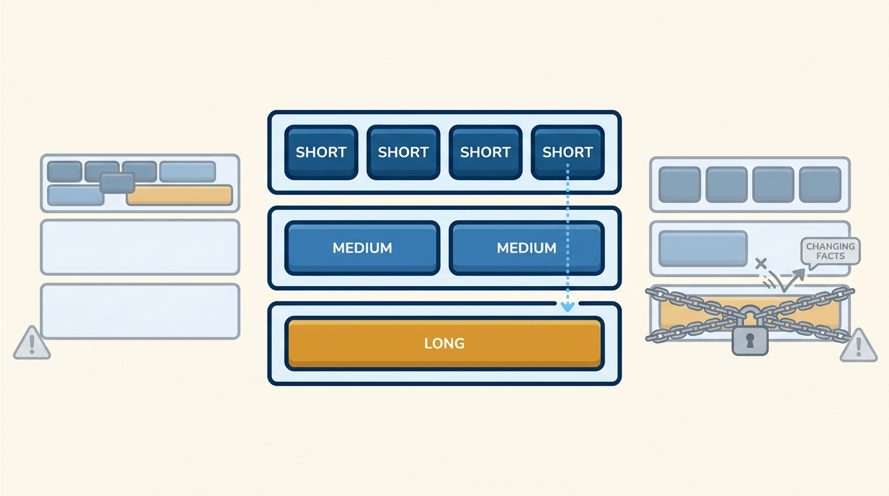

> **Status**: DRAFT
>
> **Principle**: Execution starts with a vision so concrete that different people describe the goal the same way, and a plan believable because it is built on the team's real strengths and constraints — not on hope. From there it is ownership and speed: every decision and task has an owner and a deadline, decisions are made quickly when enough information exists, and once made, everyone commits and moves — until important new information forces a fast, honest reassessment. The loop closes with blameless debriefs that turn repeated work into playbooks, so the team gets stronger after every mistake.

## Statement

My execution commitments:

- **Set a direction that survives retelling.** I define a concrete vision with a clear, measurable outcome, keep it easy to repeat and hard to misinterpret, and test it by checking whether different people describe the goal the same way.
- **Write believable plans.** Plans are based on the team's real strengths and constraints, pick the few priorities that matter most, cut or defer lower-value work, break big goals into smaller milestones, and carry buffer for delays, surprises, and changing conditions.
- **Give everything an owner.** Every decision, task, and follow-up has a named owner, a clear "what," and a "by when." Work is prioritized from most important to least, and top priorities get the most time and attention.
- **Decide fast, commit, and reassess honestly.** When enough information is available, I make the call — especially on reversible decisions — and expect commitment afterward even from people who disagreed. When important new information arrives, the plan is revisited promptly, not defended.
- **Balance time horizons.** I define the long-term vision first and work backward, connect short-term work to long-term goals, and keep a portfolio of short-term improvements, medium-term projects, and longer-term bets — over-optimizing for the immediate term is as much a failure as clinging to a long-term plan that no longer fits reality.
- **Turn learning into process.** I run regular debriefs focused on learning, not blame, capture and share the lessons, turn repeated work into playbooks and checklists, and update processes as the team learns.

**Figure 1:** *Execution is a loop, not a list: direction, plan, ownership, decision, learning — and the learning arc feeds the next cycle, so the team gets stronger every pass.*

## How to Read This

This journal is my engineering-management operating model, each record grounded in one source checklist. This record distills the "getting things done" chapter of Julie Zhuo's *The Making of a Manager* (Portfolio/Penguin, 2019): direction, believable plans, organized execution, balanced time horizons, and **process that improves itself**. The runnable version — including the "signs the team is executing well" self-check — lives in the **Checklist** tab of this post.

## Rationale

**A vision that cannot survive retelling is not a vision.** The test is not whether the goal sounds good when I present it — it is whether three different people, asked separately, describe it the same way. A concrete, measurable outcome that is easy to repeat and hard to misinterpret does **coordination work while I am not in the room**; a vague aspiration forces every ambiguous call back to me. That is why I test **the retelling, not the slide**.

**Figure 2:** *The test is not the slide — it is whether three people, asked separately, describe the goal the same way.*

**Plans fail when they are written for the team you wish you had.** A believable plan is grounded in the team's real strengths and constraints — who is actually good at what, what will actually take longer than hoped. It concentrates on the few priorities that matter, defers the rest deliberately, and carries explicit buffer, because delays and surprises are **a certainty, not a risk**. Milestones exist so believability can be checked along the way rather than discovered at the deadline.

**Ambiguous ownership is where execution quietly dies.** Work with no named owner and no deadline is work that **everyone assumes someone else is doing**. The unglamorous discipline — who owns each decision, what must be done, by whom, by when — is what makes a plan operational instead of aspirational. The same discipline governs decisions: made quickly when the information is sufficient, committed to once made, and revisited promptly when reality changes. Slow decisions and relitigated decisions are both taxes on the team; **commitment after disagreement** is what keeps speed from fracturing into churn.

**A team that only ships this quarter is quietly borrowing from next year.** Over-optimizing the immediate term feels productive right up until the medium-term projects and long-term bets that should be maturing now were never started. Working backward from the long-term vision, and keeping an explicit portfolio across horizons, forces **the trade-off into the open**. The symmetric failure is just as real: staying locked into a long-term plan that new information has already invalidated. Both are cured by the same habit — connect short-term work to long-term goals, and **reassess fast when the facts change**.

**Figure 3:** *The portfolio spans horizons, with short-term work connected to long-term goals — and both failure modes in view: over-optimizing the immediate term, and defending a plan the facts have outrun.*

**Blame buries the lesson; debriefs convert it into process.** A debrief focused on who failed produces defensiveness and thinner information next time. A debrief focused on what we learned produces lessons worth capturing — and lessons become durable only when **repeated work turns into playbooks** and checklists that outlive the people who learned them the hard way. That is the closing of the loop: a team that runs this cycle keeps learning and **comes out of mistakes stronger**, which is the most reliable sign of good execution I know.

## What This Means in Practice

| What this record says | What it does **not** say |
| --- | --- |
| The vision is concrete, measurable, and survives retelling. | The vision is a slogan — if people describe it differently, it has failed the test. |
| Plans are built on real strengths, few priorities, and buffer. | Plans are exhaustive — cutting and deferring lower-value work is part of planning, not a failure of it. |
| Every task and decision has an owner and a deadline. | The manager owns everything — ownership is **distributed and named, not hoarded**. |
| Decide quickly when there is enough information. | Decide recklessly — speed applies most to reversible decisions; irreversible ones earn more care. |
| Commit after the decision, even if you disagreed. | Disagreement is unwelcome — it belongs before the decision, and reassessment reopens when new information arrives. |
| Debriefs are regular and blameless, and produce playbooks. | Debriefs are trials — a retrospective that assigns fault produces **silence, not learning**. |

Concretely: my team's goal can be **restated consistently** by people who did not write it; the plan document names owners and deadlines and shows what was deliberately cut; the roadmap contains visible short-, medium-, and long-term work; decisions have dates; and our playbooks **trace back to specific debriefs**.

## Anti-Patterns

- **The unrepeatable vision.** A goal that sounds inspiring in the all-hands but comes back in three different versions when three people are asked what the team is doing.
- **The hope-based plan.** A plan with every priority marked critical, zero buffer, and effort estimates written for the team you wish you had.
- **Ownerless work.** Tasks and follow-ups that live in meeting notes with no name and no date attached — everyone's responsibility, so no one's.
- **The stalled reversible decision.** Treating a cheaply undoable choice with the ceremony of a one-way door, while the team waits.
- **Relitigating after commitment.** Reopening a made decision without new information — disagreement that should have been spent before the call, spent after it instead.
- **The immovable long-term plan.** Defending last year's plan against this quarter's facts because changing course would mean admitting the plan was wrong.
- **The blame-seeking debrief.** Retrospectives that produce a culprit instead of a playbook — after which people stop reporting problems early.

## Related Records

- [[managing-a-team]] — the Manager's Path view of running a single team; this record is the execution loop that team runs on.
- [[amazing-meetings]] — decision meetings and reviews are where ownership, deadlines, and commitment become visible; badly run meetings are where they dissolve.
- [[operational-excellence]] — the operational bar for running systems in production; the debrief-to-playbook loop here is the same muscle applied to delivery.
- [[managing-a-growing-team]] — as the team grows, this loop must run without me in every room; delegation is how the execution discipline scales.
- [[first-three-months]] — a new manager earns the credibility to set direction before setting it; this record assumes that foundation.

## Scope and Revisiting

This record is `draft`. It governs how teams I manage set direction, plan, decide, and improve their own process. I revisit it if the retelling test starts failing on a goal I thought was clear, if a quarter passes with **no playbook or checklist emerging** from repeated work, or if I catch the roadmap **fully consumed by short-term work** with no medium- or long-term bets in flight.

## Authoritative References

- Julie Zhuo, *The Making of a Manager: What to Do When Everyone Looks to You* (Portfolio/Penguin, 2019) — the "getting things done" chapter this record distills.
