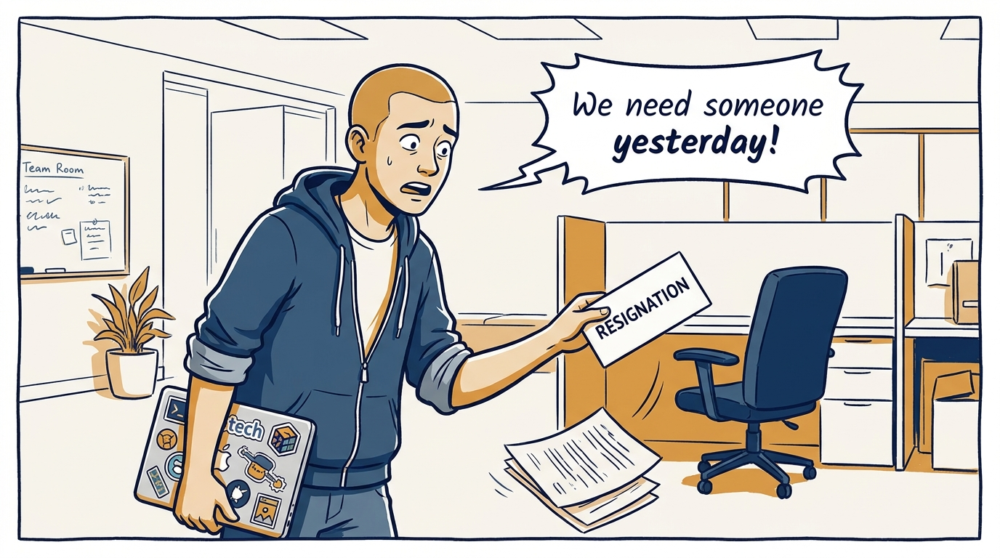
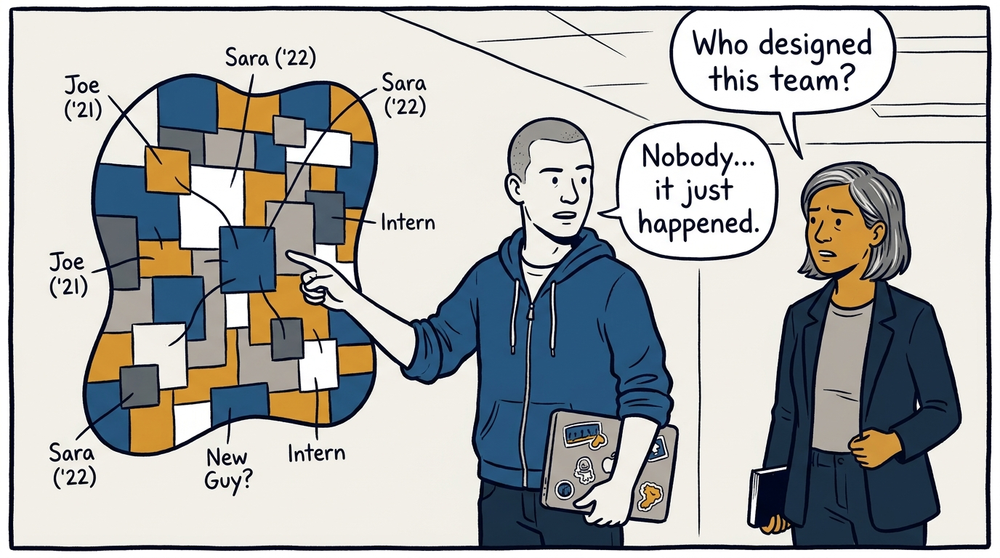
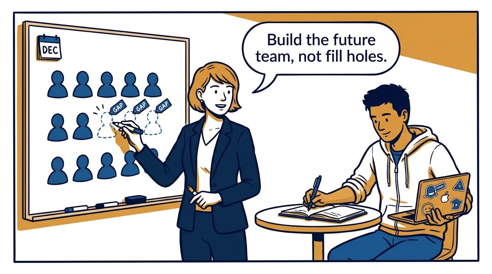
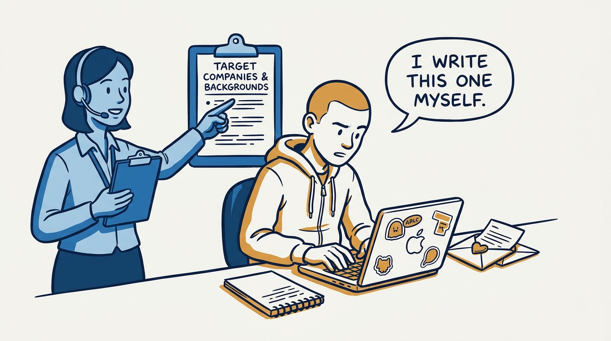
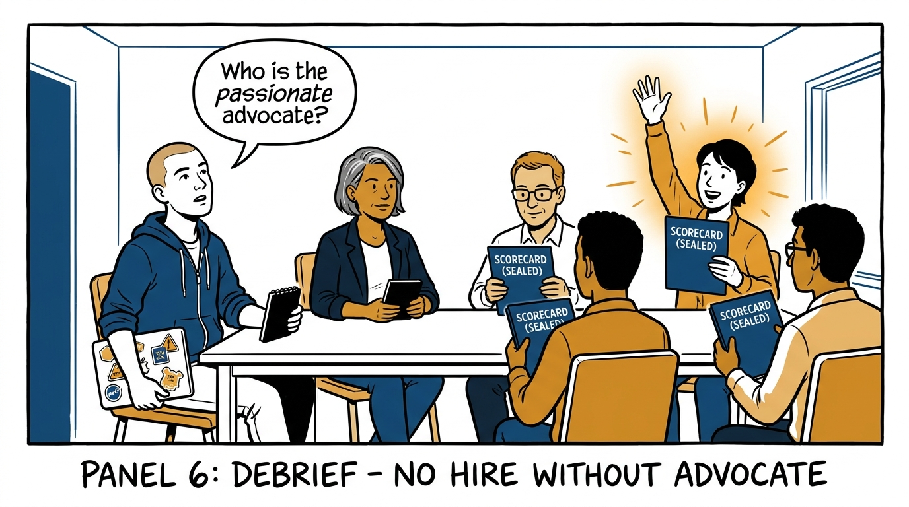
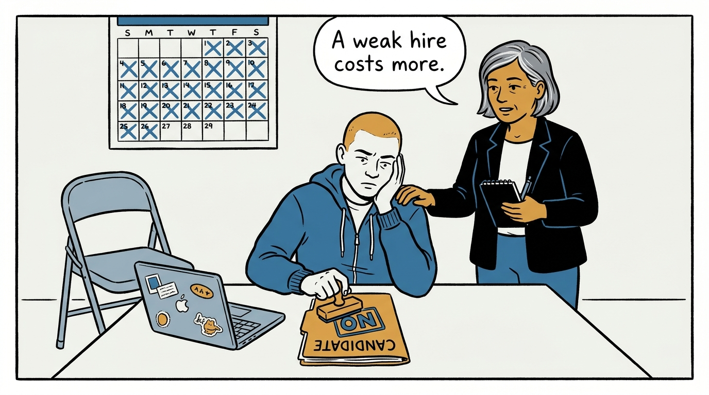
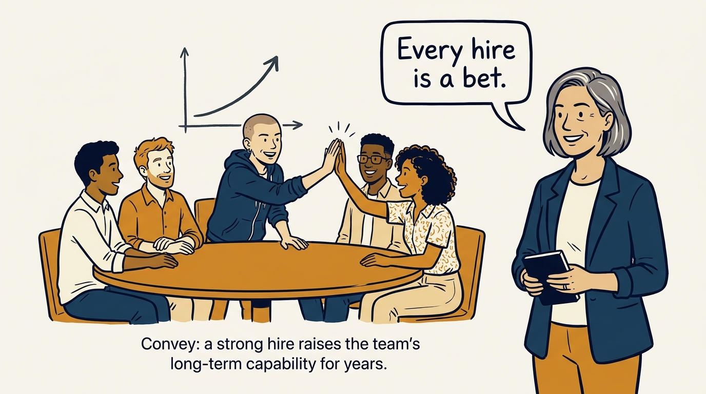

Why hiring is building the future of the team — never filling holes — in eight panels.

<!-- comic-style
{
  "cast": "VERA: a calm, seasoned engineering executive, short gray-streaked hair, dark blazer over a plain t-shirt, carries a small black notebook. ARLO: an eager early-career engineer climbing the ladder — in some strips a new lead or manager, in others the engineer being coached — buzz-cut hair, zip-up hoodie with rolled sleeves, sticker-covered laptop under one arm.",
  "style": "Clean two-tone explainer comic, thick ink outlines, flat colors with deep blue and amber accents on a light background, generous white space, hand-lettered speech bubbles with SHORT readable text, no photorealism."
}
-->

**Panel 1:** *The hook: a resignation lands, and the reflex is to fill the hole — fast.*

**Panel 2:** *The problem: hire reactively for long enough and the team's shape becomes an accident of attrition.*

**Panel 3:** *The wrong way: a gut-feel verdict from one short conversation — interviews are far too noisy for that.*

**Panel 4:** *The principle: hiring is building the future of the team — plan the year-end team and its gaps before the req opens.*

**Panel 5:** *How it runs: own it personally — write the job description yourself and shape a pipeline that feels personal, not generic.*

**Panel 6:** *The mechanic: same core questions, distinct dimensions, independent debriefs — and no offer without at least one passionate advocate.*

**Panel 7:** *The cost: the bar means saying no to a "maybe" while the chair stays empty — because a weak hire compounds on the whole team.*

**Panel 8:** *The closer: every hire is a bet on the team's long-term capability and its diversity of perspective — the strong ones compound for years.*
