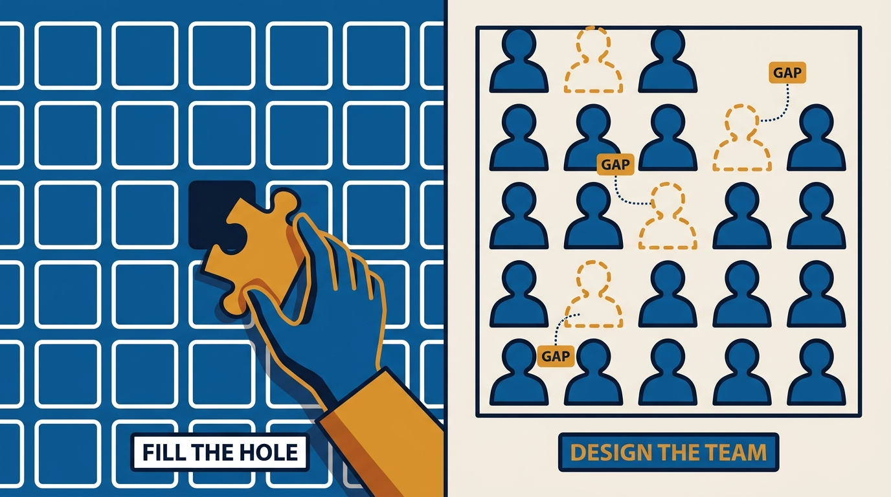
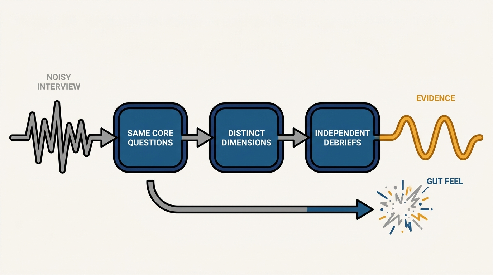
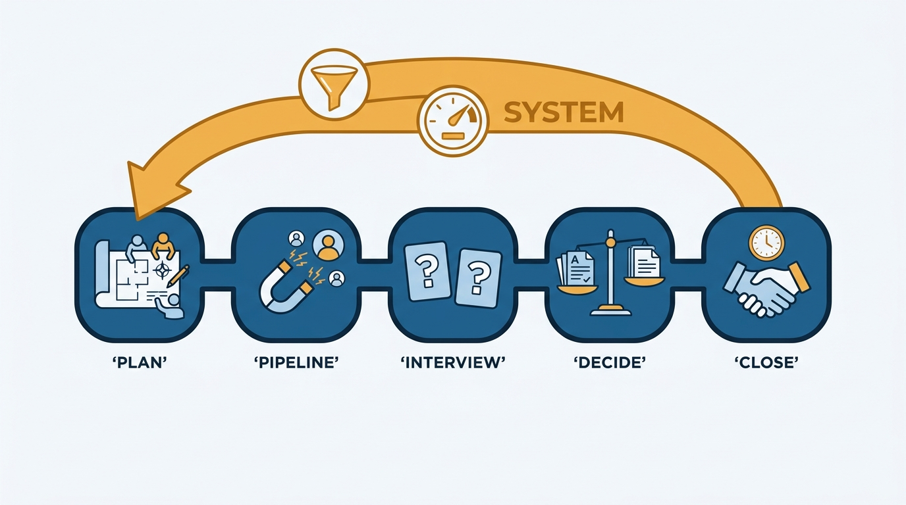

> **Status**: DRAFT
>
> **Principle**: Hiring is one of the highest-leverage things I do, and I treat it as building the future of the team — never as filling holes. I plan the team I want before I open a role, own the process personally even when recruiters are involved, run consistent interviews that are decided on evidence rather than gut feel, and hold out for candidates with at least one passionate advocate who raise the team's long-term capability. A weak hire is a decision I refuse to make; a strong hire compounds for years.

## Statement

My hiring commitments:

- **Plan the team, then open the role.** Before I hire, I map where I want the team to be by year-end, identify the skill, strength, and experience gaps, decide what kinds of people would strengthen the team's diversity, and define the level and scope of each open role. I do not hire reactively.
- **Own the process personally.** Even with recruiting partners, hiring is my responsibility: I write the job description myself, I am specific about the skills and experiences I want, and I partner closely with recruiting on sourcing, interviewing, and closing — including outreach that feels personal and relevant.
- **Build the pipeline deliberately.** I create a sourcing strategy before interviewing starts — target backgrounds, companies, titles, keywords — look beyond standard patterns, ask trusted people for recommendations, and treat references as a meaningful signal rather than a box-checking step.
- **Run consistent interviews and decide on evidence.** Questions are prepared ahead of time; every candidate gets the same core set; interviewers cover different dimensions and debrief independently before any group discussion. Interviews are noisy, so I do not decide on gut feel from a short conversation.
- **No weak hires; look for an advocate.** I hold out for at least one strong, passionate advocate, reject candidates who show toxic behavior regardless of skill, and favor people who can grow beyond the current role and raise the team's long-term capability.
- **Close like I mean it.** Once I decide, I move fast, stay personally involved, explain why the role matters and why this person is a strong fit, and keep communication warm, clear, and frequent until the candidate has decided.
- **Scale with systems, and slow down for leaders.** At volume, I work the funnel metrics, train interviewers, and break the process into parts I can improve — systems, not one-off heroics. For manager and senior-leadership hires I do extra research, involve people who understand the function deeply, and assess values alignment, not just competence.

## How to Read This

This journal is my engineering-management operating model, each record grounded in one source checklist. This record distills the hiring chapter of Julie Zhuo's *The Making of a Manager* (Portfolio/Penguin, 2019): hiring as deliberate team-building — planning ahead, owning the process, building the pipeline, interviewing consistently, deciding well, closing warmly, and scaling the machine. The runnable version lives in the **Checklist** tab of this post.

## Rationale

**Hiring is team-building, and team-building starts before the job posting.** A role opened reactively — someone quit, a project is late — gets filled with whoever is available, and the team drifts into whatever shape its attrition dictates. Planning the year-end team first turns every opening into a design decision: which gaps in skill, strength, and experience this hire should close, and what perspective the team is currently missing. That is why I define level and scope per role rather than posting a generic req.

**Figure 1:** *A role opened reactively gets filled with whoever is available; a role opened against a year-end team map closes a named gap on purpose.*

**Delegating hiring to recruiters delegates the future of my team.** Recruiters are essential partners, but they cannot know what the team needs the way I do. When I write the job description myself and shape the outreach personally, the pipeline reflects the team I am building rather than a keyword match — and candidates can tell the difference between a manager who wants *them* and a process that wants *a body*.

**Interviews are noisy instruments, so the process must supply the signal.** A short conversation is an imperfect read on years of future work, which is why gut feel fails and bias creeps in. Consistent core questions make candidates comparable; multiple interviewers covering different dimensions widen the read; independent debriefs before group discussion keep the loudest voice from becoming the verdict. Better questions help too: real past work and owned contributions, not hypotheticals — show me the apps, the writing, the pitches, and tell me which part of the teamwork was yours.

**Figure 2:** *Interviews are noisy instruments: the process supplies the signal — consistent questions, distinct interviewer dimensions, and independent debriefs — where gut feel only amplifies the noise.*

**A "weak hire" is the most expensive decision available, because it compounds.** The marginal candidate absorbs onboarding, coaching, and eventually a hard conversation — cost that lands on the whole team. The tests I use come straight from the source: is there at least one strong, passionate advocate? Can this person grow beyond the current role? Do they raise the team's long-term capability? Toxic behavior is a rejection regardless of talent, and a team of people who all look, think, and work alike makes worse decisions than a diverse one — so diversity of background and viewpoint is a hiring goal, not a compliance afterthought.

**Hiring is a long game played by the whole team.** Great candidates say no, and careers are long — so I keep in touch, build relationships before roles open, and invest in the team's reputation. When growth is the priority, hiring becomes a system: funnel metrics, trained interviewers, a process broken into improvable parts, and a high bar that every leader on the team can articulate — because team-building is everyone's job, not a manager's side quest.

**Figure 3:** *The arc runs from team plan to warm close — and at volume it becomes a system: funnel metrics, trained interviewers, and a process improved part by part.*

## What This Means in Practice

| What this record says | What it does **not** say |
| --- | --- |
| I plan the year-end team before opening a role. | Headcount planning replaces judgment — the plan tells me what to look for, not whom to pick. |
| I own the process personally, even with recruiters. | I do everything myself — recruiting is a close partnership, with the accountability staying with me. |
| Every candidate gets a consistent core set of questions. | The interview is a rigid script — tailored questions probe the role's actual needs on top of the core. |
| No hire without a strong, passionate advocate. | Consensus is required — one advocate plus no serious concerns beats lukewarm unanimity. |
| I move fast and stay involved once I decide to make an offer. | Speed excuses sloppiness — the speed comes after a disciplined decision, not instead of one. |
| Leadership hires get extra research and values assessment. | Senior candidates are exempt from process — they get more scrutiny, not less. |
| References are a meaningful signal. | Old negative feedback is disqualifying — people change; dated signals get weighed, not obeyed. |

Concretely: every open role on my team traces to a written gap in the year-end team plan, has a job description I wrote, and runs through a loop with prepared questions, distinct interviewer dimensions, and independent written debriefs. My offer decisions name the advocate; my rejections of "maybe" candidates are fast; and my calendar shows real closing time on every offer that matters.

## Anti-Patterns

- **Hole-filling.** Opening a req the day someone resigns and hiring the first plausible candidate — the team's shape becomes an accident of attrition.
- **Outsourced ownership.** Handing recruiting a generic job description and waiting for finalists, then blaming the pipeline for the team you built.
- **The gut-feel verdict.** Deciding from chemistry in a thirty-minute conversation, with every interviewer probing the same dimension and the debrief anchored by whoever speaks first.
- **The weak hire.** Talking yourself into a marginal candidate because the role has been open too long — no advocate, no growth headroom, hired anyway.
- **Cloning the team.** Sourcing only from the backgrounds, companies, and profiles already on the team, then wondering why every discussion reaches the same conclusion.
- **The slow, cold close.** Deciding to hire and then going quiet — leaving a wanted candidate to infer from silence that they are not wanted.
- **Heroic scaling.** Meeting a growth target through one-off effort spikes instead of funnel metrics, trained interviewers, and a process that improves part by part.

## Related Records

- [[hiring]] — the executive journal's view of hiring as a governed system: loops, leveling, compensation, and metrics; this record is the hiring-manager's craft that runs inside that machine.
- [[interview-loop]] — the people journal's structured interview loop; the consistent-questions and independent-debrief discipline here is what that loop operationalizes.
- [[managing-a-growing-team]] — hiring strong leaders and building self-reliant teams is how a growing team scales past its manager.
- [[nurturing-culture]] — every hire either reinforces or dilutes the culture; the hiring bar is where culture is actually enforced.
- [[leading-a-small-team]] — the team the hiring plan is building; strengths, gaps, and trust at the individual level.

## Scope and Revisiting

This record is `draft`. It governs how I hire onto teams I manage: planning, pipeline, interviewing, decisions, closing, and leadership hires. I revisit it if I catch myself opening roles with no written team plan behind them, if a hire made without a passionate advocate recurs, or if the team's composition after a year of hiring looks like a copy of the team a year ago.

## Authoritative References

- Julie Zhuo, *The Making of a Manager: What to Do When Everyone Looks to You* (Portfolio/Penguin, 2019) — the hiring chapter this record distills.
