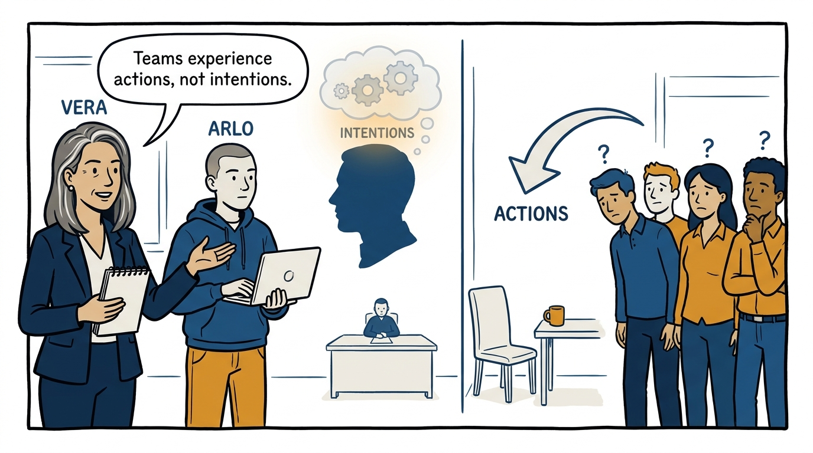
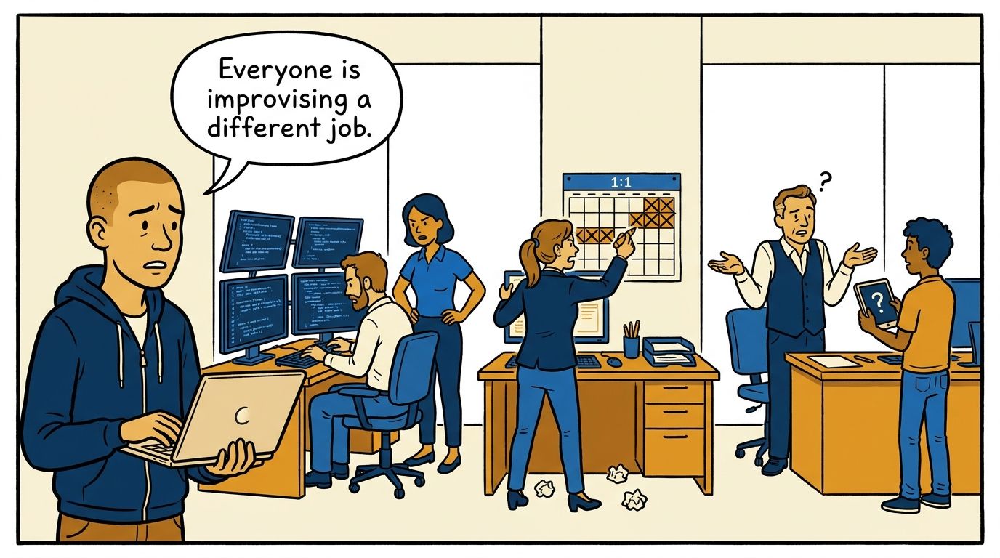
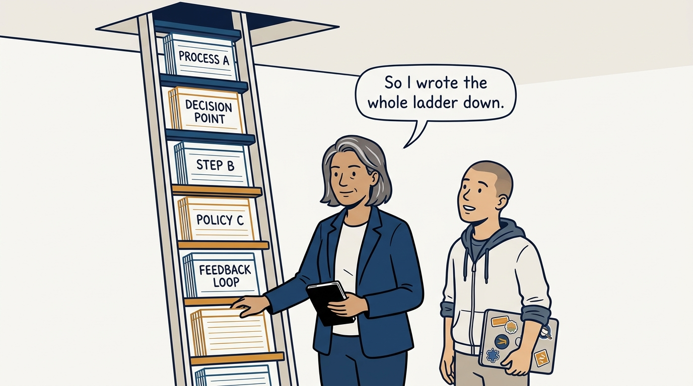
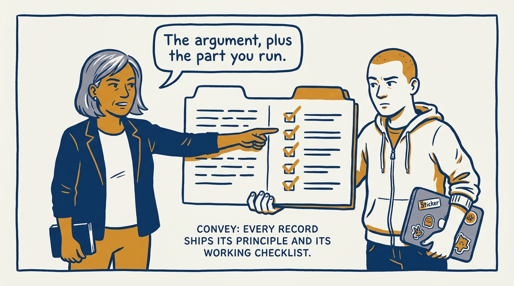
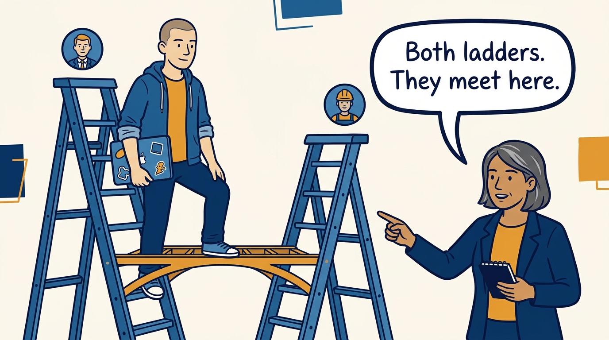
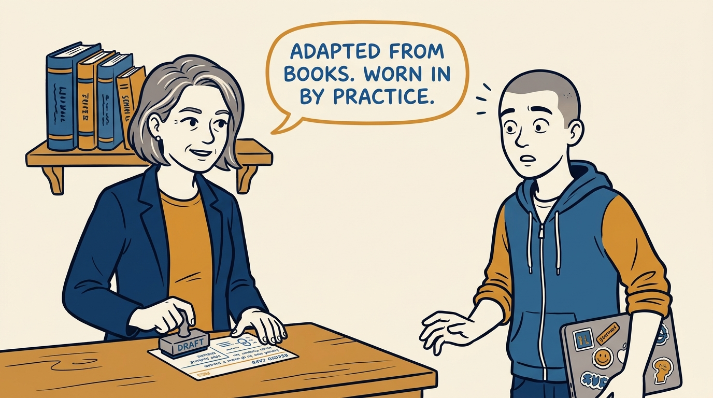
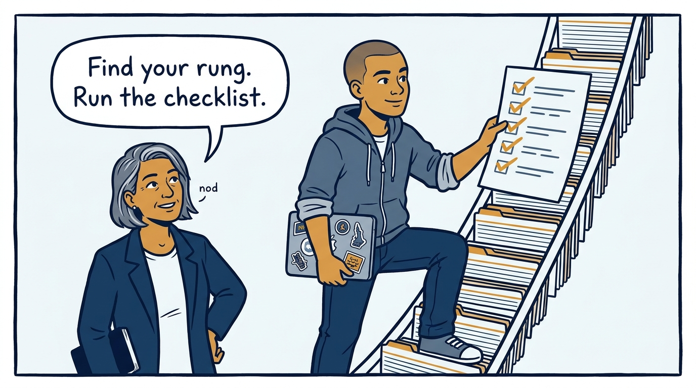

Why an executive writes the whole management ladder down — in eight panels.

<!-- comic-style
{
  "cast": "VERA: a calm, seasoned engineering executive, short gray-streaked hair, dark blazer over a plain t-shirt, carries a small black notebook. ARLO: an eager early-career engineer climbing the ladder — in some strips a new lead or manager, in others the engineer being coached — buzz-cut hair, zip-up hoodie with rolled sleeves, sticker-covered laptop under one arm.",
  "style": "Clean two-tone explainer comic, thick ink outlines, flat colors with deep blue and amber accents on a light background, generous white space, hand-lettered speech bubbles with SHORT readable text, no photorealism."
}
-->

**Panel 1:** *The hook: nobody working with me should have to guess what good management looks like at any rung.*

**Panel 2:** *The problem: an organization never experiences intentions — it experiences what managers at every rung actually do.*

**Panel 3:** *The wrong way: leave the ladder unwritten and every manager improvises a different job.*

**Panel 4:** *The principle: the whole management ladder, written down as records — what each rung is for and what I hold it to.*

**Panel 5:** *How it runs: every record states the principle in the article and ships the runnable checklist in its own tab.*

**Panel 6:** *The mechanic: the management ladder and the engineer career ladder covered side by side — meeting at the tech lead rung and the manager–report contract.*

**Panel 7:** *The cost: this is an operating manual, not a book report — records stay draft until practice wears them in, and each names when it gets revised.*

**Panel 8:** *The closer: find your rung, read what it commits to, and run its checklist against yourself.*
