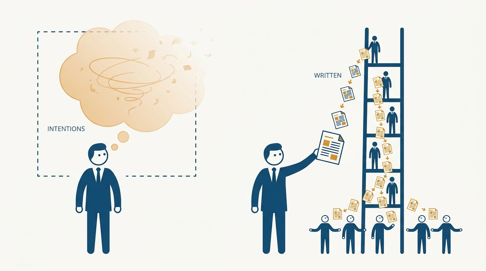
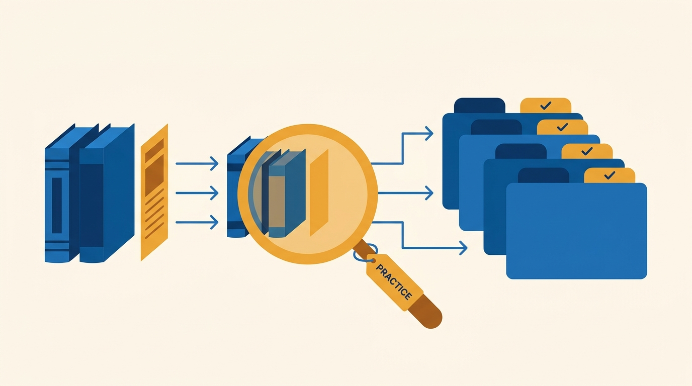
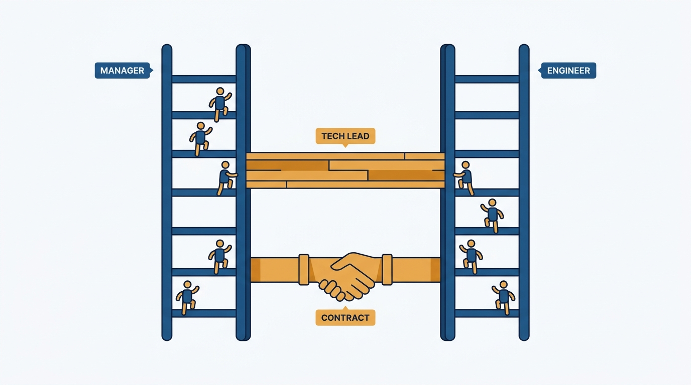

> **KEY POINTS:**
>
> * **This journal is my engineering-management operating model, written down** — 31 records covering the management ladder rung by rung, the first-line management fundamentals, the operational bar I hold software teams to, and the engineer career ladder seen from the manager's side — grounded in Camille Fournier's *The Manager's Path*, Julie Zhuo's *The Making of a Manager*, and Gergely Orosz's *The Software Engineer's Guidebook*.
> * **Every record ships its working checklist, not just the argument** — the article states the principle I commit to and why; the **Checklist** tab carries the runnable checklist distilled from the source, ready to execute at that rung of the ladder.
> * **Read it as an operating manual, not a book report** — the material is adapted from books I trust through a practitioner-executive lens; where my practice differs from a source, the record says so, and every record names the conditions under which I would revise it.

 

If you work with me — as an engineer or manager in my organization, as my peer, or as my own manager — you should not have to guess what I think good management looks like at any rung of the ladder. This journal writes it down: what I owe every report and ask of them, how mentoring and the tech lead role are run, what changes when you manage a team, several teams, or other managers, what senior leadership is actually for, the operational bar I hold software teams to, and the expectations I hold engineers to as their careers grow from competent to staff and principal. Each record states the operating principle in the article; the runnable checklist lives in the record's **Checklist** tab.

## Why an Executive Writes the Ladder Down

Because management quality at scale is a systems property, not a personality trait. An organization does not experience my intentions; it experiences what managers at every rung actually do — whether 1:1s happen and develop people, whether tech leads run projects or just write code, whether managers of managers hear ground truth or filtered reports, whether operational readiness is inspected or assumed. Writing the ladder down does two things: it tells the managers I work with what I will hold them to at each rung, and it tells everyone else what they are entitled to expect from their manager — including from me.

**Figure 1:** *An organization never experiences intentions — it experiences what managers at every rung actually do, so the ladder gets written down.*

This journal inherits its charter from its siblings. The [engineering-executive journal](../grounded-engineering-executive/introduction.html) commits me to an inspectable executive operating model; the [people-management-tools journal](../grounded-people-management-tools/introduction.html) carries the concrete instruments — interview loops, career conversations, performance mechanics. This journal covers the ladder itself: what each management role is for, how the step-changes between rungs work, and what the engineer's side of the contract looks like at every career stage.

## What a Record Looks Like

Every record follows the same shape, so you always know where to look:

| Part | What it gives you |
| --- | --- |
| **Status / Principle** blockquote | The operating principle in one quotable paragraph. |
| **Statement → Rationale → Anti-Patterns** | The ADR-shaped body: what I commit to, why it holds, what it does *not* say, and the failure modes it guards against. |
| **Checklist** tab | The working checklist distilled from the source — the part you run. |
| **View spec** link | The authoring contract behind the post — intent, success criteria, and a decision log, versioned like everything else. |

Every record carries `status: draft`, deliberately: the material is adopted from sources I trust and adapted ahead of being fully worn in at my current scope, and each record names its own revisiting conditions.

## Where the Material Comes From

Three books and one article, credited openly and per record:

- **Camille Fournier, *The Manager's Path*** (O'Reilly, 2017) — the management ladder, from being managed to senior leadership. The eight records in that section follow the book's chapters.
- **Julie Zhuo, *The Making of a Manager*** (Portfolio/Penguin, 2019) — first-line management fundamentals. Ten records follow the book's chapters; [[managing-downturn]] and [[managing-remote-teams]] are supplementary checklists extending the book's themes rather than chapter distillations.
- **Gergely Orosz, *The Software Engineer's Guidebook*** (Pragmatic Engineer, 2023) — the engineer career ladder and its career mechanics, read from the manager's side.
- **Kate Matsudaira, "Software Managers' Guide to Operational Excellence"** — the single record in the Operational Excellence section.

The sources are chapter checklists distilled from these books; the records state what *I* will run and hold people to, in first person, with the adaptations I have made.

**Figure 2:** *Trusted books, read through a practitioner lens, become first-person records — each shipping its argument and its runnable checklist.*

## The Map

Four sections after this one:

- **The Manager's Path** — the ladder rung by rung: [[management-101]], [[mentoring]], [[tech-lead]], [[managing-people]], [[managing-a-team]], [[managing-multiple-teams]], [[managing-managers]], [[senior-leadership]].
- **Operational Excellence** — the operational bar: [[operational-excellence]].
- **The Making of a Manager** — first-line fundamentals: [[what-is-management]], [[first-three-months]], [[leading-a-small-team]], [[feedback]], [[managing-yourself]], [[amazing-meetings]], [[hiring-well]], [[getting-things-done]], [[managing-a-growing-team]], [[nurturing-culture]], plus [[managing-downturn]] and [[managing-remote-teams]].
- **The Software Engineer's Guidebook** — the engineer's side of the ladder: [[competent-software-engineer]], [[well-rounded-senior-engineer]], [[pragmatic-tech-lead]], [[staff-and-principal-engineers]], and the career mechanics: [[own-your-career]], [[performance-review-cycle]], [[promotions]], [[changing-jobs]], [[engineering-career-paths]], [[thriving-in-different-environments]].

The two ladders meet in the middle: [[tech-lead]] (the management rung) and [[pragmatic-tech-lead]] (the engineer-side expectations) describe the same role from two sides, [[management-101]] and [[own-your-career]] are the two halves of the manager–report contract, and [[performance-review-cycle]] is the engineer's side of the review the people-tools journal runs from the manager's chair. Follow the links rather than the section order if a thread pulls you.

**Figure 3:** *The journal covers both ladders, and they meet in the middle: the tech lead role seen from two sides, and the manager–report contract signed from both ends.*

## How to Read This Journal

- **If you are a manager in my organization** — find your rung in The Manager's Path section and run its Checklist tab against yourself; then read the Making of a Manager records for the fundamentals the rung assumes.
- **If you are an engineer** — [[management-101]] tells you what you are entitled to expect from your manager and what I ask you to own; the Guidebook section tells you what I hold engineers to at each level and how I coach the career mechanics around it.
- **If you are my peer or my manager** — read the Status/Principle blockquotes across the sections; that is the whole operating model in twenty minutes.
- **If you are building your own model** — take the checklists and adapt them; that is what I did. The source books are worth your time in full, and disagreeing with my adaptations is a fine way to find your own.

## Status and Revisiting

This journal is a living document. Records move from `draft` to `accepted` as practice wears them in, each on the revisiting conditions it declares for itself — and this introduction gets updated whenever the journal's shape changes.

## Authoritative References

- Camille Fournier, *The Manager's Path: A Guide for Tech Leaders Navigating Growth and Change* (O'Reilly, 2017).
- Julie Zhuo, *The Making of a Manager: What to Do When Everyone Looks to You* (Portfolio/Penguin, 2019).
- Gergely Orosz, *The Software Engineer's Guidebook* (Pragmatic Engineer, 2023).
- Kate Matsudaira, "Software Managers' Guide to Operational Excellence".
