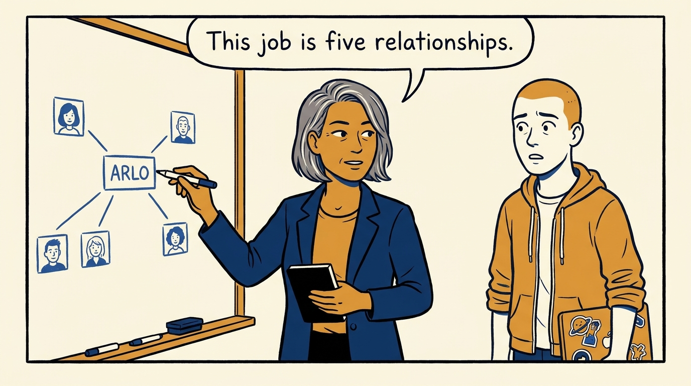
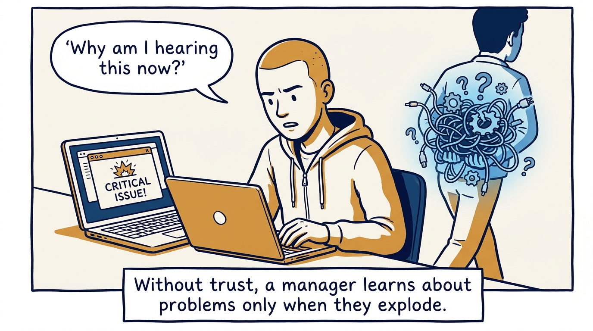
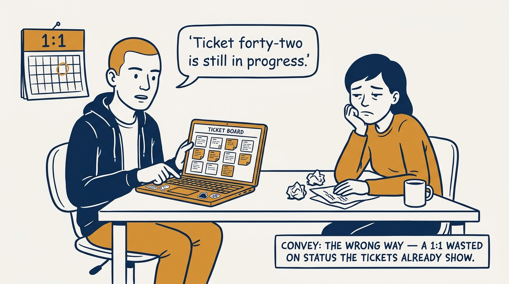
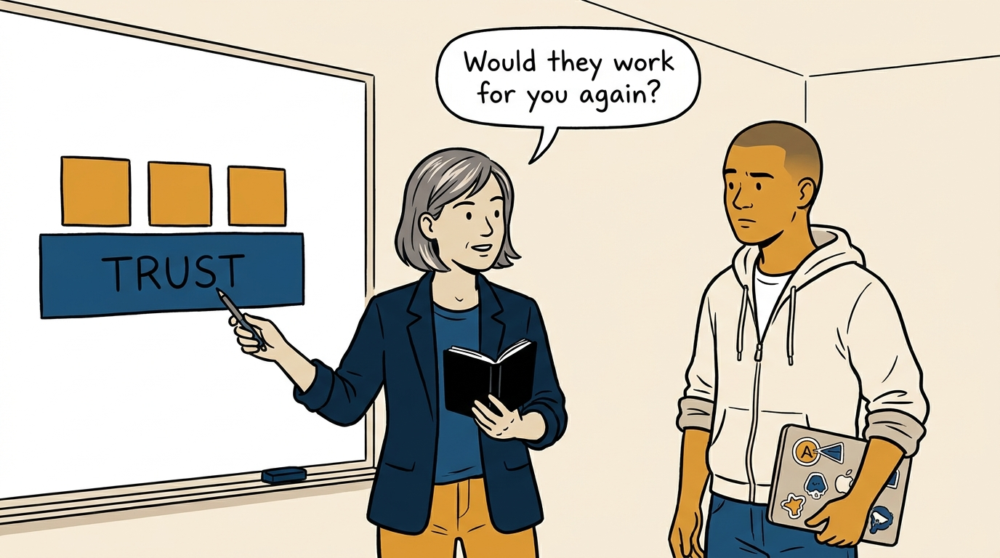
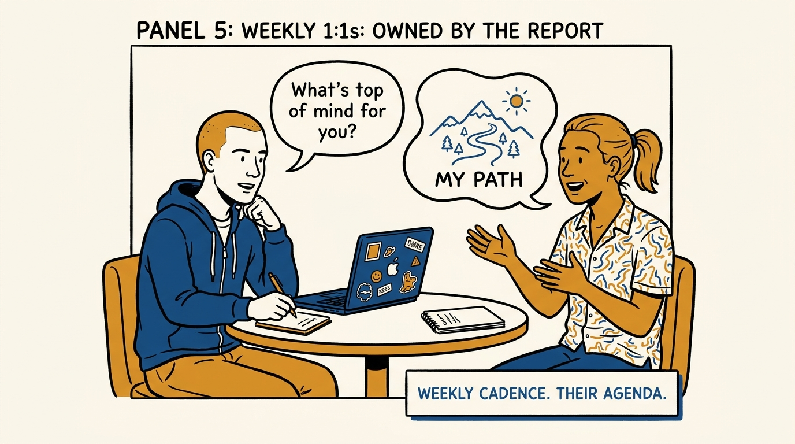
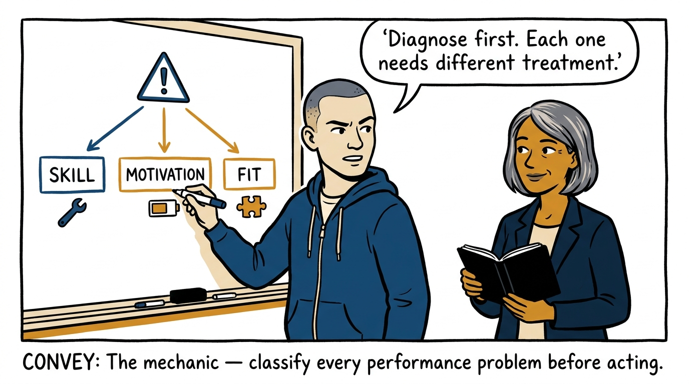
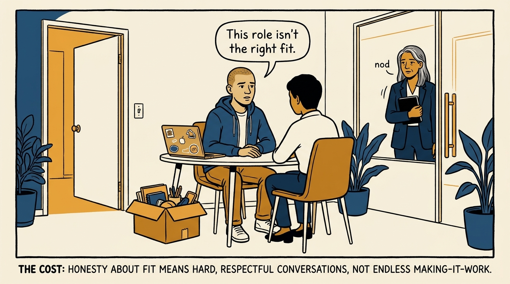
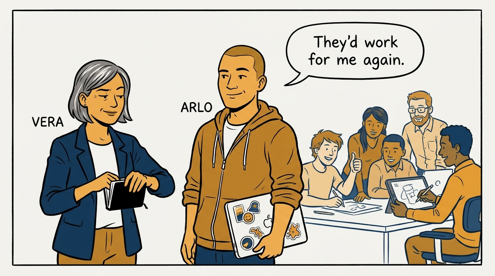

Why a small team runs on trust — and why every hard people call gets a diagnosis before a treatment — in eight panels.

<!-- comic-style
{
  "cast": "VERA: a calm, seasoned engineering executive, short gray-streaked hair, dark blazer over a plain t-shirt, carries a small black notebook. ARLO: an eager early-career engineer climbing the ladder — in some strips a new lead or manager, in others the engineer being coached — buzz-cut hair, zip-up hoodie with rolled sleeves, sticker-covered laptop under one arm.",
  "style": "Clean two-tone explainer comic, thick ink outlines, flat colors with deep blue and amber accents on a light background, generous white space, hand-lettered speech bubbles with SHORT readable text, no photorealism."
}
-->

**Panel 1:** *The hook: on a small team, management is a handful of relationships.*

**Panel 2:** *The problem: without trust, problems arrive only after they explode.*

**Panel 3:** *The wrong way: the status-meeting 1:1 — a relationship reduced to reading the board aloud.*

**Panel 4:** *The principle: everything runs on trust — and the test is scored by them, not by you.*

**Panel 5:** *How it runs: a weekly 1:1 that is theirs — questions first, laptop closed.*

**Panel 6:** *The mechanic: skill, motivation, or fit — the diagnosis chooses the treatment.*

**Panel 7:** *The cost: honesty about fit is uncomfortable — but quick and respectful beats making it work forever.*

**Panel 8:** *The closer: the blunt test, answered without flinching.*
