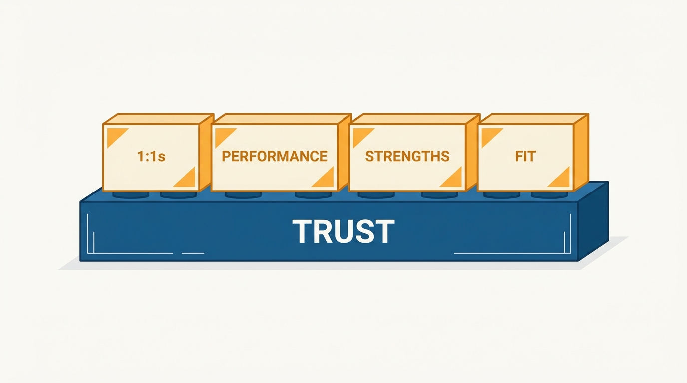
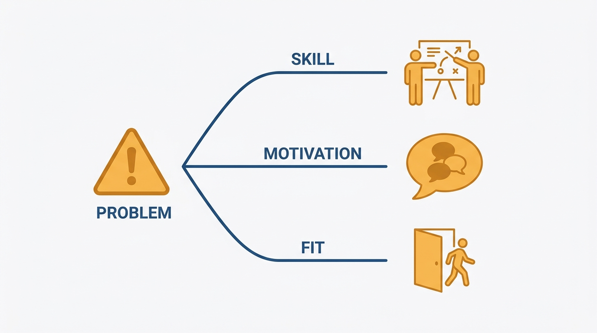
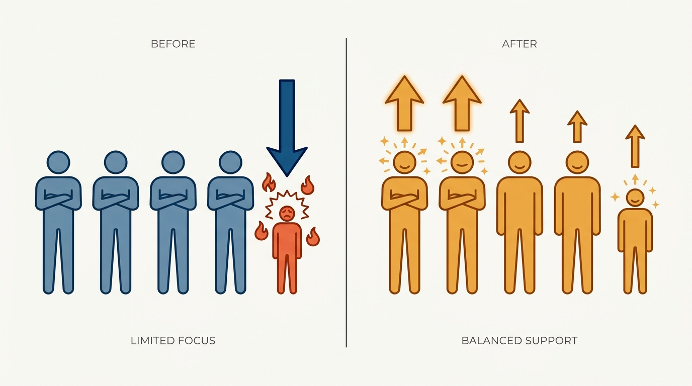

> **Status**: DRAFT
>
> **Principle**: On a small team, management is a handful of relationships, and every one of them runs on trust — an environment where people tell me what they really think, bring me their biggest challenges, and where critical feedback flows both ways without being taken personally. The test I hold myself to is blunt: would my team choose to work for me again? On that foundation I run weekly 1:1s about the person's priorities and growth rather than status, keep expectations and my read of performance transparent, diagnose every problem as skill, motivation, or fit before acting on it, spend disproportionate time making strong people even better — and when the evidence says fit is wrong, I stop trying to make it work forever and move the person out quickly and respectfully.

## Statement

My operating model for leading a small team:

- **Trust is the foundation, and I test it honestly.** People can tell me what they really think and bring me their biggest challenges; critical feedback flows in both directions without being taken personally; 1:1s are allowed to include awkward but meaningful conversations. My standing self-check: would my team choose to work for me again?
- **I treat each report as a person, not a performer.** I show care and respect for who they are, invest regular time in each of them, and ask more questions instead of jumping straight to advice.
- **Every report gets a weekly 1:1 that is theirs, not mine.** At least one weekly 1:1 per direct report, focused on their priorities, growth, and obstacles — not a status update. I discuss top outcomes, calibrate what "great" looks like, share feedback in both directions, check how they're feeling, and ask: "What's top of mind for you?", "How can I help?", "What was most useful about today's conversation?"
- **Performance is transparent, early, and diagnosed before treated.** Each report knows what I expect and how I think they're doing; I address concerns early instead of letting ambiguity linger; and I diagnose whether a problem is skill, motivation, or fit — because each has a different fix.
- **I model vulnerability and accountability.** I admit my own mistakes quickly, apologize clearly when I get something wrong, share growth areas and uncertainties honestly, and lead with empathy during hard moments.
- **I invest disproportionately in strengths.** I notice and name each person's strengths specifically, create opportunities to use them more, and spend extra time helping strong people get even better — refusing to let low performance consume all my attention.
- **I protect the culture and am honest about fit.** No brilliant jerks, a high bar for collaboration and kindness — one divider can reduce the whole team's effectiveness. When someone's values, aspirations, or working style genuinely don't fit the role, I explore better-fit roles where possible and otherwise move them out quickly and respectfully.

**Figure 1:** *On a small team everything is built on one foundation: 1:1s, performance clarity, strengths investment, and fit decisions all rest on trust.*

## How to Read This

This journal is my engineering-management operating model. This record distills the small-team leadership chapter of Julie Zhuo's *The Making of a Manager* (Portfolio/Penguin, 2019): trust as the precondition for everything else, the shape of a useful 1:1, performance clarity, the skill–motivation–fit diagnosis, strengths-based investment, and respectful exits. The runnable version lives in the **Checklist** tab of this post.

## Rationale

**Without trust, I am managing blind.** Everything a manager does on a small team — coaching, feedback, delegation, performance judgment — depends on knowing what is actually going on, and reports only surrender that information voluntarily. If people don't feel safe telling me what they really think or bringing me their biggest challenges, I learn about problems when they explode instead of when they start. That is why trust is not a soft nicety before the real work; it is the channel the real work travels through. The "would they work for me again" question keeps the test honest, because it is scored by them, not by me.

**A 1:1 spent on status is a wasted 1:1.** Status has cheaper channels. The scarce thing a weekly 1:1 provides is dedicated attention on the report's priorities, growth, and obstacles — the conversation nobody schedules otherwise. Asking questions before giving advice matters for the same reason: the moment I jump to advice, the meeting becomes about my thinking instead of theirs, and I stop learning what I most need to know. The three closing questions — top of mind, how can I help, what was most useful — keep the meeting pointed at them and give me a running signal of whether the 1:1s are actually worth their time.

**Ambiguity about performance is a manager's failure, not a report's.** Nobody should discover in a review that they have been falling short for months. Each report deserves to know what I expect and how I currently think they are doing, while there is still time to change the trajectory. And before I act on a problem, I diagnose it: a skill gap calls for coaching and opportunity; a motivation gap calls for understanding what changed; a fit gap calls for honesty about the role. Treating a fit problem with training, or a motivation problem with pressure, wastes months and erodes the trust everything else depends on.

**Figure 2:** *Diagnosis before treatment: a skill gap gets coaching, a motivation gap gets a conversation, a fit gap gets honesty about the role.*

**Strengths compound; firefighting doesn't.** The instinctive allocation of a manager's attention is toward the weakest performer, because that is where the discomfort is. But the team's outcomes are driven mostly by what its strongest people do, and helping a strong person get even better usually returns more than dragging a struggling person to adequate. I keep deliberate time on my strongest people — noticing and naming strengths specifically, and building their work around them — precisely because nothing about the week will do it by default.

**Figure 3:** *The instinctive allocation follows the discomfort; the deliberate one follows the outcomes — strong people made even better.*

**One divider costs more than their output, every time.** A brilliant jerk sets the real bar for the team, whatever the stated values say — every day they are tolerated teaches the team that collaboration and kindness are optional for the sufficiently talented. And when fit is genuinely wrong, endless "making it work" is not kindness: it exhausts the manager, blocks the team, and holds the person in a role where they cannot succeed. A quick, respectful move — into a better-fit role where one exists, out where one doesn't — is better for all three.

## What This Means in Practice

| What this record says | What it does **not** say |
| --- | --- |
| Build an environment where people say what they really think. | Manufacture comfort — trust is allowed to include awkward, meaningful conversations. |
| Hold at least one weekly 1:1 with every direct report. | Use the 1:1 for status — priorities, growth, and obstacles are the agenda; status has cheaper channels. |
| Be transparent about expectations and my current read. | Save the honest assessment for review season — concerns are raised early, while trajectory can change. |
| Diagnose skill vs. motivation vs. fit before acting. | Every problem gets the same treatment — the diagnosis chooses between coaching, motivation work, and honesty about the role. |
| Spend disproportionate time on the strongest people. | Ignore struggling reports — but low performance may not consume all my attention. |
| Move people out quickly and respectfully when fit is wrong. | Fire at the first sign of trouble — exploring a better-fit role comes first, and "quickly" applies after the evidence is in. |

Concretely: every report on my team has a weekly 1:1 that they would call useful, can state what I expect of them and how I think they're doing, and has heard me name their strengths specifically. When a performance concern exists, it has a diagnosis — skill, motivation, or fit — and a plan matched to it. And I can answer the "would they work for me again" question without flinching.

## Anti-Patterns

- **The status-meeting 1:1.** Reading the ticket board out loud once a week and calling it a relationship — the report's growth and obstacles never get a scheduled minute.
- **Advice on reflex.** Jumping straight to solutions instead of asking questions, so the report stops bringing me problems and starts bringing me finished conclusions.
- **Ambiguity as kindness.** Letting a performance concern linger unspoken because the conversation is uncomfortable — until the review lands as an ambush.
- **The undiagnosed fix.** Sending a motivation problem to training, or pressuring a skill gap, because I never asked which problem it actually is.
- **The squeaky-wheel allocation.** Letting the lowest performer absorb all my coaching time while my strongest people — the ones driving the team's outcomes — get none.
- **Tolerating the brilliant jerk.** Excusing toxic behavior for the sake of individual output, while one divider quietly reduces the whole team's effectiveness.
- **Making it work forever.** Cycling a poor-fit person through plan after plan when the evidence has been in for months, instead of moving them — respectfully — to a role where they can succeed.

## Related Records

- [[what-is-management]] — the job definition this record applies at small scale: better outcomes through people, people before process.
- [[management-101]] — the standing two-sided contract with each report; this record is that contract running week to week on a small team.
- [[feedback]] — the craft behind "share feedback in both directions" and the early performance conversations this record requires.
- [[first-three-months]] — the ramp that precedes this steady state; the trust this record runs on is built there first.
- [[career-conversations]] (people journal) — the one-off deep conversation that gives the weekly 1:1 its motivational context, and the strengths discussion its raw material.

## Scope and Revisiting

This record is `draft`. It governs how I run any team where I directly manage every member, and what I hold first-line managers reporting to me accountable for. I revisit it if 1:1s on my team drift into status meetings for more than a few weeks, if a performance concern reaches a formal review without the person having heard it from me first, or if I catch a fit problem that has been "being made to work" for more than a quarter without a decision.

## Authoritative References

- Julie Zhuo, *The Making of a Manager: What to Do When Everyone Looks to You* (Portfolio/Penguin, 2019) — the "Leading a Small Team" chapter this record distills.
