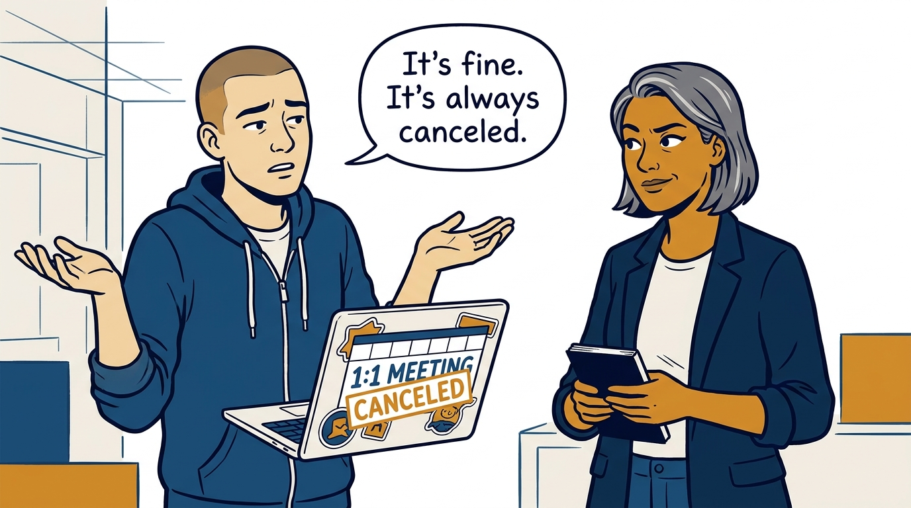
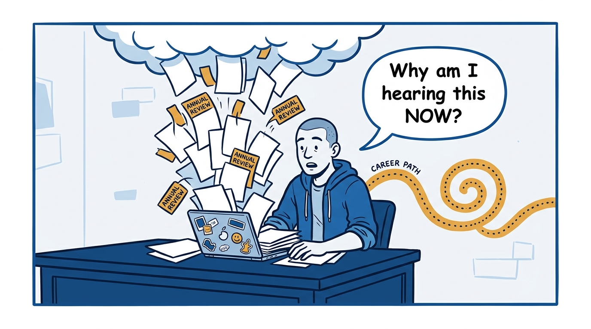
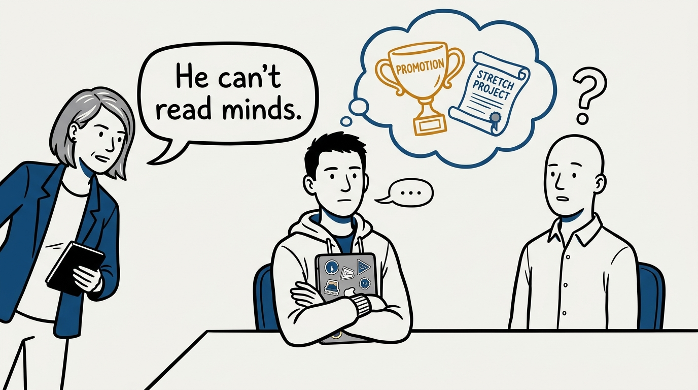
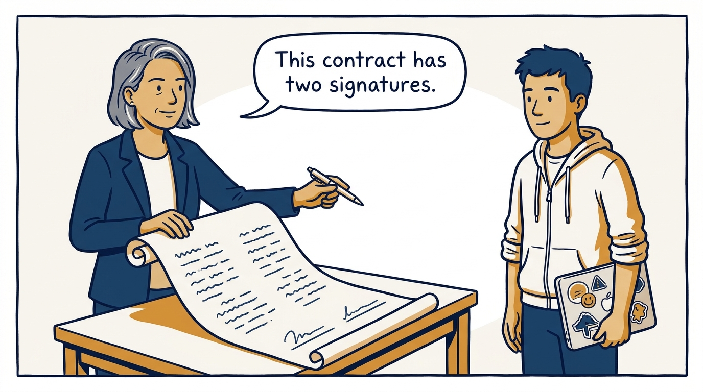
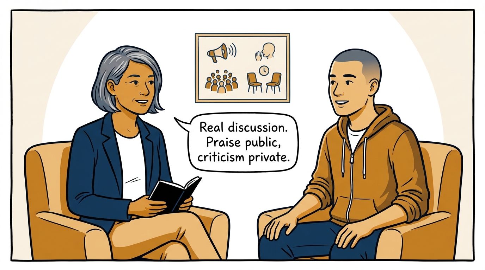
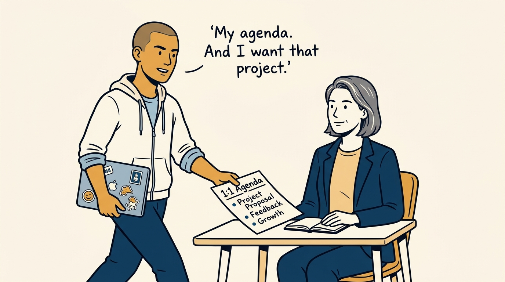
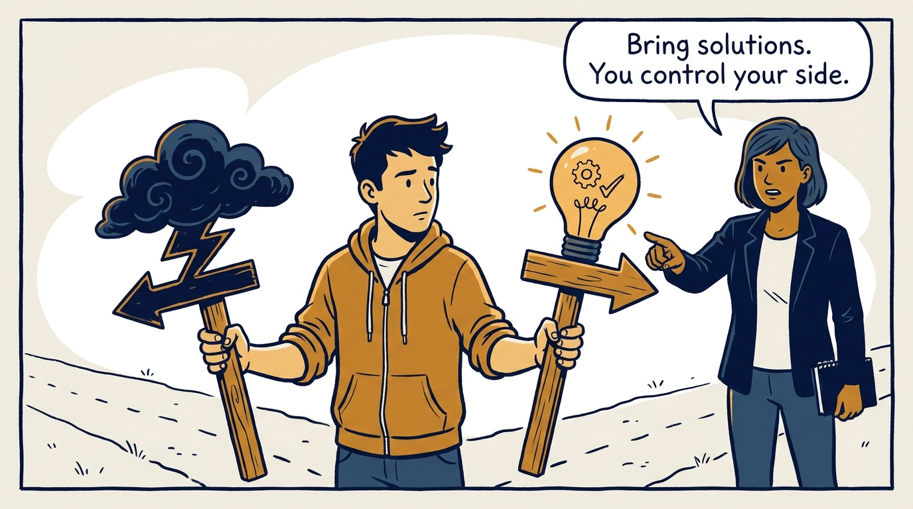
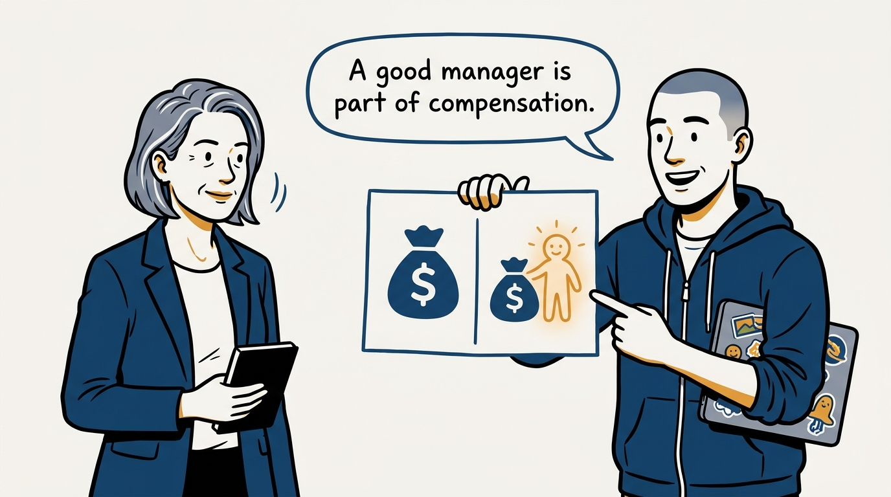

Why the manager–report relationship is a contract with two signatures — in eight panels.

<!-- comic-style
{
  "cast": "VERA: a calm, seasoned engineering executive, short gray-streaked hair, dark blazer over a plain t-shirt, carries a small black notebook. ARLO: an engineer newly stepping into management, buzz-cut hair, zip-up hoodie with rolled sleeves, sticker-covered laptop under one arm.",
  "style": "Clean two-tone explainer comic, thick ink outlines, flat colors with deep blue and amber accents on a light background, generous white space, hand-lettered speech bubbles with SHORT readable text, no photorealism."
}
-->

**Panel 1:** *The hook: many engineers have never had a manager they would call good — so they stop expecting one.*

**Panel 2:** *The problem: without the contract, feedback arrives once a year as a surprise and careers quietly drift.*

**Panel 3:** *The wrong way: the mind-reader assumption — never say what you want, then resent not getting it.*

**Panel 4:** *The principle: the manager–report relationship is a contract with two signatures — and both sides get held to it.*

**Panel 5:** *How it runs, manager side: 1:1s that are discussions, praise in public, criticism private and prompt, and active work on growth.*

**Panel 6:** *How it runs, report side: bring the agenda, ask for what you want, speak up while it is still fixable.*

**Panel 7:** *The cost: being managed well is a skill — bring solutions, not just complaints, and work the one side you control.*

**Panel 8:** *The closer: a good manager is a meaningful part of compensation — and this contract is what 'good' means.*
