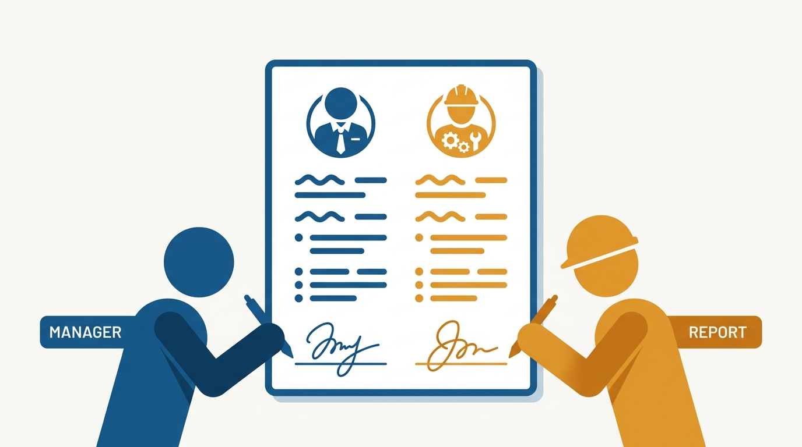
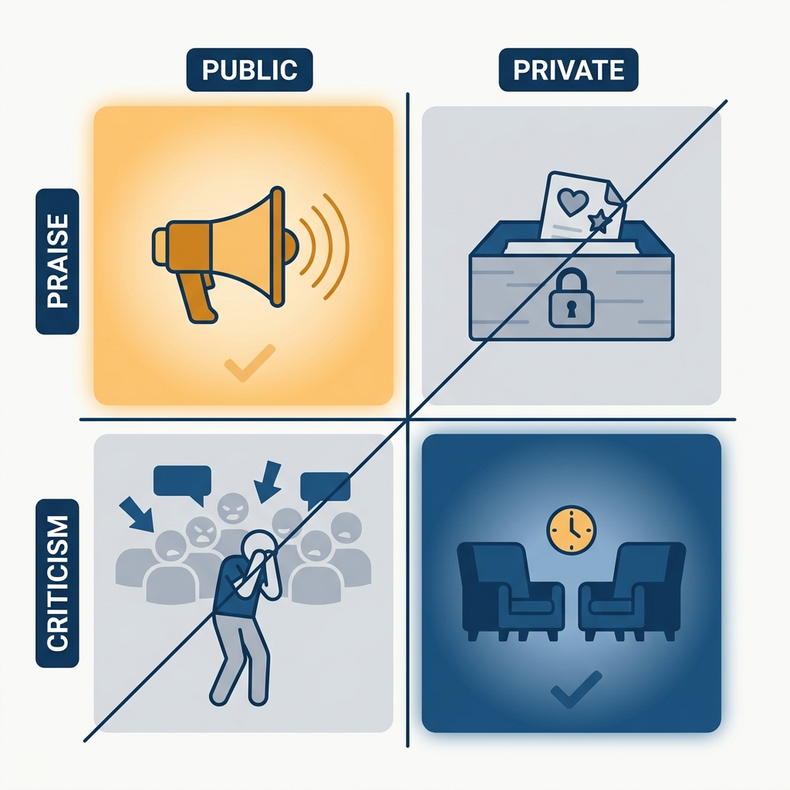

> **Status**: DRAFT
>
> **Principle**: The manager–report relationship is a contract with two signatures, and I hold both sides to it. As a manager I owe every report regular 1:1s that are discussions rather than status readings, feedback given continuously — praise public, criticism private and prompt — and active work on their growth: promotion clarity, stretch opportunities, advocacy, and focus. In return I ask every report to own their half: know what you want from your career, bring the agenda, ask for help and feedback, speak up when you are unhappy, and treat your manager as a resource, not a mind reader. Being managed well is a skill, and I expect people at every level of my organization — including me — to practice it.

## Statement

My operating model for the basic manager–report contract has two sides.

What I owe every report as their manager:

- **Regular 1:1s that are discussions, not status updates.** The meeting exists for the things a status report cannot carry — and it treats the report as a person, not just a worker, building trust and human connection deliberately.
- **Feedback, continuously and in the right register.** Praise delivered publicly when appropriate; criticism delivered privately and promptly. No saving important feedback for a formal review.
- **Growth beyond day-to-day execution.** I help each report improve their work, navigate workplace challenges, and understand what promotion actually requires here — and I identify stretch opportunities that get them there.
- **Connection and advocacy.** I connect each person's work to team and company goals, point them at training and career resources, and advocate for their growth and advancement in rooms they are not in.
- **Focus.** I help every report concentrate on what matters most, which sometimes means taking things off their plate.

What I ask every report to own:

- **Know what you want, and say it.** Think about what you want from your career; ask directly about promotion and raise expectations; ask for the projects and stretch work you want.
- **Drive your own 1:1s.** Bring topics and agendas; ask for help when stuck; ask for feedback — including the constructive kind — rather than waiting for it to arrive.
- **Speak up and set boundaries.** Say when you are unhappy while it is still fixable; set your own work-life boundaries; take ownership of your growth and happiness at work. Your manager is a resource, not a mind reader.

**Figure 1:** *One relationship, one contract, two signatures — the manager's obligations and the report's are halves of the same document.*

## How to Read This

This journal is my engineering-management operating model, one record per source checklist. This record is grounded in the "Management 101" chapter of Camille Fournier's *The Manager's Path* (O'Reilly, 2017) — the chapter about what to expect from a manager and how to be managed, distilled here into **the contract I hold both sides of the relationship to**. I have sat on both sides of it and now also hold every manager in my organization to the manager's half. The runnable version — the expectations list, the report's responsibilities, and the self-assessment — lives in the **Checklist** tab of this post.

## Rationale

**The contract has to be explicit because most people have never seen it honored.** Fournier's starting observation is that many engineers have never had a manager they would call good, so they **calibrate their expectations to neglect**: 1:1s that are status meetings or don't happen, feedback that arrives once a year as a surprise, careers that drift. Writing the contract down resets that calibration. A report who knows they are owed prompt private criticism and promotion clarity will notice when they are not getting it — and a manager who has signed up for that list cannot quietly drop it.

**1:1s are the load-bearing mechanism of the manager side.** Almost everything else I owe a report — feedback, growth discussion, human connection, focus — flows through a regular, protected 1:1 that is used for discussion rather than status. A manager who lets 1:1s decay into status readings, or skips them when busy, has effectively **suspended the whole contract** while appearing to keep the meeting. That is why "has regular 1:1s" and "uses them for discussion, not status" are the first two lines of the checklist, not incidental hygiene.

**Figure 2:** *Everything the manager side owes flows across the 1:1 — let it decay into a status reading and the whole contract quietly collapses.*

**The register of feedback matters as much as its existence.** Praise in public reinforces the behavior and the person; criticism in public humiliates and teaches the team to hide problems. **Criticism delayed is criticism wasted** — by the time it arrives in a review, the pattern has hardened and the trust needed to hear it has thinned. Public-praise, private-and-prompt-criticism is a small rule that carries most of the feedback half of the contract.

**Figure 3:** *A small rule carries the feedback half of the contract: praise public, criticism private and prompt — invert either register and it backfires.*

**The report's half exists because a manager cannot supply motivation, only respond to it.** I can identify stretch opportunities, but I cannot know which ones someone wants unless they have thought about their career and said so. I can answer promotion questions, but only if they are asked. Fournier is blunt about this: **figuring out what you want is your job**, and using your manager well — bringing solutions rather than only problems, asking for advice rather than demanding fixes — is a skill worth deliberately practicing. Reports who treat their manager as a mind reader end up resentful; reports who treat their manager as a resource end up developed.

**You control your side of the relationship, and only your side.** Managers are imperfect; I ask reports to give theirs some grace, and to diagnose honestly when things go wrong: **is the problem the manager, the situation, or me?** That diagnosis matters beyond the current job — Fournier's advice to choose managers carefully when evaluating roles follows directly from it. A good manager is a meaningful part of compensation; the contract in this record is what "good" means.

## What This Means in Practice

| What this record says | What it does **not** say |
| --- | --- |
| Every report gets regular 1:1s used for discussion. | The 1:1 is a status meeting — status has other channels. |
| Praise is public when appropriate; criticism is private and prompt. | Feedback waits for the review cycle — that is where surprises come from. |
| Managers actively work on each report's growth, promotion clarity, and advocacy. | Growth is fully the manager's job — **the report names the direction, the manager clears the path**. |
| Reports bring agendas, asks, and honest state to the relationship. | A quiet report is a happy report — **silence is not consent**, and managers are not mind readers. |
| Reports control their side of the relationship and give managers some grace. | Reports must tolerate a bad manager indefinitely — sometimes the honest diagnosis is the manager or the situation, and the right move is a change. |
| A good manager is worth weighing when choosing a job. | Title and compensation are all that matter in an offer. |

Concretely: everyone in my organization can name their 1:1 cadence, has heard specific praise and specific private criticism within recent memory, and **can state what their next promotion requires**. And everyone owns an answer to "what do you want next?" — because I ask, and "I haven't thought about it" is **an answer I expect to hear at most once**.

## Anti-Patterns

- **The vanishing 1:1.** Cancelled when busy, converted to status when held — the report technically has a manager and practically has none.
- **Review-day surprises.** Saving important criticism for the formal review, where it arrives too late to act on and too loaded to hear.
- **Public criticism, private praise.** Inverting the registers — humiliating people in front of peers while their wins go unmentioned where it counts.
- **The mind-reader assumption.** A report who never states what they want, then resents not getting it; a manager who never asks, then is surprised by the resignation.
- **Complaints without asks.** Bringing only problems and demanding fixes, rather than bringing solutions and asking for advice — the fastest way to teach a manager to dread your 1:1.
- **Blaming across the boundary.** A report endlessly relitigating what the manager should do differently instead of working the one side of the relationship they control.
- **Ignoring the manager when choosing a job.** Evaluating offers on title and compensation alone, as if the person you will report to were an implementation detail.

## Related Records

- [[managing-people]] — the manager's half of this contract in full mechanics: onboarding a new report, 1:1 formats, continuous feedback, reviews, and underperformance.
- [[mentoring]] — the first rung of the ladder where someone starts delivering the support side of this contract.
- [[what-is-management]] — Julie Zhuo's answer to what the manager's job actually is; this record is the per-report contract inside that job.
- [[own-your-career]] — the engineer-side career-ownership playbook; the report's half of this contract is its day-to-day core.
- [[career-conversations]] (people journal) — the deliberate one-off conversation that gives a manager the motivational context this contract assumes.

## Scope and Revisiting

This record is `draft`. It governs the baseline manager–report relationship everywhere I am the accountable executive: what any report can expect from any manager here, and what any manager can expect reports to own. I revisit it if skip-levels or engagement surveys show reports who cannot name their manager's side of the contract, if **formal reviews keep producing surprises** (the signal that continuous feedback has stopped), or if I catch myself letting my own 1:1s decay into status meetings.

## Authoritative References

- Camille Fournier, *The Manager's Path: A Guide for Tech Leaders Navigating Growth and Change* (O'Reilly, 2017) — Chapter 1, "Management 101", whose checklist this record distills.
