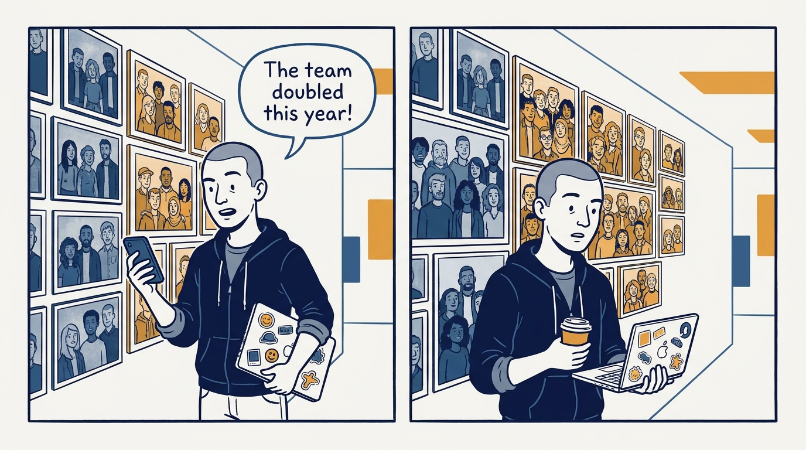
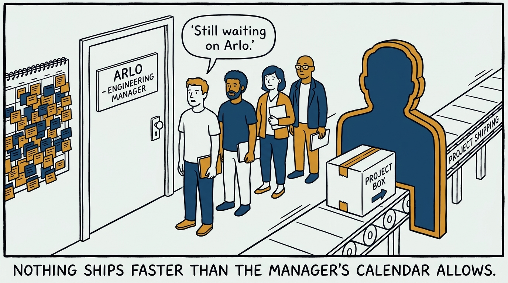
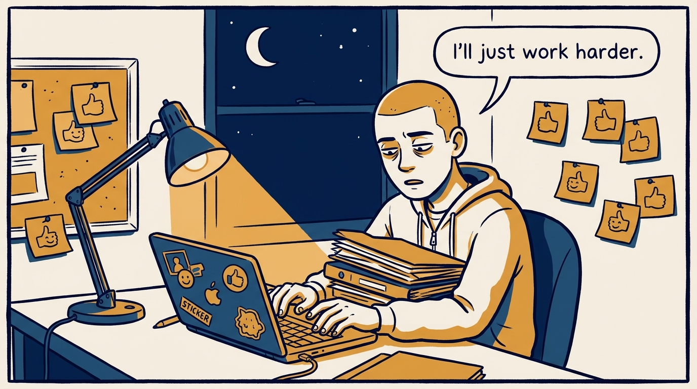
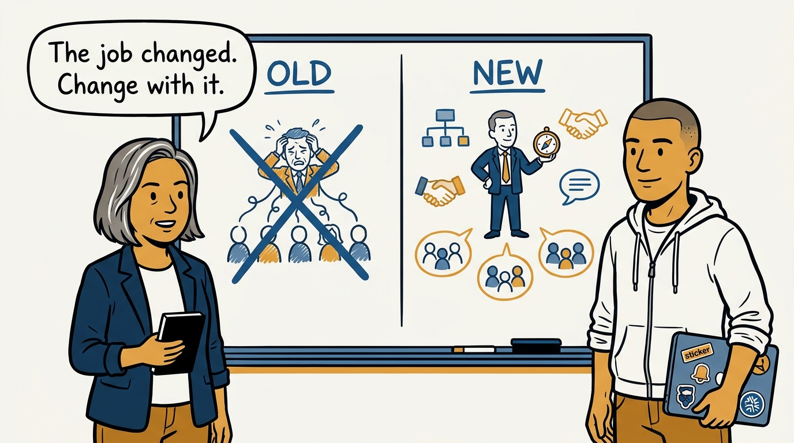
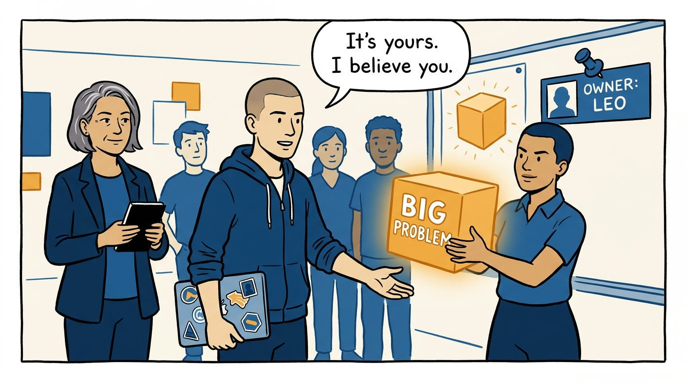
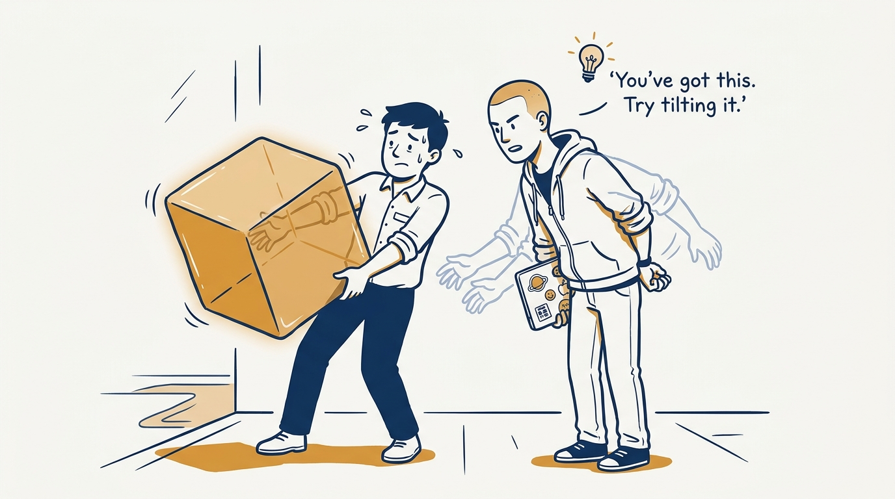
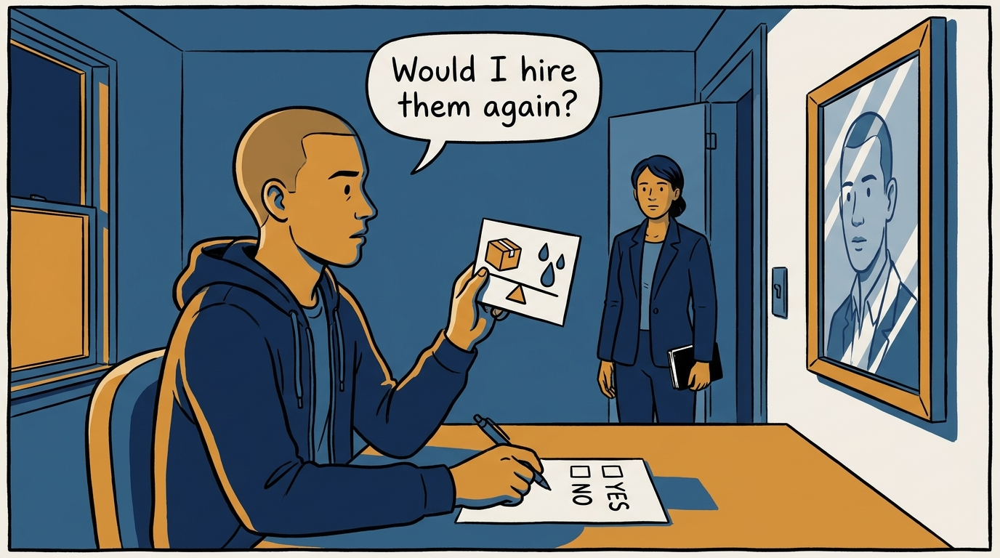

Why a growing team changes the manager's job whether they accept it or not — in eight panels.

<!-- comic-style
{
  "cast": "VERA: a calm, seasoned engineering executive, short gray-streaked hair, dark blazer over a plain t-shirt, carries a small black notebook. ARLO: an eager early-career engineer climbing the ladder — in some strips a new lead or manager, in others the engineer being coached — buzz-cut hair, zip-up hoodie with rolled sleeves, sticker-covered laptop under one arm.",
  "style": "Clean two-tone explainer comic, thick ink outlines, flat colors with deep blue and amber accents on a light background, generous white space, hand-lettered speech bubbles with SHORT readable text, no photorealism."
}
-->

**Panel 1:** *The hook: the team doubles — and the job quietly becomes a different job.*

**Panel 2:** *The problem: staying deep in every detail makes the manager the bottleneck — nothing moves faster than his calendar.*

**Panel 3:** *The wrong way: scaling by working harder — longer hours of the old job, while only good news travels upward, because nobody has yet invited dissent, rewarded a messenger, or owned a mistake out loud.*

**Panel 4:** *The principle: a growing team changes the job whether you accept it or not — the only choice is whether you change with it.*

**Panel 5:** *How it runs: delegate big problems as a sign of trust — and clarify ownership publicly, so the organization treats them as the owner too.*

**Panel 6:** *The mechanic: stay available to coach — and never take the work back, because boomerang delegation teaches the team that ownership is decorative.*

**Panel 7:** *The cost: judging managers by outcomes, not effort — and when the honest answer to 'would I hire them again?' is no, making the hard move.*

**Panel 8:** *The closer: keep putting yourself out of the current job — the freed time goes to unique leverage, and that is how the next job gets created.*
