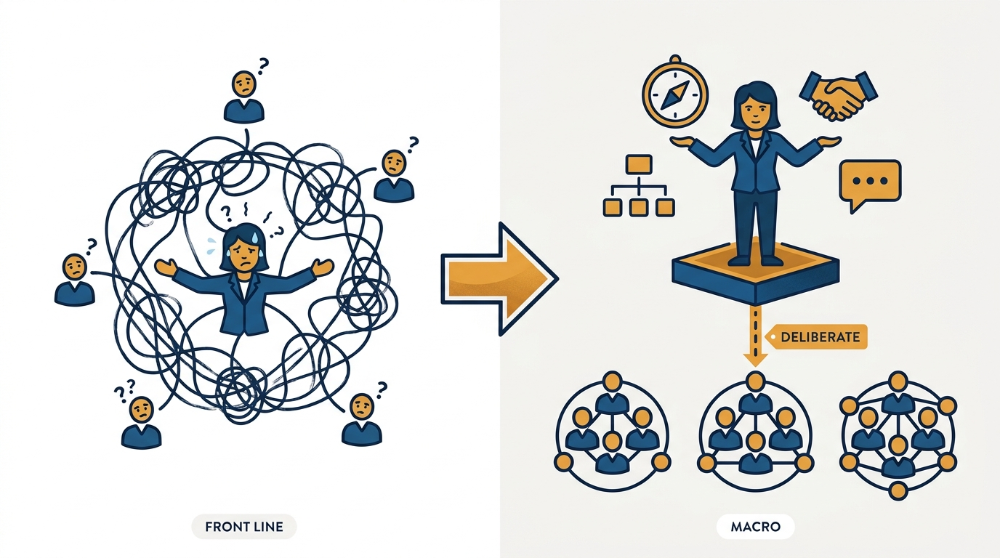
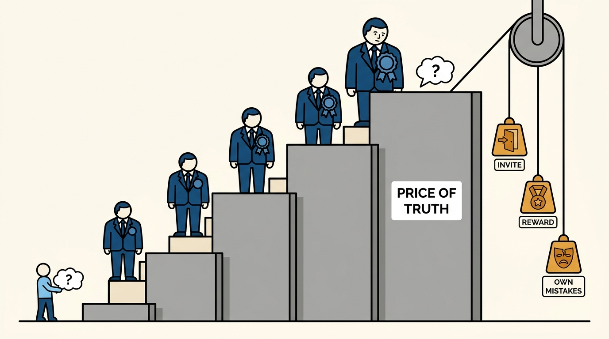
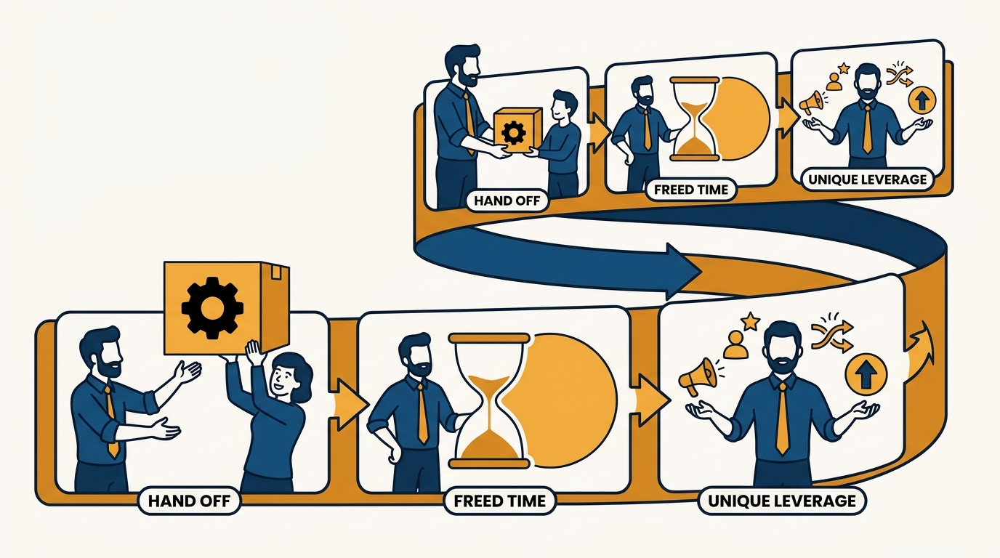

> **Status**: DRAFT
>
> **Principle**: A growing team changes the job whether I accept it or not — the only choice is whether I change with it. I shift to the macro view — vision, org design, delegation, communication — and ration direct involvement to where it matters most. Because authority makes truth expensive, I explicitly invite dissent and reward uncomfortable truths. And I judge managers as multipliers, by outcomes — "would I hire this person again for this role?" — applying the same test to myself: putting myself out of the current job is how the next one gets created.

## Statement

My commitments as the team grows:

- **Shift to the macro view, on purpose.** I accept that management changes as the team grows, move from front-line involvement to vision, org design, delegation, and communication, and stop trying to support everyone only through direct involvement. I pick and choose where my attention matters most, balancing diving in against stepping back.
- **Make truth easier to hear.** I assume people hesitate to challenge me once I have authority, so I explicitly invite dissent, reward those who tell me uncomfortable truths, own my mistakes publicly, and use language that lowers the risk of speaking up.
- **Delegate big problems as a sign of trust.** Delegation is a core leadership skill, not off-loading: I believe my reports can solve hard problems, publicly clarify who owns what, and stay available to coach without taking the work back.
- **Become more people-centric.** I spend less time proving individual expertise and more time getting the best out of others — hiring strong leaders, building self-reliant teams, and communicating clearly and often. I use 1:1s to help the other person, align on people, purpose, and process, and help my managers establish healthy processes for their own teams.
- **Judge managers as multipliers.** A manager should be a positive multiplier. I notice when one is slowing projects, making poor calls, or blocking team growth; I judge by outcomes, not effort or intent; I ask "would I hire this person again for this role?" — and make the hard move when the answer is no.
- **Put myself out of a job, and spend the freed time on unique leverage.** I look for responsibilities someone else can do as well as me or better, delegate work that is important but not uniquely mine, and invest where my unique value is highest: communicating what matters across the organization, helping hire top talent, resolving priority conflicts between teams, and escalating decisions when my managers lack the full picture.

## How to Read This

This journal is my engineering-management operating model, each record grounded in one source checklist. This record distills the chapter on managing a growing team from Julie Zhuo's *The Making of a Manager* (Portfolio/Penguin, 2019): the shift from managing individuals directly to **managing at scale** — perspective, dissent, delegation, and judging (and replacing) management, including my own role. The runnable version lives in the **Checklist** tab of this post.

## Rationale

**The management style that got the team here stops working, and pretending otherwise breaks both.** With a handful of reports I can stay deep in every detail; past that point, trying to support everyone through direct involvement **makes me the bottleneck** and starves the actual work of the role — vision, org design, delegation, communication. The shift is not a loss of rigor; it is **a change in where rigor is applied**. Diving in remains legitimate, but it becomes a deliberate choice about where my attention matters most, not a default.

**Figure 1:** *The shift is not a loss of rigor but a change in where it is applied: direct involvement becomes one deliberate, rationed line — not the default wiring.*

**Authority silently raises the price of telling me the truth.** The same observation that was casual feedback to a peer becomes a career risk when aimed at the person who writes your performance review — so **silence is the default I must assume**, not an anomaly. That is why inviting dissent has to be explicit and repeated, why the messenger of an uncomfortable truth gets rewarded visibly, and why owning my mistakes publicly matters: each is a signal that **lowers the price of the next hard truth**. A growing team where only good news travels upward is a team whose problems I will learn about last.

**Figure 2:** *Authority silently raises the wall in front of every uncomfortable truth; inviting dissent, rewarding messengers, and owning mistakes publicly are what pull it back down.*

**Delegation is an act of trust, and half-delegation is an act of sabotage.** Giving someone a big problem says "I believe you can solve this" — provided **ownership is clarified publicly**, so the organization treats them as the owner too, and provided I coach without taking the work back. Delegating the task while retaining the decisions gives me the workload of doing it myself plus a report who has learned that ownership from me is provisional. Self-reliant teams are built from **real ownership, repeatedly given**.

**A manager is a multiplier or a divider — and effort is not the metric.** A struggling engineer affects their own output; a struggling manager slows projects, degrades decisions, and blocks the growth of everyone under them. That asymmetry is why I judge managers **by outcomes rather than effort or intent**, and why the clarifying question is Zhuo's blunt one: **would I hire this person again for this role?** When the honest answer is no, the hard move is kinder than the slow erosion of the team that the avoidance buys.

**Putting myself out of a job is the mechanism by which the job grows.** Any responsibility someone else can do as well as I can — or better — is one I should hand over, because my time is **the scarcest resource I allocate** and unique leverage is the only defensible use of it: cross-organizational communication, top-talent hiring, priority conflicts between teams, escalations where only I hold the full picture. The role that remains after each round of giving work away is the next, larger role — and the measure of success shifts accordingly, from what I can do to **how much more the whole team can achieve**.

**Figure 3:** *Putting yourself out of the current job is the mechanism: each handoff frees capacity for unique leverage, and the role that remains is the next, larger one.*

## What This Means in Practice

| What this record says | What it does **not** say |
| --- | --- |
| I move to the macro view as the team grows. | I stop going deep — diving in stays available, rationed to where it matters most. |
| I explicitly invite dissent and reward uncomfortable truths. | Every dissent changes the decision — it changes **what I know before I decide**. |
| I delegate big problems and publicly clarify ownership. | I disappear — I stay available to coach, without taking the work back. |
| I judge managers by outcomes as multipliers. | Effort and intent count for nothing — they matter in coaching, but not as substitutes for outcomes. |
| "Would I hire this person again?" decides hard cases. | The first bad quarter ends a manager — the question is about the pattern, and it triggers action, starting with honesty. |
| I keep giving away work others can do as well or better. | My job shrinks — the freed capacity goes to **unique leverage**, and the role keeps growing. |

Concretely: my calendar shows macro work — vision, org design, hiring, cross-team conflicts — rather than a stack of project deep-dives; each of my leaders owns something big with their name on it publicly; my 1:1s produce **help for the other person, not status for me**; and at least once a year I can **name a responsibility I used to hold** that someone else now runs as well as I did or better.

## Anti-Patterns

- **Scaling by working harder.** Answering team growth with longer hours of the same front-line management instead of changing what the job is.
- **The involvement bottleneck.** Staying deep in every detail of every project, so nothing ships faster than my calendar allows.
- **The comfortable echo.** Never hearing disagreement and reading it as alignment, when it is actually the price of dissent having risen past what anyone will pay.
- **Shooting the messenger, gently.** Responding to an uncomfortable truth with visible irritation — once — and then wondering why the flow of bad news stopped.
- **Boomerang delegation.** Handing over a problem, hovering, and taking it back at the first wobble — teaching the team that ownership is decorative.
- **Judging managers on effort.** Keeping a struggling manager in place because they work hard and mean well, while their team's projects slow and its best people leave.
- **Hoarding the old job.** Keeping responsibilities I could hand off because they are comfortable and I am good at them — spending unique-leverage time on replaceable work.

## Related Records

- [[managing-multiple-teams]] — the Manager's Path rung this growth leads into: running several teams through priorities, process, and delegated ownership.
- [[managing-managers]] — once the people I manage are managers, judging multipliers and making truth easy to hear become the core of the job.
- [[leading-a-small-team]] — the record this one grows out of: the direct, individual-level management that stops scaling past a handful of reports.
- [[hiring-well]] — hiring strong leaders is the enabling move; a growing team scales through the leaders it hires and grows.
- [[getting-things-done]] — the execution loop must keep running without me in every room; delegation is how that discipline survives growth.

## Scope and Revisiting

This record is `draft`. It governs how I manage teams that have grown past direct involvement — my own shift to macro work, the dissent I cultivate, the delegation I practice, and the standard I hold managers to, including myself. I revisit it if my calendar **fills with front-line work** at the expense of vision and org design, if a quarter passes without anyone telling me **something I did not want to hear**, or if I cannot name a responsibility I have handed off in the past year.

## Authoritative References

- Julie Zhuo, *The Making of a Manager: What to Do When Everyone Looks to You* (Portfolio/Penguin, 2019) — the chapter on managing a growing team this record distills.
