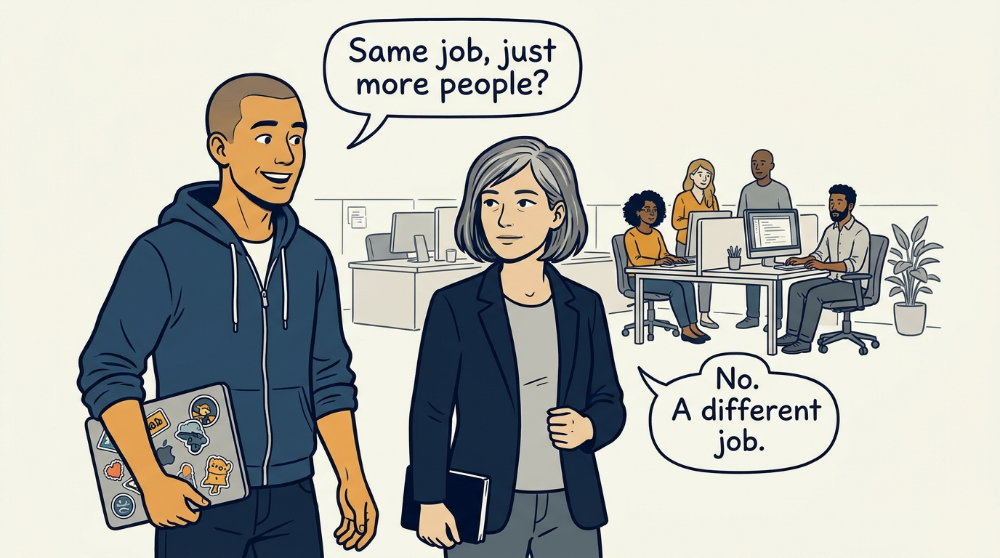
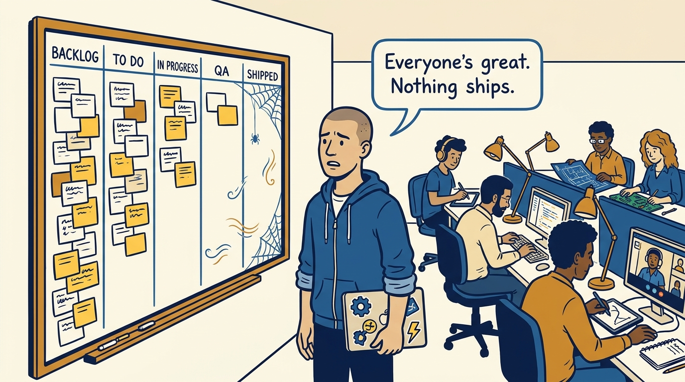
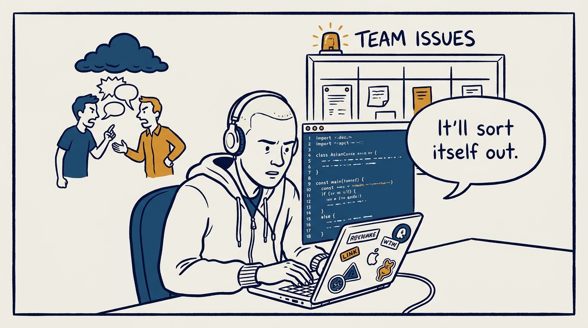
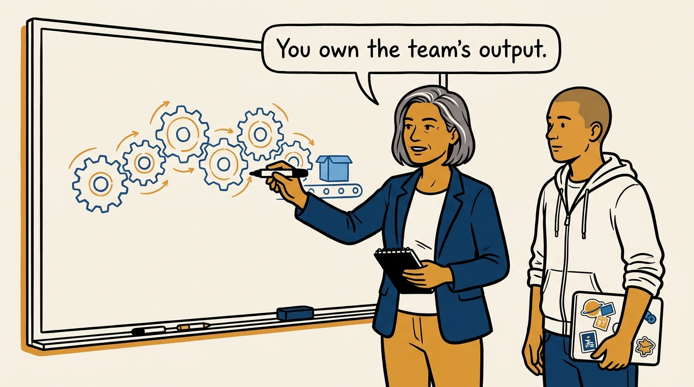
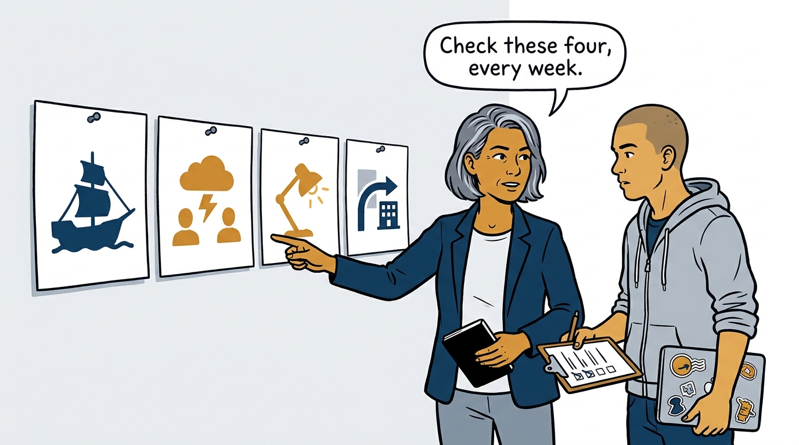
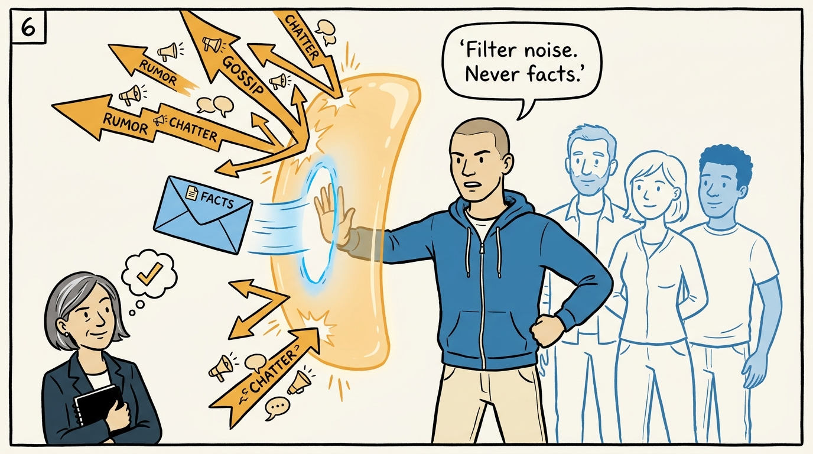
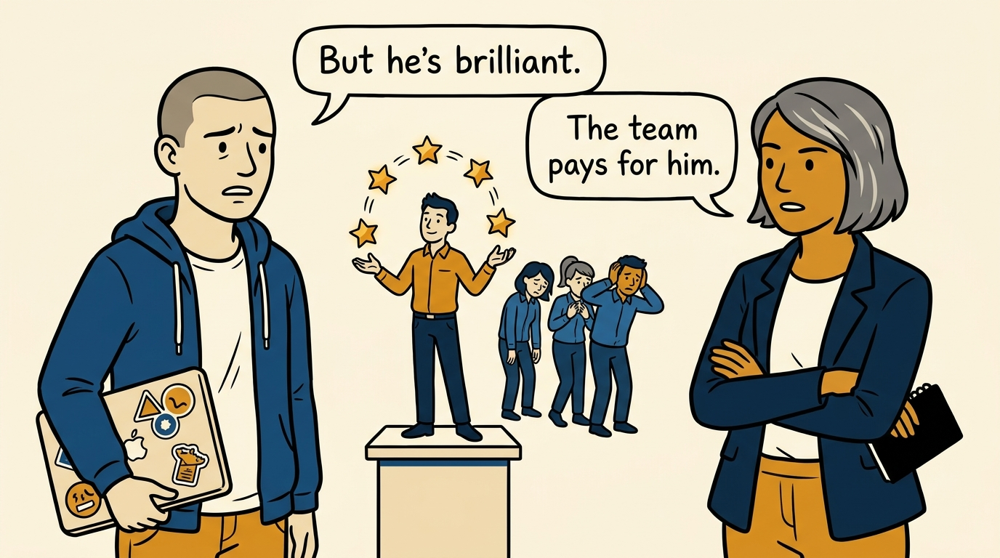
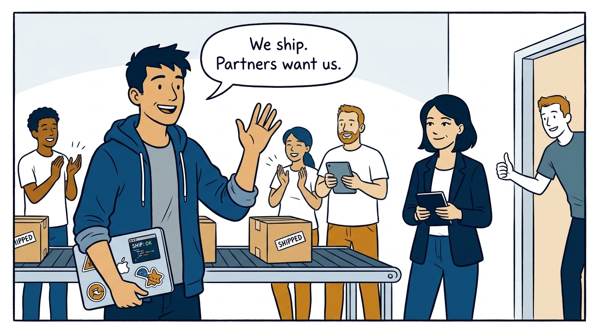

Why running a team is a different job — not "more people management" — in eight panels.

<!-- comic-style
{
  "cast": "VERA: a calm, seasoned engineering executive, short gray-streaked hair, dark blazer over a plain t-shirt, carries a small black notebook. ARLO: an engineer newly stepping into management, buzz-cut hair, zip-up hoodie with rolled sleeves, sticker-covered laptop under one arm.",
  "style": "Clean two-tone explainer comic, thick ink outlines, flat colors with deep blue and amber accents on a light background, generous white space, hand-lettered speech bubbles with SHORT readable text, no photorealism."
}
-->

**Panel 1:** *The hook: managing a team looks like 'more people management' — it is a different job.*

**Panel 2:** *The problem: six strong individual performances do not add up to a team that ships.*

**Panel 3:** *The wrong way: keep the old job, manage by hope, and let small dysfunctions calcify.*

**Panel 4:** *The principle: the unit of accountability shifts — everything on the team is the manager's to notice.*

**Panel 5:** *How it runs: the four dysfunctions have early signals — the job is to check for them deliberately, not wait.*

**Panel 6:** *The mechanic: a shield filters distraction but passes the facts people need — a wall blocks both.*

**Panel 7:** *The cost: owning the hard calls — no consensus hiding, and no cohesion traded for a brilliant jerk.*

**Panel 8:** *The closer: the team ships, partners want to work with it, and the manager stayed close enough to feel the bottlenecks.*
