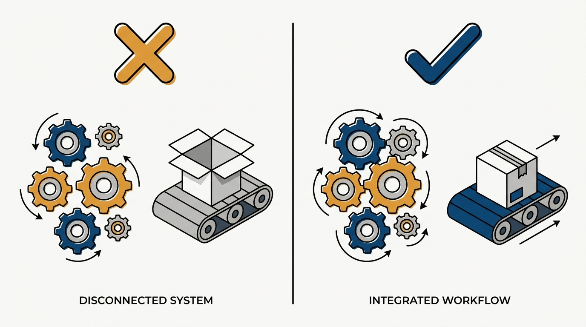
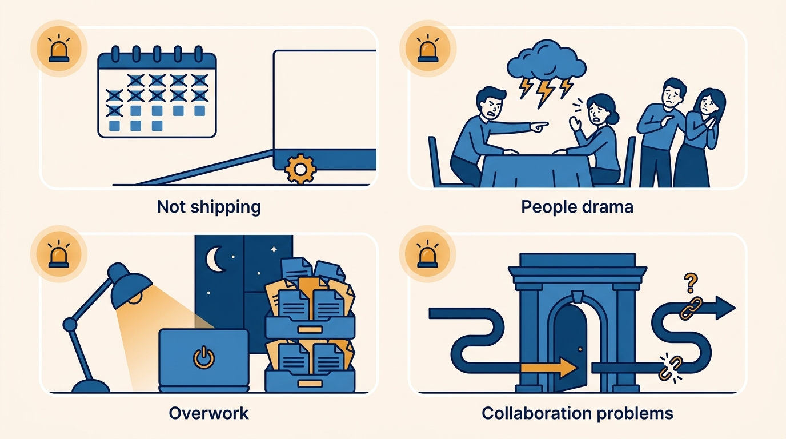
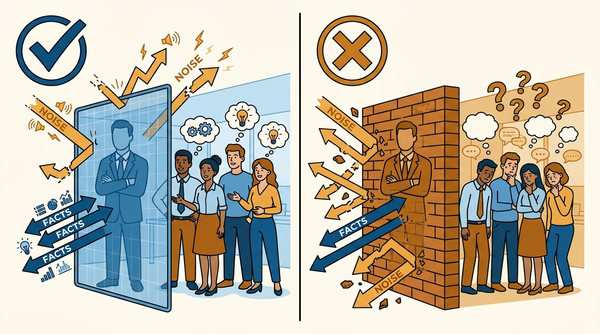

> **Status**: DRAFT
>
> **Principle**: Managing a team is a different job, not "more people management." The unit of accountability shifts from individuals to the team's collective output — and everything on that team is mine to notice: whether it ships, whether one person's negativity is poisoning the room, whether crunch has quietly become normal, whether partner teams still want to work with us. I stay technical enough to feel the bottlenecks firsthand, I shield the team without becoming a wall, I own the hard decisions instead of outsourcing them to consensus, and I never trade team cohesion for the output of a brilliant jerk.

## Statement

When I run a team — and for every manager I hold accountable at this rung — the commitments are:

- **I treat team management as a new job.** I stop enough of my old work to make room for it: keeping the team on the highest-value projects, clearing roadblocks, partnering with product on scope and priorities, planning ahead for hiring, giving frequent feedback outside review cycles, and communicating timelines, risks, and tradeoffs upward.
- **I stay technical.** I spend less time coding, but I keep enough hands-on exposure — code, debugging, reviews — to stay credible, feel real bottlenecks firsthand, and evaluate feasibility and estimates with my own judgment rather than secondhand reports.
- **I watch for the four dysfunctions and act early.** Not shipping, people drama, overwork, and collaboration problems each have observable signals; my job is to spot them before they calcify, not to hope they resolve themselves.
- **I manage former peers with transparency, not authority.** I acknowledge the awkwardness directly, ask for their help making the transition work, and never use managerial power to casually override technical decisions or micromanage people who were my equals last month.
- **I am a shield, not a wall.** I protect the team from unnecessary distraction and politics, but I share important realities calmly and give enough context that people understand why the goals matter. I treat the team like adults.
- **I drive decisions and own the outcomes.** I build a data-driven culture, run retrospectives on projects and process, check whether assumptions proved true, and take responsibility for unpopular calls instead of hiding behind consensus or votes.
- **I protect cohesion.** I build psychological safety, address information-hiding and disrespect quickly, and remove persistent toxic behavior — including from "brilliant jerks" — when it cannot be corrected.

## How to Read This

This journal is my engineering-management operating model, each record grounded in one source. This record distills the "Managing a Team" chapter of Camille Fournier's *The Manager's Path* (O'Reilly, 2017) — the rung where a manager stops managing a set of individuals and starts owning a team's collective health and output. I write it two-sided: what I commit to when I occupy this role, and what I hold every team manager in my organization accountable for. The runnable version — dysfunction signals, self-onboarding steps, and the self-audit — lives in the **Checklist** tab of this post.

## Rationale

**The team's output is a different object than the sum of individual performances.** I can have six individually strong engineers and a team that does not ship — because releases are painful, features are oversized, testing is manual, or nobody knows why the current project matters. Managing individuals well does not automatically produce a healthy team; the team-level concerns — shipping cadence, decision-making process, cross-team relationships, project selection — need an owner, and at this rung that owner is me. Fournier's checklist is blunt about the shift: it is a different job, not "more people management."

**Figure 1:** *Six strong engineers are not yet a team: the collective output is a different object, and at this rung it is the manager's object.*

**Staying technical is what makes the rest of the job possible.** If I cannot feel the friction of coding, deploying, and supporting the system firsthand, I cannot tell a real bottleneck from a complaint, a padded estimate from an honest one, or a necessary hack from an expensive one. Technical credibility is also the currency I spend when guiding decisions I no longer implement myself. The failure mode is drifting into meetings-only management and becoming technically obsolete years earlier than necessary — at which point I am managing rumors about the system instead of the system.

**Dysfunction announces itself in small signals long before it becomes a crisis.** A team that has not shipped in weeks, one or two people driving most of the negativity, a repeated crunch that everyone has stopped remarking on, a partner team that quietly routes around us — each of these is visible early to a manager who is looking. The source's discipline is to check deliberately: is the team shipping consistently? Is drama being addressed with direct, timely conversations or with hope? Are we protecting time for stability work, and learning from crunch instead of normalizing it? Are product, design, and peer teams actually happy working with us? Waiting for dysfunction to become undeniable means paying for it at its most expensive.

**Figure 2:** *The four dysfunctions announce themselves in small signals long before they become crises — the job is to be looking.*

**Shielding the team is a service; walling them off is a disservice.** The team should not absorb every reorganization rumor and political skirmish — that is distraction I am paid to absorb. But a manager who hides everything produces a team that cannot understand why its goals matter, and during uncertainty the information vacuum fills with gossip, which is worse than the truth. The line I hold: filter noise, never facts that people need to do their jobs or understand their situation. Calm, low-drama honesty treats the team like adults; theatrical protection treats them like children.

**Figure 3:** *A shield filters noise but passes facts; a wall blocks both — and the information vacuum fills with gossip.*

**Conflict avoidance is a management failure dressed up as niceness.** Relying on consensus or voting for hard decisions outsources responsibility to a process that cannot carry it — the decisions that matter are exactly the ones where consensus fails. Being "kind" sometimes means saying the uncomfortable true thing; being merely "nice" means letting a simmering issue rot because the conversation would be awkward. The same logic makes the brilliant-jerk rule non-negotiable: tolerating someone who makes teammates feel unsafe or ineffective, because their individual output is high, is choosing one person's productivity over the team's — the exact inversion of what this rung is accountable for.

## What This Means in Practice

| What this record says | What it does **not** say |
| --- | --- |
| I stay technical enough to feel bottlenecks and judge estimates. | I keep my old IC workload — I explicitly stop enough old work to make room for management. |
| I watch for the four dysfunctions and act early. | I wait for review cycles or escalations to tell me the team is unhealthy. |
| I shield the team from distraction and politics. | I hide realities — important truths are shared calmly, before gossip fills the gap. |
| I own hard and unpopular decisions. | Every decision is mine — most technical decisions belong to the team; I set the process and take responsibility for outcomes. |
| I remove persistent toxic behavior, including brilliant jerks. | I fire people for a first offense — direct conversations and correction come first; removal is for behavior that cannot be corrected. |
| I plan projects at the team level with realistic time budgets. | The team's agile process is mine to run day-to-day — I plan above it, not inside it. |
| I budget roughly 20% for sustaining engineering work. | Sustaining work is what happens if there is time left over. |

Concretely: I assume less than a full quarter of uninterrupted engineering time per quarter, reserve roughly 20% for sustaining work, cut scope as deadlines approach rather than slipping silently, and shield engineers from constant random estimation requests. Joining a new team, I onboard myself technically: an architecture and release-flow walkthrough, a couple of real features early, watching code reviews, and taking part in support work — credibility comes from engagement with the team's actual work, not from the org chart.

## Anti-Patterns

- **"More people management."** Treating the team rung as a bigger version of the previous job and never picking up the team-level concerns: project selection, shipping health, upward communication, hiring ahead.
- **The technically absent manager.** Managing only through meetings and status reports until the system is an abstraction — and every estimate, feasibility call, and bottleneck claim has to be taken on faith.
- **Hoping drama resolves itself.** Letting one or two persistently negative people set the team's emotional weather because a direct, timely conversation feels confrontational.
- **Normalizing crunch.** Treating repeated crunch periods as the cost of doing business instead of a signal to fix — and never protecting time for stability and sustainability work.
- **The wall.** Over-shielding until the team has no idea why its goals matter, then watching gossip fill every information gap during uncertainty.
- **Consensus as a hiding place.** Putting every hard call to a vote so that no one — least of all me — is responsible for the outcome.
- **The brilliant jerk exemption.** Excusing destructive behavior because the individual's output is high, and quietly paying for it with everyone else's safety and effectiveness.
- **Overriding former peers by rank.** Using new managerial authority to win technical arguments I used to have to win on merit — spending long-term trust on short-term convenience.

## Related Records

- [[managing-people]] — the previous rung: the craft of managing individuals (1:1s, feedback, delegation); this record starts where the unit of accountability becomes the team.
- [[managing-multiple-teams]] — the next rung: production code is gone, and the job becomes time, priorities, delegation, and building leaders across teams.
- [[tech-lead]] — the adjacent technical-leadership role; a team manager partners with (or grows) a tech lead rather than absorbing that role.
- [[leading-a-small-team]] — Julie Zhuo's first-line view of the same territory, from the *Making of a Manager* side of this journal.
- [[feedback]] — frequent feedback outside review cycles is one of this rung's core commitments; that record carries the craft.

## Scope and Revisiting

This record is `draft`. It governs how I run a single team when I am its direct manager, and what I hold every team-level manager in my organization accountable for: team health, shipping cadence, decision ownership, and cohesion. I revisit it if I fail the self-audit twice in a row on the same question (in particular: when did I last touch the code, and is the team completing work regularly), if a team dysfunction reaches me through escalation before I noticed it myself, or if I catch myself tolerating a cohesion-destroying performer because of their output.

## Authoritative References

- Camille Fournier, *The Manager's Path: A Guide for Tech Leaders Navigating Growth and Change* (O'Reilly, 2017) — the "Managing a Team" chapter this record distills; the checklist in the Checklist tab is adapted from its chapter checklist.
