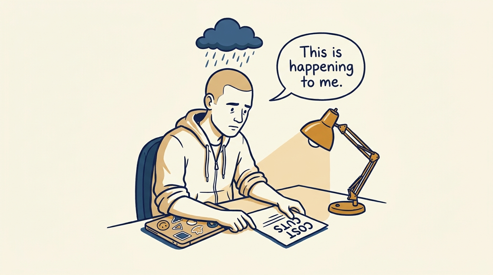
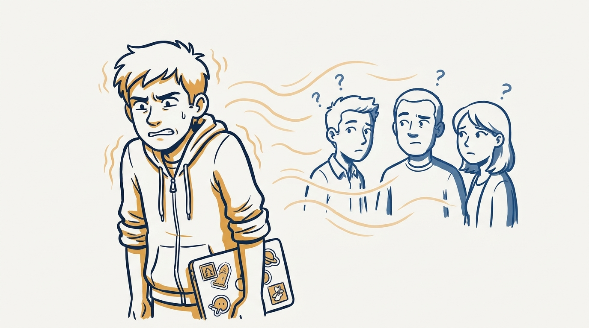
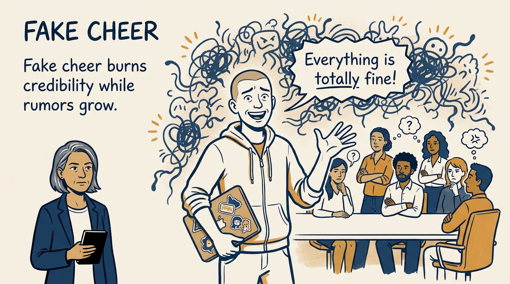
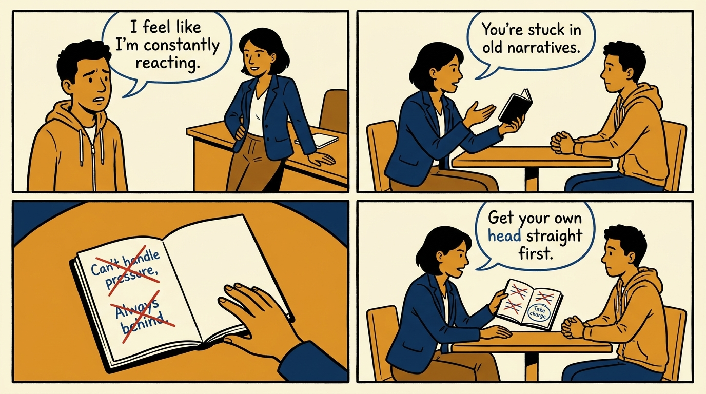
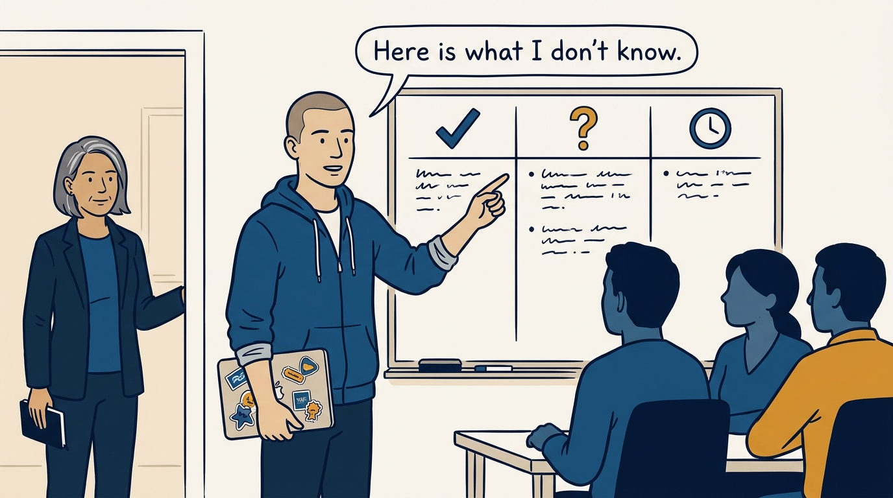
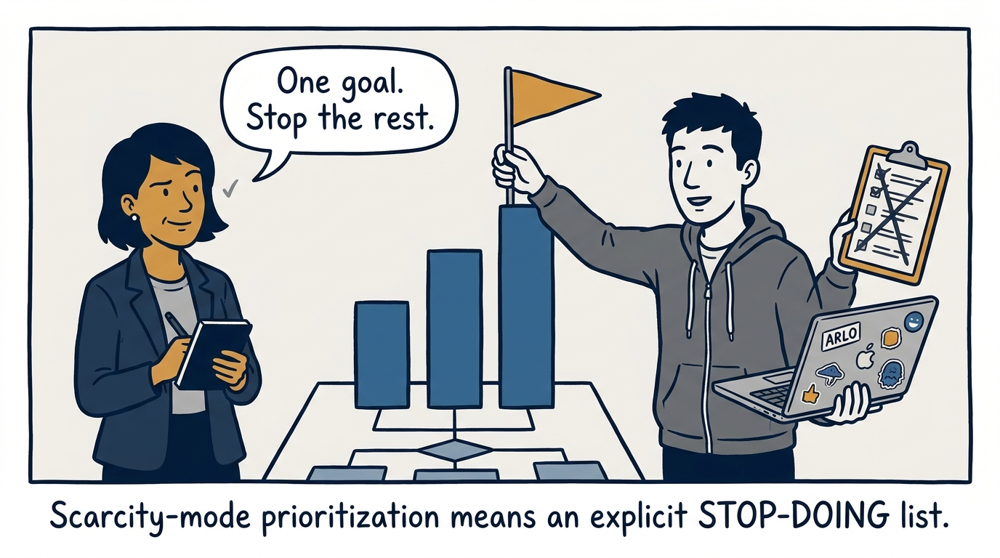
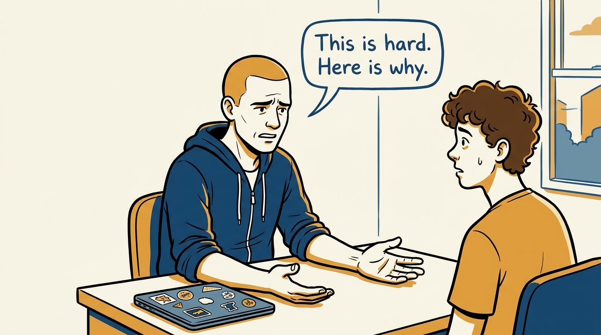
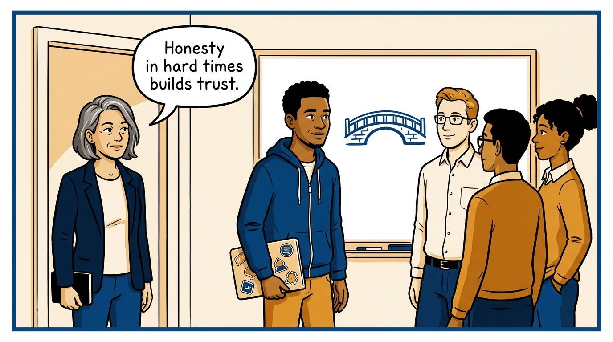

Why leading a downturn starts inside your own head — and how honesty builds the asset it threatens — in eight panels.

<!-- comic-style
{
  "cast": "VERA: a calm, seasoned engineering executive, short gray-streaked hair, dark blazer over a plain t-shirt, carries a small black notebook. ARLO: an eager early-career engineer climbing the ladder — in some strips a new lead or manager, in others the engineer being coached — buzz-cut hair, zip-up hoodie with rolled sleeves, sticker-covered laptop under one arm.",
  "style": "Clean two-tone explainer comic, thick ink outlines, flat colors with deep blue and amber accents on a light background, generous white space, hand-lettered speech bubbles with SHORT readable text, no photorealism."
}
-->

**Panel 1:** *The hook: the downturn lands on the manager first — as guilt, anxiety, and isolation.*

**Panel 2:** *The problem: a manager who has not processed his own state transmits it.*

**Panel 3:** *The wrong way: fake optimism — spending credibility exactly when it is needed most, while the rumor gap fills itself.*

**Panel 4:** *The principle: drop 'this is happening to me' and 'I should have been perfect' — keep 'I can influence how we navigate this.'*

**Panel 5:** *How it runs: what I know, what I don't, and when you'll hear more — on a cadence the team can trust.*

**Panel 6:** *The mechanic: scarcity mode — one top goal, an explicit stop-doing list, and permission to say no.*

**Panel 7:** *The cost: hard news delivered fast and honestly feels bad even when led well — discomfort is not failure.*

**Panel 8:** *The closer: trust deepens when you show up honestly in hard times — that is the asset a downturn can build.*
