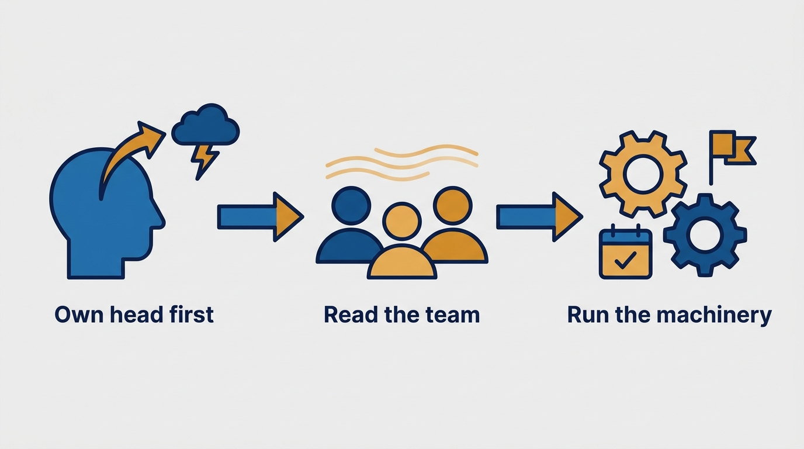
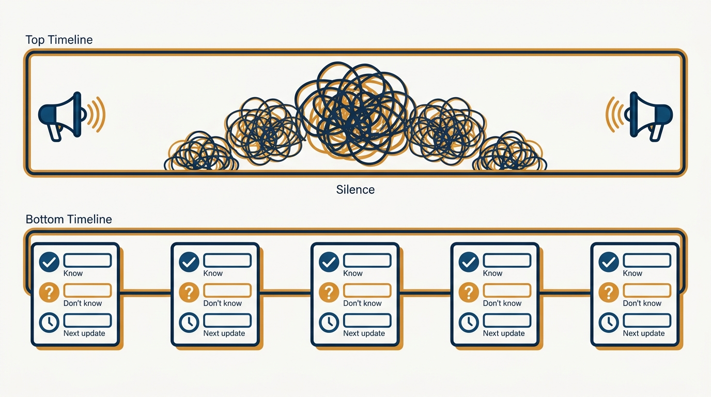
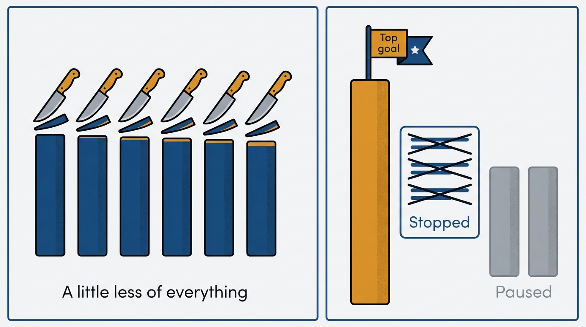

> **Status**: DRAFT
>
> **Principle**: In a downturn, my first management job is myself: I replace "this is happening to me" and "I should have been perfect" with "I can influence how we navigate this," and only then turn to the team. From there the work is disciplined, not heroic — I read fear, grief, and guilt as operating risks; I communicate on a steady cadence with what I know, what I don't know, and when updates will come; I prioritize in scarcity mode with one top goal and an explicit stop-doing list; and I deliver each kind of hard news honestly, without fake optimism. Trust deepens when I show up honestly in hard times — that is the asset a downturn can build.

## Statement

My operating model for leading through a downturn has six parts:

- **Own my own head first.** I acknowledge what I am feeling — guilt, anxiety, isolation, grief — separate facts from self-blame, drop the stories "this is all happening to me" and "I should have been perfect," and focus on what is in my control right now, committing to one concrete next step.
- **Read the team's emotional state as an operating risk.** I watch for fear signals (withdrawal, layoff fixation, silence in meetings), grief signals (low energy, mourning lost colleagues or plans), and guilt or stress signals (overwork, inability to disconnect) — and I treat morale problems as trust and purpose problems, not side issues.
- **Communicate on a cadence, without fake certainty.** I tell people what I know, what I do not know, and when to expect updates; I give the "why" behind priority changes in plain language and do not let rumor gaps stay open. And I build trust intentionally: I explain how the team got here, own my part honestly, and ask the team for help explicitly.
- **Prioritize in scarcity mode.** Fewer things, done better: one most important goal for the period, a definition of what success looks like, an explicit non-goals or stop-doing list, and paused work that does not ladder to the top goal — rechecked whenever conditions change.
- **Handle layoffs and hard news with clarity and speed.** If layoffs may happen, I am clear on the reason, decide on future company needs rather than comfort or recency, move quickly once decided, equip managers with context and scripts, define support precisely, follow up personally with impacted people — and support those who remain just as intentionally. Each other kind of hard news — cut bonuses, hiring freezes, pay cuts, stalled promotions, shifting strategy, missed goals — gets its own honest script.
- **Run a weekly rhythm and keep morale grounded in reality.** Every week: restate the top priority, review what was deprioritized, surface risks and rumors early, share new facts, invite questions, check for overload, recognize progress however small. Morale is not cheerleading — it is protected trust and protected purpose.

**Figure 1:** *The order is the model: own head first, the team's emotional state second, the disciplined machinery third.*

## How to Read This

This journal is my engineering-management operating model, each record grounded in one source. This record sits in the *Making of a Manager* section but is honest about its provenance: the source is a supplementary checklist that extends the themes of Julie Zhuo's *The Making of a Manager* (Portfolio/Penguin, 2019) — her trust-first, human-first management approach applied to downturns — rather than a chapter of the book itself. The runnable version — the self-check, the emotional-signals watchlist, the hard-news scripts, the weekly rhythm — lives in the **Checklist** tab of this post.

## Rationale

**A manager who has not processed their own state transmits it.** Downturns hit managers with a specific cocktail — guilt about decisions, anxiety about the future, isolation from holding information the team does not have. Unprocessed, that leaks into every interaction as either false cheer or visible dread. The two stories to drop are precise: "this is all happening to me" surrenders agency, and "I should have been perfect" rewrites the past instead of navigating the present. The replacement — "I can influence how we navigate this" — is not positive thinking; it is a scoping exercise that points at what is actually in my control.

**Emotional undercurrents are operating risks because they change how the team performs.** Fear produces withdrawal, reduced creativity, and silence in exactly the meetings where I need honest signals. Grief produces low energy that looks like a performance problem but is not one. Guilt produces overwork and burnout in the people I most need to last. Reading these signals is not soft-skills garnish — it is diagnostics on the machine that has to execute the recovery. And most morale problems underneath are trust and purpose problems, which is why cheerleading does not fix them.

**"What I know, what I don't, when you'll hear more" beats both silence and spin.** In uncertainty, people fill information gaps with rumors, and rumors are always worse than reality — or worse, unevenly distributed. Fake optimism and false certainty burn credibility exactly when I need it most; silence reads as concealment. The steady cadence is the fix: a predictable rhythm of honest updates, including explicit "I don't know yet" and a date for the next update, keeps the rumor gap closed without pretending to certainty I do not have.

**Figure 2:** *Rumors grow in the gaps between updates; a steady cadence of "know / don't know / when you'll hear more" leaves them no room.*

**Scarcity is a forcing function, and it only works if the stop-doing list is explicit.** A downturn means fewer people and less money chasing the same ambitions; pretending otherwise burns the team on work that no longer matters. One top goal with a concrete definition of success is half the discipline; the other half is the explicit non-goals list and the permission structure around it — people need my language for saying no to low-priority work, explicit quick decision paths, and escalation as a normal move rather than a failure. Speed in a downturn comes from clarity, not pressure.

**Figure 3:** *Scarcity mode is not less of everything — it is one top goal, an explicit stop-doing list, and paused work that stays paused.*

**Each kind of hard news has its own honest shape, and delivering it fast beats delivering it perfectly.** Cut bonuses need acknowledged disappointment plus the business rationale, not spin. Pay cuts need transparency about why and what recovery looks like, plus reaffirming the person's value. Stalled promotions need honesty about timelines and growth reframed beyond titles. Layoffs need the most discipline of all: decisions based on future company needs rather than comfort or recency, speed once decided, equipped managers, precisely defined support — and just as much intention for the people who remain, because they are watching how the departed were treated to learn what this company is.

## What This Means in Practice

| What this record says | What it does **not** say |
| --- | --- |
| I process my own guilt and anxiety before addressing the team. | I share every private fear with the team — honesty is filtered by judgment about audience and detail. |
| I tell people what I do not know and when updates will come. | I promise outcomes I cannot guarantee to make the room feel better. |
| One top goal, an explicit stop-doing list, paused non-laddering work. | Everything gets a little less effort — peanut-buttering the cut across all work. |
| Layoff decisions follow future company needs, executed quickly. | Layoffs by recency or comfort, or slow-rolled to soften the discomfort of deciding. |
| Morale is protected trust and purpose, grounded in reality. | Morale is cheerleading — sugarcoating until the team stops believing anything I say. |
| Trust deepens when I show up honestly in hard times. | Discomfort means I am failing — hard periods feel bad even when led well. |

Concretely: in a downturn my team can name the single top priority and what was explicitly stopped, everyone knows when the next update comes, no rumor survives a week unaddressed, every piece of hard news arrived with its rationale attached, and the weekly rhythm runs without fail.

## Anti-Patterns

- **Leaking the unprocessed state.** Walking into the team meeting with my own guilt and anxiety unexamined, so the team reads dread or false cheer instead of direction.
- **Treating morale as a side issue.** Dismissing withdrawal, silence, and low energy as attitude problems instead of reading them as fear and grief — operating risks in the system that must execute the recovery.
- **The rumor gap.** Going quiet between decisions, letting the team's imagination — always worse than reality — fill the space.
- **Fake optimism.** "It's all going to be fine" delivered without evidence, spending credibility I will need for the next hard message.
- **Peanut-butter prioritization.** Cutting 20% of effort from everything instead of stopping whole workstreams, so nothing ships and everyone burns out.
- **The slow, comfortable layoff.** Deciding based on recency or personal comfort, then dragging execution out — maximizing anxiety for everyone while sparing only me.
- **Forgetting the survivors.** Handling departures carefully and assuming those who remain are fine, when they are watching exactly how the departed were treated.

## Related Records

- [[managing-yourself]] — the get-your-own-head-straight discipline is that record applied under maximum pressure.
- [[getting-things-done]] — the prioritization machinery this record shifts into scarcity mode.
- [[nurturing-culture]] — a downturn is the stress test of culture: what I repeat, model, and reward under pressure is what the team learns the values really are.
- [[feedback]] — hard news lands on the honesty and trust foundations that record builds in ordinary times.

## Scope and Revisiting

This record is `draft`. It governs how I lead a team through cost cuts, layoffs, hiring freezes, and stalled growth — my own state, the communication cadence, scarcity-mode prioritization, hard-news delivery, and the weekly rhythm. I revisit it after each real downturn episode with a blameless retrospective, when the weekly rhythm has quietly lapsed for more than two weeks, or when I catch myself delivering hard news without its rationale attached.

## Authoritative References

- Julie Zhuo, *The Making of a Manager: What to Do When Everyone Looks to You* (Portfolio/Penguin, 2019) — the management approach this record extends; the source checklist is supplementary material applying the book's trust-first themes to downturns, not a chapter of the book.
