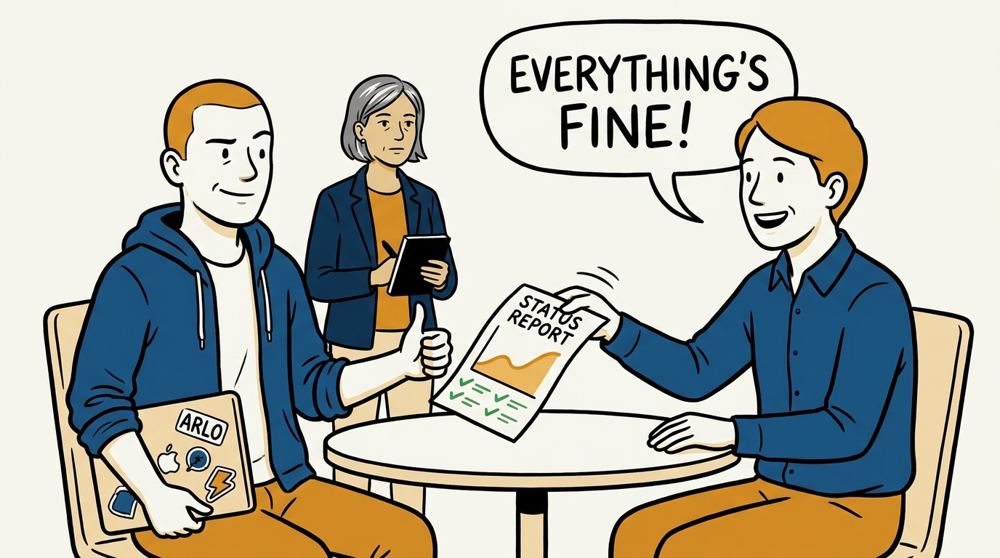
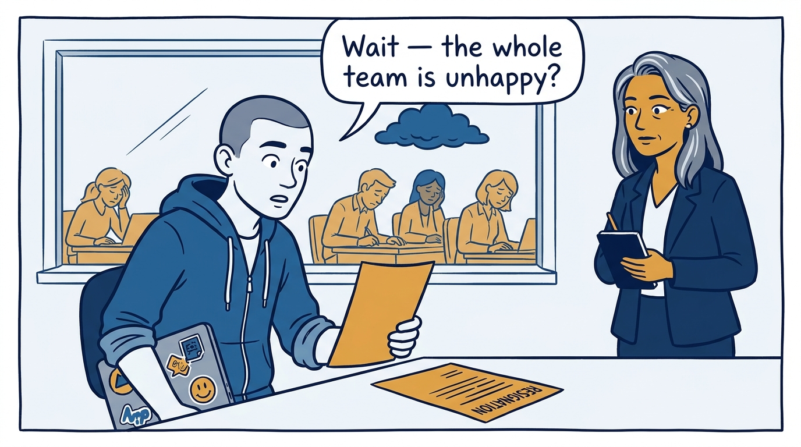
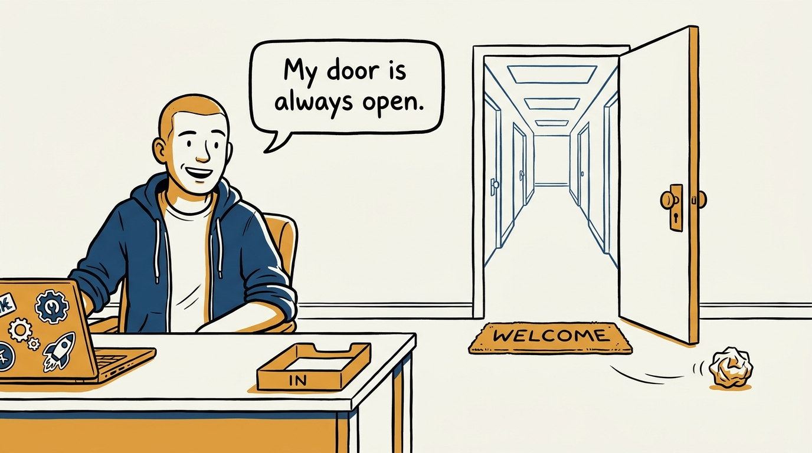
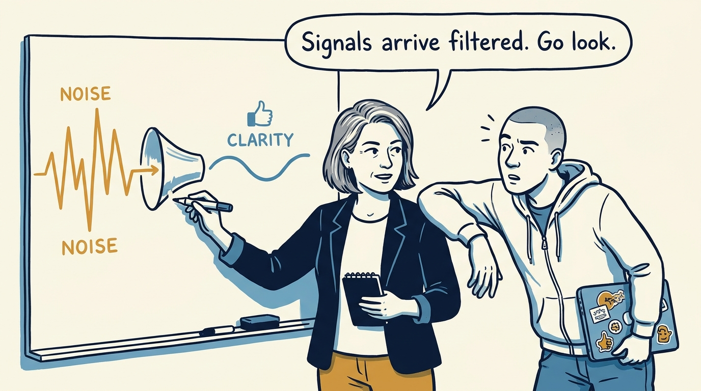
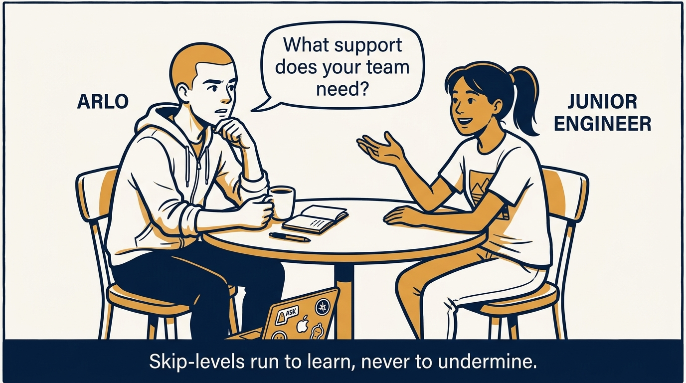
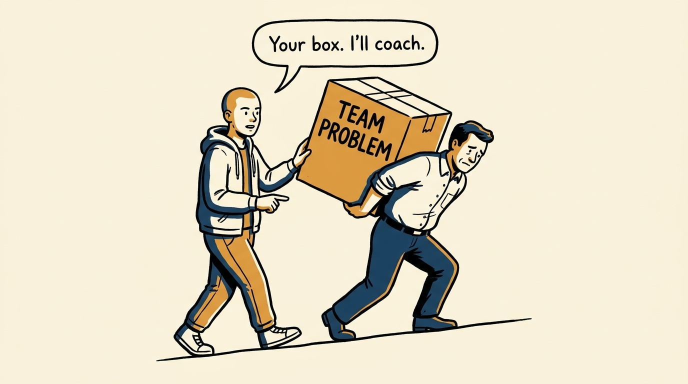
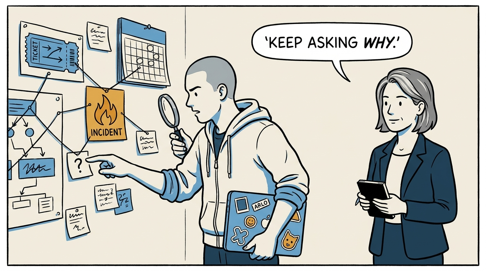
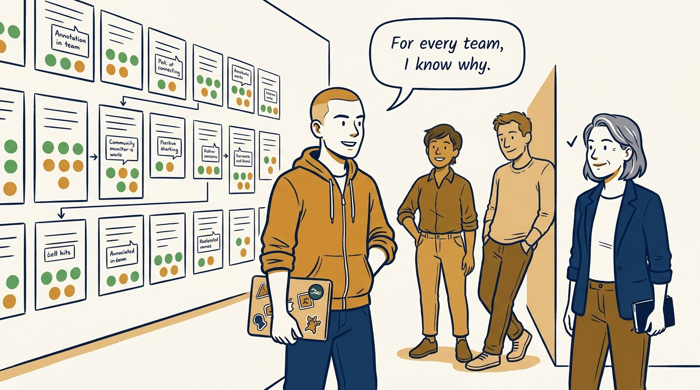

When your reports are managers, every signal arrives pre-filtered — eight panels on getting ground truth without taking over.

<!-- comic-style
{
  "cast": "VERA: a calm, seasoned engineering executive, short gray-streaked hair, dark blazer over a plain t-shirt, carries a small black notebook. ARLO: an engineer newly stepping into management, buzz-cut hair, zip-up hoodie with rolled sleeves, sticker-covered laptop under one arm.",
  "style": "Clean two-tone explainer comic, thick ink outlines, flat colors with deep blue and amber accents on a light background, generous white space, hand-lettered speech bubbles with SHORT readable text, no photorealism."
}
-->

**Panel 1:** *The hook: every report on the desk is green — and every one of them has been summarized on the way up.*

**Panel 2:** *The problem: rely on what filters up, and you learn about the failing team from the resignation letter.*

**Panel 3:** *The wrong way: the open door — the people with the worst news are the least likely to walk through it.*

**Panel 4:** *The principle: filtering is what summarization does — so deliberate inspection has to replace ambient awareness.*

**Panel 5:** *How it runs: regular skip-levels with real questions — the ground-truth channel, framed to learn, not to police.*

**Panel 6:** *The mechanic: coach the manager who carries the problem — absorb it, and team health quietly becomes your job.*

**Panel 7:** *The cost: ground truth is work — hypothesis, data, observation, and asking why until the real issue surfaces.*

**Panel 8:** *The closer: the bar for the rung — for every team, being able to say whether it runs well, and why.*
