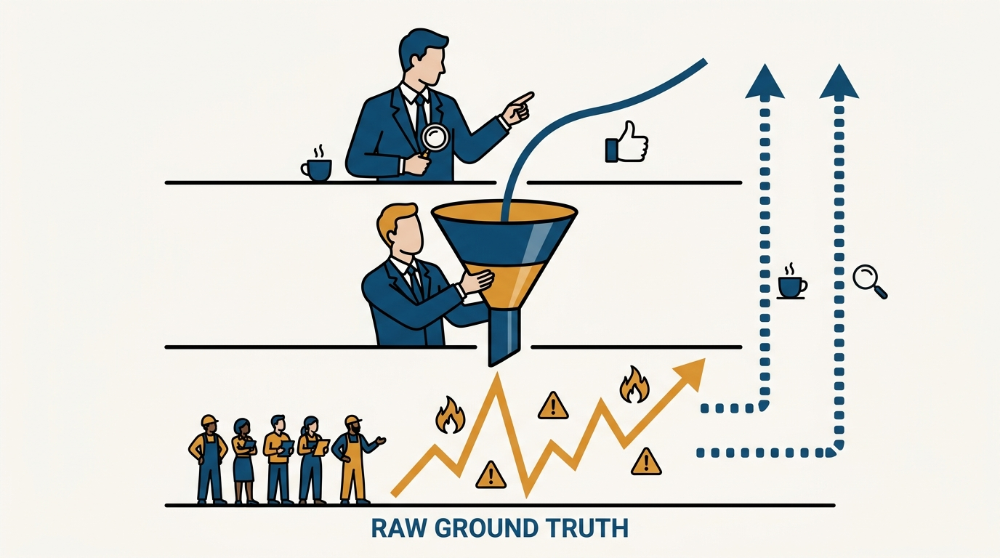
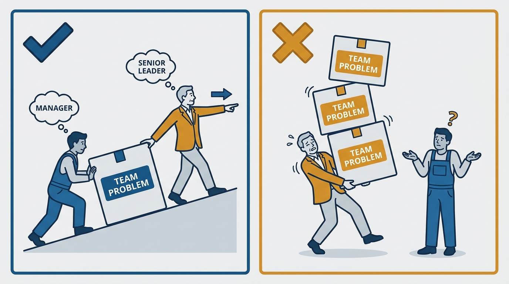
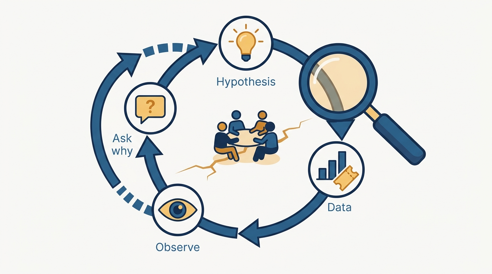

> **Status**: DRAFT
>
> **Principle**: When my direct reports are managers, everything I know about the teams arrives filtered through them — and a manager under pressure filters optimistically. So at this rung, deliberate inspection replaces ambient awareness: regular cadences with each manager, skip-levels run to learn rather than to undermine, and follow-up on small signals until I understand whether they matter. I hold each manager accountable for their team's health and output — I coach them, but I do not absorb the responsibility that belongs to them — and when a team is dysfunctional, I debug it like a systems problem: hypothesis, data, observation, and asking why until the real issue surfaces.

## Statement

When I manage managers — and for every manager-of-managers I hold accountable — the commitments are:

- **I actively seek ground truth.** I keep a regular cadence with each manager on goals, risks, delivery, and people issues; I know the status of hiring, coaching, goal-setting, postmortems, and major incidents across teams; and I never rely on an open-door policy alone to surface problems. I follow up on small signals until I know whether they matter.
- **I run skip-levels, to learn.** I meet skip-level reports regularly — 1:1 and occasionally in groups — and ask about team health, blockers, morale, what support they need, and whether there are concerns about the manager, the product direction, or coordination with other teams. Skip-levels exist to inform me, never to undermine the manager.
- **I hold managers accountable without absorbing their job.** Each manager is accountable for their team's health and productivity; a messy environment does not excuse chronic issues. I expect problems brought to me early, with context and proposed next steps. I coach — I do not take the responsibility back.
- **I watch for the manager failure patterns.** Overpromising and underdelivering; people-pleasing and avoiding hard conversations; shielding teams from reality instead of solving root problems; saying yes to everyone and creating confusion; micromanaging; skipping 1:1s and evading specifics. I address these directly and early.
- **I inspect new managers closely and manage experienced ones deliberately.** First-time managers get extra coaching, explicit expectations, and corrective feedback within their first six months. Experienced managers get a culture-fit assessment — experience elsewhere is not effectiveness here — independence where earned, and coaching on strategy, scope, and organizational impact.
- **I hire managers with rigor.** I test how candidates run 1:1s and handle difficult people situations, ask how they coach underperformers and grow strong performers, probe their management philosophy and delegation style, check that they can diagnose team problems rather than just talk well, verify technical credibility with the team they would lead, and run thorough reference checks — strengths, failures, and whether people would work with them again.
- **Outside my expertise, I lean in harder.** For unfamiliar functions I spend more time learning, not less: I ask the manager and team to teach me how the work works, and I check in regularly until I can detect problems and ask informed questions.

## How to Read This

This journal is my engineering-management operating model, each record grounded in one source. This record distills the "Managing Managers" chapter of Camille Fournier's *The Manager's Path* (O'Reilly, 2017) — the rung where the reports are themselves managers and **the distance to the actual work doubles**. I write it two-sided: what I commit to when I occupy this role, and what I hold every manager-of-managers in my organization accountable for. The runnable version — the skip-level question set, the failure-pattern watchlist, the team-debugging procedure, and the self-review — lives in the **Checklist** tab of this post.

## Rationale

**Filtered information is the defining hazard of this rung.** A manager reporting upward summarizes, smooths, and — under pressure — shades toward optimism. None of this requires bad faith; **it is what summarization does**. If I only know what my managers choose to tell me, I will learn about a failing team at the moment it fails, and about a departing engineer from their resignation letter. That is why the source insists on active information-seeking: regular cadences on goals, risks, delivery, and people; awareness of hiring, postmortems, and incidents across teams; and the discipline of following up on small signals — an offhand remark, a skipped meeting, an unusually vague update — until I understand whether they matter. **An open-door policy surfaces nothing**; the people with the worst news are the least likely to walk through it.

**Figure 1:** *Every signal arrives pre-filtered — and filters shade optimistic. Skip-levels and follow-up are the deliberate bypass channels.*

**Skip-levels are the ground-truth channel, and their framing decides their value.** Run well, a skip-level tells me things no status report contains: whether people understand and believe the goals, what daily friction looks like, what support the team actually needs, and — asked carefully — whether there are concerns about the manager, the product direction, or coordination with other teams. Run badly, the same meeting becomes surveillance that undermines the manager and teaches everyone to perform. The difference is **intent made explicit**: I ask to learn, I ask what is going well as earnestly as what is not, and what I hear feeds coaching conversations with the manager — **not end-runs around them**.

**Accountability that I absorb stops being accountability.** When a manager brings me a struggling team and I quietly take over the problem, I have taught them that team health is ultimately my job. The source's line is exact: coach managers, but do not absorb the responsibility that belongs to them. The standard I hold is that managers bring me problems early, with context and proposed next steps — and that a manager "making my job easier" is doing so the right way, by running a genuinely healthy team, not by hiding problems until they detonate. The failure patterns I watch for are mostly **ways of faking health**: overpromising, people-pleasing, shielding the team from reality instead of fixing root problems, saying yes to everyone, or going vague and skipping 1:1s. Each is addressed directly and early, because **each one compounds**.

**Figure 2:** *Coach the carrier; never take the box. Accountability that gets absorbed upward stops being accountability.*

**New managers and experienced managers fail differently, so I inspect them differently.** A first-time manager is learning a new craft with live subjects; the kind move and the rigorous move are the same — close inspection of their 1:1s, feedback, delegation, and planning, explicit expectations, and corrective feedback within the first six months, while habits are still soft. An experienced manager arriving from elsewhere carries a formed philosophy that may or may not fit; **the risk is not skill but mismatch**, so I assess culture fit honestly — experience elsewhere is not effectiveness here — align on management philosophy and expectations, then give independence where it is earned and coach at the level of strategy, scope, and organizational impact. Hiring managers gets the same seriousness as hiring senior engineers, because a bad manager damages an entire team **before the damage is visible**: role-played 1:1s and difficult situations, coaching philosophy, diagnostic ability, technical credibility with the specific team, and references that cover failures, not just strengths.

**A dysfunctional team is a systems problem, and I debug it like one.** When a team is unhappy or underdelivering, the tempting move is to **accept the first story offered** — the manager's, or the loudest engineer's. Instead I run the debugging loop: form a hypothesis; check the data — tickets, incidents, code reviews, calendars, communication patterns, delivery history; observe the team in meetings and working sessions; ask people whether they understand their goals and why those goals matter; assess dynamics, trust, and cross-functional relationships; and keep asking why until the real issue surfaces. I jump in to help when the manager is struggling — but as **a debugger with curiosity**, not as a replacement manager.

**Figure 3:** *A dysfunctional team is a systems problem: hypothesis, data, observation, and why — repeated until the real issue surfaces.*

**The same grounding requirement applies here as everywhere on the ladder.** I stay technically relevant enough — systems, bottlenecks, technical bets, some code and postmortems — to **filter requests with my own judgment** and explain technical tradeoffs in business terms, instead of acting as a relay between leadership and teams.

## What This Means in Practice

| What this record says | What it does **not** say |
| --- | --- |
| I actively seek information across teams. | I distrust my managers — **inspection is how I support them**, not how I audit their honesty. |
| I run regular skip-levels with a real question set. | Skip-levels are a back channel for overriding managers — what I learn feeds coaching, not end-runs. |
| Managers are accountable for team health and output. | I abandon struggling managers — I coach closely, especially in the first six months. |
| I address failure patterns directly and early. | One bad week is a pattern — I follow signals until I know whether they matter. |
| I debug dysfunctional teams with hypothesis and data. | I take over dysfunctional teams — I help, then hand the running of the team back. |
| Outside my expertise, I lean in and learn the function. | I must become an expert in every function — the bar is **informed questions and problem detection, not mastery**. |
| I hire managers with role-play, diagnosis tests, and deep references. | A polished interview narrative is enough — talking well about management is not the same as diagnosing a real team. |

Concretely: every manager reporting to me has **a standing cadence** covering goals, risks, delivery, and people; every skip-level report sees me at a predictable rhythm; every new manager has explicit written expectations and gets substantive feedback within six months; and for every team in my organization I can say **whether it is running well, and why** or why not.

## Anti-Patterns

- **The open-door manager-of-managers.** Waiting for problems to walk in, then being surprised by an attrition spike or a failed delivery that "no one raised."
- **Skip-levels as surveillance.** Using skip-level meetings to collect ammunition about a manager instead of context about a team — and destroying both channels at once.
- **Absorbing the manager's job.** Taking over every struggling team personally, teaching managers that escalation means handoff and that team health is ultimately mine.
- **Excusing chronic issues because the environment is messy.** Accepting perpetual dysfunction as the cost of a hard context instead of holding the manager accountable for improving it.
- **Confusing polish with competence.** Hiring or promoting managers who talk beautifully about management but cannot diagnose a concrete team problem — the exact gap rigorous interviews and references exist to catch.
- **Retreating to comfort zones.** Managing an unfamiliar function by avoiding it — engaging deeply only where I feel expert, and leaving the unfamiliar teams effectively unmanaged.
- **Adopting the first story.** Debugging a dysfunctional team by accepting the most available narrative instead of checking tickets, calendars, delivery history, and the team's own understanding of its goals.
- **The relay manager.** Passing requests downward and status upward without applying technical judgment in either direction — adding latency and subtracting nothing.

## Related Records

- [[managing-multiple-teams]] — the previous rung: leading several teams directly; this record begins where the directs are themselves managers and information distance doubles.
- [[senior-leadership]] — the next rung: the executive level, where these inspection habits become organizational systems.
- [[management-101]] — the two-sided contract every manager owes their reports; skip-levels are partly a check that my managers are honoring it.
- [[managing-a-team]] — what I hold each of my managers accountable for delivering on their own team.
- [[hiring-well]] — the general hiring craft; this record adds the manager-specific rigor of role-play, diagnosis tests, and deep references.

## Scope and Revisiting

This record is `draft`. It governs how I operate whenever my direct reports are managers: information-seeking, skip-levels, accountability boundaries, manager development and hiring, and team debugging. I revisit it if a serious team problem reaches me through escalation or attrition **before my own inspection surfaced it**, if a new manager reaches six months without substantive corrective feedback, or if my self-review shows me **sliding back into individual-contributor or project-manager habits** instead of spending time on leverage.

## Authoritative References

- Camille Fournier, *The Manager's Path: A Guide for Tech Leaders Navigating Growth and Change* (O'Reilly, 2017) — the "Managing Managers" chapter this record distills; the checklist in the Checklist tab is adapted from its chapter checklist.
