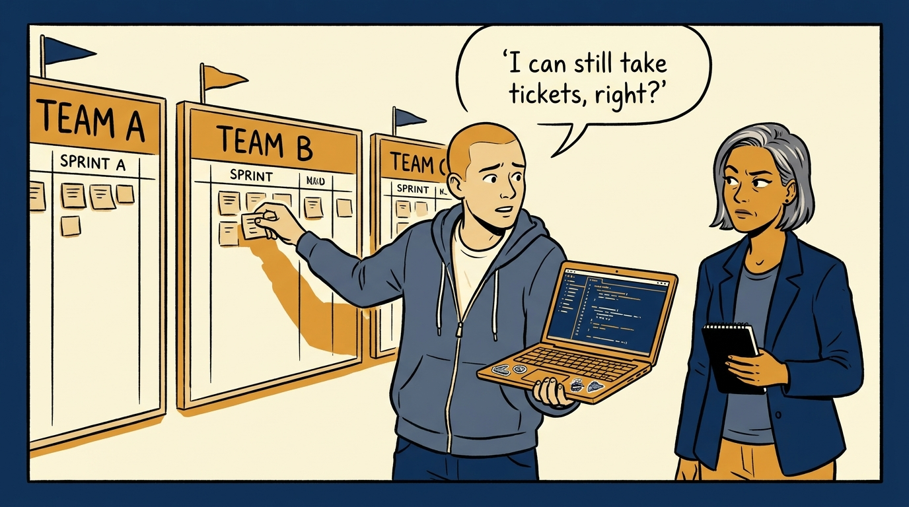
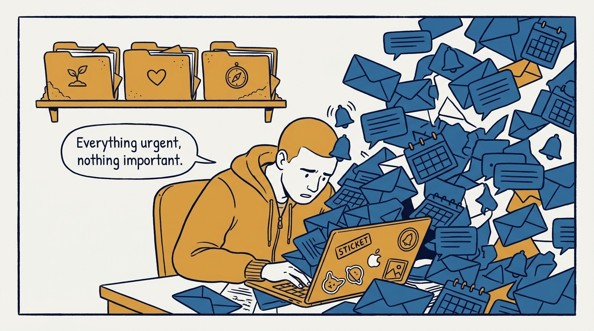
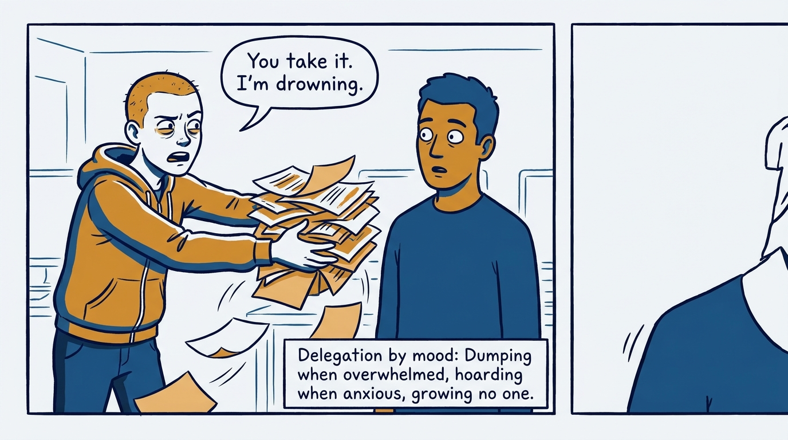
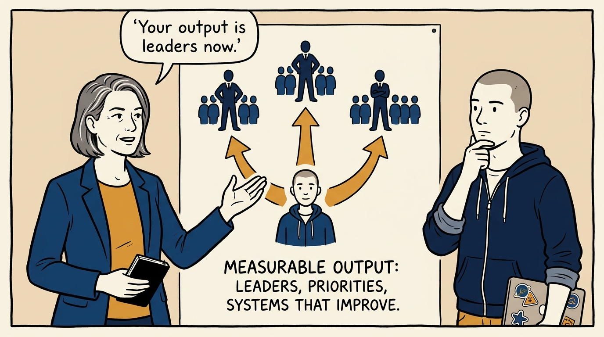
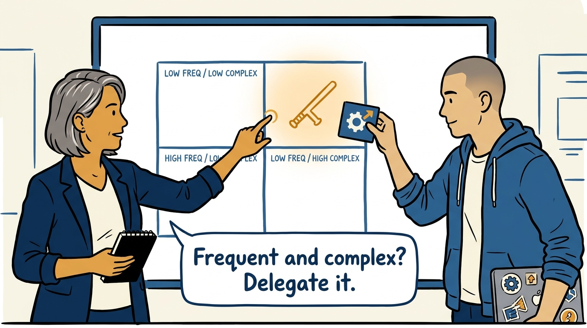
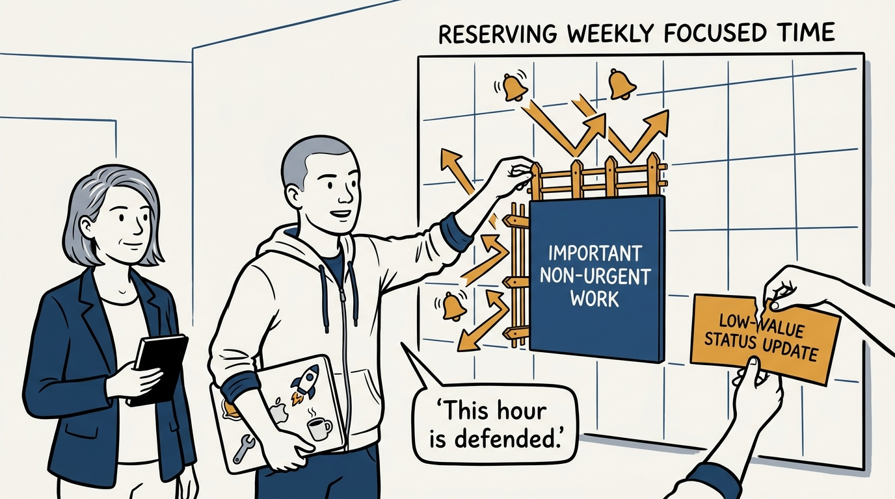
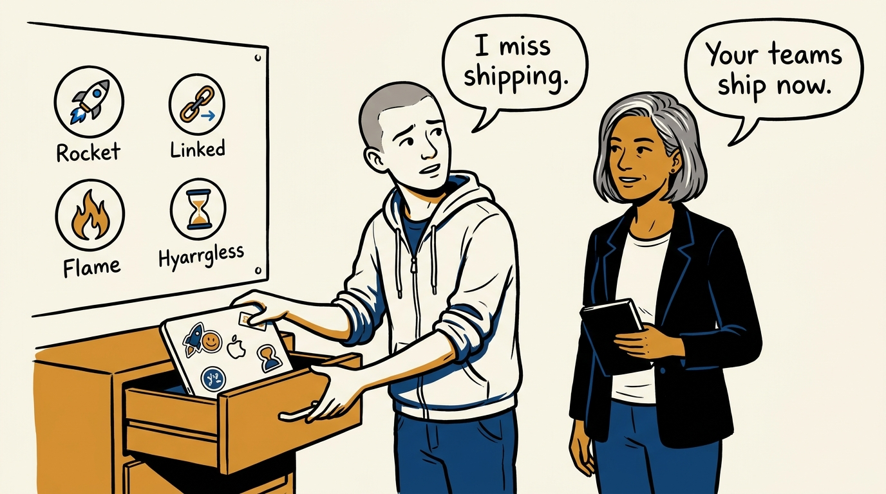
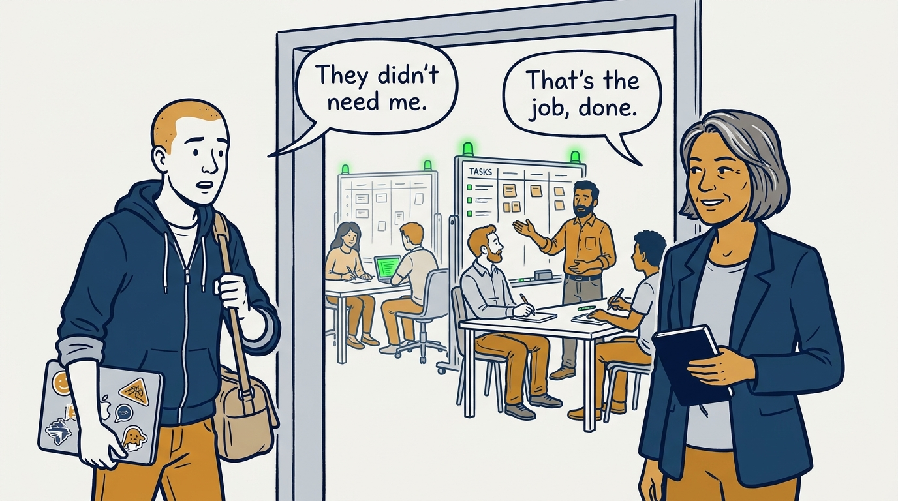

What changes when writing production code stops being the job — in eight panels.

<!-- comic-style
{
  "cast": "VERA: a calm, seasoned engineering executive, short gray-streaked hair, dark blazer over a plain t-shirt, carries a small black notebook. ARLO: an engineer newly stepping into management, buzz-cut hair, zip-up hoodie with rolled sleeves, sticker-covered laptop under one arm.",
  "style": "Clean two-tone explainer comic, thick ink outlines, flat colors with deep blue and amber accents on a light background, generous white space, hand-lettered speech bubbles with SHORT readable text, no photorealism."
}
-->

**Panel 1:** *The hook: three teams now — and the strongest pull is back toward the comfortable old job.*

**Panel 2:** *The problem: urgent work invades on its own; the important work — hiring, health, leaders — never sends an invite.*

**Panel 3:** *The wrong way: delegation by mood — offloading when overwhelmed reduces workload but builds no capability.*

**Panel 4:** *The principle: the job's output is no longer code — it is leaders, priorities, and a system of work that runs without you.*

**Panel 5:** *How it runs: two questions — how frequent, how complex — decide what to hand off, keep, or turn into coaching.*

**Panel 6:** *The mechanic: important work survives only when it is structurally defended — reserved time, pruned meetings, quick clear no's.*

**Panel 7:** *The cost: giving up the comfort of shipping yourself — credibility becomes maintenance, and health gauges replace the editor.*

**Panel 8:** *The closer: the bar is the week-away test — the teams keep operating well when the manager steps away.*
