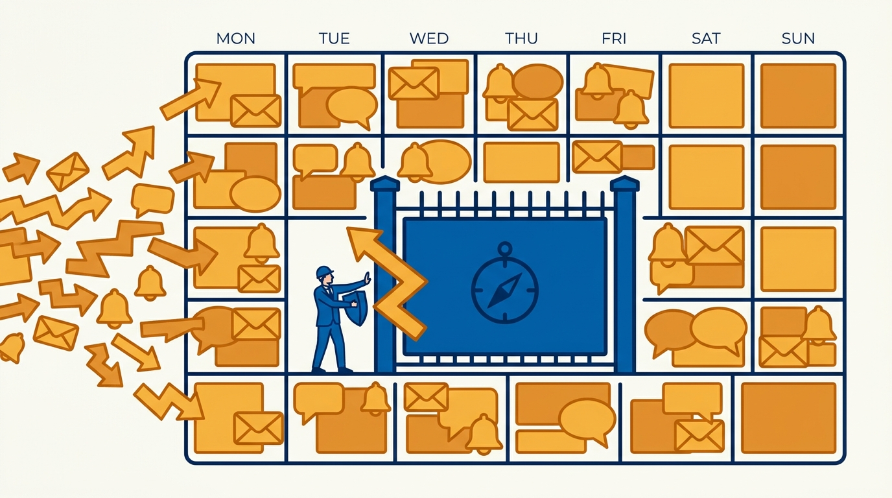
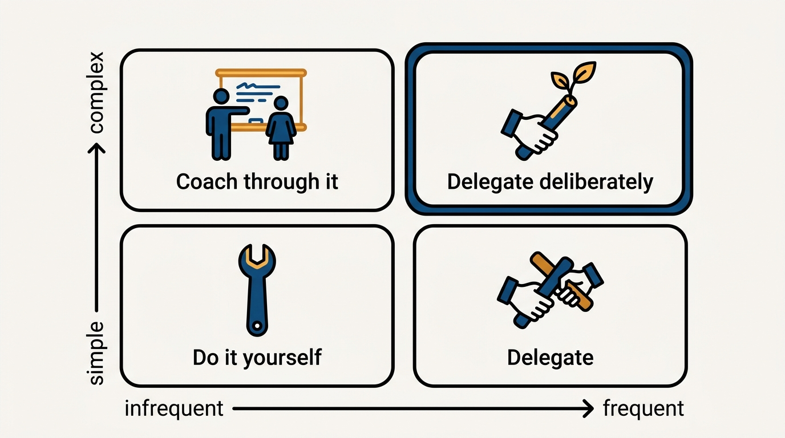
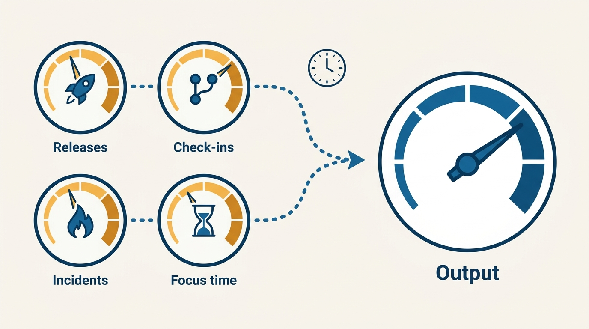

> **Status**: DRAFT
>
> **Principle**: At the multi-team rung, my job is no longer to write production code — and pretending otherwise steals time from the job I actually have. My output is leaders, priorities, and a system of work that improves without me in the middle of it. I separate important work from merely urgent work and reserve weekly time for the former; I delegate on purpose, using complexity and frequency to decide what to hand off, what to keep, and what to turn into coaching; I say no clearly and quickly; and I measure team health by release frequency, code flow, incident load, and focus time — not just output. The bar is simple: my teams keep operating well if I step away for a week.

## Statement

When I manage multiple teams — and for every manager I hold accountable at this rung — the commitments are:

- **I own the role as it is, not as it was.** I accept that writing production code is no longer my primary job. I stay technically credible through reviews, debugging, incidents, and design conversations, and I keep at least one protected block each week for creative or technical work — but my measurable output is managers, tech leads, and future leaders.
- **I prioritize by importance, not urgency.** I separate important work from merely urgent work, reserve time every week for important-but-not-urgent work, prune low-value meetings from my calendar, and refuse to treat email, chat, and scheduled meetings as automatically important.
- **I delegate on purpose, using the grid.** Simple and frequent: delegate. Simple and infrequent: do it myself when explaining would take longer. Complex and infrequent: use as coaching opportunities for rising leaders. Complex and frequent: delegate deliberately to develop team ownership. I identify the tasks only I can do — and teach the rest.
- **I build leaders, not helpers.** Tech leads and emerging managers get real responsibility — planning, coordination, follow-through — not helper tasks. Delegation exists to grow capability, not just to reduce my workload.
- **I say no like a leader.** "Yes, and" instead of reflexive rejection; explicit tradeoffs — what slips if we say yes; "help me say yes" questions that test weak proposals; policies where I keep saying no to the same thing; honest time and budget constraints; and quick, clear no's instead of vague "not right now."
- **I measure team health beyond output.** Release frequency, frequency of code check-ins, incident frequency and operational load, process friction, whether engineers have what they need, and whether people have focus time to build rather than just react.
- **I model sustainable pace.** Efficiency, automation, and simplification instead of longer hours; no after-hours signals that normalize overwork; protection of myself and my teams from burnout.

## How to Read This

This journal is my engineering-management operating model, each record grounded in one source. This record distills the "Managing Multiple Teams" chapter of Camille Fournier's *The Manager's Path* (O'Reilly, 2017) — the rung where the manager's calendar, delegation choices, and system-of-work improvements become the job itself. I write it two-sided: what I commit to when I occupy this role, and what I hold every multi-team manager in my organization accountable for. The runnable version — including the weekly manager reset and the monthly leadership check — lives in the **Checklist** tab of this post.

## Rationale

**Clinging to production code at this rung is comfort spending, not contribution.** With multiple teams, the highest-leverage work is exactly the work nobody demands by deadline: hiring plans, team health, roadmaps, growing leaders, fixing the system of work. Every hour I spend as an extra engineer is an hour taken from work only I can do — while displacing an engineer who would have done the coding better because they live in the codebase daily. Staying technically credible matters, which is why I protect one weekly block for technical work and stay close to reviews, incidents, and design conversations — but credibility is a maintenance activity now, not the job.

**Urgent work volunteers itself; important work has to be defended.** Email, chat, and a full calendar all feel like work and arrive with built-in urgency, but almost none of it is important. The important work — the kind that determines whether my organization is better in six months — never shows up as a meeting invite. So the discipline is structural, not motivational: reserved weekly time for important-but-not-urgent work, a recurring calendar review that removes low-value meetings, and a purpose test for every recurring group meeting. If I regularly find the week consumed by urgent-but-low-value work, that is a system failure of mine, not bad luck.

**Figure 1:** *Urgent work invades the calendar on its own; important work survives only where it is structurally defended.*

**The delegation grid turns a guilt-ridden judgment call into a routine decision.** Most managers delegate by mood — offloading when overwhelmed, hoarding when anxious. Fournier's grid replaces mood with two questions: how frequent is this task, and how complex? Simple-frequent tasks are training wheels for ownership; simple-infrequent tasks are cheaper to just do; complex-infrequent tasks are the best coaching opportunities I have, worth doing slower with a rising leader in the room; complex-frequent work is precisely what must be delegated, because it is what develops real team ownership — and what buries me if I keep it. The residue after the grid is the short list of things only I can do. Everything else, I teach.

**Figure 2:** *The grid replaces mood with two questions — how frequent, how complex — and complex-frequent work is exactly what must be handed off.*

**Team health is legible in flow metrics before it is legible in output.** Output figures lag; by the time a team's results visibly sag, the causes are months old. Release frequency, check-in frequency, incident load, and focus time move first — and so do the soft signals: a tech lead who reports "everything is fine" but skips 1:1s, meetings that feel lifeless or one-sided, priorities that churn with no stable goals, teams that turn inward and stop learning from outside. Watching these signals — and then actually improving the system of work behind them: smaller releases, fewer manual steps and handoffs, better tooling, incident load kept in bounds — is what managing multiple teams means when I can no longer be inside each team's daily work.

**Figure 3:** *Flow signals move first: by the time output visibly sags, the causes are months old.*

**The culture I build must outlast me — and must not define itself against others.** "Us vs. them" identity-building feels like team spirit and costs the organization dearly: teams aligned to their own superiority rather than company purpose, closed to outside ideas, hostile at the boundaries where all real delivery happens. I align teams to company purpose, treat my peer leaders as my first team, and build teams that survive leadership changes and reorganizations. The same logic applies to pace: the signals I send — after-hours messages, celebrated heroics — become culture faster than anything I say, so I queue the non-urgent messages and push for smarter, not merely harder.

## What This Means in Practice

| What this record says | What it does **not** say |
| --- | --- |
| Production code is no longer my primary job. | I go technically dark — reviews, incidents, design conversations, and one protected technical block keep me credible. |
| I reserve weekly time for important-but-not-urgent work. | Urgent work is ignored — it is handled, but it does not get to crowd out the important by default. |
| I delegate complex, frequent work to develop ownership. | I dump whatever I dislike — the grid decides, and complex-infrequent work is coached, not dropped on someone. |
| I say no quickly and clearly when the answer is no. | I reflexively reject — "yes, and" with explicit tradeoffs comes first; policies replace repeated one-off no's. |
| I track release frequency, code flow, and incident load. | Output metrics are enough — flow and health signals move first, and they are what I inspect. |
| The week-away test is the bar for my teams. | I make myself unnecessary tomorrow — building leaders who can run planning and follow-through takes deliberate, sustained coaching. |

Concretely: my week includes a manager reset — review team health, risks, and staffing; prune the calendar; pick one thing to delegate; move one important-but-not-urgent item forward; check in with tech leads and future leaders; remove one friction point from a team's workflow. Monthly, I step back and ask whether the teams are getting more independent, whether the culture is drifting into silos, whether operating metrics are improving, and whether I am building an organization that can scale without me in the middle of everything.

## Anti-Patterns

- **The manager who still ships.** Spending prime hours writing production code while hiring plans, team health, and leader development quietly starve — leverage traded for comfort.
- **The calendar as boss.** Treating every meeting, email, and chat ping as automatically important, and discovering at month's end that nothing important-but-not-urgent moved at all.
- **Delegation as dumping.** Handing off work only when overwhelmed, with no intent to grow anyone — reducing my workload without building any capability.
- **Helper-task "development."** Giving tech leads and emerging managers errands instead of real responsibility, then concluding they are not ready for more.
- **The vague not-right-now.** Deflecting requests with soft non-answers I never intend to revisit, teaching the organization that my no's are negotiable and my yes's are meaningless.
- **Output-only dashboards.** Watching delivery numbers while release frequency slows, incident load climbs, and focus time evaporates — then being surprised by the collapse.
- **"Us vs. them" team spirit.** Building team identity against other teams, and paying for the morale boost with silo behavior at every boundary.
- **After-hours heroics as culture.** Sending weekend messages, praising crunch, and calling it commitment — normalizing overwork one signal at a time.

## Related Records

- [[managing-a-team]] — the previous rung: owning one team's health and output while still sharing its technical day-to-day.
- [[managing-managers]] — the next rung: the directs are themselves managers, and skip-levels become the ground-truth channel.
- [[tech-lead]] — the role I am deliberately growing when I use complex-infrequent work as coaching opportunities.
- [[getting-things-done]] — the prioritization craft from the *Making of a Manager* side of this journal; this record applies it at multi-team scope.
- [[managing-a-growing-team]] — Julie Zhuo's view of the same transition, from a growing-team perspective.

## Scope and Revisiting

This record is `draft`. It governs how I operate when managing multiple teams and what I hold multi-team managers accountable for: prioritization, deliberate delegation, leader-building, team-health measurement, and sustainable pace. I revisit it if the week-away test fails for any of my teams, if two consecutive monthly checks show teams becoming less independent or operating metrics degrading, or if my own weekly review keeps showing important work postponed for urgent-but-low-value work.

## Authoritative References

- Camille Fournier, *The Manager's Path: A Guide for Tech Leaders Navigating Growth and Change* (O'Reilly, 2017) — the "Managing Multiple Teams" chapter this record distills; the checklist in the Checklist tab is adapted from its chapter checklist.
