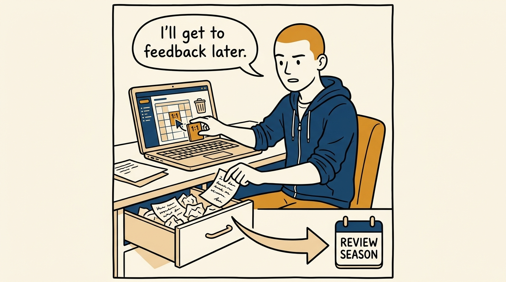
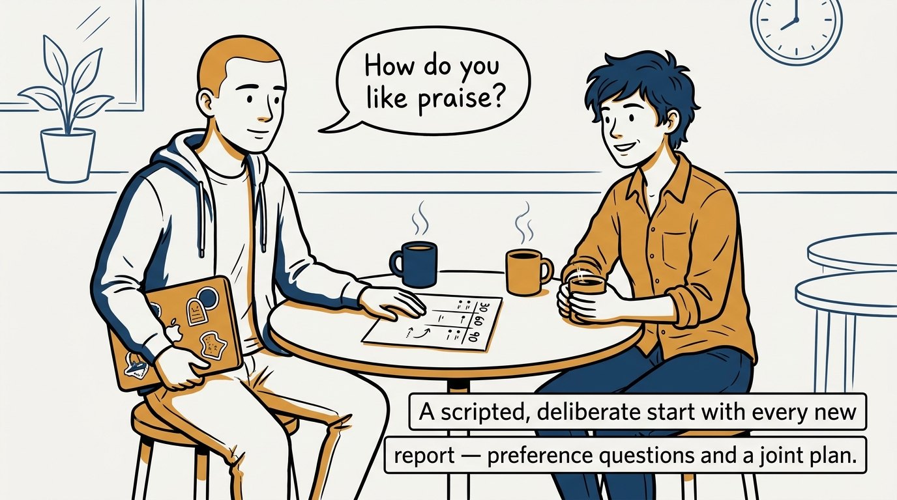
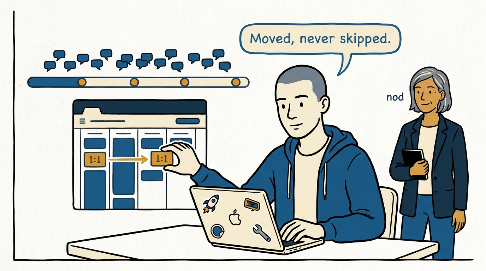
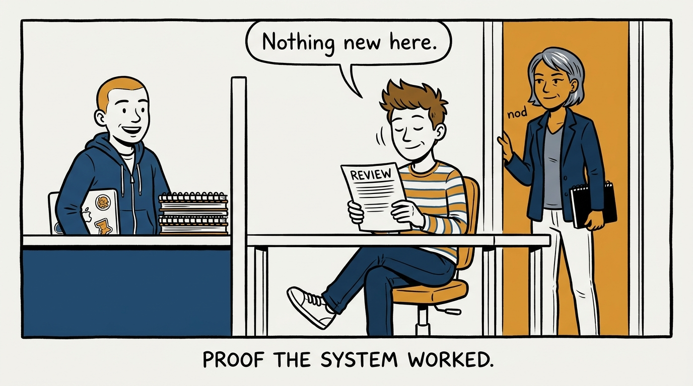

How first-line people management becomes a set of learnable mechanics under one rule — no surprises — in eight panels.

<!-- comic-style
{
  "cast": "VERA: a calm, seasoned engineering executive, short gray-streaked hair, dark blazer over a plain t-shirt, carries a small black notebook. ARLO: an engineer newly stepping into management, buzz-cut hair, zip-up hoodie with rolled sleeves, sticker-covered laptop under one arm.",
  "style": "Clean two-tone explainer comic, thick ink outlines, flat colors with deep blue and amber accents on a light background, generous white space, hand-lettered speech bubbles with SHORT readable text, no photorealism."
}
-->

**Panel 1:** *The hook: people management looks like a talent — it is actually a set of learnable mechanics.*

**Panel 2:** *The problem: when feedback waits for the formal moment, the formal moment becomes an ambush.*

**Panel 3:** *The wrong way: cancel the 1:1 for 'real work', hoard the observations, deliver them all at once later.*

**Panel 4:** *The principle: every mechanic — 1:1s, feedback, reviews, plans — exists so nothing important lands as a surprise.*

**Panel 5:** *How it runs: every new report gets a deliberate start — preference questions and a joint 30/60/90 plan.*

**Panel 6:** *The mechanic: 1:1s are weekly by default and rescheduled rather than skipped; feedback flows continuously in small doses.*

**Panel 7:** *The cost: the rule demands the uncomfortable conversation early and in writing — not deferred until it is a crisis.*

**Panel 8:** *The closer: when the mechanics run all year, the review is boring — and boring is the win.*
