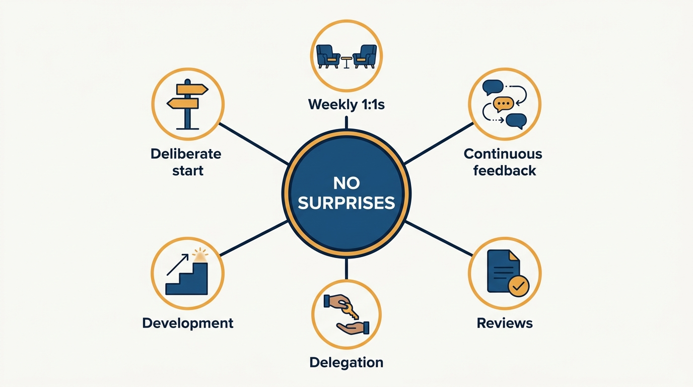
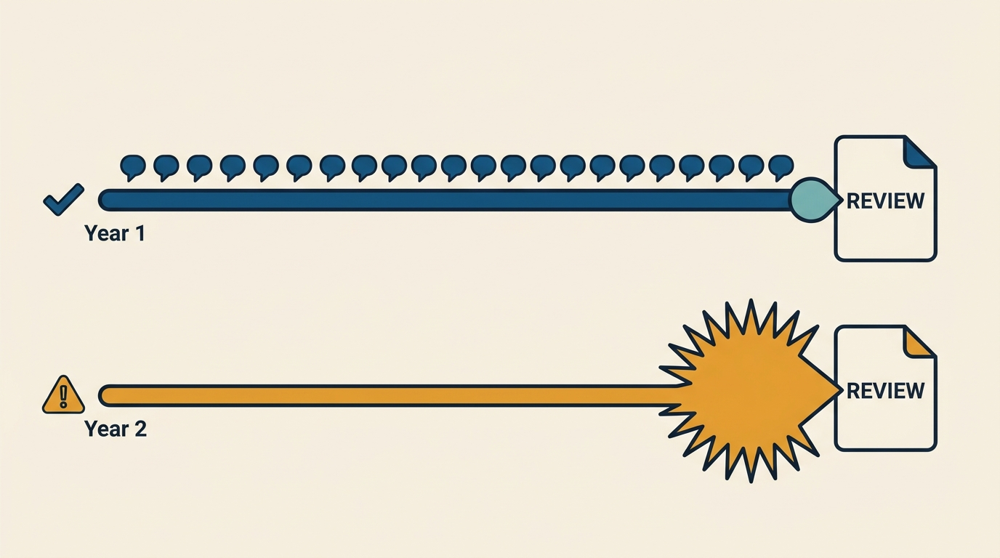
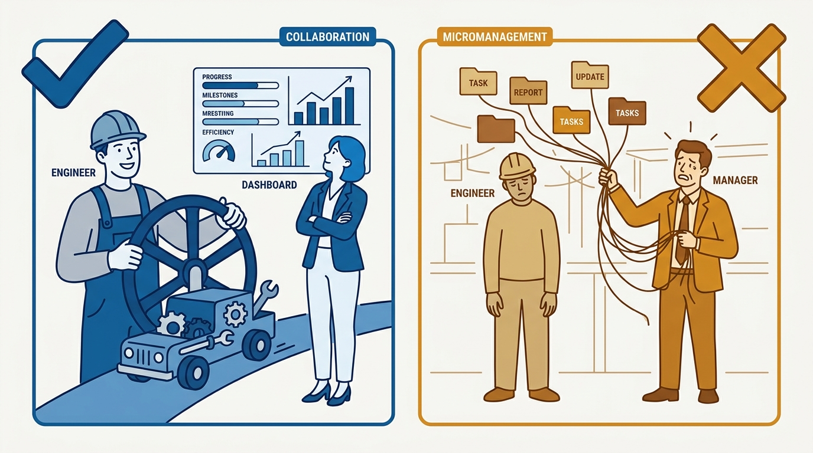

> **Status**: DRAFT
>
> **Principle**: First-line people management is not a talent; it is a set of learnable mechanics run on a cadence — a deliberate start with every new report, weekly 1:1s that get rescheduled rather than skipped, feedback given continuously in small doses, development discussed before it is urgent, ownership delegated rather than tasks assigned, and underperformance addressed early and in writing. One rule ties every mechanic together: no surprises. Nobody should first learn in a formal review that their work is falling short, first learn at promotion time what the bar was, or first learn in a termination meeting that their job was at risk. I run these mechanics myself, and they are the bar I hold every first-line manager to.

## Statement

My operating model for first-line people management has six parts:

- **Every new report gets a deliberate start.** In the first conversations I learn how they like to be praised — publicly or privately — how they want to receive serious feedback, what excited them about joining, how to recognize when they are stressed, which manager behaviors they dislike, and what their career goals are. We build a 30/60/90-day plan together, I make expectations explicit — communication, meeting cadence, work style, escalation, autonomy — and I collect their feedback on onboarding while they can still see it with fresh eyes.
- **1:1s are weekly by default, rescheduled rather than skipped, and kept even for strong performers.** They are used for more than status, leave room for the human being, produce shared notes, and their frequency changes based on need, not habit.
- **1:1 style is adapted per person.** To-do list, catch-up, feedback, or progress-report — whichever this person needs now. The meeting serves the report, protects space for what they want to raise, and does not decay into a recurring complaint session.
- **Feedback is continuous, so reviews contain no surprises.** I learn each person's strengths, weaknesses, goals, and level; observe closely enough to notice patterns; give praise promptly and specifically; deliver corrective feedback as soon as possible; and never save important feedback for a formal review. Development is deliberate: regular career conversations, promotion transparency, stretch work, and help building the promotion case when someone is ready.
- **Delegation transfers ownership, not tasks.** I stay involved enough to support success without taking over, adjust involvement to project stage and risk, pull information from systems before asking people for updates, set standards for code and decisions, treat openly shared problems neutrally, and protect autonomy — because autonomy drives motivation.
- **Reviews are written early from year-round notes; underperformance is handled early and in writing.** Reviews cover the whole year with concrete examples and peer feedback, give real weight to strengths, keep improvement areas focused, and reach the person before the meeting. Underperformance is named early and often, documented with timelines and deliverables, run with HR where required — and I do not put someone on a plan unless I am prepared for them to leave. When someone cannot grow to the next level on my team, I say so honestly and help them find a better fit, preserving goodwill and dignity.

**Figure 1:** *Six learnable mechanics, one unifying rule: every practice exists so that nothing important arrives as a surprise.*

## How to Read This

This journal is my engineering-management operating model, one record per source checklist. This record is grounded in the "Managing People" chapter of Camille Fournier's *The Manager's Path* (O'Reilly, 2017) — the rung where an engineer first becomes responsible for other people's performance, growth, and experience of work. I have run these mechanics as a first-line manager and now hold every first-line manager in my organization to them. The runnable version — new-report start, 1:1 mechanics and styles, continuous feedback, development, delegation, reviews, underperformance, coaching out, and the self-check — lives in the **Checklist** tab of this post.

## Rationale

**The first weeks with a new report set the terms for years, so I script them.** The preference questions — how do you like to be praised, how do you want serious feedback, how do I recognize when you are stressed, which manager behaviors do you hate — take one conversation and prevent years of accidental friction. The 30/60/90-day plan and explicit expectations do for the relationship what an interface does for a system: they make the implicit contract inspectable. And a new hire's confusion is an asset with an expiry date — I collect their onboarding feedback in the first 90 days and route it into the docs, because in month four they will no longer be able to see what was missing.

**The 1:1 is the mechanism everything else runs through, so its failure modes get named.** Weekly by default; rescheduled, not skipped — because a skipped 1:1 tells the report exactly where they rank against whatever displaced them. Kept even for strong performers, who are otherwise quietly abandoned as "fine" until the day they resign. And adapted per person: the to-do-list 1:1, the catch-up, the feedback session, the progress report are different meetings, and running the same format for everyone means running the wrong format for most. The test is direction: the meeting serves the report, not the manager's need for status.

**Continuous feedback is what makes every formal moment boring — which is the goal.** Lightweight, regular feedback — praise prompt and specific, correction as soon as possible — keeps the gap between how someone is doing and how they think they are doing near zero. Then the review is a summary of known information, the promotion case is built from documented evidence, and the difficult conversation, if it comes, is the continuation of a thread, not an ambush. Every dreaded moment in people management is dreaded because feedback was deferred; the no-surprises rule is simply the refusal to defer it.

**Figure 2:** *Continuous small doses keep the review boring; deferred feedback turns it into an ambush.*

**Delegation is an ownership transfer, and micromanagement is usually an information problem.** Delegating tasks while retaining ownership produces a team that executes but never thinks. Fournier's mechanics make the handoff real: agree on what success looks like, make progress visible in systems, and then pull information from those systems instead of interrogating people — asking a person for a status you could read yourself is a small tax on trust, levied repeatedly. Involvement scales with stage and risk, not with the manager's anxiety, and openly shared problems get a neutral reception, because punishing transparency buys silence exactly where silence is most expensive.

**Figure 3:** *Delegation transfers the wheel, not the task list — and progress is read from systems, not interrogated out of people.*

**Underperformance handled early is coaching; handled late, it is a crisis with a personnel file.** The failure pattern is always the same: the manager waits, frustration compounds, and the eventual conversation is harsher and later than it should have been — a surprise, which means a failure under the rule. Naming the gap early and often, in writing, with concrete expectations and timelines, gives the person a genuine chance to correct — and if they cannot, the outcome arrives with dignity intact. Two honesty tests anchor the hard end of this record: I do not put someone on a plan unless I am prepared for them to leave, and when my team cannot offer someone the growth they need, I say so and help them find where it exists.

## What This Means in Practice

| What this record says | What it does **not** say |
| --- | --- |
| 1:1s are weekly by default and rescheduled, not skipped. | The cadence is sacred — frequency adjusts to need, but by decision, not decay. |
| Feedback flows continuously, in small doses. | Formal reviews are pointless — they still synthesize the year; they just contain nothing new. |
| Delegation transfers ownership, with involvement scaled to stage and risk. | The manager disappears after delegating — support without takeover is the job. |
| Progress is pulled from systems before people are asked. | Managers never ask for updates — they just do not ask for what a dashboard already shows. |
| Underperformance is documented early, with timelines in writing when needed. | Documentation is a trap being built — it is the fairness mechanism that keeps the process honest. |
| Someone who cannot grow here is told so and helped to a better fit. | Coaching out is disguised firing — done honestly and early, it is career advice with logistics. |
| Strong performers keep their 1:1s and development attention. | Attention is only for problems — neglecting your best people is how you lose them. |

Concretely: every manager in my organization can show me shared 1:1 notes, a 30/60/90 plan for each recent hire, and year-round feedback notes that make review season a writing exercise rather than an archaeology project. No report of theirs is ever surprised by a review, a promotion outcome, or a performance conversation — and when I run skip-levels, that is one of the things I check.

## Anti-Patterns

- **The skipped 1:1.** Cancelled for "real work" and never rescheduled — teaching the report precisely how much they matter.
- **The status-meeting 1:1.** Every session a project update the manager could have read in the tracker, with the human topics permanently crowded out.
- **The neglected strong performer.** "They're fine, they don't need me" — until the resignation letter explains what they needed.
- **Feedback hoarding.** Saving observations for the review, then delivering six months of accumulated criticism in one sitting to a blindsided report.
- **Task delegation with retained ownership.** Handing out work items while keeping every decision, then wondering why nobody on the team shows judgment.
- **Interrogation-driven status.** Asking people for information the systems already display, converting trust into reporting overhead.
- **The sudden performance plan.** A PIP as the first clear signal that anything was wrong — a documented ambush that fails the no-surprises rule at the moment it matters most.
- **The dishonest keep.** Knowing someone cannot reach the next level on this team and saying nothing, stealing years of their career to avoid one uncomfortable conversation.

## Related Records

- [[management-101]] — the two-sided contract this machinery delivers; that record is the promise, this one is the implementation.
- [[managing-a-team]] — the next rung: from managing individuals to debugging and leading a team as a system.
- [[feedback]] — Julie Zhuo's treatment of feedback craft; this record sets the cadence, that one deepens the skill.
- [[performance-review-cycle]] — the engineer-side view of the review cycle; a report following that record and a manager following this one meet with no surprises.
- [[career-conversations]] (people journal) — the one-off deep career conversation whose output feeds this record's development mechanics.

## Scope and Revisiting

This record is `draft`. It governs the first-line people-management mechanics I run and the bar I hold every first-line manager in my organization to: new-report starts, 1:1s, continuous feedback, development, delegation, reviews, and underperformance. I revisit it if reviews or performance plans keep landing as surprises (the core rule is failing), if skip-levels show 1:1s decaying into status meetings or silently disappearing, or if regretted attrition among strong performers suggests the machinery is only serving the struggling.

## Authoritative References

- Camille Fournier, *The Manager's Path: A Guide for Tech Leaders Navigating Growth and Change* (O'Reilly, 2017) — Chapter 4, "Managing People", whose checklist this record distills.
