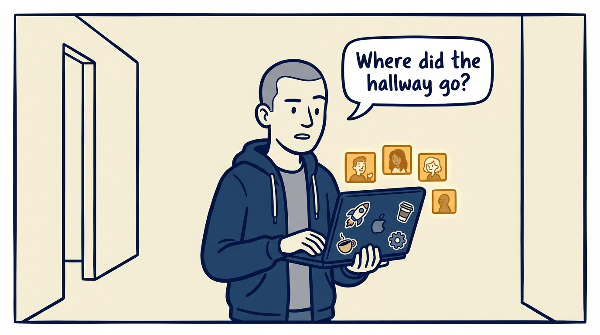
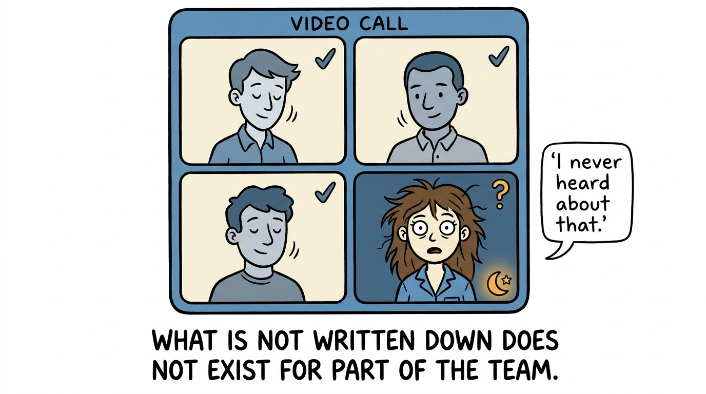
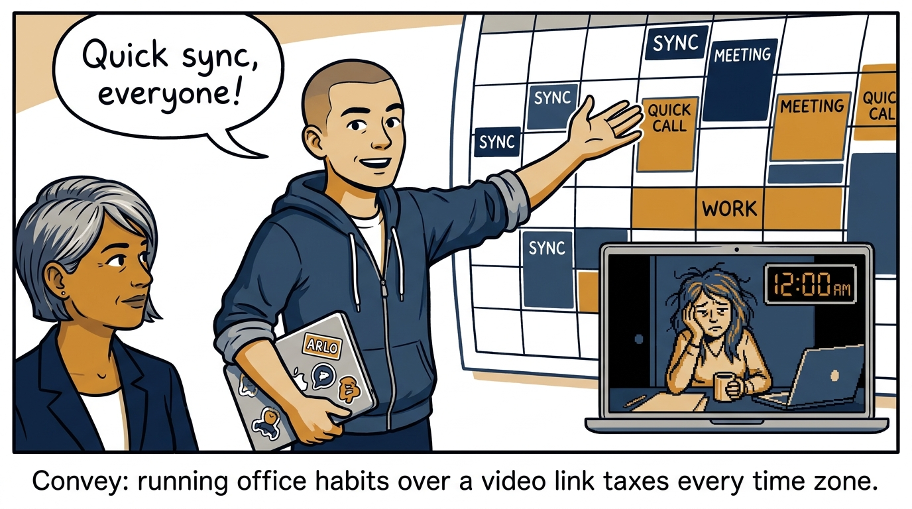
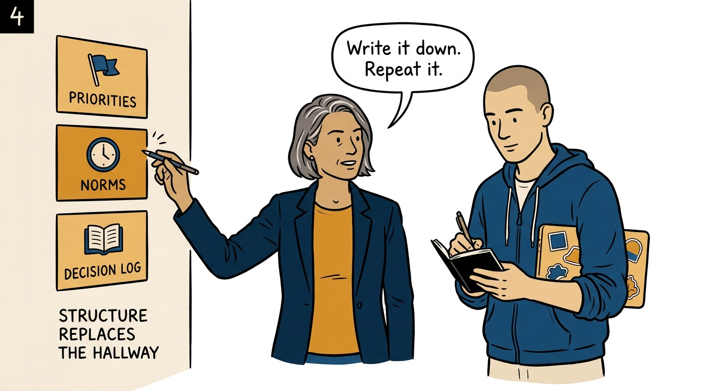
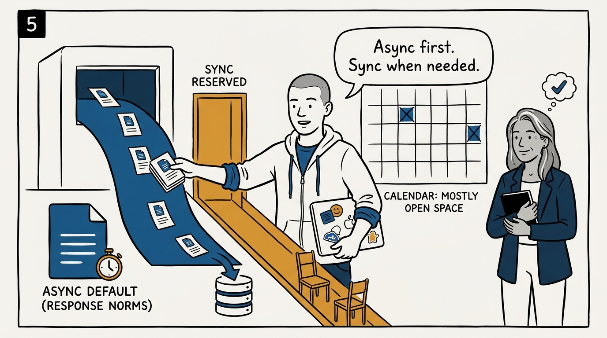
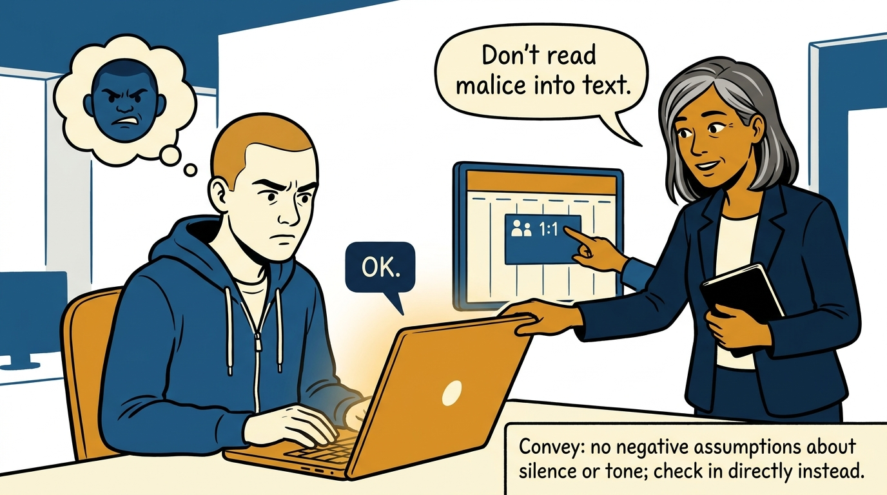
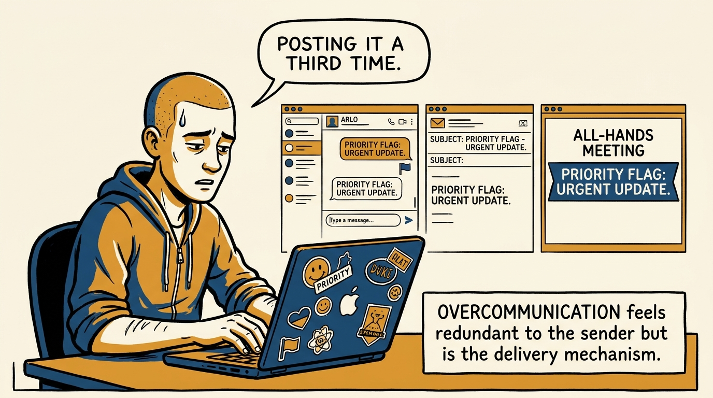
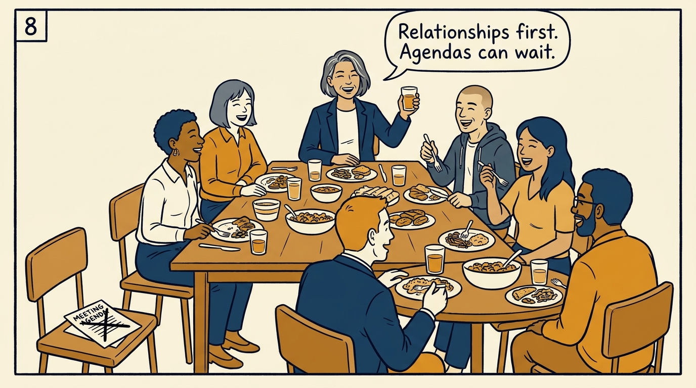

Why a remote team runs on what is written down and repeated — in eight panels.

<!-- comic-style
{
  "cast": "VERA: a calm, seasoned engineering executive, short gray-streaked hair, dark blazer over a plain t-shirt, carries a small black notebook. ARLO: an eager early-career engineer climbing the ladder — in some strips a new lead or manager, in others the engineer being coached — buzz-cut hair, zip-up hoodie with rolled sleeves, sticker-covered laptop under one arm.",
  "style": "Clean two-tone explainer comic, thick ink outlines, flat colors with deep blue and amber accents on a light background, generous white space, hand-lettered speech bubbles with SHORT readable text, no photorealism."
}
-->

**Panel 1:** *The hook: the hallway that used to carry priorities, context, and corrections is simply gone.*

**Panel 2:** *The problem: whatever is not written down explicitly does not exist for part of the team.*

**Panel 3:** *The wrong way: office habits over a video link — synchronous everything, someone's midnight in every meeting.*

**Panel 4:** *The principle: a remote team runs on what is written down and repeated — structure replaces the hallway.*

**Panel 5:** *How it runs: async by default with response-time norms — synchronous time reserved for disagreement and connection.*

**Panel 6:** *The mechanic: no negative assumptions about silence or tone — open-ended 1:1 questions surface what text hides.*

**Panel 7:** *The cost: repeating what matters in multiple places feels redundant — on a remote team it is the delivery mechanism.*

**Panel 8:** *The closer: when a remote team finally meets, spend it on the one thing distance cannot deliver — connection.*
