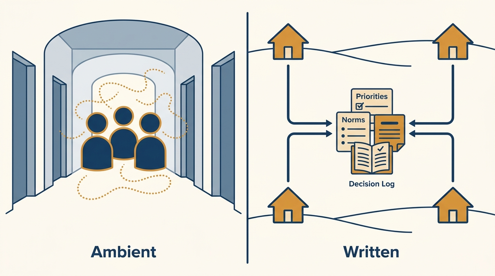
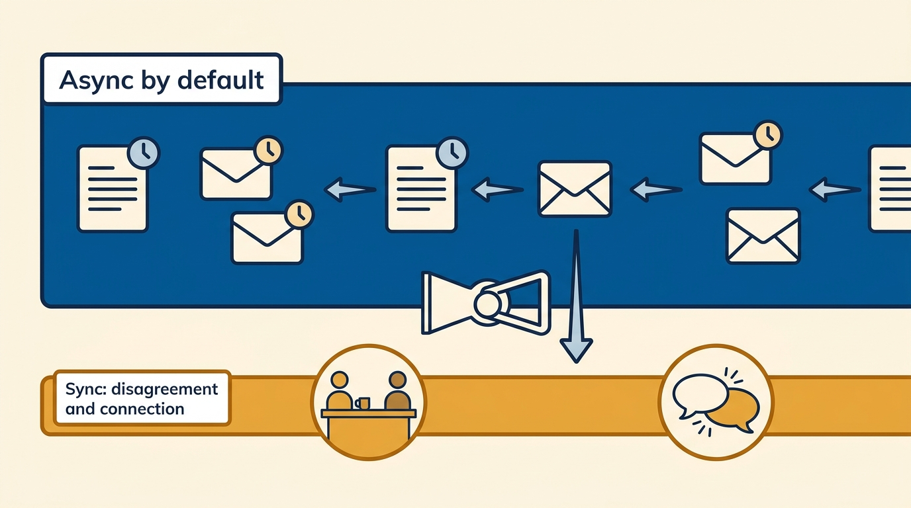
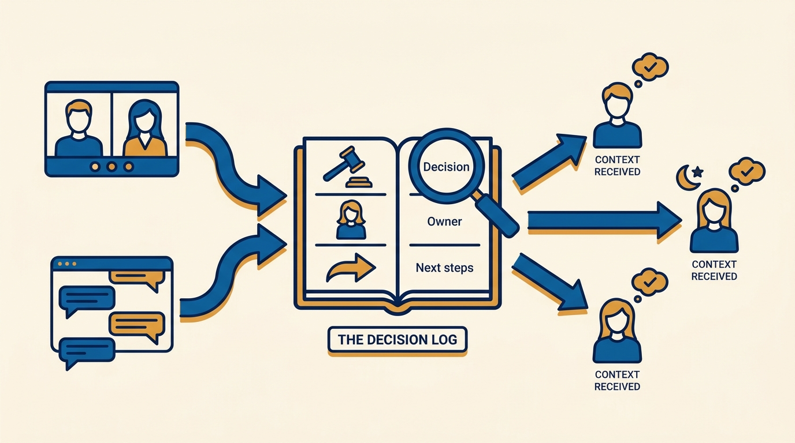

> **Status**: DRAFT
>
> **Principle**: A remote team runs on what is written down and repeated, because nothing travels by hallway anymore. So I make everything the office used to carry implicitly explicit: weekly priorities, roles and expectations, response-time norms, where decisions and knowledge live — with async as the default and a searchable decision log as the memory. And because distance quietly erodes trust and connection, I engineer those too: regular 1:1s with open-ended questions, no negative assumptions about silence or tone, rituals that bond the team, and in-person time spent on relationships rather than packed agendas. On a remote team, overcommunicating is the correct calibration.

## Statement

My operating model for managing a remote team has six parts:

- **Make the implicit explicit.** Team priorities are clarified weekly; roles, responsibilities, and expectations are written down; response-time norms for messages are defined; and how decisions, updates, and knowledge get shared is documented — with asynchronous communication as the default wherever possible.
- **Engineer trust deliberately.** Regular 1:1 check-ins with open-ended questions about workload, morale, and concerns; space for honest feedback; my own uncertainty shared when appropriate; and a standing rule — no negative assumptions about silence or tone.
- **Write decisions down where they can be found.** Decisions, owners, and next steps are summarized in writing; project communication lives in dedicated threads; and a searchable decision log or knowledge base is the team's memory.
- **Run deliberate rhythms.** Stand-ups covering done / next / blockers, regular all-hands with key updates recorded for absentees, office hours or open Q&A — and the rhythms themselves reviewed and refined regularly.
- **Foster connection on purpose.** Rituals for bonding, small wins celebrated publicly, peer recognition encouraged, casual spaces for non-work conversation — time made for connection, not just task updates.
- **Spend in-person time on relationships.** When the team does meet, relationship-building beats packed agendas: shared meals, low-pressure activities, and unstructured time for natural connection.

## How to Read This

This journal is my engineering-management operating model, each record grounded in one source. This record sits in the *Making of a Manager* section but is honest about its provenance: the source is a supplementary checklist that extends the themes of Julie Zhuo's *The Making of a Manager* (Portfolio/Penguin, 2019) — her clarity-and-trust fundamentals applied to distributed teams — rather than a chapter of the book itself. The runnable version — the foundations, the rhythms, the manager habits, the quick self-review — lives in the **Checklist** tab of this post.

## Rationale

**Distance removes the ambient channel, so structure has to replace it.** In an office, priorities, expectations, and decisions propagate through overheard conversations and hallway corrections. Remote, that channel is gone, and whatever is not written down explicitly simply does not exist for part of the team. That is why the foundations are all acts of writing: weekly priorities, explicit roles and expectations, response-time norms, documented decision-sharing. This is not bureaucracy — it is replacing infrastructure the office used to provide for free.

**Figure 1:** *The hallway is gone: what the office carried ambiently, a remote team must carry in writing.*

**Async by default is a respect for time zones and focus, not a communication downgrade.** A distributed team that runs on synchronous meetings taxes someone's evening in every time zone and shreds everyone's focus. Defaulting to async — with clear response-time norms so async does not mean "whenever" — lets the team work on its own schedule while the written record keeps everyone aligned. Synchronous time then gets reserved for what actually needs it: decisions under real disagreement, and human connection.

**Figure 2:** *Async is the wide default lane; synchronous time is reserved for what actually needs it — real disagreement and human connection.*

**A searchable decision log is the team's shared memory.** Remote decisions made in a call or a thread evaporate unless summarized — with owners and next steps — somewhere searchable. Without that log, the team re-litigates settled questions, absent members are silently excluded from context, and "I never heard about that" becomes a recurring failure mode. Repeating important information in multiple places is not redundancy; on a remote team it is the delivery mechanism.

**Figure 3:** *The searchable decision log is the team's memory: calls and threads flow in, and the same context flows out to everyone — including whoever was asleep.*

**Silence and tone are the two great misreaders of remote work.** In text, a terse message reads as anger and a quiet teammate reads as disengaged — and both readings are usually wrong. So I hold a double discipline: I do not make negative assumptions about silence or tone, and I actively watch for the real signals of disengagement and isolation in 1:1s, where open-ended questions about workload, morale, and concerns can surface what text hides. I also notice who is participating and who is fading into the background, because remote meetings make fading easy and invisible.

**Connection does not happen by accident anymore, so I schedule what used to be spontaneous.** The office produced bonding as a byproduct; remote work produces isolation as a byproduct. Rituals, public celebration of small wins, peer recognition, casual non-work spaces — these are the deliberate substitutes. And scarce in-person time is too valuable to fill with status meetings: when the team gathers, the agenda is relationships — shared meals, low-pressure activities, unstructured time — because that is the one thing distance cannot deliver.

## What This Means in Practice

| What this record says | What it does **not** say |
| --- | --- |
| Norms for roles, response times, and decision-sharing are written and explicit. | Everyone must be online at the same hours — norms define response windows, not presence. |
| Async is the default for communication. | Meetings are banned — synchronous time is reserved for disagreement and connection. |
| Decisions are summarized in writing in a searchable log. | Every conversation becomes a document — the log records decisions, owners, and next steps. |
| I overcommunicate and repeat key information in multiple places. | Noise is fine — repetition targets what matters most, through deliberate channels. |
| I make no negative assumptions about silence or tone. | I ignore disengagement — I watch for it actively and check in directly. |
| In-person time prioritizes relationship-building. | Offsites are packed with the meetings we saved up — packed agendas waste the scarcest resource. |
| Rhythms are reviewed and refined regularly. | The rhythm set once is the rhythm forever. |

Concretely: anyone on my remote team can answer the quick self-review at any time — they know what matters most right now, they know where to ask questions and find updates, they are comfortable being honest about problems, wins get noticed, and the quieter members are still connected and supported. If any of those answers is no, the system — not the person — gets fixed.

## Anti-Patterns

- **Office habits over a video link.** Running a distributed team on implicit norms and synchronous meetings, then blaming remoteness when alignment and focus collapse.
- **Async without norms.** Declaring async-first without response-time expectations, so urgent things rot and everyone monitors every channel constantly out of anxiety.
- **The evaporating decision.** Deciding in a call, summarizing nowhere — then re-litigating with whoever was not in the room.
- **Reading malice into silence.** Treating a terse message or a quiet week as a problem with the person instead of an artifact of the medium.
- **Task-only management.** Every touchpoint a status update, no casual spaces, no rituals — until people are colleagues in name and strangers in practice.
- **The packed-agenda offsite.** Spending rare in-person days on back-to-back meetings that could have been async documents, and none of it on the connection that was the point.
- **The invisible fade.** Not noticing who has stopped participating, because remote meetings make fading easy and nobody's job was to watch.

## Related Records

- [[leading-a-small-team]] — the trust and clarity fundamentals this record ports to a distributed setting.
- [[amazing-meetings]] — the meeting discipline that decides what deserves synchronous time on a remote team.
- [[nurturing-culture]] — the rituals and repeated messages that carry culture matter double when there is no shared room to carry it.
- [[internal-communication]] (executive journal) — the organization-level communication architecture this team-level operating model plugs into.

## Scope and Revisiting

This record is `draft`. It governs how I run any team that is remote or substantially distributed: the explicit norms, the async default, the decision log, the rhythms, and the connection work. I revisit it when the quick self-review returns a "no" that persists across two checks, when the communication rhythms have not been reviewed in six months, or when in-person time keeps getting filled with status agendas instead of relationship-building.

## Authoritative References

- Julie Zhuo, *The Making of a Manager: What to Do When Everyone Looks to You* (Portfolio/Penguin, 2019) — the management approach this record extends; the source checklist is supplementary material applying the book's clarity-and-trust fundamentals to remote teams, not a chapter of the book.
