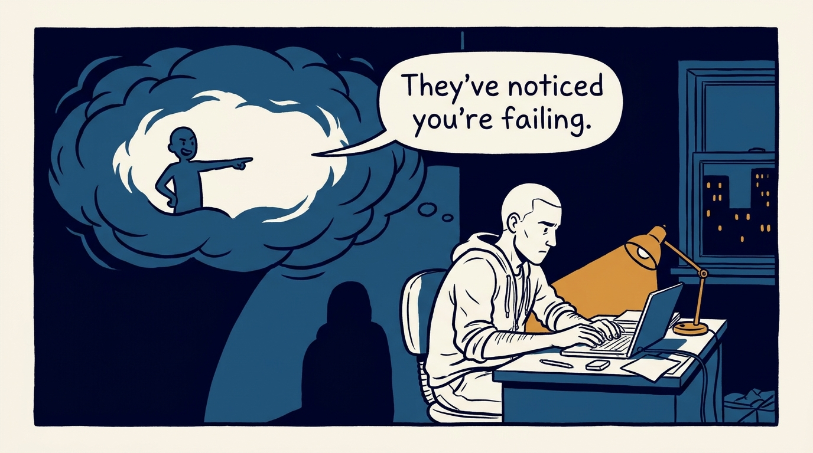
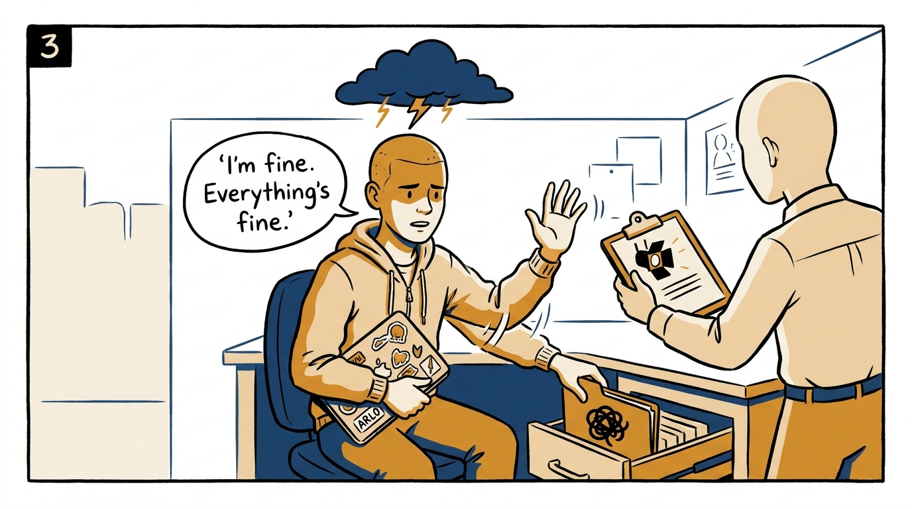
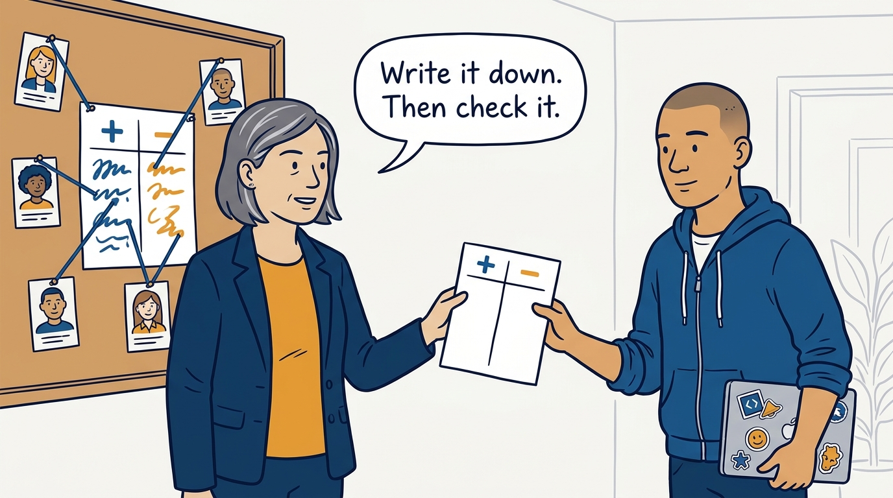
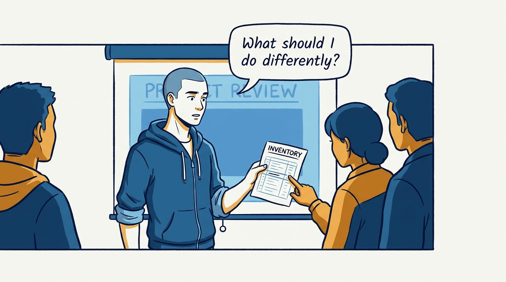
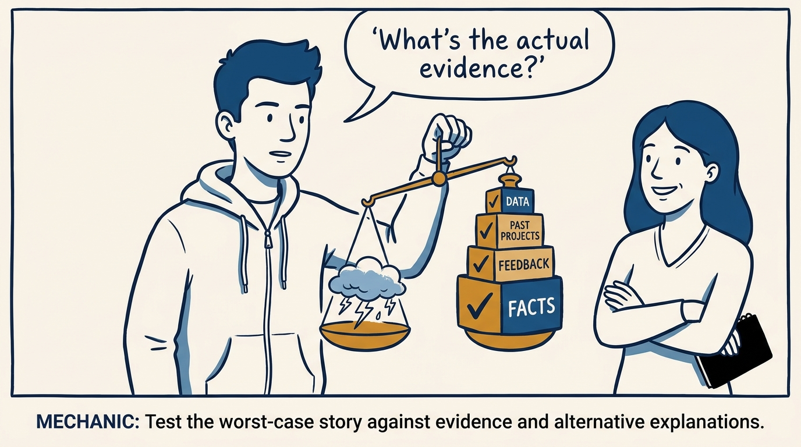
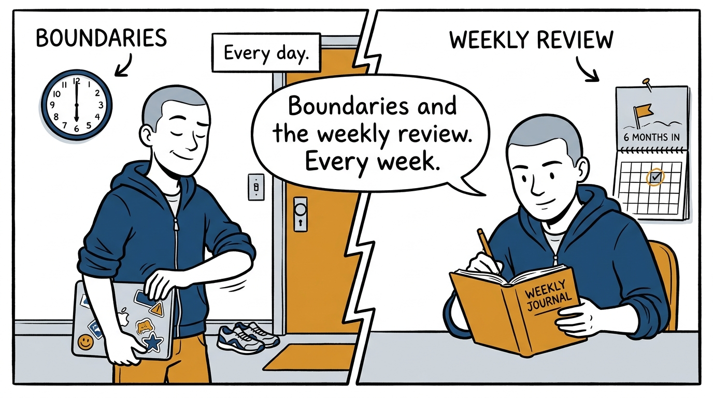

Why the first person a manager manages is themselves — and why the inner critic never gets the last word — in eight panels.

<!-- comic-style
{
  "cast": "VERA: a calm, seasoned engineering executive, short gray-streaked hair, dark blazer over a plain t-shirt, carries a small black notebook. ARLO: an eager early-career engineer climbing the ladder — in some strips a new lead or manager, in others the engineer being coached — buzz-cut hair, zip-up hoodie with rolled sleeves, sticker-covered laptop under one arm.",
  "style": "Clean two-tone explainer comic, thick ink outlines, flat colors with deep blue and amber accents on a light background, generous white space, hand-lettered speech bubbles with SHORT readable text, no photorealism."
}
-->

**Panel 1:** *The hook: before the team, there is one report nobody assigned you — yourself.*

**Panel 2:** *The problem: the worst-case story sounds like perception — it is only an interpretation.*

**Panel 3:** *The wrong way: obeying the story — hiding hard problems and declining chances the evidence never justified.*

**Panel 4:** *The principle: self-knowledge that never leaves your head is just the inner critic — calibration makes it real.*

**Panel 5:** *How it runs: ask right after the task, ask for specifics — and say thank you, not 'yes but'.*

**Panel 6:** *The mechanic: cross-examine the story — weighed against evidence, it usually loses.*

**Panel 7:** *The cost: none of it is glamorous — boundaries, breaks, a written weekly review, goals actually revisited.*

**Panel 8:** *The closer: good management is personal — aim at better, not perfect.*
