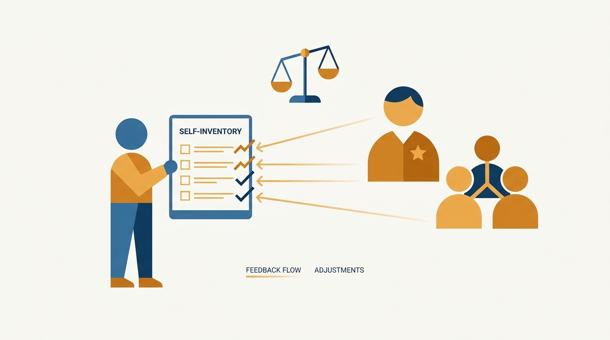
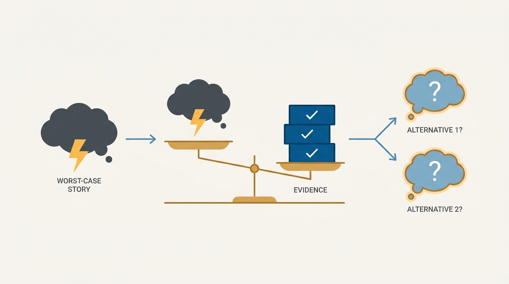
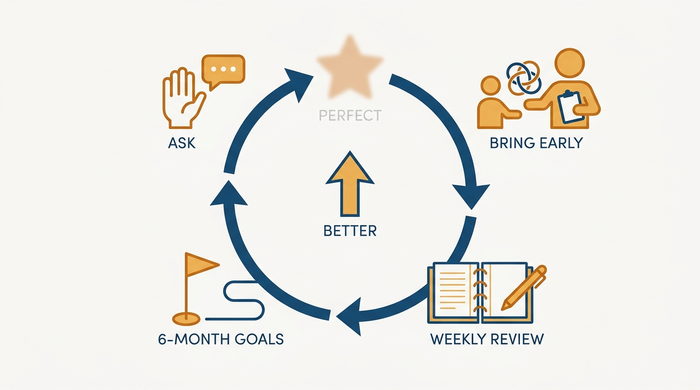

> **Status**: DRAFT
>
> **Principle**: The first person I manage is me, and I refuse to do it by feel. I keep a written picture of my strengths, weaknesses, and triggers — and I calibrate that picture against reality by asking my manager and trusted coworkers, because self-knowledge that never leaves my own head is just my inner critic wearing a lab coat. I treat imposter-syndrome stories as claims to be tested against evidence, engineer the conditions I do my best work in, protect my wellbeing as operational necessity rather than indulgence, and run a deliberate learning loop — because a manager who is not managing themselves is managing everyone else worse.

## Statement

My operating model for managing myself has six parts:

- **Self-knowledge is written down, not felt.** I keep an explicit inventory: my top strengths and biggest weaknesses, the words people close to me would use to describe me, the traits that made me succeed before, the positive feedback I hear most often, my inner-critic patterns, and the situations that reliably trigger self-doubt or overreaction.
- **The inventory is calibrated against reality.** I ask my manager where my biggest growth opportunities are, what holds me back from greater impact, and how my skills compare with the ideal person in my role. I ask three to seven trusted coworkers for honest, specific feedback — including task-specific feedback right after presentations, meetings, and projects — and I thank them without getting defensive.
- **Imposter-syndrome stories get tested, not obeyed.** When I catch myself telling a worst-case story, I pause and ask what evidence I actually have, consider alternative explanations, and swap the fixed-mindset framing for a growth one. Discomfort is part of learning, not proof I am failing; early confusion in a management role is normal.
- **I engineer my best conditions and know my triggers.** I identify the conditions I do my best work in, structure my calendar around them, protect time for thinking, and get enough sleep. I know which people and situations set me off, and I pause and cool down before responding or deciding when triggered.
- **Wellbeing is operational, not optional.** Boundaries around work time, short non-work breaks in the day, time for exercise, hobbies, family, and friends — a manager whose work consumes all mental space has no reserve left for the moments that need it.
- **I run a deliberate learning loop.** I ask for feedback often, use my manager as a coach rather than only an evaluator, bring hard problems early, learn from peers and mentors, review my week in writing, set six-month goals and revisit them — and I aim at better, not perfect, playing to my own strengths instead of copying someone else's style.

## How to Read This

This journal is my engineering-management operating model, each record grounded in one source. This record distills the self-management chapter of Julie Zhuo's *The Making of a Manager* (Portfolio/Penguin, 2019) — her argument that the first half of the management journey is **learning to manage yourself**: your self-image, your fears, your energy, and your growth. The runnable version — the full self-inventory, calibration questions, and routines — lives in the **Checklist** tab of this post.

## Rationale

**Uncalibrated self-knowledge is just my inner critic with better vocabulary.** Everyone carries a self-image; the question is whether it matches what other people actually experience. Zhuo's move is to force the calibration: write the self-assessment down, then check it against my manager's view of my growth opportunities and against honest feedback from a handful of trusted coworkers. **Where the pictures disagree, reality wins.** This is also why I ask for specific, task-anchored feedback rather than general praise — "that went well" **calibrates nothing**.

**Figure 1:** *The written inventory is only half the tool; the calibration against manager and coworker feedback is what makes it real.*

**Imposter syndrome is a story, and stories can be cross-examined.** The worst-case narrative — I'm failing, they've noticed, it was a mistake to give me this job — presents itself as perception but is **actually an interpretation**. So I treat it like any other unverified claim: what evidence do I actually have, and what alternative explanations fit the same facts? Zhuo's reassurance matters here because it is **factual, not motivational**: early confusion in management is the normal state, so treating discomfort as proof of failure misreads the data.

**Figure 2:** *The worst-case story presents itself as perception; weighed against actual evidence and alternative explanations, it usually loses.*

**My output tracks my conditions more than my willpower.** I do measurably better work under some conditions — certain kinds of blocks on the calendar, protected thinking time, enough sleep, routines that support focus and recovery — and measurably worse under others. **Engineering those conditions is higher-leverage** than trying to out-discipline bad ones. The same logic applies to triggers: I cannot prevent certain people and situations from setting me off, but knowing my triggers in advance **turns a reflex into a pause** — and decisions made after cooling down are consistently better than replies fired while hot.

**Wellbeing is what keeps my judgment available when it matters.** Boundaries, breaks, exercise, and time with family and friends are **not rewards for finishing the work**; they are what preserves the mental space the work draws on. A manager running on empty starts making their **worst decisions precisely in the hard weeks** that demand their best ones. When I am struggling, the recovery moves are equally concrete: stop punishing myself for feeling bad, name the worry directly, question my interpretation, recall challenges I have handled before, ask trusted people for help, and keep a record of small wins so progress is visible even when outcomes are not.

**Learning speed is a system, and my manager is part of it.** The job gets harder every year; the only sustainable response is **getting better faster**. That does not happen by accident — it happens through a loop: frequent feedback requests, my manager used as a coach with hard problems brought early rather than confessed late, 1:1s treated as learning time, peers asked directly how they do what they do well, a weekly written review, and six-month goals that actually get revisited. The loop's aim is calibrated too: better, not perfect — good management is personal, and the goal is **a sharper version of my own style**, not an imitation of someone else's.

**Figure 3:** *Learning speed is a system: a loop of feedback, early hard problems, written review, and revisited goals — aimed at better, not perfect.*

## What This Means in Practice

| What this record says | What it does **not** say |
| --- | --- |
| My strengths, weaknesses, and triggers are written down. | I navigate by an unexamined gut feel of who I am. |
| The self-image is **checked against manager and peer feedback**. | Self-reflection alone is a reliable source of self-knowledge. |
| Worst-case stories are tested against evidence. | Feeling like an imposter is proof of being one — or something to suppress. |
| Discomfort and early confusion are part of learning. | Struggling in a new management role means I am failing at it. |
| I engineer conditions, calendar, and routines for my best work. | **Willpower should compensate** for a hostile calendar and no sleep. |
| Wellbeing boundaries are part of the operating model. | Boundaries are a luxury for after the hard quarter ends. |
| I bring hard problems to my manager early, as coaching material. | My manager is an evaluator to whom I present only finished wins. |

Concretely: I can show a written self-inventory and name the last time it was **corrected by someone else's feedback**. My calendar visibly reflects the conditions I work best in. When a trigger fires, there is **a pause before the reply**. And at any moment I can state my current six-month goals and what last week taught me — because the review actually happened, in writing.

## Anti-Patterns

- **Self-assessment in a vacuum.** Maintaining a confident picture of my strengths and weaknesses that no manager or coworker has ever been asked to confirm or correct.
- **Obeying the worst-case story.** Letting an imposter-syndrome narrative drive decisions — declining opportunities, over-preparing, hiding problems — without ever asking what evidence supports it.
- **Punishing myself for struggling.** Treating a bad stretch as a character verdict and adding self-criticism on top of the original problem, instead of naming the worry and working it.
- **Replying while triggered.** Sending the message or making the call in the heat of the reaction, when I already know which situations reliably set me off.
- **Hero-schedule wellbeing debt.** Letting work consume every boundary, break, and hobby "temporarily," then wondering why judgment and patience degrade exactly when the pressure peaks.
- **Manager as judge, not coach.** Curating what my manager sees, bringing only polished wins, and losing the coaching a hard problem raised early would have bought.
- **Copying someone else's style.** Trying to become a different manager's impression of good management instead of playing my own strengths — forgetting that good management is personal.

## Related Records

- [[first-three-months]] — the transition period where self-doubt peaks and this record's calibration and imposter-syndrome disciplines matter most.
- [[what-is-management]] — the definition of the job; this record covers the person doing it.
- [[self-awareness]] (people journal) — the self-awareness toolkit; this record is that discipline applied to my own management practice, calibrated by other people's feedback.
- [[managing-energy]] (executive journal) — the executive-level version of conditions and wellbeing; this record is the first-line-manager foundation it builds on.

## Scope and Revisiting

This record is `draft`. It governs how I manage myself as a manager: the written self-inventory and its calibration against real feedback, the handling of imposter-syndrome stories and triggers, the conditions and wellbeing boundaries I maintain, and the learning loop I run. I revisit it if a self-assessment goes **six months without being checked** against anyone else's view, if I notice work consuming boundaries I had committed to protecting, or if I catch myself **hiding hard problems from my manager** rather than bringing them early.

## Authoritative References

- Julie Zhuo, *The Making of a Manager: What to Do When Everyone Looks to You* (Portfolio/Penguin, 2019) — the "Managing Yourself" chapter this record distills.
