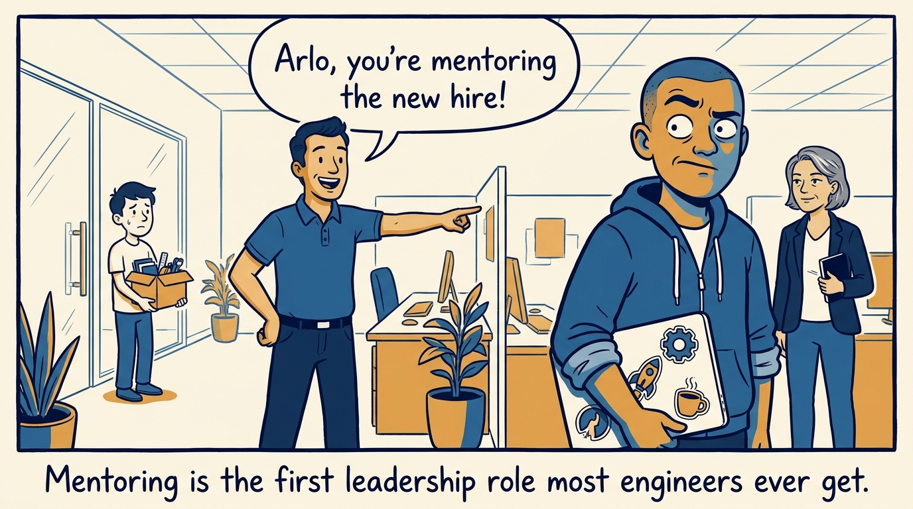
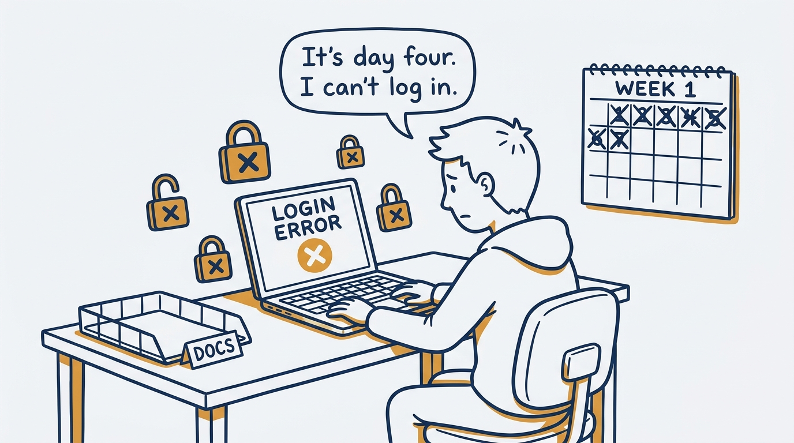
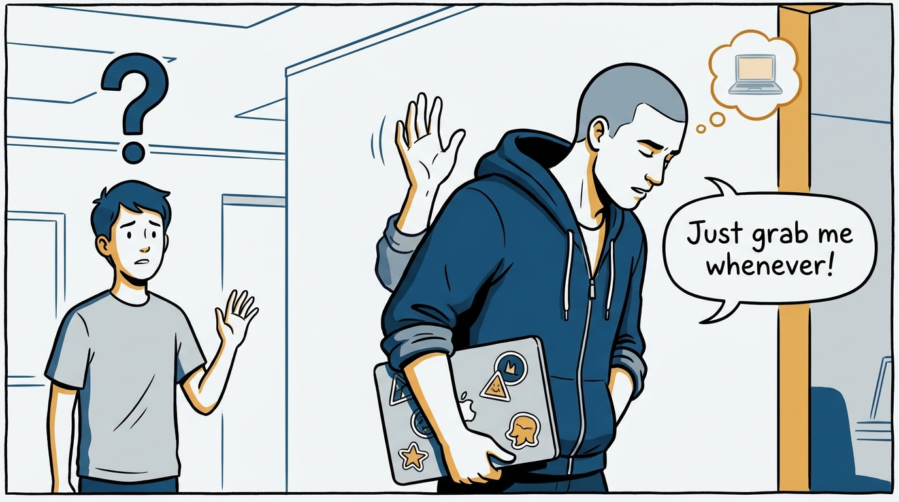
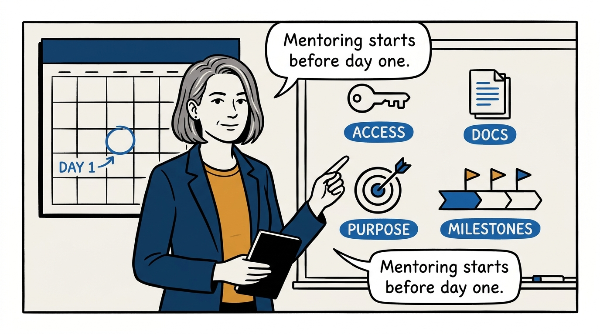
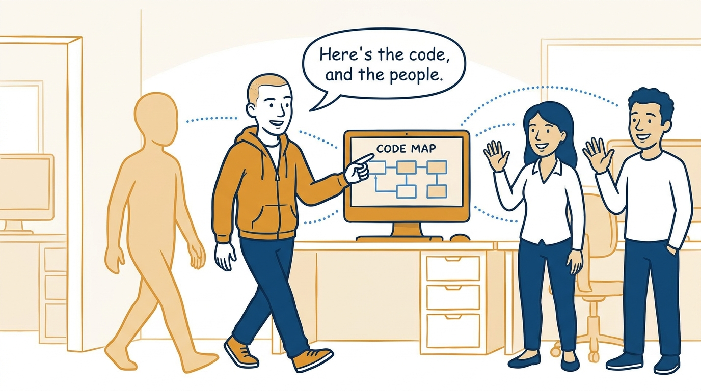
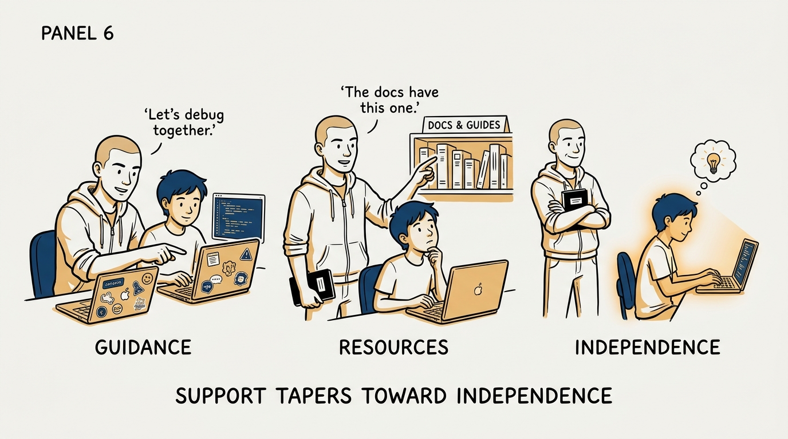
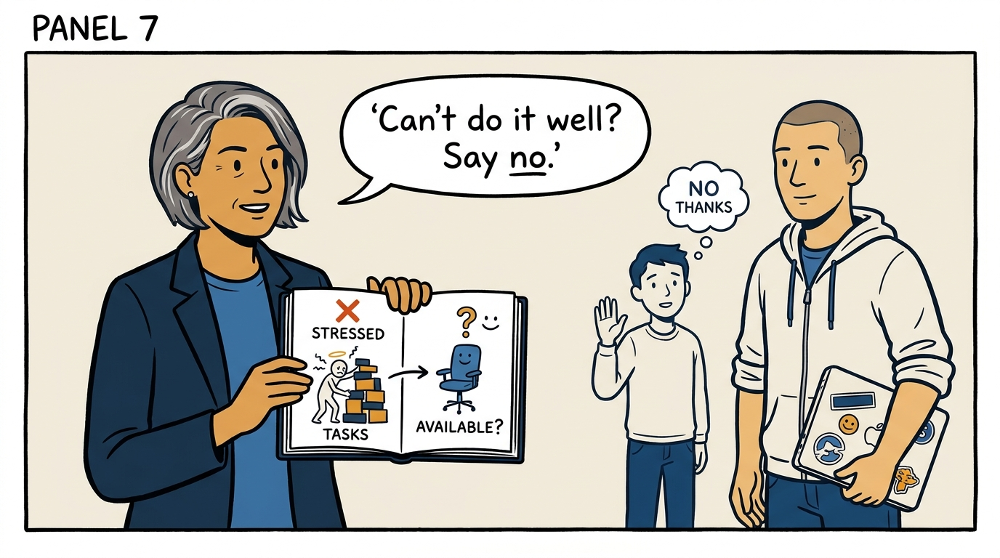
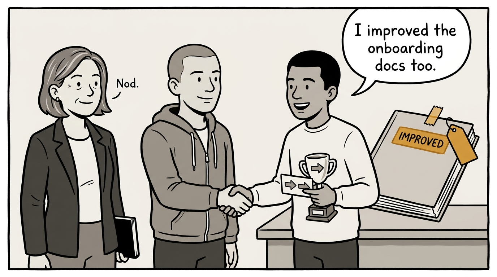

Why mentoring is a designed first leadership role, not an informal favor — in eight panels.

<!-- comic-style
{
  "cast": "VERA: a calm, seasoned engineering executive, short gray-streaked hair, dark blazer over a plain t-shirt, carries a small black notebook. ARLO: an engineer newly stepping into management, buzz-cut hair, zip-up hoodie with rolled sleeves, sticker-covered laptop under one arm.",
  "style": "Clean two-tone explainer comic, thick ink outlines, flat colors with deep blue and amber accents on a light background, generous white space, hand-lettered speech bubbles with SHORT readable text, no photorealism."
}
-->

**Panel 1:** *The hook: mentoring is the first leadership role most engineers ever hold — and it usually arrives without warning.*

**Panel 2:** *The problem: a mentee who loses their first week to logistics learns something permanent about how the organization treats people.*

**Panel 3:** *The wrong way: 'just grab me whenever' — no purpose, no plan, until both sides quietly stop trying.*

**Panel 4:** *The principle: mentoring is designed, not improvised — purpose, access, docs, and a milestone-sliced project ready before the mentee arrives.*

**Panel 5:** *How it runs: the first days are an orientation run on purpose — people, code, process, and the unspoken norms, with check-ins so nobody sits lost.*

**Panel 6:** *The mechanic: calibrated withdrawal — listen first, point at docs instead of answering everything, and shrink support as the mentee grows.*

**Panel 7:** *The cost: mentoring is counted as real work with real boundaries — and a bad mentor is worse than no mentor, so saying no is allowed.*

**Panel 8:** *The closer: the loop closes on purpose — what was learned gets reviewed, the docs get better, and the mentee leaves with connections and next steps.*
