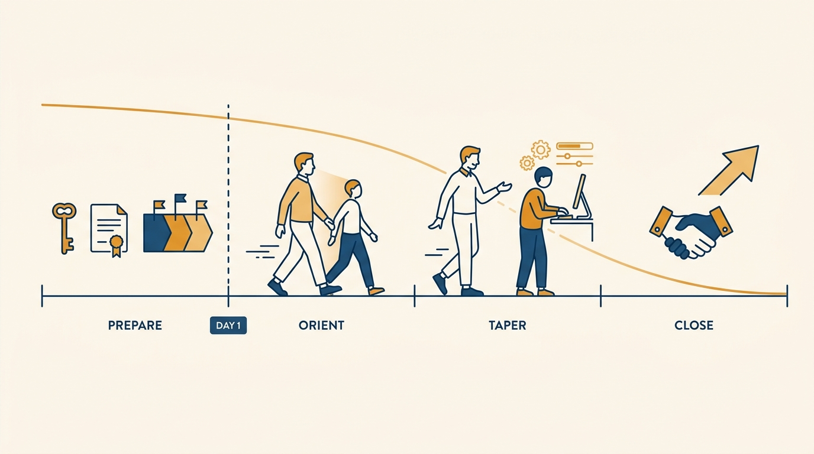
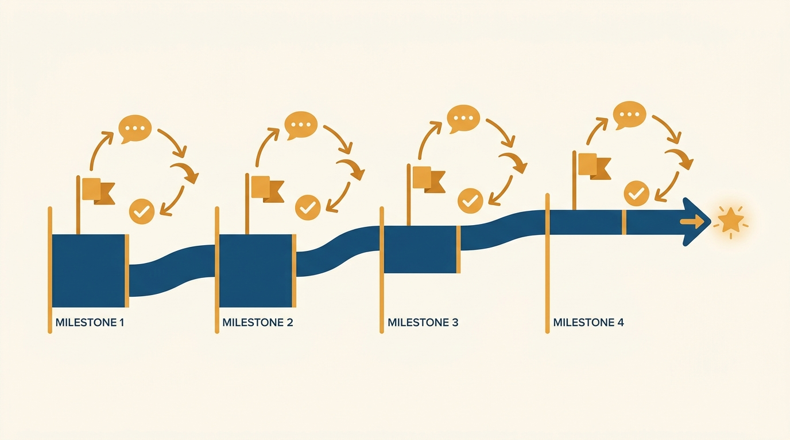
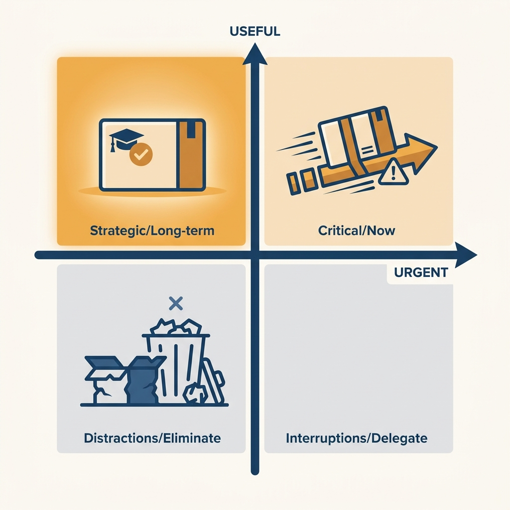

> **Status**: DRAFT
>
> **Principle**: Mentoring is the first leadership role most engineers ever hold, and I treat it as a designed role, not an informal favor. A mentor's work starts before the mentee's day one — purpose clarified, success defined, environment and access prepared, a level-appropriate project broken into small milestones — moves through a deliberate first-days orientation, and then tapers: listening before answering, pointing at docs instead of dispensing answers, encouraging independence without abandoning the person. Mentoring assigned casually and run vaguely damages the mentee, the mentor, and the team's view of what leadership is. So I match mentors to goals, count mentoring as meaningful work, and expect anyone who cannot do it well right now to say no.

## Statement

My operating model for mentoring has five parts:

- **Preparation happens before day one.** The mentor clarifies the purpose of the relationship, defines what success looks like for the mentee and for the team, prepares the environment — tools, systems, software, workspace access confirmed — collects the onboarding docs, and chooses a project that is clear, useful, and appropriate to the mentee's level, broken into small milestones with a check-in plan.
- **The first days are an orientation, run deliberately.** The mentor orients the mentee to the team and workflow, introduces them to key people, walks through code, tools, and processes, explains both the formal rules and the unspoken norms, and checks in several times so nobody sits lost and silent.
- **Ongoing mentoring is a taper toward independence.** Listen before answering; watch for confusion, hesitation, and overload; rephrase and use diagrams and walkthroughs when understanding fails; point to docs and resources instead of answering everything; make small course corrections early. Adjust support to progress — encourage independence without abandoning the person.
- **Interns and new hires get distinct treatment.** An intern gets a real project — specific but not urgent, sized to finish within the internship with room for training and program activities — and is coached to present and demo it at the end. A new hire uses the onboarding docs actively, improves them wherever they hit surprises, and gets help building relationships and learning how things really get done, not just how they are documented.
- **Mentoring is matched, resourced, and closed out.** I match mentoring assignments to goals and to the right mentor, count the time as meaningful work with explicit expectations and boundaries, and expect a mentor who cannot do it well right now to say no. At the end, mentor and mentee review what was learned and delivered, improvements flow back into onboarding and docs, and the mentee leaves with useful connections and next steps.

**Figure 1:** *Mentoring is an arc, not a favor: prepared before day one, run deliberately, tapered toward independence, and closed on purpose.*

## How to Read This

This journal is my engineering-management operating model, one record per source checklist. This record is grounded in the "Mentoring" chapter of Camille Fournier's *The Manager's Path* (O'Reilly, 2017) — the first rung of the management ladder, where an engineer first becomes responsible for another person's progress. I write it as the executive who **assigns and resources mentoring**, and who holds mentors to the conduct below. The runnable version — pre-start preparation, first days, ongoing conduct, the intern and new-hire variants, mindset, pitfalls, and the close — lives in the **Checklist** tab of this post.

## Rationale

**Mentoring fails in the setup far more often than in the relationship.** A mentee who arrives to no working accounts, no docs, and no defined project loses their most impressionable weeks to logistics — and concludes that this is how the organization treats people. Every item in the pre-day-one list is cheap: confirming access, collecting docs, picking a project, slicing milestones. The reason the checklist front-loads them is that they cannot be recovered later; **a botched first week is permanent data** in the mentee's model of the company.

**A clear, level-appropriate project is the actual curriculum.** Orientation tours and coffee chats do not teach anyone how the team works; a real project does. Fournier's requirements are precise: clear enough that the mentee can make progress without constant hand-holding, useful enough that finishing it matters, and sized to the person's level. Broken into small milestones, the project **generates its own feedback loop** — each milestone is a natural check-in, a natural place for a course correction, and a natural unit of visible progress.

**Figure 2:** *The milestone-sliced project is the curriculum: every milestone is a built-in check-in, an early course correction, and a visible unit of progress.*

**The mentor's craft is calibrated withdrawal.** Early on, the mentor walks through everything; by the end, the mentee should be finding answers on their own. **The failure modes sit at both extremes** — answering every question forever (the mentee never becomes independent) and "just figure it out" abandonment (the mentee flounders and hides it). The middle path is deliberate: listen before jumping in, watch for the signals of confusion and overload, point at docs first, and adjust support based on actual progress rather than a fixed schedule.

**Mentoring is leadership practice, and I treat it with that seriousness.** It is where an engineer first practices patience, empathy, clear communication, and responsibility for someone else's outcomes — the exact skills the later rungs of the ladder require. That is also why the mentee's questions are valuable to the mentor: they expose blind spots in the mentor's own understanding of systems everyone else has stopped questioning. Treating this as side work — unmatched, unresourced, uncounted — wastes **the best low-stakes leadership training** the organization has.

**A bad mentor is worse than no mentor, so refusal is an allowed answer.** A mentor who intimidates, shows off, hoards knowledge, or lets the relationship drift into vagueness teaches the mentee that this is what senior engineers are like. I would rather **delay a mentoring assignment** than staff it with someone who lacks the time or inclination — which is why "say no to mentoring if you cannot do it well" is part of the model, not a loophole in it.

## What This Means in Practice

| What this record says | What it does **not** say |
| --- | --- |
| Mentoring starts before day one, with environment, docs, and a project prepared. | Mentoring starts when the mentee shows up and asks something. |
| The mentee gets a clear, useful, level-appropriate project with milestones. | Any spare task will do — **vague or throwaway work teaches nothing**. |
| The mentor tapers support toward independence. | The mentor either answers everything forever or lets the mentee "just figure it out." |
| Interns get a real, specific, non-urgent project sized to the internship. | Interns are staffed on the critical path — or given busywork nobody needs. |
| New hires actively improve the onboarding docs they trip over. | Onboarding docs are read-only artifacts that decay untouched. |
| Mentoring is **meaningful, matched, bounded work** — and refusable. | Mentoring is a free side duty anyone can be assigned regardless of fit or load. |

Concretely: no mentee in my organization starts without a named mentor, working access, and **a milestone-sliced project chosen before their first day**. Mentors can state the purpose and the success definition of their assignment, and every completed mentoring round **leaves a trace** — improved docs, a closed retrospective, and a mentee with connections and next steps.

**Figure 3:** *An intern project lives in one quadrant: real and useful, but off the critical path — sized to finish within the internship.*

## Anti-Patterns

- **Day-one scramble.** The mentee arrives and only then does anyone request accounts, hunt for docs, or wonder what they should work on.
- **The vague relationship.** No purpose, no success definition, no cadence — "just grab me whenever" until both parties quietly stop trying.
- **Mentoring as status theater.** Intimidating, belittling, showing off, or hoarding knowledge — using the mentee as an audience instead of serving their growth.
- **"Just figure it out."** Abandonment dressed up as respect for independence, leaving the mentee to flounder and to hide that they are floundering.
- **The urgent intern project.** Putting an intern on the critical path, where the schedule cannot absorb their learning curve — or its twin, the throwaway project nobody will ever use.
- **Unmatched assignment.** Handing mentoring to whoever has apparent slack, without matching the mentee's goals to the right mentor.
- **The unclosed loop.** The mentorship just stops: no review of what was learned, no reflection, no doc improvements fed back, no connections or next steps for the mentee.

## Related Records

- [[management-101]] — the two-sided manager–report contract; the mentor delivers a scoped slice of its support side without being the manager.
- [[tech-lead]] — the next rung: from guiding one person to leading a project and team without formal authority.
- [[managing-people]] — where a new report's onboarding continues once a manager, not just a mentor, owns the relationship.
- [[engineering-onboarding]] (executive journal) — the onboarding system this record's new-hire mentoring plugs into and continuously improves.

## Scope and Revisiting

This record is `draft`. It governs how mentoring assignments are prepared, matched, conducted, and closed in my organization — for interns, new hires, and any engineer taking on their first mentee. I revisit it if mentees keep reporting **lost first weeks** (the preparation is failing), if onboarding docs stop improving between mentoring rounds (the feedback loop is broken), or if mentoring assignments keep landing on people who did not want them (the matching and the right to say no are being ignored).

## Authoritative References

- Camille Fournier, *The Manager's Path: A Guide for Tech Leaders Navigating Growth and Change* (O'Reilly, 2017) — Chapter 2, "Mentoring", whose checklist this record distills.
