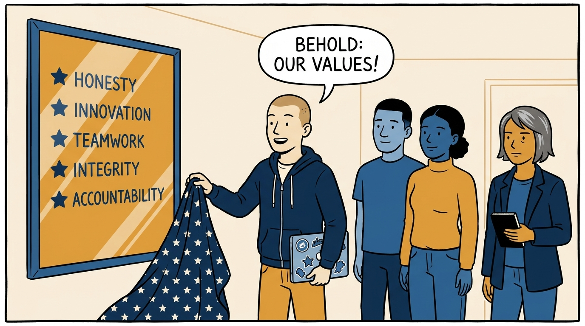
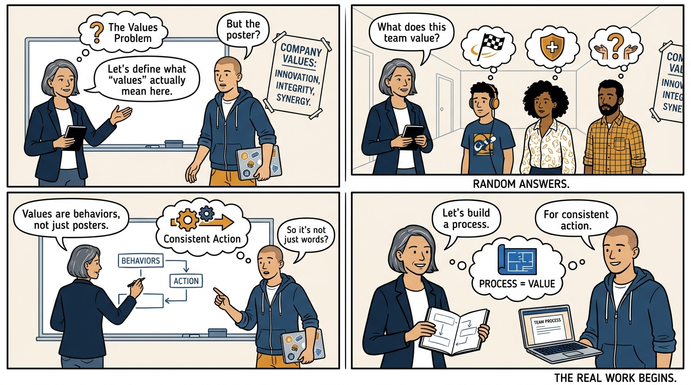
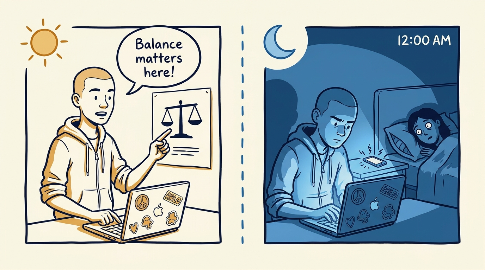
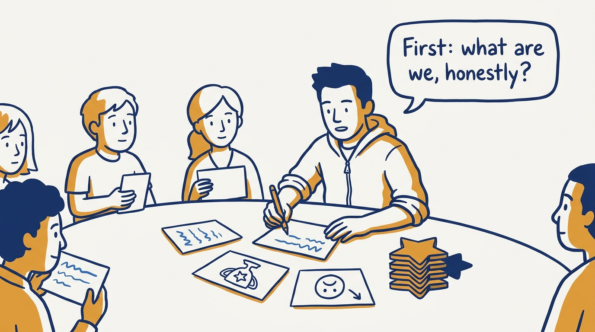
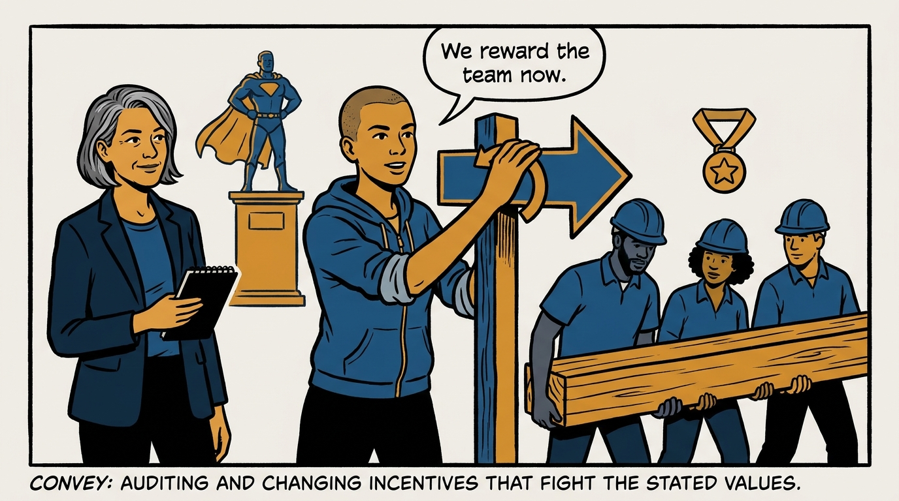
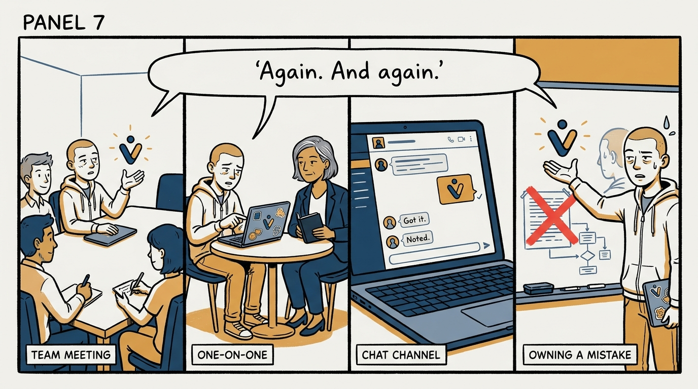
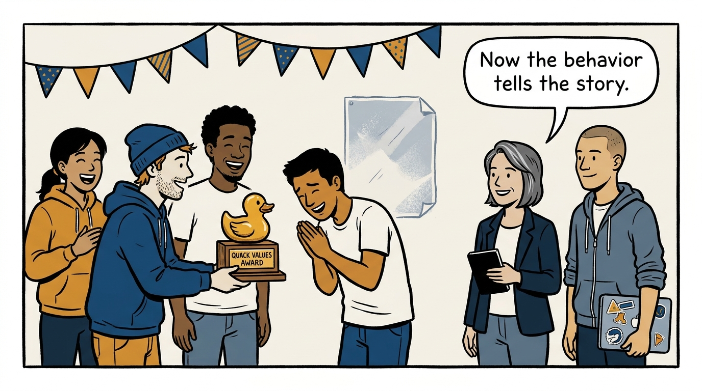

Why culture is what you repeat, model, reward, and ritualize — not what you write on a slide — in eight panels.

<!-- comic-style
{
  "cast": "VERA: a calm, seasoned engineering executive, short gray-streaked hair, dark blazer over a plain t-shirt, carries a small black notebook. ARLO: an engineer newly stepping into management, buzz-cut hair, zip-up hoodie with rolled sleeves, sticker-covered laptop under one arm.",
  "style": "Clean two-tone explainer comic, thick ink outlines, flat colors with deep blue and amber accents on a light background, generous white space, hand-lettered speech bubbles with SHORT readable text, no photorealism."
}
-->

**Panel 1:** *The hook: culture work begins — with a poster.*

**Panel 2:** *The problem: ask random team members what the team values — and get three different answers.*

**Panel 3:** *The wrong way: preach balance, send midnight messages — when behavior and values conflict, the team believes the behavior.*

**Panel 4:** *The principle: culture is what you repeat, what you model, what you reward, and what you ritualize — not what you frame on a wall.*

**Panel 5:** *How it runs: diagnose the culture you actually have — adjectives, proud moments, complaints — then choose five values with each one's shadow named.*

**Panel 6:** *The mechanic: audit what actually gets rewarded — and when the incentive fights the values, change the incentive, not the poster.*

**Panel 7:** *The cost: repeating the message across every channel — mistakes included — long past the point it feels redundant; that is when it starts to land.*

**Panel 8:** *The closer: a ritual that is unmistakably this team's — daily behavior finally telling the same story as the stated values.*
