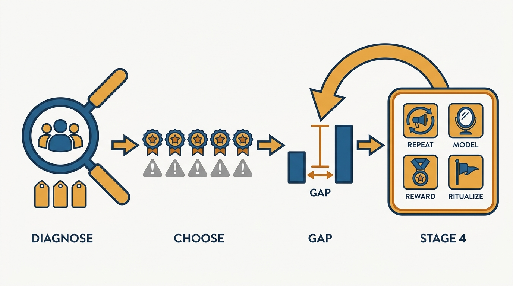
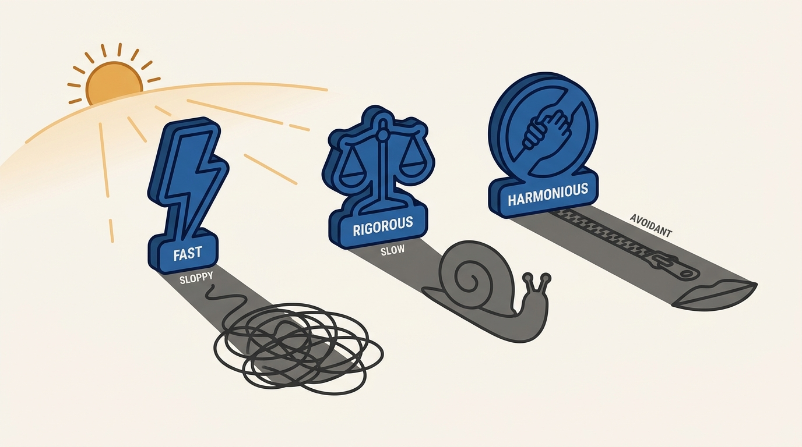
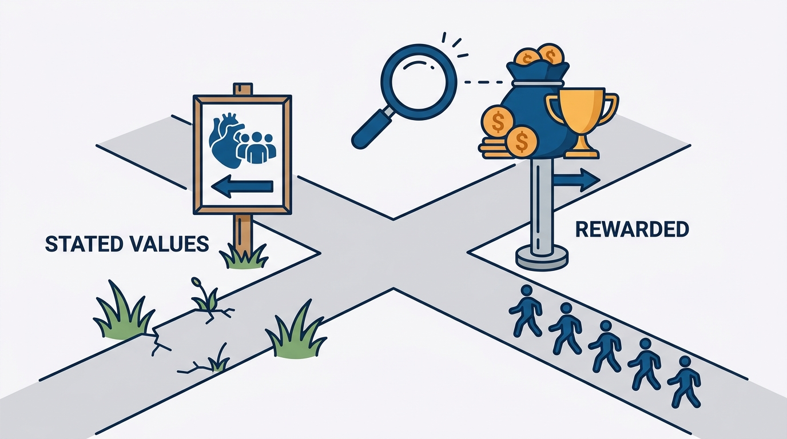

> **Status**: DRAFT
>
> **Principle**: My team's culture is what I repeat, what I model, what I reward, and what I ritualize — not what I write on a slide. So I work on culture deliberately: I diagnose the current culture honestly in plain adjectives, I choose the aspirational adjectives while naming the tradeoff each one carries when taken too far, and I close the gap through repetition across channels, visible modeled behavior, an audit of what actually gets rewarded, and traditions specific to this team. When my daily behavior and my stated values tell different stories, the team believes the behavior.

## Statement

My operating model for nurturing culture has six parts:

- **Diagnose before aspiring.** I write down the first three adjectives that describe my team's personality today, the moments that made me proud, what we do better than most teams, and the top three complaints about how things work — then check the picture against the broader organization's culture and against what an outside observer would say we do well or poorly. If random team members were asked "what does our team value?", I check whether their answers would be consistent.
- **Choose values with their tradeoffs attached.** I pick the top five adjectives I want others to use about my team — and for each one I name the downside of taking it too far. I list cultural traits I admire in other teams, why, and what tradeoffs those teams accept — and the traits I deliberately do not want to copy.
- **Name the gap.** I rate how close the team is to the ideal culture, list the strengths that already align, the biggest gaps, the main obstacles, and describe how I want the team to work one year from now.
- **Repeat what matters, in many forms.** I assume important messages need to be heard many times through multiple channels, and I talk openly not just about values but about mistakes and lessons learned.
- **Walk the walk and audit the incentives.** I check that my own behavior matches the values I claim, eliminate visible contradictions, and review what behaviors are actually rewarded — changing structural incentives when they push people away from the stated values.
- **Build traditions that make values visible.** I create rituals specific to this team — not generic ones — that celebrate learning, openness, creativity, or support, and I pay attention to the small repeated actions that signal what matters.

**Figure 1:** *The operating model in one flow: diagnose honestly, choose values with tradeoffs named, measure the gap — then close it with the four mechanisms that actually transmit culture.*

## How to Read This

This journal is my engineering-management operating model, each record grounded in one source. This record distills the "Nurturing Culture" chapter of Julie Zhuo's *The Making of a Manager* (Portfolio/Penguin, 2019) — the closing argument of the book: that a manager shapes culture whether or not they mean to, so they had better **do it on purpose**. The runnable version — the diagnosis prompts, the aspiration exercise, the incentive-trap watchlist — lives in the **Checklist** tab of this post.

## Rationale

**Culture exists whether I nurture it or not — the only choice is whether it is deliberate.** Every team already has a personality: how it handles disagreement, what it celebrates, what it quietly punishes. If I never diagnose it, **I am still shaping it** — through what I tolerate, what I reward, and what I model — just without knowing what I am building. Writing down three honest adjectives and the top three complaints is the cheapest possible way to see **the culture I actually have** rather than the one I assume I have.

**Every value taken too far becomes a liability, so I choose values with the tradeoff named.** "Fast" taken too far is sloppy; "rigorous" taken too far is slow; "harmonious" taken too far avoids every hard conversation. Zhuo's exercise forces the honesty: for each aspirational adjective, **name the downside**. The same discipline applies to admiring other teams — the cultures I envy accepted tradeoffs to get there, and copying the trait without accepting the tradeoff produces **cargo-cult culture**.

**Figure 2:** *Every value taken too far becomes a liability — so each aspirational adjective is chosen with its shadow named.*

**Repetition is the mechanism, not a failure of communication.** A value **said once at an offsite is decoration**. Important messages need to be heard many times, in many forms, through multiple channels — including the uncomfortable forms: open discussion of tension and disagreement, and honest talk about my own mistakes and what they taught me. When I feel like I am repeating myself, that is usually the first moment **the message is starting to land**.

**Trust is fragile, and consistency is how I protect it.** The fastest way to destroy a culture is **a visible contradiction** between what I say and what I do — asking for feedback I do not act on, demanding candor I do not offer. Modeling the exact behavior I want the team to adopt, and asking for feedback the same way I expect others to, is not a nice-to-have; it is **the load-bearing wall**.

**People believe the incentives, not the poster.** If I say "team success matters most" but reward individual heroics; if I say "invest long-term" but celebrate only short-term wins; if I say "be honest" but promote conflict-avoiders and reward the loudest complainers — the team learns **the real values in weeks**. So I audit: what behaviors actually get rewarded here, and why are people making the choices they are making? When the structural incentives push against the stated values, **I change the incentives**, hold people accountable when behavior violates the values, and publicly recognize the ones who do the hard right thing.

**Figure 3:** *People believe the incentives, not the poster: when rewards pull against stated values, the team follows the rewards — so the audit targets what actually gets rewarded.*

**Rituals make the values visible in everyday life.** A value the team only hears about stays abstract; a tradition the team enacts together — a recurring moment that celebrates learning, openness, creativity, or support — turns it into something people bond around. That is why the rituals must be specific to this team, grown from what we actually value: **a borrowed tradition signals nothing**, while even a small one of our own tells everyone what matters here. And the smallest repeated actions — what gets celebrated, what gets a mention, what quietly passes — carry the same signal.

## What This Means in Practice

| What this record says | What it does **not** say |
| --- | --- |
| I diagnose the current culture honestly, complaints included. | Culture work starts with writing aspirational values on a wall. |
| I choose five aspirational adjectives with the tradeoff of each named. | More values are better — an unbounded list means **nothing is a value**. |
| I repeat what matters across many channels, many times. | Saying it once at an all-hands counts as communicating it. |
| I audit what is actually rewarded and fix misaligned incentives. | Restating the values harder will overcome incentives that contradict them. |
| I build rituals specific to this team that make values visible. | Generic borrowed rituals will bond a team around its own values. |
| I hold people accountable when behavior violates the values. | Culture is only celebration — violations handled quietly teach the team **the values are optional**. |

Concretely: I can show a written current-culture diagnosis and a five-adjective aspiration with tradeoffs, I can point to the last time I changed an incentive because it fought the values, and the team has at least one ritual that is **unmistakably ours**. The final test I run on myself: what are my actions, rewards, and rituals teaching the team — and does daily behavior tell **the same story as the stated values**?

## Anti-Patterns

- **Values by decree.** Announcing aspirational values without ever diagnosing the current culture, so the gap — and the team's cynicism about it — stays invisible.
- **Adjectives without tradeoffs.** Choosing values like "fast" or "excellent" without naming what taking them too far costs, which makes the values unfalsifiable and unusable in real decisions.
- **The single announcement.** Communicating a value once and assuming it stuck, instead of repeating it across channels until it shows up in decisions I did not make.
- **The visible contradiction.** Preaching candor while dodging feedback, or work-life balance while sending midnight messages — the team believes the behavior every time.
- **The incentive traps.** Rewarding individual performance over team success, short-term gains over long-term investment, conflict avoidance over honest discussion, or the loudest complainers over the quiet contributors.
- **Cargo-cult rituals.** Copying another company's traditions instead of building ones specific to this team, so the ritual signals nothing.
- **Quiet tolerance of violations.** Recognizing value-aligned behavior publicly but handling violations invisibly or not at all — which teaches the team the values apply only when convenient.

## Related Records

- [[leading-a-small-team]] — culture at team scale starts with the trust and honesty basics that record commits to.
- [[managing-a-growing-team]] — growth is when culture stops propagating by osmosis and starts needing the deliberate repetition and rituals this record describes.
- [[feedback]] — holding people accountable to values, and modeling how feedback is asked for and received, run on that record's feedback machinery.
- [[engineering-culture]] (executive journal) — the organization-level view of the same commitment; this record is the team-scale instrument.
- [[organizational-values]] (executive journal) — the company-level values this team culture must nest inside rather than contradict.

## Scope and Revisiting

This record is `draft`. It governs how I diagnose, choose, and reinforce culture on any team I run or hold a manager accountable for. I revisit it when random team members give **inconsistent answers** to "what does our team value?", when I catch an incentive rewarding behavior the stated values condemn and I have not fixed it within a quarter, or when a year-out description of how the team should work has **gone stale without being rewritten**.

## Authoritative References

- Julie Zhuo, *The Making of a Manager: What to Do When Everyone Looks to You* (Portfolio/Penguin, 2019) — the "Nurturing Culture" chapter this record distills.
