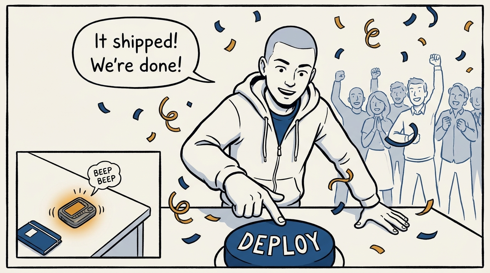
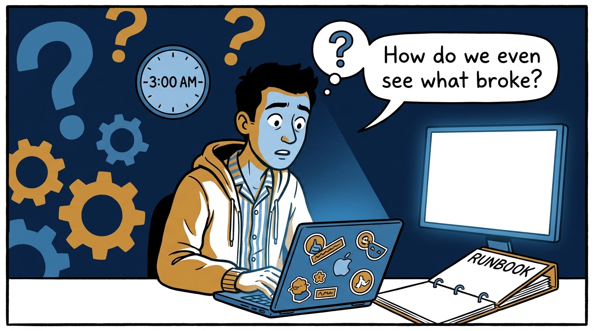
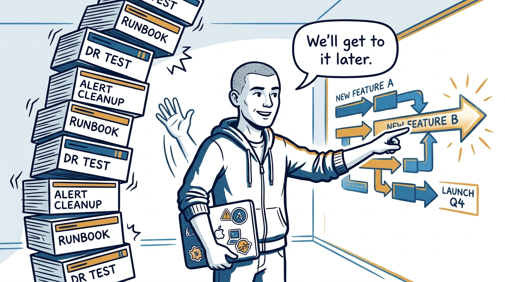
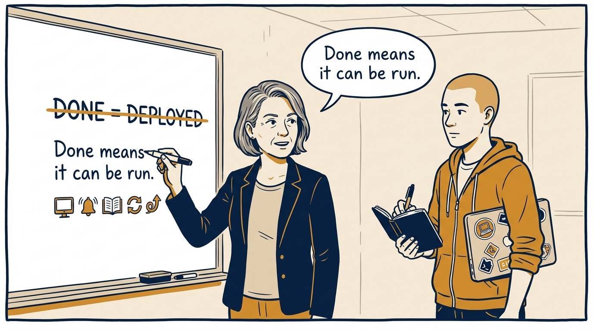
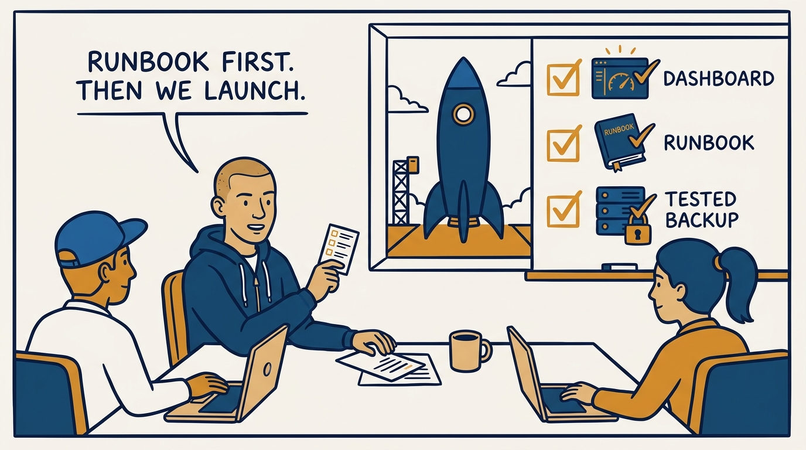
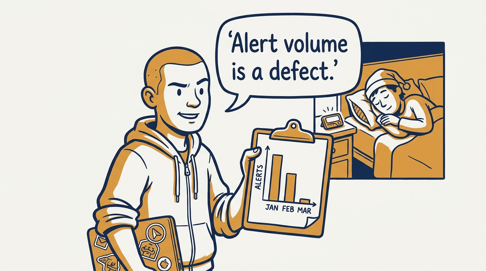
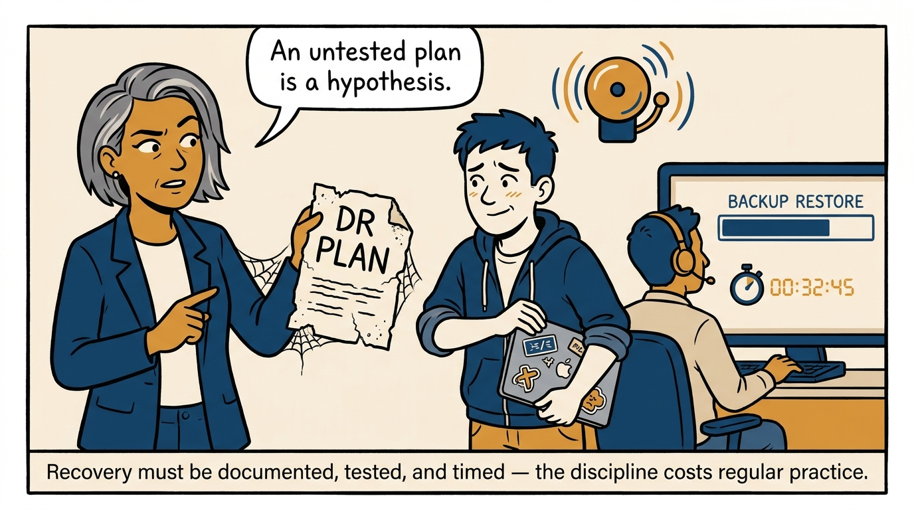
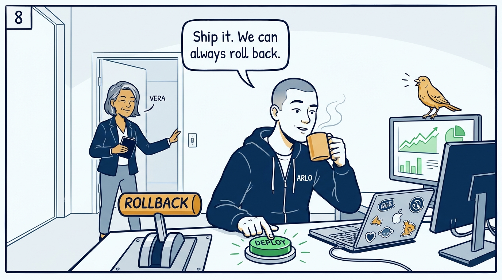

Why a system is done when it can be run — not when it ships — in eight panels.

<!-- comic-style
{
  "cast": "VERA: a calm, seasoned engineering executive, short gray-streaked hair, dark blazer over a plain t-shirt, carries a small black notebook. ARLO: an engineer newly stepping into management, buzz-cut hair, zip-up hoodie with rolled sleeves, sticker-covered laptop under one arm.",
  "style": "Clean two-tone explainer comic, thick ink outlines, flat colors with deep blue and amber accents on a light background, generous white space, hand-lettered speech bubbles with SHORT readable text, no photorealism."
}
-->

**Panel 1:** *The hook: 'done' is declared at ship time — while the pager is already warming up.*

**Panel 2:** *The problem: the first serious incident becomes archaeology — the team digs for dashboards and runbooks that were never built.*

**Panel 3:** *The wrong way: 'we'll get to it' — every deferred runbook, DR test, and alert cleanup is invisible until the night it isn't.*

**Panel 4:** *The principle: a system is done when it can be launched, monitored, paged on, recovered, and improved without heroics — and the manager owns whether the answers are yes.*

**Panel 5:** *How it runs: the launch review — dashboards, runbooks, SLOs, tested recovery — is the cheapest, highest-leverage operational meeting a manager runs.*

**Panel 6:** *The mechanic: measure alert volume and on-call pain, treat high numbers as defects to fix — the same neglect shows up in attrition and in time-to-recovery.*

**Panel 7:** *The cost: the bar demands drills — recovery plans tested, backups restored, time to full recovery measured — not documents that age in a drawer.*

**Panel 8:** *The closer: with canaries, flags, monitoring, and a rollback path always ready, deployment becomes a source of confidence instead of fear.*
