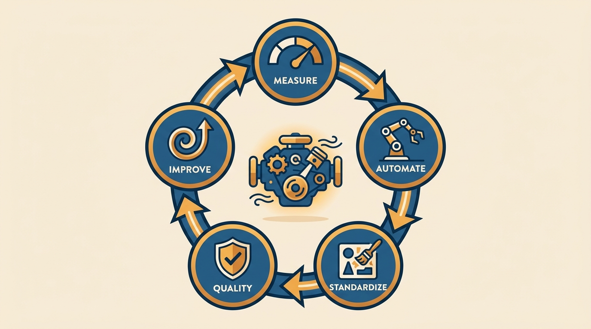
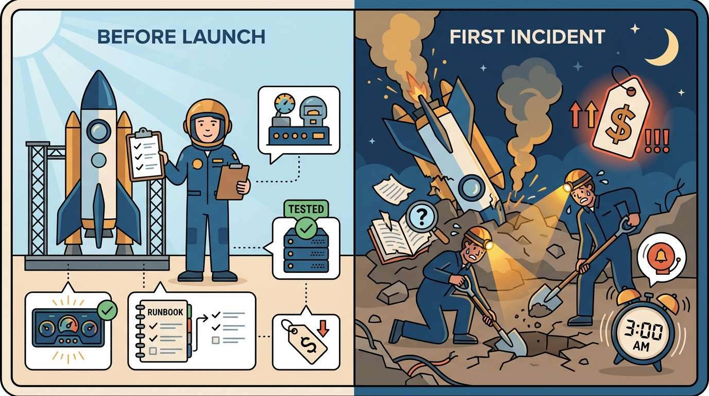
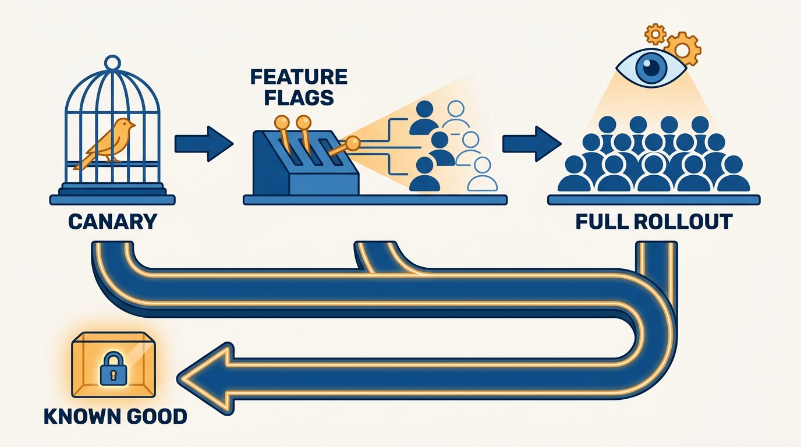

> **Status**: DRAFT
>
> **Principle**: A system is not done when it ships — it is done when it can be launched, monitored, paged on, recovered, and improved without heroics. Operational excellence is a management responsibility with a checkable bar, not an infrastructure team's hobby: invest in quality assurance, automate what is repetitive, standardize and improve the processes, measure and track the data, and keep improving continuously. I hold every software team I am responsible for to that bar across seven areas — launch readiness, incidents, on-call, operational data, customer issues, failover and recovery, and CI/CD — and the manager, not the pager, owns whether the answers are yes.

## Statement

The operational bar I hold software teams to:

- **Nothing launches unready.** Before launch: monitoring and dashboards work and are accessible, runbooks are understandable by unfamiliar team members, SLOs are defined and tracked, disaster recovery is in place and tested, dependency failure behavior is understood, load and performance testing has been done, and compliance requirements are met.
- **Incidents produce learning, not just resolution.** Every team has an incident review process (retrospectives, root-cause analyses), follow-up items that are tracked to completion with weekly reviews of what is open, measured alert volume, and reviewed response quality.
- **On-call is structured and humane.** A defined schedule and rotation length, backup plans when someone does not respond to a page, engineers with the right skills, tools, and permissions, explicit expectations about feature work during on-call — and on-call pain that is measured and actively minimized.
- **The team watches its data.** Dashboards give visibility into the health of the system *and* the business, are reviewed regularly, and the team knows what is currently in flight — feature flags, marketing campaigns, sales events — and where the scaling thresholds are.
- **Customer-reported issues are a tracked signal.** Frequency and type of customer issues are tracked, trends are analyzed as growing or shrinking, timeouts, errors, and crashes are measured (especially on mobile), and quality is weighed whenever new features are considered.
- **Recovery is designed, tested, and timed.** Disaster recovery plans are documented and tested, systems degrade gracefully, time to full recovery is measured and optimized, and rollback or failover to a known good instance is always possible.
- **Deployment is a source of confidence, not fear.** CI/CD with high confidence in deployment quality, canary releases or feature flags for gradual rollouts, synthetic and real-user monitoring on key flows, and adequate observability throughout.

## How to Read This

This journal is my engineering-management operating model, each record grounded in one source. This record is the exception in an otherwise book-grounded section: it distills Kate Matsudaira's article "Software Managers' Guide to Operational Excellence" — the source checklist names her article explicitly — into the operational bar I hold software teams to. The seven areas above map one-to-one onto her checklist; the runnable version lives in the **Checklist** tab.

## Rationale

**Operational excellence is a management responsibility because nobody else has the incentive to enforce it.** Engineers under delivery pressure will rationally defer runbooks, DR tests, and alert cleanup — every one of those is invisible until the night it isn't. Matsudaira's framing puts the accountability where the leverage is: the manager does not have to operate the systems, but the manager owns asking the questions and refusing to accept "we'll get to it" as a permanent answer. That is why the bar is written as checkable conditions, not aspirations.

**The five keys are one loop, not five projects.** Invest in quality assurance, automate repetitive and manual tasks, standardize and improve engineering processes, measure and track performance data, foster a culture of continuous improvement. Each feeds the next: measurement exposes the repetitive pain, automation removes it, standardization keeps it removed, and the improvement culture is what makes the loop run again next quarter instead of decaying into a one-time cleanup.

**Figure 1:** *The five keys are one loop, not five projects: measurement exposes the pain, automation removes it, standardization keeps it removed, and the improvement culture reruns the loop.*

**Launch readiness is cheaper than launch archaeology.** Every item on the launch list — working dashboards, runbooks a stranger can follow, tracked SLOs, tested backups, understood dependency failures, load testing, compliance — costs a fraction before launch of what it costs during the first serious incident, when the team is simultaneously discovering how the system fails and how to observe it. A launch review against this list is the single highest-leverage operational meeting a manager runs.

**Figure 2:** *Every readiness item costs a fraction before launch of what it costs during the first serious incident, when the team is discovering how the system fails and how to observe it at the same time.*

**On-call quality is an operational metric, not a personnel perk.** A rotation with unmeasured paging pain, no backup plan, unclear feature-work expectations, or engineers missing the permissions to act burns people *and* lengthens incidents — the same neglect shows up in attrition and in time-to-recovery. Measuring alert volume and on-call pain, and treating high numbers as defects to fix, is how the incident load gets driven down instead of merely endured.

**Recovery ability, not incident absence, is the real reliability measure.** Incidents are inevitable; unrecoverable ones are a choice. That is why the bar insists on documented *and tested* recovery plans, graceful degradation, a measured and optimized time to full recovery, and — always — a rollback or failover path to a known good instance. A deployment pipeline with canaries, feature flags, and real-user monitoring is part of the same stance: it turns every release into a small, observable, reversible experiment instead of a bet.

**Figure 3:** *A deployment pipeline with canaries, flags, and monitoring turns every release into a small, observable, reversible experiment — with a path back to a known good instance from every stage.*

## What This Means in Practice

| What this record says | What it does **not** say |
| --- | --- |
| The manager owns the operational bar and asks the questions. | The manager personally operates the systems — the craft of meeting the bar lives with the team. |
| Nothing launches without the readiness list holding. | Launches are slow — the list is short, known in advance, and cheapest before launch. |
| Incident follow-ups are tracked weekly to completion. | Retrospectives are enough — a review whose action items die in a backlog is theater. |
| On-call pain is measured and minimized. | On-call is eliminated — someone carries the pager; the job is making that humane and effective. |
| Dashboards cover system health *and* business health. | Observability is an infra concern — feature flags, campaigns, and sales events are operational context too. |
| Rollback or failover to a known good instance is always possible. | Incidents are preventable — recovery ability, not incident absence, is what I hold teams to. |
| Quality is weighed when new features are considered. | Features stop for quality — the trade-off is made explicitly, with customer-issue trends on the table. |

Concretely: every service my teams run can pass the Checklist tab today or has a dated plan for each gap; launch reviews use the readiness section; open incident action items are reviewed weekly; and I can see alert volume, on-call pain, customer-issue trends, and time to recovery for any team without asking anyone to compile them.

## Anti-Patterns

- **Done means deployed.** Declaring a project finished at ship time, with monitoring, runbooks, and recovery "to follow" — they follow at 3 a.m., during the first incident.
- **The untested recovery plan.** A DR document nobody has ever executed; backups nobody has restored. An untested plan is a hypothesis, not a plan.
- **Retrospective theater.** Running incident reviews whose action items are never tracked to completion — the same incident returns wearing a different alert.
- **Normalized pager pain.** Treating a loud, exhausting on-call rotation as the cost of doing business instead of a measured defect to drive down.
- **The hero dependency.** A system only one person can operate or recover — runbooks that live in someone's head are an outage waiting for a vacation.
- **Dashboards nobody reads.** Building observability for the audit and never reviewing it — visibility that is not looked at regularly is decoration.
- **The irreversible deploy.** Shipping without canaries, flags, or a rollback path to a known good instance, turning every release into an all-or-nothing bet.

## Related Records

- [[senior-leadership]] — the True North commitment to protect quality, readiness, and operational standards; this record is the concrete bar behind it.
- [[managing-a-team]] — team health and system health degrade the same way, quietly; the manager who owns one owns both.
- [[tech-lead]] — the rung that runs projects day-to-day against this bar and surfaces the gaps first.
- [[run-engineering-processes]] (executive journal) — launch reviews, incident reviews, and on-call rotations are exactly the kind of clearly owned processes an organization runs on.

## Scope and Revisiting

This record is `draft`. It governs the operational bar for every software team and service I am accountable for — what must be true at launch and in steady state, and what I check when I review a team's operations. I revisit it when an incident exposes a failure mode the seven areas do not cover, when a team consistently passes the checklist while operational outcomes still degrade (a sign the bar has drifted from reality), or when platform changes (new runtime, new compliance regime) add conditions the list must absorb.

## Authoritative References

- Kate Matsudaira, "Software Managers' Guide to Operational Excellence" — the article this record and its checklist distill; the source checklist PDF names it explicitly.
