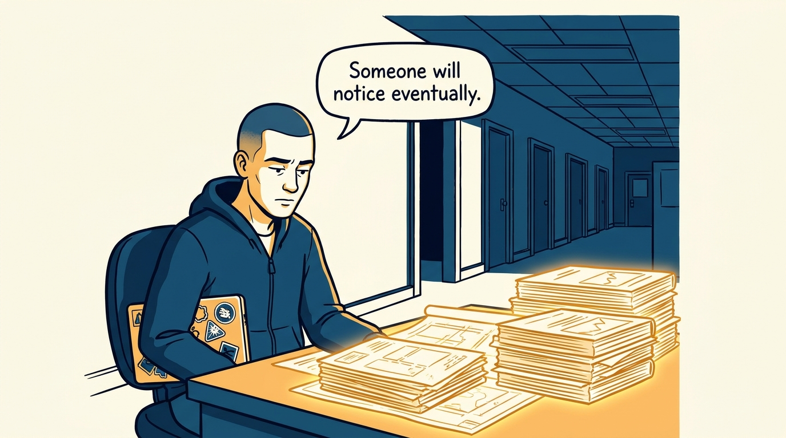
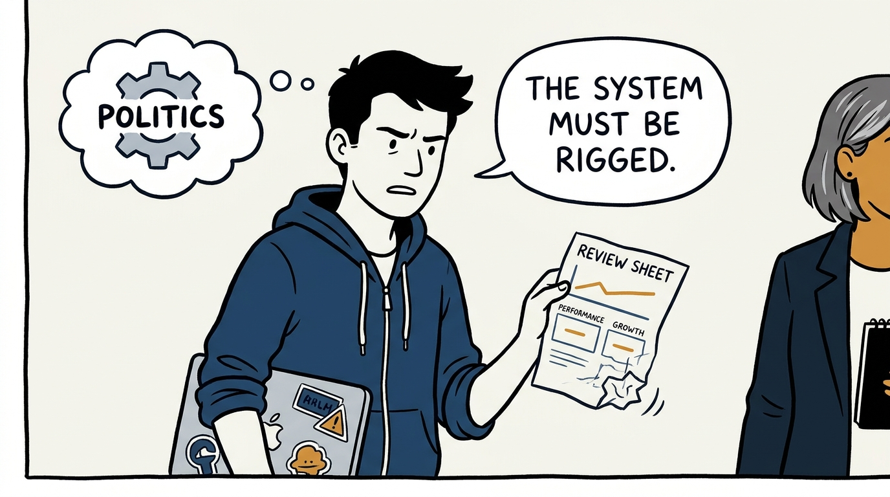
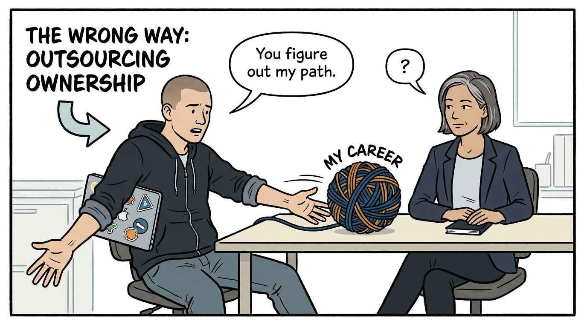
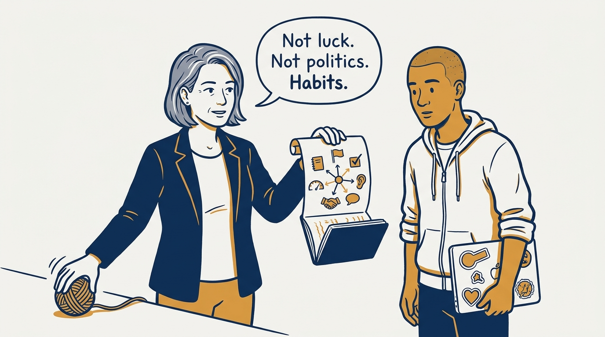
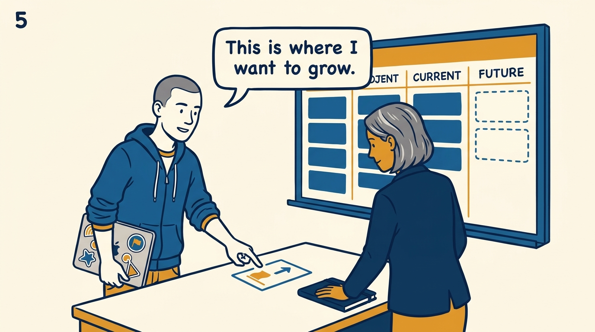
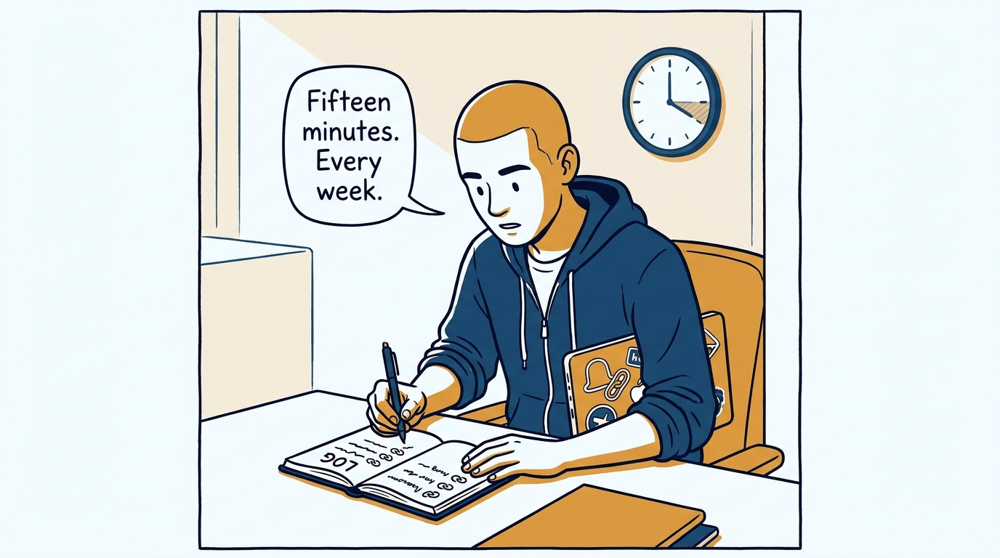
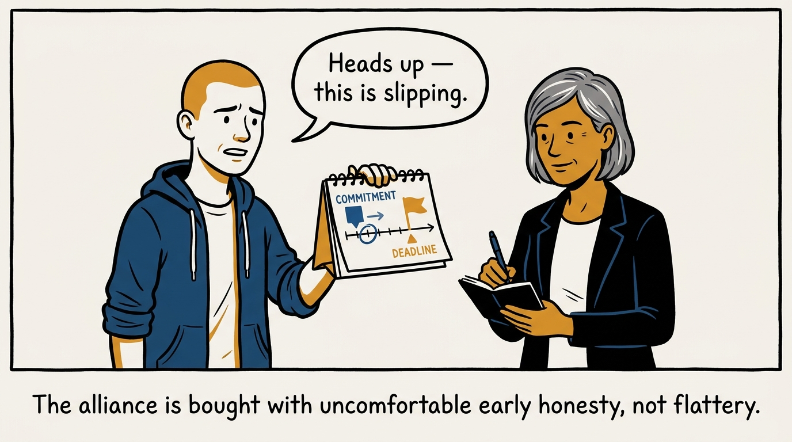
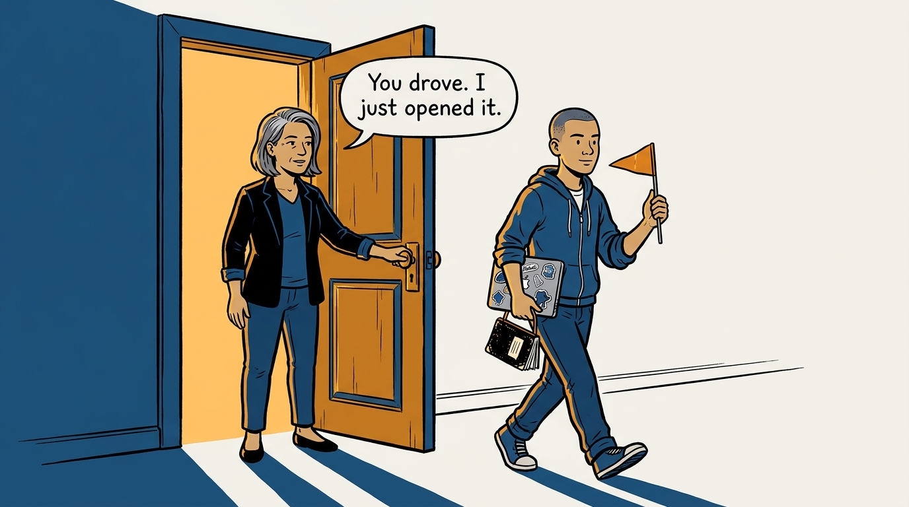

Why nobody can drive your career for you — and the habit set that lets your manager actually help — in eight panels.

<!-- comic-style
{
  "cast": "VERA: a calm, seasoned engineering executive, short gray-streaked hair, dark blazer over a plain t-shirt, carries a small black notebook. ARLO: an eager early-career engineer climbing the ladder — in some strips a new lead or manager, in others the engineer being coached — buzz-cut hair, zip-up hoodie with rolled sleeves, sticker-covered laptop under one arm.",
  "style": "Clean two-tone explainer comic, thick ink outlines, flat colors with deep blue and amber accents on a light background, generous white space, hand-lettered speech bubbles with SHORT readable text, no photorealism."
}
-->

**Panel 1:** *The hook: excellent work, done silently, waiting for the organization to notice.*

**Panel 2:** *The problem: the flat review that follows — read as proof of politics, when it is proof of missing information.*

**Panel 3:** *The wrong way: handing the whole tangle to the manager — a savior cannot drive a career any more than an adversary can.*

**Panel 4:** *The principle: ownership is a habit set — goals, finishing, evidence, feedback, alliance, pacing — not luck and not politics.*

**Panel 5:** *How it runs: say what you want — a manager who has to guess your goals will guess wrong, and staff you by convenience.*

**Panel 6:** *The mechanic: fifteen minutes a week in the work log — review evidence, 1:1 backbone, and a tool for saying no, all in one notebook.*

**Panel 7:** *The cost: telling your manager early when a commitment slips — the trust that advocacy runs on is built from exactly these moments.*

**Panel 8:** *The closer: I can open doors and advocate — but the engineers who practice these habits are the ones I can actually help.*
