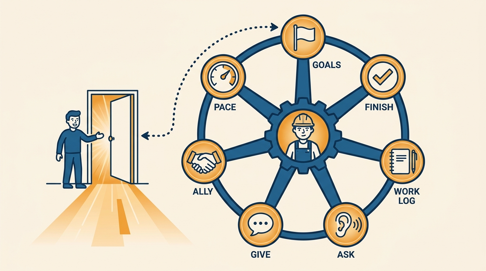
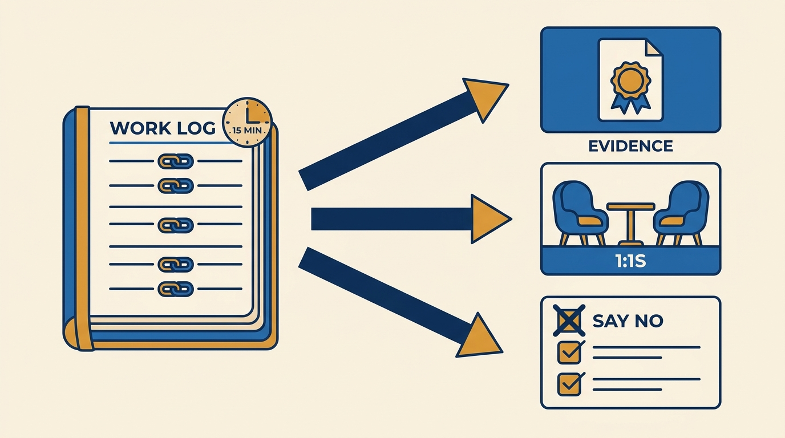
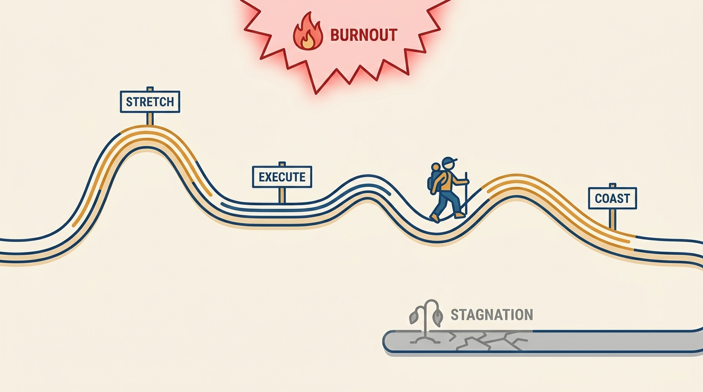

> **Status**: DRAFT
>
> **Principle**: I cannot drive anyone's career for them — I can advocate, open doors, and coach, but the direction and the evidence have to come from the engineer. So I coach every engineer into a concrete habit set: know what you want and say it, finish what you commit to and make the finish visible, keep a work log, ask for feedback on specific work and give feedback generously, treat your manager as an ally rather than an obstacle or a savior, and pace yourself deliberately between stretching, executing, and coasting. Career ownership is not politics and not luck; it is habits — and the engineers who practice them are the ones I can actually help.

## Statement

What I expect engineers to own, and what I coach them into:

- **Take charge — do not wait for me.** I expect every engineer to define what they want from their career, communicate their goals and interests regularly, look for opportunities to grow, and create chances for others to give them feedback. A manager who has to guess your goals will guess wrong.
- **Be seen as someone who gets things done.** Finish the work you commit to, at high quality and a good pace; focus on impactful work over busywork; understand the team's and business's priorities; and make sure your manager and team know when important work lands — with measurable impact where possible.
- **Keep a work log.** Record important work weekly: projects, decisions, code reviews, design docs, meetings, support work — with links to the artifacts. Review it regularly with me, and use it both as review-and-promotion evidence and as a tool to decide what to prioritize, stop, or decline.
- **Ask for feedback on specific work.** Not "how am I doing?" but "what went well and what could be improved in this design, this incident, this presentation?" — from teammates, managers, product partners, and anyone you work with. Clarify vague feedback with concrete examples, ask about impact, and actually adjust.
- **Give feedback as well as you take it.** Call out good work when you see it and mean it; keep critical feedback on situations, observations, and impact; make clear it is your observation, not absolute truth; never phrase it as an order to someone you do not manage; end the conversation positively.
- **Make your manager an ally.** Regular 1:1s, honest sharing of what you are working on and where you want to grow, understanding my goals and challenges, delivering what you agree to — and giving updates *early* when a commitment is slipping. Trust built this way is what my advocacy runs on.
- **Pace yourself.** Notice whether you are stretching, executing, or coasting; stretch when it grows you, execute enough to stay reliable, do not coast so long that motivation dies — and ask for support before overload becomes burnout.

**Figure 1:** *Ownership is a habit set, not luck: seven habits the engineer drives — while the manager's part is opening doors.*

## How to Read This

This journal is my engineering-management operating model. This record is grounded in the "Own Your Career" chapter material from Gergely Orosz's *The Software Engineer's Guidebook* (2023), read from the manager's side: the career-ownership habits I coach engineers into, and what I owe in return when they practice them. The engineer's side of the manager–report contract in [[management-101]] is this record in miniature. The runnable version — written in the engineer's first person, as the source has it — lives in the **Checklist** tab of this post.

## Rationale

**A manager who has to guess your goals will guess wrong — and most managers are guessing.** The Guidebook's first instruction is the one I repeat most: do not wait for your manager to drive your growth. I manage multiple people, each with different ambitions, and my picture of what each person wants decays fast unless they refresh it. The engineers who state their goals plainly get staffed onto the work that serves those goals; the ones who stay silent get staffed by convenience. That is not favoritism — it is the information I was given.

**Reputation compounds from finishing, not from starting.** "Gets things done" is the single most portable reputation an engineer can build, and it is built from three parts the source keeps separate for a reason: finishing what you commit to, choosing impactful work over busywork, and making sure the right people know when important work completes. I coach the third part hardest, because good engineers resist it as self-promotion. It is not — silent completion reads as no completion from where I sit, and I refuse to let an engineer's review depend on my memory.

**The work log is the cheapest high-leverage habit in this record.** Fifteen minutes a week recording projects, decisions, reviews, and support work — with links — solves three problems at once: it makes performance reviews and promotion cases a matter of assembly rather than archaeology, it gives our 1:1s a factual backbone, and, least obviously, it is a prioritization instrument. An engineer who reads their own log can see where their time actually went, and use that to decide what to stop or say no to. I ask to see the log periodically not to audit it, but because reviewing it together is where the coaching happens.

**Figure 2:** *One log, three payoffs: review evidence by assembly instead of archaeology, a factual backbone for 1:1s, and a tool for deciding what to stop.*

**Feedback only flows to people who make it cheap to give.** Vague requests ("any feedback for me?") produce polite nothing. Specific requests tied to concrete work produce usable answers, and asking about impact — not just quality — is what turns feedback into behavioral change. The reciprocal habit matters just as much: an engineer who gives specific, honest, well-framed feedback becomes someone colleagues trust with the truth, which is exactly the raw material their own growth needs.

**Pacing is a career-length concern, and both failure modes are silent.** The source names three modes — stretching, executing, coasting — and the skill is noticing which one you are in. Permanent stretch ends in burnout; permanent coast ends in stagnation and quiet disengagement. I watch for both, but I cannot see them as early as the engineer can, which is why the commitment I coach is "ask for support before overload becomes burnout" and "address low motivation instead of ignoring it." An engineer who tells me they are coasting gets a challenge; one who hides it gets a surprise review.

**Figure 3:** *Pacing is deliberate alternation: stretch, execute, coast — and both failure modes, burnout and stagnation, are silent until raised.*

## What This Means in Practice

| What this record says | What it does **not** say |
| --- | --- |
| The engineer defines and communicates career goals; I staff and advocate against them. | I design anyone's career for them — direction is theirs to set. |
| Make completed work visible, with measurable impact where possible. | Self-promotion theater — visibility is reporting finished work, not marketing unfinished work. |
| Keep a work log and review it with me regularly. | The log is surveillance — it is the engineer's evidence and prioritization tool; I only see what we review together. |
| Ask for feedback on specific work, from many sources. | Act on every piece of feedback — take it seriously, then decide thoughtfully what to adopt. |
| Make your manager an ally: early updates, honest 1:1s, delivered commitments. | Manage up with flattery — the alliance is built on transparency, not agreement. |
| Stretch deliberately, and coast deliberately when recovery is needed. | Maximum intensity always — sustainable pacing beats permanent stretch. |

Concretely: every engineer on my teams can tell me what they want from the next stage of their career, show a work log that is current within two weeks, name the last piece of specific feedback they asked for and what they changed because of it, and tell me — before I discover it — whether they are currently stretching, executing, or coasting.

## Anti-Patterns

- **Waiting to be discovered.** Doing excellent work silently and assuming the organization will notice — then reading the flat review as proof of politics rather than of missing information.
- **Busywork mistaken for impact.** Full calendars and fast responses with nothing finished that the team's priorities actually needed.
- **The empty-handed review.** Arriving at performance review time with no log, no links, no metrics — reconstructing a year from memory and losing half of it.
- **Fishing for reassurance.** Asking "any feedback?" in a way calibrated to produce praise, and clarifying nothing when the answer is vague.
- **Feedback as ammunition.** Giving critique framed as absolute truth or as orders to peers, spending trust the giver has not earned.
- **Manager as adversary — or as savior.** Hiding slipping commitments until they explode, or outsourcing all career thinking to the 1:1 and calling it ownership.
- **Unnoticed coasting.** Months of low-challenge work with motivation quietly draining, ignored instead of raised — until the engineer resigns "unexpectedly."

## Related Records

- [[management-101]] — the two-sided contract this record is half of: what I owe every report, and what I ask every report to own — this is the report's half, expanded.
- [[performance-review-cycle]] — working the review cycle itself; the goals, work log, and feedback habits here are what make that record cheap to execute.
- [[promotions]] — the promotion case is assembled from the evidence this record's habits produce.
- [[feedback]] — my side of the feedback craft as a manager; this record asks engineers to practice the same craft peer-to-peer.
- [[career-conversations]] (people journal) — the manager-run conversation about a person's whole arc; this record is what the engineer does between those conversations.

## Scope and Revisiting

This record is `draft`. It governs the career-ownership habits I coach engineers into at every level, and the advocacy I owe engineers who practice them. I revisit it when a strong engineer is surprised by a review outcome despite following these habits (a signal my side of the contract failed), when the company changes its review or promotion machinery in ways that shift what evidence matters, or when work logs drift into compliance theater instead of a tool engineers use for themselves.

## Authoritative References

- Gergely Orosz, *The Software Engineer's Guidebook* (Pragmatic Engineer, 2023) — the career-ownership chapter this record distills, via the "Own Your Career" checklist.
