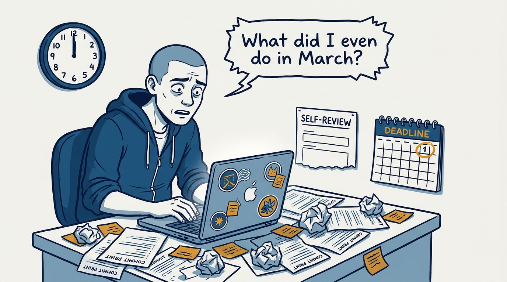
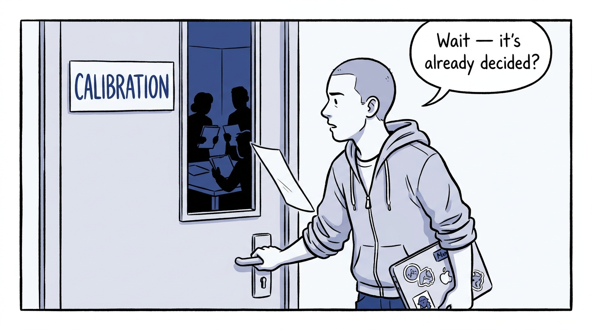
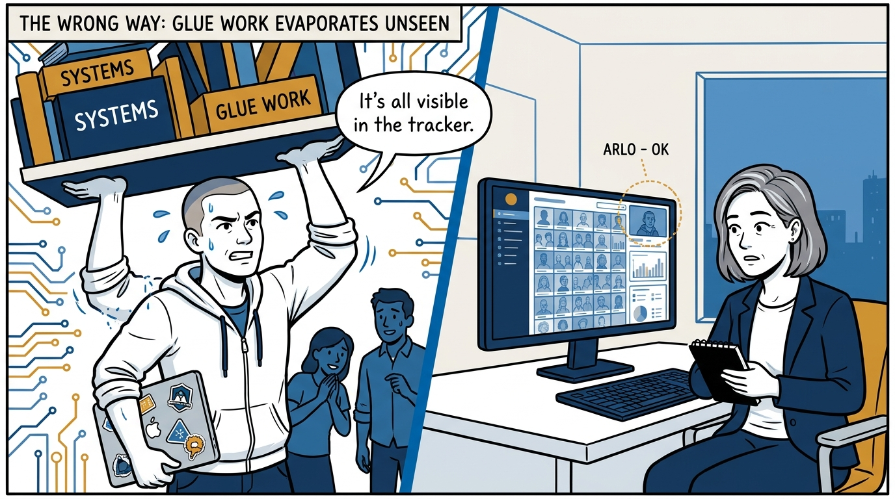
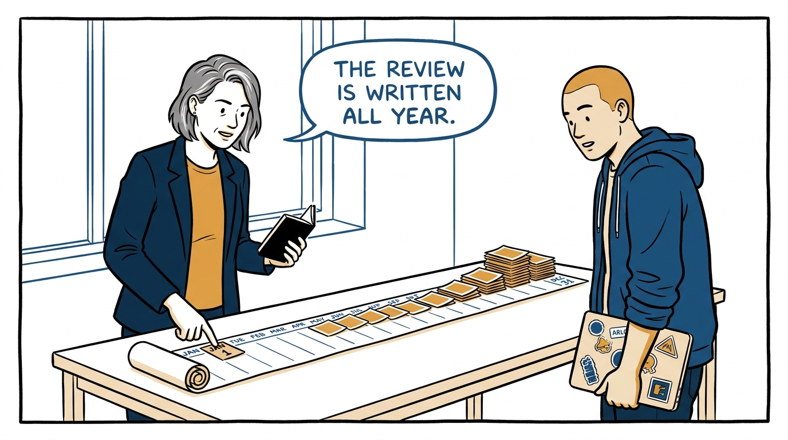
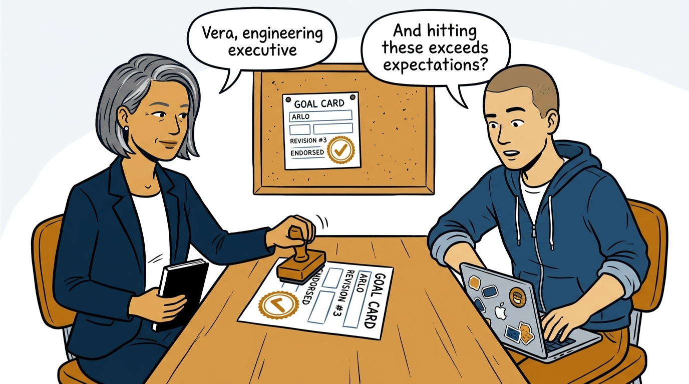
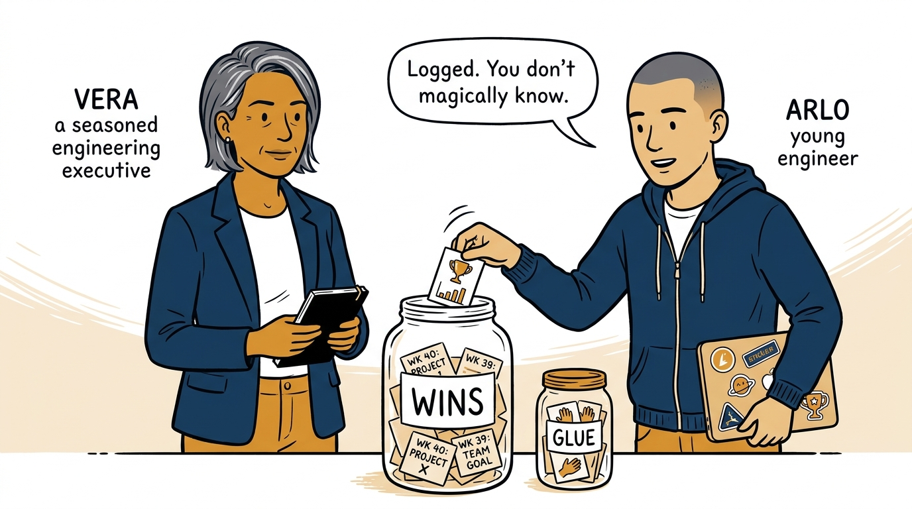
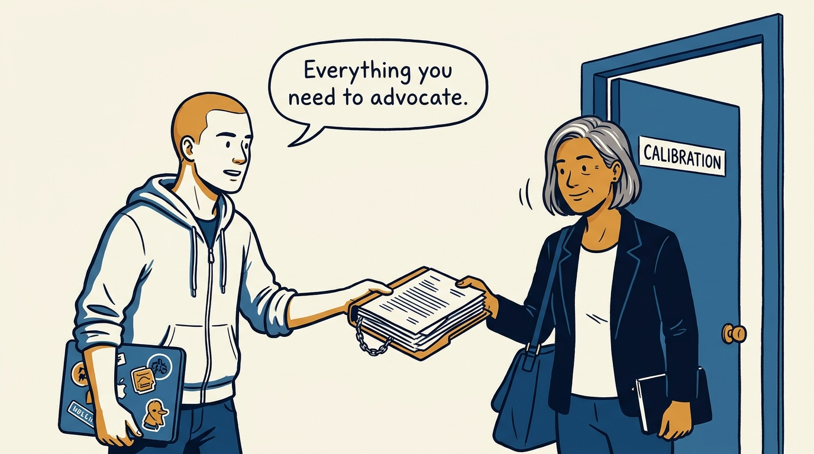
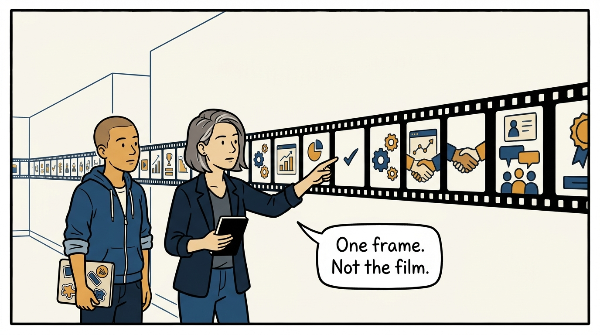

Why a performance review is written all year — and how to work the cycle from its first week — in eight panels.

<!-- comic-style
{
  "cast": "VERA: a calm, seasoned engineering executive, short gray-streaked hair, dark blazer over a plain t-shirt, carries a small black notebook. ARLO: an engineer newly stepping into management, buzz-cut hair, zip-up hoodie with rolled sleeves, sticker-covered laptop under one arm.",
  "style": "Clean two-tone explainer comic, thick ink outlines, flat colors with deep blue and amber accents on a light background, generous white space, hand-lettered speech bubbles with SHORT readable text, no photorealism."
}
-->

**Panel 1:** *The hook: the end-of-cycle sprint — reconstructing a year from memory the week the self-review is due.*

**Panel 2:** *The problem: by the time calibration meets, the inputs are fixed — arriving late means negotiating with a decision already made.*

**Panel 3:** *The wrong way: assuming the manager knows — unaided memory favors the recent and the loud, and untracked glue work evaporates.*

**Panel 4:** *The principle: the review is written all year — the meeting at the end only reads it out. Start at week one.*

**Panel 5:** *How it runs: goals are revised until the manager can endorse them, recorded — and 'would achieving these exceed expectations?' is asked in week one.*

**Panel 6:** *The mechanic: wins recorded weekly with evidence, glue work tracked and bounded — the operating assumption is that the manager does not already know.*

**Panel 7:** *The cost: a self-review assembled from artifacts, handed over before the gate closes — advocacy material delivered, not improvised.*

**Panel 8:** *The closer: read the outcome like an engineer — a snapshot through imperfect lenses, one frame in a long career, examined together from the same side.*
