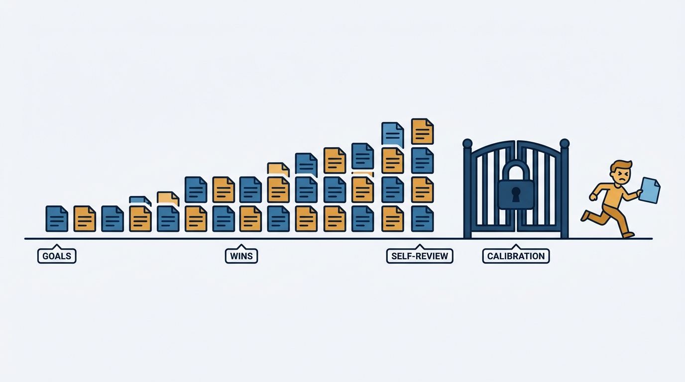
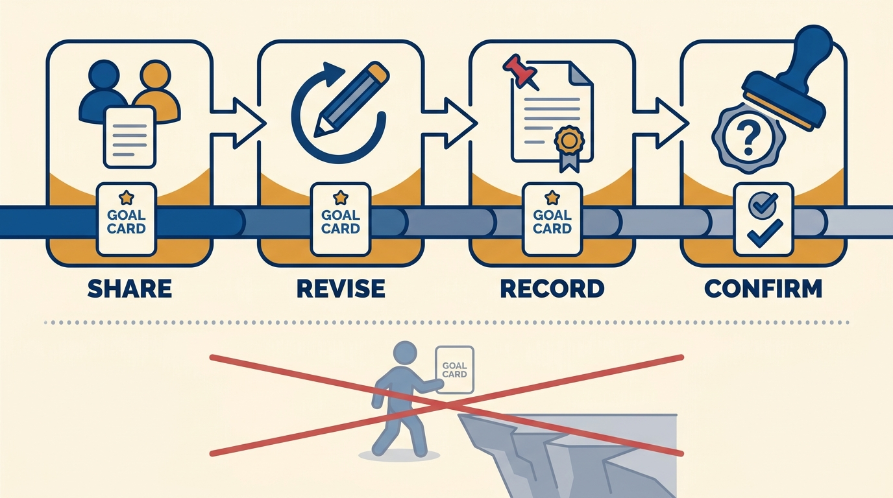
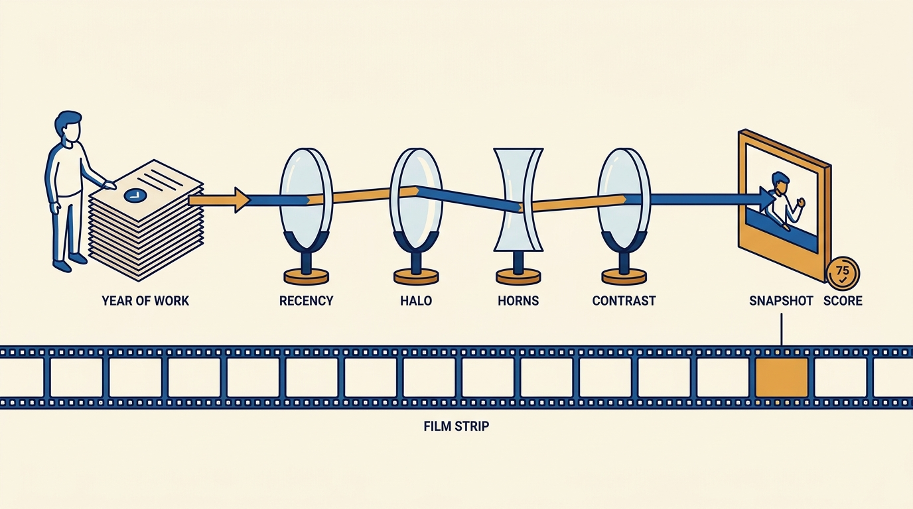

> **Status**: DRAFT
>
> **Principle**: A performance review is written all year — the meeting at the end only reads it out. So I coach engineers to work the cycle from its first week: learn how the system actually works and who actually decides, set goals I can explicitly endorse and confirm what achieving them would mean, record wins and glue work continuously instead of assuming I already know, arrive at review time with a self-review built from artifacts rather than memory, and read the outcome as a snapshot filtered through known rater biases — not as a verdict on a career. The engineer and I are on the same side of this process, and everything in this record exists to keep it that way.

## Statement

How I expect engineers to work the review cycle, and what I do to make it workable:

- **Learn the system before playing in it.** At the start of a cycle I expect an engineer to know what our team's goals are and how they connect to company goals, what the company actually rewards, who makes the final review decision, who gives input, and when decisions and calibration happen. I answer these questions plainly when asked — none of this is secret.
- **Set goals I can endorse — and calibrate them up front.** Goals should support the engineer, the team, me, and the company; be shared with me and revised until I can support them; be recorded somewhere visible or official; and come with an explicit answer to the question the source insists on: *would achieving these goals meet or exceed expectations?*
- **Build evidence habits for the whole cycle.** Wins recorded weekly or biweekly — completed projects, outcomes, metrics, screenshots, praise; a work log of notable work and impact; regular 1:1s that share progress, wins, and challenges. The operating assumption: I do *not* already know everything you are doing.
- **Track glue work — and bound it.** Helping teammates, unblocking others, and holding things together counts, but only if it is visible; and I watch with the engineer for helping that grows at the expense of core responsibilities.
- **Ask for feedback well before review time.** After meetings, incidents, presentations, projects — specific and early, so course corrections happen mid-cycle, not as review-day surprises.
- **Prepare deliberately.** Before the review: ask me how I think you are performing, understand your standing relative to expectations, know the deadlines and calibration dates, and give me important context *before* decisions are finalized. Then write a self-review from artifacts: results over time (not just recent work), original goals and outcomes, competency examples for the level, qualitative contributions like mentoring and judgment, and peer feedback and praise.
- **Interpret the outcome like an engineer.** The review is a snapshot, not a career; ratings pass through known biases — recency, strictness, leniency, horns, halo, similarity, central tendency, contrast; vague feedback deserves a request for specifics; and no major life plans get built on an uncertain bonus.

## How to Read This

This journal is my engineering-management operating model. This record is grounded in the "Performance Reviews" chapter material from Gergely Orosz's *The Software Engineer's Guidebook* (2023), read from the manager's side: how I coach engineers to work the review cycle, and what I owe them in return. My own side of the same cycle — how I write and deliver reviews — is [[performance-reviews]] in the people-management journal; this record is the mirror image. The runnable version lives in the **Checklist** tab of this post.

## Rationale

**The review is decided by information, and information has a deadline.** By the time calibration meets, the inputs are fixed: my written assessment, peer feedback, and whatever evidence exists. An engineer who starts assembling their case the week the self-review is due is negotiating with a decision that has mostly been made. That is why the source's first section is called "start early" — knowing who decides, who gives input, and when calibration happens is not politics, it is knowing the deadline for being understood.

**Figure 1:** *The review is written all year: evidence accumulates until the calibration gate closes — the engineer who starts at the end arrives after the decision.*

**Unendorsed goals are a trap I refuse to set.** The quiet failure mode of goal-setting is an engineer working all cycle toward goals their manager never really signed up for — and discovering at review time that hitting them counts as merely meeting expectations. The Guidebook's fix is mechanical and I enforce it: goals are shared, revised until I can genuinely support them, recorded officially, and accompanied by an explicit answer to "would achieving these meet or exceed expectations?" That one question, asked in week one, prevents the most common review-day dispute I know.

**Figure 2:** *The mechanical fix: goals are shared, revised until endorsed, recorded — and the meets-or-exceeds question is answered in week one, not on review day.*

**I refuse to let outcomes depend on my memory — and neither should the engineer.** I run reviews for multiple people and my unaided recall favors the recent, the loud, and the dramatic. Weekly recorded wins, a work log with links, and 1:1s that actually surface progress are the correction. The same goes double for glue work: mentoring, unblocking, holding a migration together — this work evaporates from reviews unless it is tracked, and the engineer is the only person positioned to track it. The counterweight comes from the same source page: watch for helping others growing at the expense of core responsibilities.

**A self-review built from artifacts beats a self-review built from adjectives.** The document I can defend in calibration cites results delivered over the whole cycle, original goals with outcomes, competency examples for the level, qualitative contributions, and peer feedback — not enthusiasm. I also tell engineers the uncomfortable part the source makes explicit: assess honestly whether your manager will be a strong advocate, and give them the context they need before decisions are finalized. I would rather be handed my advocacy material than have an engineer assume I will improvise it well.

**Ratings are measurements taken with an imperfect instrument.** Recency, strictness, leniency, horns, halo, similarity, central tendency, contrast — the biases the source lists are not exotic; they are the default failure modes of every rater, including me. Coaching engineers to know them is not cynicism. It lets a good engineer metabolize a mediocre rating without catastrophizing, push back with specifics instead of grievance, and keep the review in perspective within the larger arc of a career — long-term growth, relationships, skills, and impact are the game; the rating is one frame of it.

**Figure 3:** *A rating is a measurement taken with an imperfect instrument: it passes through known biases, and it is one frame of a career, not the film.*

## What This Means in Practice

| What this record says | What it does **not** say |
| --- | --- |
| Learn who decides, who gives input, and when calibration happens. | Play politics — understanding the system is transparency, and I answer these questions openly. |
| Goals are revised until I can endorse them, then recorded officially. | Goals are a private aspiration — unendorsed goals are a review-day trap. |
| Record wins weekly; assume I do not know what you are doing. | Bombard the manager with noise — evidence is curated, linked, and shared in 1:1s. |
| Track glue work so it is visible. | Glue work is unlimited — helping that eats core responsibilities gets flagged, together. |
| Give me advocacy context before decisions are finalized. | Lobby after the outcome — post-calibration appeals are the expensive, low-yield path. |
| Read outcomes with known rater biases in mind. | Dismiss feedback as bias — reflect first, ask for specifics, then decide what to act on. |
| The review is a snapshot in a long career. | The review does not matter — it compounds; it is simply not the whole game. |

Concretely: in the first weeks of a cycle, every engineer on my teams has endorsed, recorded goals and knows what achieving them would mean; mid-cycle, their work log and our 1:1s mean nothing about their year is news to me; at review time, their self-review assembles in hours from artifacts; and afterward, our conversation is about specifics and next-cycle growth, not about surprises.

## Anti-Patterns

- **The end-of-cycle sprint.** Discovering the review process in the week the self-review is due, and reconstructing a year from memory and commit history.
- **Working to unendorsed goals.** A cycle of effort toward goals the manager never confirmed — and the "meets expectations" surprise that follows.
- **Assuming the manager knows.** Skipping the wins, the metrics, and the hard parts in 1:1s because "it's all visible in the tracker" — it is not.
- **Invisible glue work.** A cycle spent unblocking others, with nothing written down — generosity converted into a thin review.
- **Recent-work self-reviews.** A self-review that covers the last two months because that is what memory retained, handing the recency bias a free win.
- **Context after calibration.** Delivering the crucial advocacy material the week after decisions were finalized, then contesting the outcome.
- **Catastrophizing the snapshot.** Treating one rating as a career verdict — or building major financial plans on an uncertain bonus — instead of keeping the review inside the larger arc.

## Related Records

- [[performance-reviews]] (people journal) — the manager's side of this same cycle: how I write, calibrate, and deliver reviews; this record is what I coach the engineer sitting across the table to do.
- [[own-your-career]] — the year-round ownership habit set; this record points those habits at one specific institutional process.
- [[promotions]] — the longer game the review cycle feeds; promotion cases are assembled from the same evidence, over more cycles.
- [[management-101]] — the manager–report contract; working the review cycle openly together is that contract under load.

## Scope and Revisiting

This record is `draft`. It governs how I coach engineers to work the performance review cycle end to end — context, goals, evidence, self-review, and interpretation. I revisit it when the company changes its review system, cadence, or calibration mechanics; when an engineer who followed this record is still blindsided by an outcome (a failure of my side of the process); or when evidence habits decay into performative logging that no one reads.

## Authoritative References

- Gergely Orosz, *The Software Engineer's Guidebook* (Pragmatic Engineer, 2023) — the performance-review chapter this record distills, via the "Performance Reviews" checklist.
