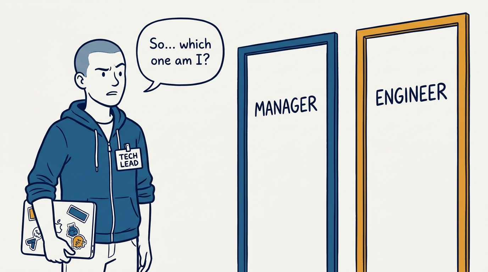
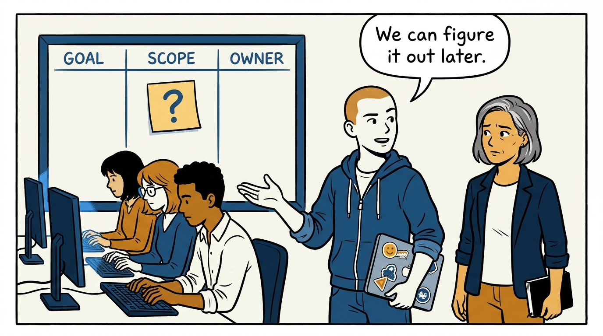
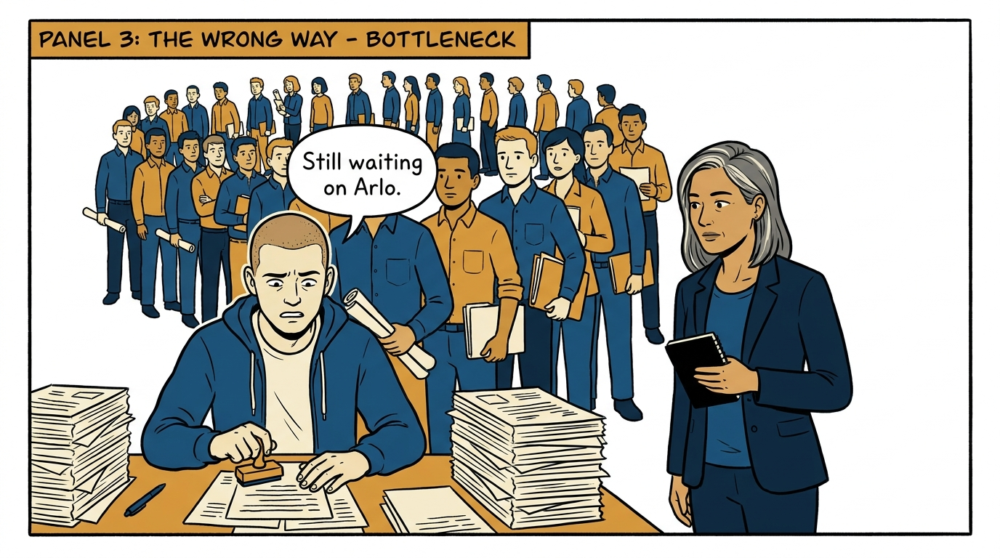
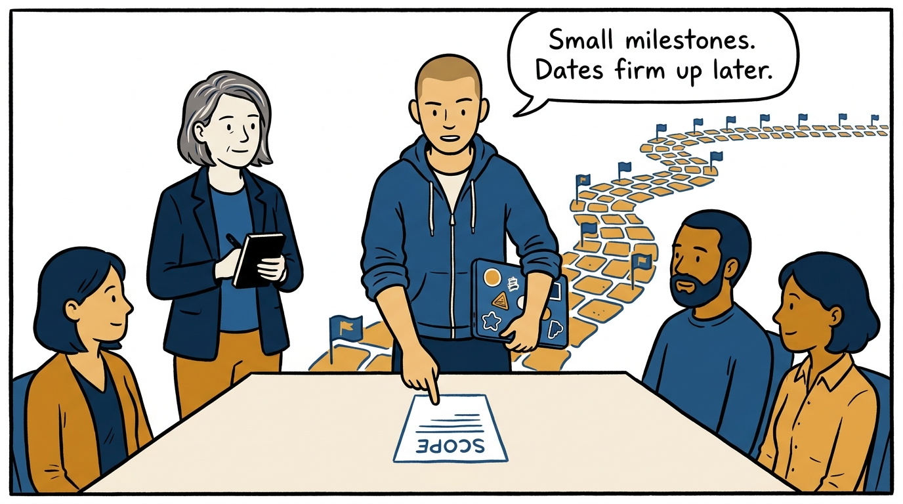
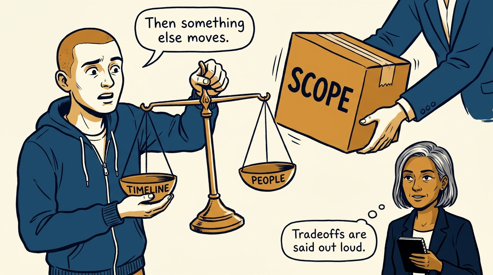

Why a tech lead is neither a junior manager nor a superior engineer — and what project leadership actually looks like — in eight panels.

<!-- comic-style
{
  "cast": "VERA: a calm, seasoned engineering executive, short gray-streaked hair, dark blazer over a plain t-shirt, carries a small black notebook. ARLO: an eager early-career engineer climbing the ladder — in some strips a new lead or manager, in others the engineer being coached — buzz-cut hair, zip-up hoodie with rolled sleeves, sticker-covered laptop under one arm.",
  "style": "Clean two-tone explainer comic, thick ink outlines, flat colors with deep blue and amber accents on a light background, generous white space, hand-lettered speech bubbles with SHORT readable text, no photorealism."
}
-->

**Panel 1:** *The hook: tech lead is not a junior manager and not a superior engineer — so what is it?*

**Panel 2:** *The problem: a project without a goal, a written scope, and an owner is not early — it is already failing quietly.*

**Panel 3:** *The wrong way: centralizing every decision until the whole team queues behind the lead.*

**Panel 4:** *The principle: accountable for the project succeeding, hands-on enough to understand the system and set its quality bar.*

**Panel 5:** *How it runs: start with a real kickoff and written scope, then ship small milestones — estimates are forecasts that firm up as they land.*

**Panel 6:** *The mechanic: when scope grows, timeline, staffing, or quality moves — and the tech lead says so at that moment, out loud.*

**Panel 7:** *The discipline: risks are worked, not hoped away — prototypes for the unknowns, and a direct conversation before any escalation.*

**Panel 8:** *The closer: the job is to make the team succeed — not to make the team dependent on the lead.*
