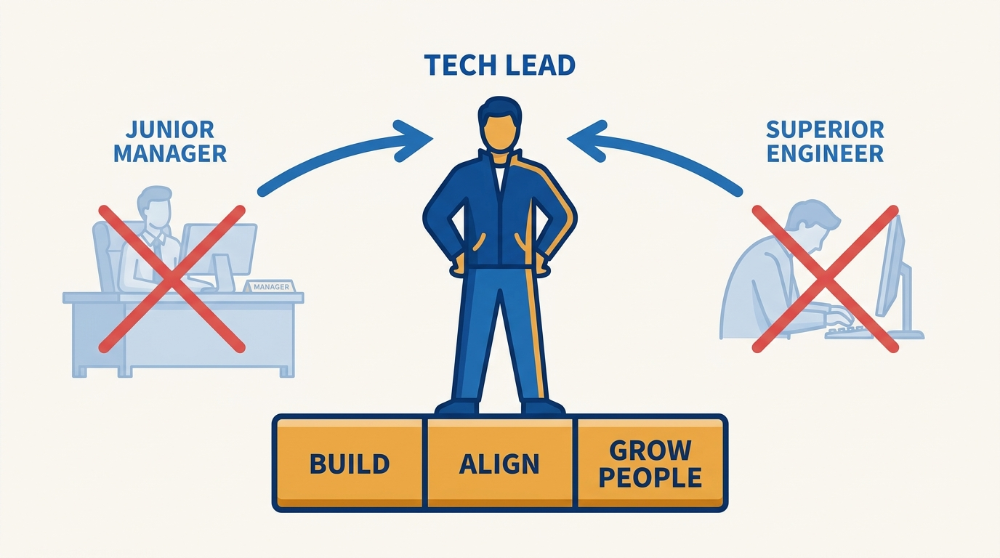
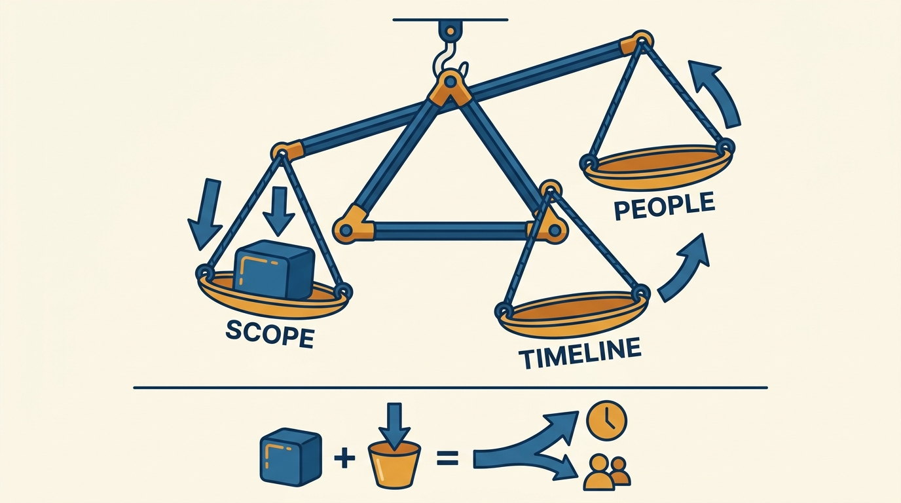
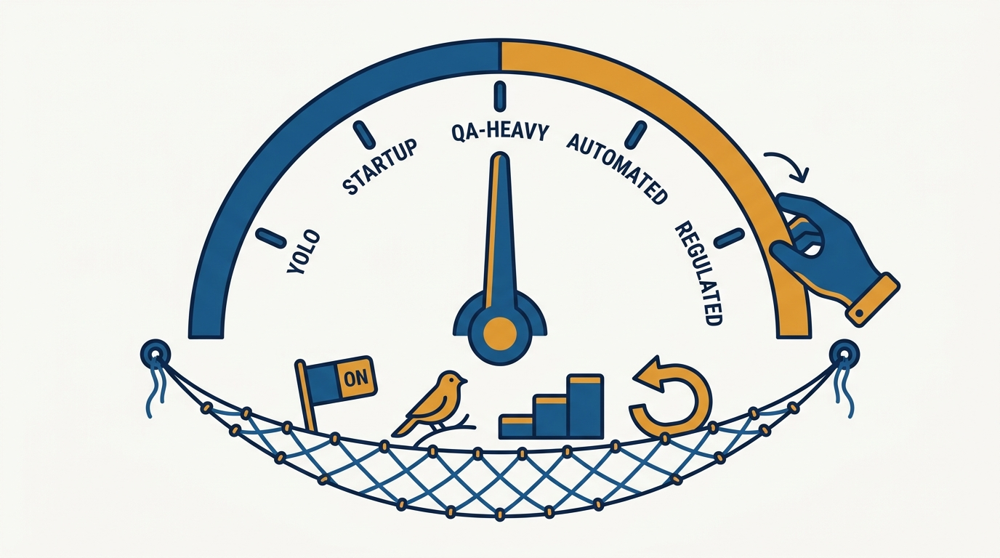

> **Status**: DRAFT
>
> **Principle**: A tech lead is not a junior manager and not a superior engineer — they are accountable for a project succeeding while staying hands-on enough to understand the system and set its quality bar. The disciplines: clarify the role, start with a real kickoff and written scope, ship small milestones with estimates as forecasts, respect the physics binding scope, timeline, and people, work risks through prototypes and direct conversation, match releases to the product's risk, keep stakeholders unsurprised, and close projects properly. The job is to make the team succeed — not to make the team dependent on the lead.

## Statement

The expectations I hold tech leads to:

- **The role is clarified before it is exercised.** Whether "tech lead" is a formal title, an informal role, or a project responsibility is established; my expectations of the lead are explicit; the split between building software, strategy and alignment, and helping people grow is deliberate; the lead stays hands-on enough to understand the system and set a quality bar, does not act like a manager unless that responsibility is explicitly theirs, and never becomes the bottleneck everyone waits on.
- **Projects start well or not at all.** A clear business goal, an explicit problem, a written scope, a named owner; a kickoff before major work that aligns stakeholders on why, what, how, and when; the proposal circulated and reviewed beforehand; open questions captured before implementation starts — followed by an engineering kickoff covering architecture, APIs, data, infrastructure, and operations, with decisions written down.
- **Milestones are small and estimates are forecasts.** The project broken into shippable milestones that validate progress every few weeks or sooner; risks that could change the estimate visible; dates not locked in before engineering planning is done; when the business needs a fixed date, scope and quality tradeoffs discussed explicitly; stakeholders taught that dates firm up as milestones land.
- **Software project physics are respected.** Scope, timeline, and people considered together: when scope grows, timeline, staffing, quality expectations, or scope elsewhere must adjust; added people cost onboarding and coordination before they add speed; changes are communicated, never hidden until they become crises.
- **Risks and dependencies are worked, not hoped away.** Technology risk mitigated with prototypes, spikes, and simpler alternatives; upstream and downstream teams told what is needed and what will change; direct engineer-to-engineer conversation before escalation; work not started while the "why" or "what" is still unclear.
- **Releases match the product's risk.** The release approach chosen consciously on the spectrum from YOLO shipping to highly regulated; changes verified before release (review, tests, CI, monitoring, on-call ownership, runbooks); safety nets — flags, canaries, staged rollouts, easy rollback — used where appropriate; any bypassed process bypassed intentionally, with stakeholders informed and incidents handled blamelessly.
- **Stakeholders are unsurprised and the team is healthy.** Stakeholders identified broadly, kept informed through regular updates that become a shared source of truth; roles and on-call ownership clear; the team's focus protected from vague urgent interruptions; team health watched — psychological safety, engagement, conflicts addressed early — and problems escalated to me with suggested solutions, not surprises.
- **Projects are closed properly.** "Done" defined and agreed; a final update written; contributors recognized; learnings captured in a retrospective before the team moves on.

## How to Read This

This journal is my engineering-management operating model; this record is the tech-lead stage of the engineer career ladder seen from the manager's side — the project-leadership expectations I hold an engineer to when they lead a project or a team's execution without managing people. It is grounded in the Pragmatic Tech Lead chapters of Gergely Orosz's *The Software Engineer's Guidebook* (Pragmatic Engineer, 2023). The management-ladder view of the same rung — the tech lead as a first step on the manager's path — is the separate record [[tech-lead]]; this one is the engineer's side. The checklist I hand the tech lead lives in the **Checklist** tab.

## Rationale

**Tech lead is a role about outcomes, not a rank — and ambiguity about the role is the first project risk.** Most tech-lead failures I have seen begin before the project does: the engineer does not know whether they hold a title, a temporary responsibility, or a vague expectation, so they either under-lead (staying a senior engineer with a nicer name) or over-lead (acting like a manager without the mandate). So the first expectation is clarification — with me: what I expect, where their time should go across building, aligning, and growing people, and what is explicitly not theirs. The two standing constraints: stay hands-on enough to understand the system and set the quality bar, and never become the decision bottleneck the whole team queues behind. The seat also carries a quieter duty: watching team health — psychological safety, engagement, conflicts caught early — and bringing problems to me with suggested solutions rather than letting them surface as surprises.

**Figure 1:** *The role sits between two wrong models: not a junior manager, not a superior engineer — a deliberate split across building, aligning, and growing people.*

**Most project failures are visible at kickoff — which is why I inspect beginnings, not just endings.** A project without a clear business goal, an explicit problem, and a written scope is not early; it is already failing quietly. The kickoff discipline — proposal circulated before the meeting, stakeholders across product, engineering, design, data, and business reviewing the plan, open questions captured before implementation — is cheap insurance against the expensive kind of surprise. The engineering kickoff is its twin on the technical side: the team discusses the approach, covers architecture through operations, writes decisions down, and includes dependent engineering teams early. When a project drifts later, the root cause is usually findable in a kickoff that skipped one of these.

**Scope, timeline, and people form a physics you cannot negotiate with.** When scope increases, at least one of timeline, staffing, quality expectations, or scope elsewhere must move; when the timeline shrinks, scope shrinks or capacity grows; when people leave, the plan changes. Adding people is not free speed — onboarding and coordination costs arrive first. I hold tech leads accountable for stating these tradeoffs out loud to stakeholders at the moment they occur, because the alternative — absorbing the change silently and hoping — converts a manageable adjustment into a late crisis. The same physics govern estimates: they are rough forecasts that become reliable as milestones land, which is exactly why milestones must be small enough to validate progress every few weeks or sooner.

**Figure 2:** *Project physics: scope, timeline, and people are one linked system — when one moves, something else must, visibly.*

**Risk work is prototypes and conversations, not registers.** The risk disciplines in the source are strikingly concrete: prototype unfamiliar technology, split unknowns into spikes, prefer simpler alternatives to unstable tools; tell upstream teams what you need and downstream teams what will change; talk directly to the teams you depend on, offer to do the work yourself where appropriate, mock or stub the dependency, remove it from the critical path — and escalate only after engineer-to-engineer communication has been tried. I coach tech leads toward exactly this posture: a risk that has a prototype, a named contact, or a fallback is being managed; a risk that has only a slide is being watched.

**The release process is a dial, and turning it consciously is the tech lead's job.** YOLO shipping, startup-style releases, QA-heavy processes, large-tech automation, regulated pipelines — none is universally right; what is wrong is inheriting one by accident. I expect tech leads to know the product's cost of bugs and need for feedback speed, and to set verification and safety nets accordingly: review, tests, CI, monitoring, on-call ownership, runbooks before rollout; flags, canaries, staged rollouts, and easy rollback where changes are risky. Pragmatic risk-taking is welcome under one condition — that it is conscious: bypassed process is bypassed intentionally, stakeholders and support know what may happen, a rollback plan exists, and incidents are handled blamelessly and measured.

**Figure 3:** *The release process is a dial, not a default: choose the setting by the product's risk, and string the safety nets underneath.*

## What This Means in Practice

| What this record says | What it does **not** say |
| --- | --- |
| The tech lead stays hands-on: planning, writing, reviewing code, supporting releases, joining on-call where appropriate. | The tech lead is the team's best coder who takes the hardest tasks — leading by example is not hoarding the interesting work. |
| The role's mandate is explicit, agreed with me. | The tech lead manages people — not unless that responsibility is explicitly theirs. |
| Estimates are forecasts that firm up as milestones land. | Dates are commitments made at kickoff — locking dates before engineering planning is the anti-pattern, not the discipline. |
| When scope, timeline, or people change, something else moves — visibly. | The lead absorbs changes to protect stakeholders from bad news — hiding the tradeoff until it becomes a crisis. |
| Escalate dependency problems after direct engineer-to-engineer contact. | Escalation is the first move — most dependency friction dissolves in one direct conversation. |
| Choose the release approach by the product's risk, with safety nets. | One correct release process exists — YOLO shipping and regulated pipelines are both legitimate at the right ends of the dial. |
| The lead empowers the team and removes blockers. | The project depends on the lead — success that evaporates when the lead is away is a failure of the role. |

Concretely: when an engineer steps into a tech-lead role on my watch, our first conversation covers the mandate (title, scope, time split, what is not theirs); my project reviews ask for the written scope, the next milestone, the top risks with their mitigations, and the last stakeholder update — and when a project ends, I look for the final update and the retrospective before I call it closed.

## Anti-Patterns

- **The undefined lead.** Stepping into the role without clarifying whether it is a title, a responsibility, or a hope — then improvising a mandate no one agreed to.
- **The bottleneck.** Centralizing every decision so the team queues behind the lead — the opposite of the empowerment the role exists to create.
- **The kickoff skipped.** Major work starting with no written scope, no aligned stakeholders, and open questions still open — a failure scheduled at the start and discovered at the end.
- **The absorbed scope change.** Saying yes to growing scope without moving timeline, staffing, or quality expectations — hiding the physics until they assert themselves as a crisis.
- **The date locked at kickoff.** Committing fixed dates before engineering planning is done, then treating the team's honest forecasts as underperformance.
- **Escalation as first resort.** Raising every dependency problem to managers before a single engineer-to-engineer conversation has been tried — burning goodwill both ways.
- **The unclosed project.** The team disbands, no final update is written, contributors go unrecognized, learnings evaporate — and the next project repeats the same lessons at full price.

## Related Records

- [[tech-lead]] — the same rung seen from the management ladder (Camille Fournier's *The Manager's Path*); that record is about the step toward management, this one is the engineer-side project-leadership bar.
- [[well-rounded-senior-engineer]] — the individual senior expectations this record assumes and builds on.
- [[staff-and-principal-engineers]] — where project-level leadership widens into organization-level leverage.
- [[operational-excellence]] — the operational bar (monitoring, on-call, incidents) that this record's release and safety-net expectations plug into.
- [[managing-a-team]] — my side of the pairing: what the engineering manager runs while the tech lead leads the project.

## Scope and Revisiting

This record is `draft`. It governs the expectations I hold engineers to when they lead projects as tech leads — role clarity, kickoffs, milestones and estimates, project physics, risk and dependency mitigation, releases, stakeholder management, and team structure and dynamics — and how I review projects against them. I revisit it if the organization formalizes the tech-lead role differently (title, rotation, or mandate changes), if project post-mortems repeatedly trace failures to causes this record does not cover, or if our release-engineering baseline shifts enough that the release-approach spectrum here no longer matches practice.

## Authoritative References

- Gergely Orosz, *The Software Engineer's Guidebook* (Pragmatic Engineer, 2023) — the Pragmatic Tech Lead chapters (the role, project leadership, scope/timeline/people, day-to-day project management, risks and dependencies, shipping to production, stakeholders, team structure, and team dynamics) this record distills.
