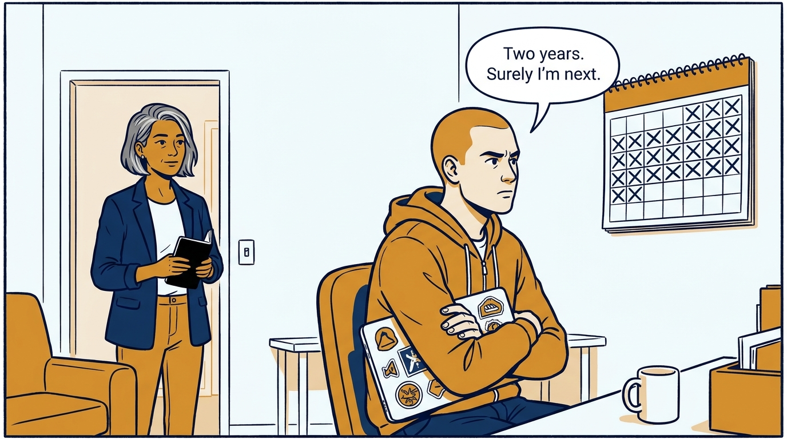
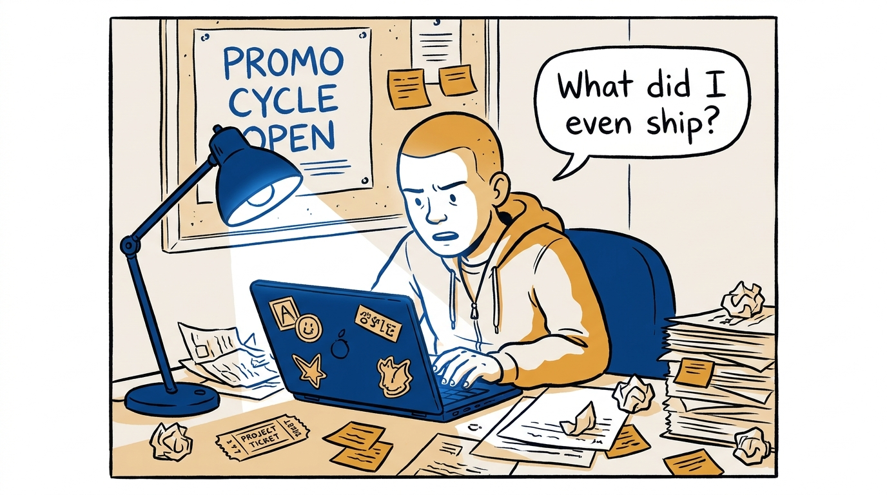
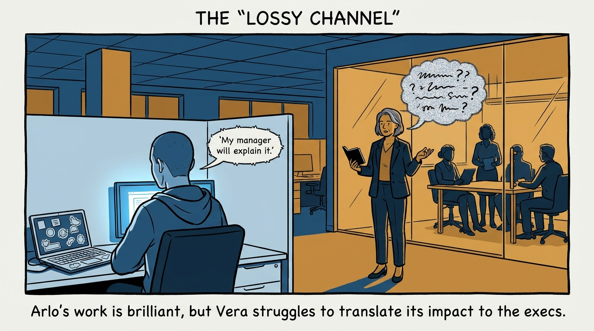
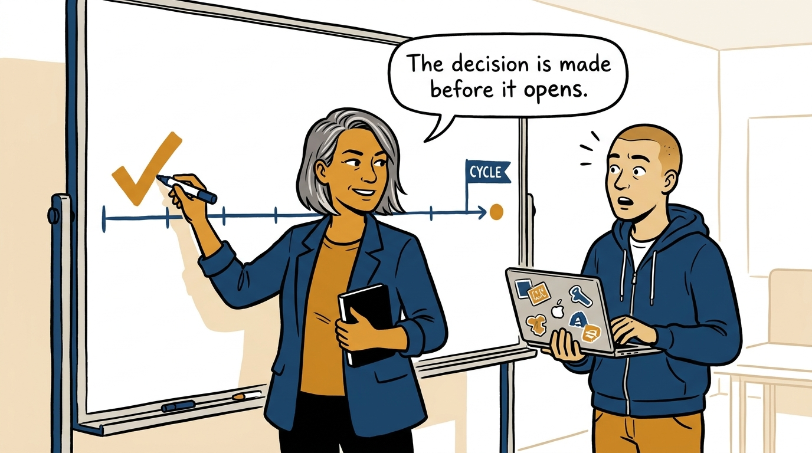
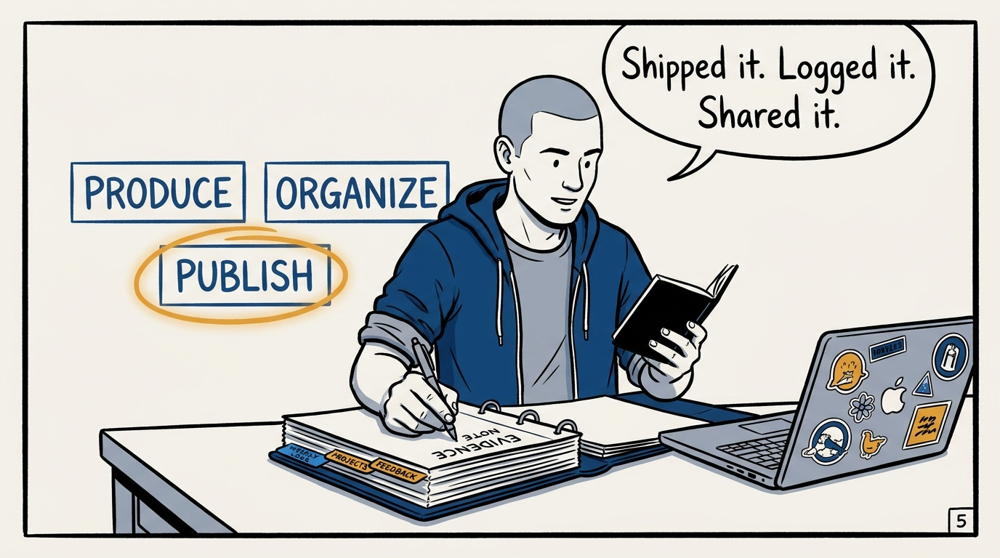
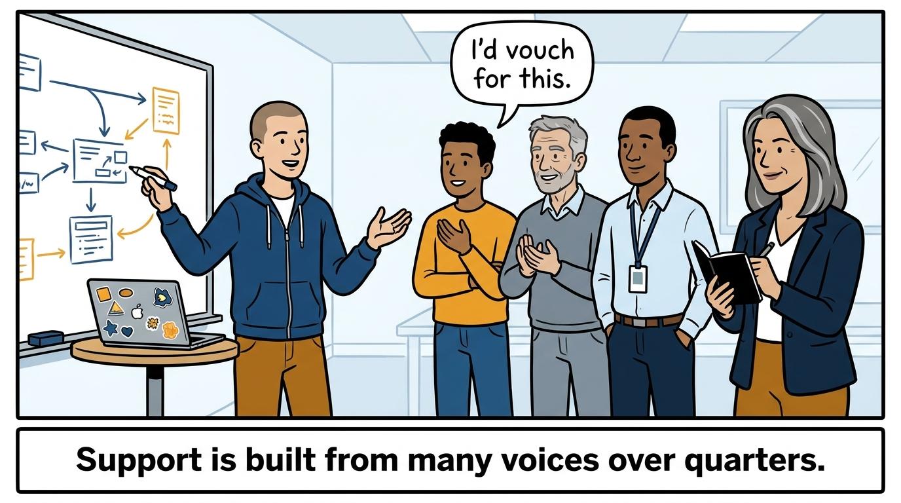
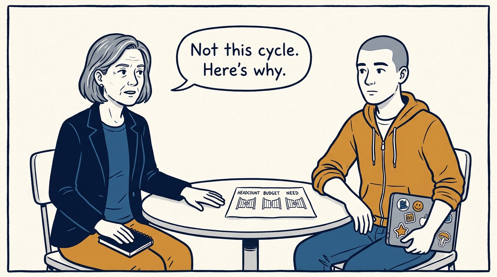
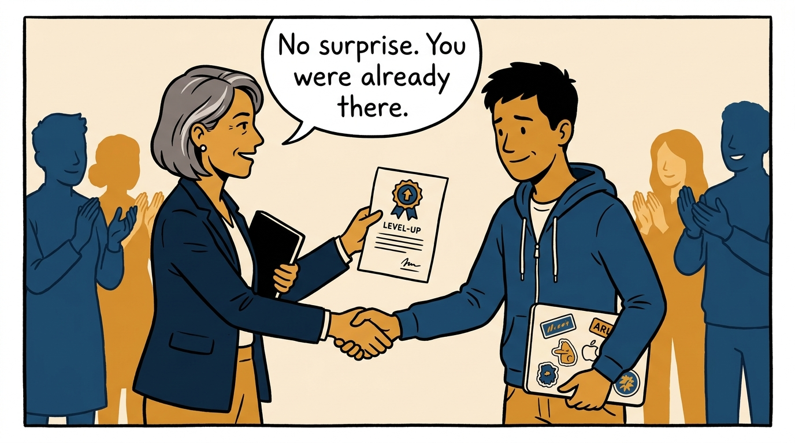

Why a promotion is won long before the cycle opens — in eight panels.

<!-- comic-style
{
  "cast": "VERA: a calm, seasoned engineering executive, short gray-streaked hair, dark blazer over a plain t-shirt, carries a small black notebook. ARLO: an engineer newly stepping into management, buzz-cut hair, zip-up hoodie with rolled sleeves, sticker-covered laptop under one arm.",
  "style": "Clean two-tone explainer comic, thick ink outlines, flat colors with deep blue and amber accents on a light background, generous white space, hand-lettered speech bubbles with SHORT readable text, no photorealism."
}
-->

**Panel 1:** *The hook: promotion treated as a reward for waiting.*

**Panel 2:** *The problem: the cycle opens and the evidence has to be reconstructed from memory.*

**Panel 3:** *The wrong way: doing excellent work in silence and leaving visibility to one lossy channel.*

**Panel 4:** *The principle: the promotion is decided on evidence assembled long before the cycle opens — and the engineer owns assembling it.*

**Panel 5:** *How it runs: track achievements continuously — produce the work, organize the team, publish the outcomes.*

**Panel 6:** *The mechanic: a case needs supporters beyond one manager — peers, seniors, and skip-levels who have seen the work.*

**Panel 7:** *The cost: headcount, budget, and approval rates are real — every candidate needs a plan for the cycle where the answer is no.*

**Panel 8:** *The closer: no promotion case should surprise either side — the title is the system catching up with reality.*
