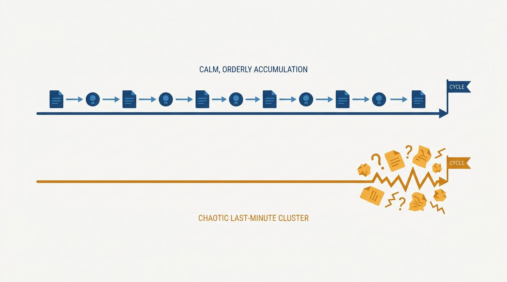
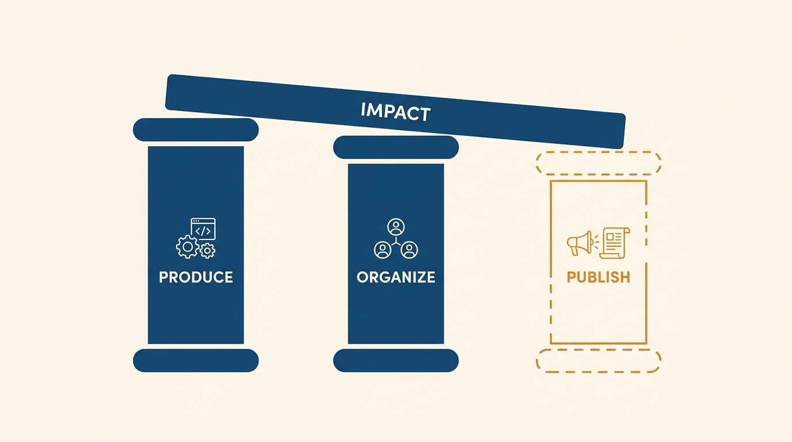
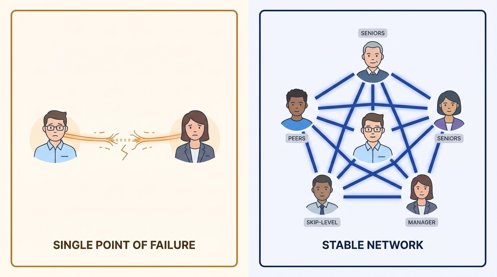

> **Status**: DRAFT
>
> **Principle**: A promotion is decided on evidence assembled long before the cycle opens — and the engineer, not the manager, owns assembling it. I expect engineers who want the next level to understand how the promotion system at their company actually works, to demonstrate next-level work before the title arrives, and to produce, organize, and publish their impact rather than relying on me to make it visible. My side of the contract: I tell them honestly where they stand, co-own a plan with milestones, recruit broader support — and I am straight about the parts neither of us controls: business need, headcount, budget, and the lower approval rates that come with senior levels.

## Statement

What I expect from engineers pursuing promotion, and what I commit to in return:

- **Know the system before you play it.** I expect engineers to understand how promotions are actually decided at our company — informal, lightweight, heavyweight, or committee-based — who influences and approves the decision, and what the expectations are at their current and next levels, including whether a terminal level exists.
- **Next-level work comes before the next-level title.** I promote people who are consistently exceeding expectations at their current level and already demonstrating the work expected at the next one, with impact visible beyond their immediate tasks.
- **The case is built from evidence, continuously.** I expect a clear record of major projects, outcomes, and impact — tracked weekly, monthly, or quarterly — backed by artifacts: design docs, postmortems, launch notes, metrics, feedback. The work must connect to something the business cares about: revenue, cost, reliability, productivity, customer impact.
- **Produce, organize, publish.** Producing high-quality work is a third of the job. I also expect engineers to organize — improve processes, coordinate groups, help teams execute — and to publish: share progress, outcomes, and learnings through 1:1s, docs, demos, and internal posts. Nobody should rely only on their manager to make their impact visible.
- **Support is secured early, and it is broader than me.** I expect engineers to ask where they stand and what gaps remain well before the cycle, and to build support from peers, senior engineers, and skip-level leaders who understand their impact — earned partly by helping others succeed.
- **I co-own the plan and the honesty.** When an engineer names a promotion goal, they get a straight answer on whether the path is realistic, an actionable plan with milestones, and a manager who can clearly explain their impact to others. No promotion case on my team should surprise either of us.
- **Realism is part of the deal.** Promotion is not guaranteed. Business need, headcount, and budget gate it; senior-level promotions have lower approval rates. I expect every candidate to have a plan for the cycle where the answer is no.

## How to Read This

This journal is my engineering-management operating model. This record is grounded in the Promotions chapter of Gergely Orosz's *The Software Engineer's Guidebook* (2023), read from the manager's side of the table: the book tells engineers how to earn a promotion; this record states what I expect engineers to bring to a promotion case and how I coach them through it. The runnable version — the checklist I hand an engineer who wants the next level — lives in the **Checklist** tab of this post.

## Rationale

**The promotion decision is made before the cycle opens.** By the time a packet reaches a committee or a calibration meeting, the evidence either exists or it doesn't. An engineer who starts assembling their case when the cycle is announced is writing fiction under deadline; an engineer who has tracked achievements and kept artifacts all along is writing a summary. That is why I push evidence-keeping as a continuous habit, not a cycle-time scramble — and why preparation "well before the promotion cycle begins" is a checklist item, not a nice-to-have.

**Figure 1:** *By the time the cycle opens, the evidence either exists or it doesn't — continuous tracking writes a summary; the scramble writes fiction.*

**Demonstrated next-level work is the only argument that survives scrutiny.** Every credible promotion system asks the same question: is this person already operating at the next level? Potential, loyalty, and tenure do not survive a committee's skepticism; a record of next-level work does. So I coach engineers to close the gap in the work first — visible impact beyond their own tasks, a clear line from their work to business or organizational value — and treat the title as the system catching up with reality.

**Visibility is the engineer's job, and "publish" is the neglected verb.** The source splits impact into produce, organize, and publish, and in my experience the third is where strong engineers stall. Managers change, forget, and summarize badly; a manager is a lossy channel for someone else's impact. An engineer who shares outcomes and learnings through docs, demos, and internal posts gives every decision-maker direct evidence — and gives me, at packet-writing time, material instead of memories.

**Figure 2:** *Producing is a third of the job: impact stands on produce, organize, and publish — and publish is the pillar most strong engineers leave half-built.*

**A promotion case needs more supporters than one manager.** Whoever approves the promotion — a skip-level, a director, a committee — will weigh voices other than mine. Peer endorsements, senior engineers who have seen the work, skip-levels who recognize the name: that support is built over quarters, largely by helping others succeed and contributing to work that benefits the whole team. I tell engineers plainly: if I am the only person who can explain your impact, your case is fragile.

**Figure 3:** *If one manager is the only person who can explain the impact, the case is fragile — support is a network built over quarters, not a single channel.*

**Honesty about the odds protects the career, not just the cycle.** Headcount, budget, and business need gate promotions regardless of merit, and approval rates fall at senior levels. Pretending otherwise sets people up to read a "no" as betrayal. So I keep two things true at once: an actionable plan with milestones, and an explicit understanding that promotion is not the only measure of success. The engineers who last are the ones investing in breadth, depth, and judgment that pay off regardless of when the title lands — without letting level define their self-worth or burning relationships to advance faster.

## What This Means in Practice

| What this record says | What it does **not** say |
| --- | --- |
| The engineer owns building the evidence and the visibility. | The engineer is on their own — I co-own the plan, the honesty, and the advocacy. |
| Next-level work must be demonstrated before the promotion. | The bar is perfection — it is consistent next-level performance, visible beyond one's own tasks. |
| Publish your work; don't rely only on your manager. | Self-promotion theater — publishing means sharing real outcomes and learnings, not noise. |
| Build support from peers, seniors, and skip-levels. | Politics over substance — support is earned by helping others succeed and doing team-level work. |
| Headcount, budget, and approval rates are real constraints. | A "no" means the work was wasted — the skills and evidence carry into the next cycle or the next role. |
| Have a plan for not being promoted this cycle. | Accept a stalled path indefinitely — a system that never promotes ready people is a signal too. |

Concretely: every engineer on my team who wants the next level has had the straight conversation about where they stand, has a written plan with milestones, keeps a running record of achievements and artifacts, and can name people beyond me who would speak for their work. When a cycle ends in a no, we both already know why, and the plan for the next cycle exists before the disappointment fades.

## Anti-Patterns

- **Waiting to be noticed.** Doing excellent work in silence and treating visibility as the manager's job — the packet then rests on one lossy channel.
- **The cycle-time scramble.** Starting to gather evidence when the promotion cycle is announced, and reconstructing a year of impact from memory and closed tickets.
- **Promotion as the only scoreboard.** Making the title the sole measure of success, so every cycle without one reads as failure and self-worth tracks level.
- **Burning relationships to advance.** Grabbing scope, hoarding credit, or elbowing peers — buying one level at the price of the support the next one requires.
- **The falsely encouraging manager.** Telling an engineer they are "close" every cycle without naming gaps, headcount limits, or the real approval odds at senior levels.
- **Confusing tenure with readiness.** Arguing years-at-level instead of next-level evidence — no credible system promotes on waiting.
- **Ignoring the system's shape.** Building a case for the process you wish existed — informal where it's committee-based, evidence-light where it's heavyweight — instead of the one that will actually judge it.

## Related Records

- [[own-your-career]] — the general career-ownership contract; this record is the specific case of converting ownership into a promotion case.
- [[performance-review-cycle]] — the recurring review cycle whose ratings and feedback are the raw material a promotion case is built from.
- [[changing-jobs]] — when the honest answer is that the path here is blocked, the move is the alternative; promotion odds versus external offers is a real comparison.
- [[engineering-career-paths]] — the ladder and terminal-level context a promotion campaign runs inside.
- [[career-conversations]] (people journal) — the conversation where a promotion goal first surfaces with the motivational context behind it.

## Scope and Revisiting

This record is `draft`. It governs how promotion cases are built and coached on my teams: the evidence expectations, the produce-organize-publish discipline, the support structure, and the honesty about constraints. I revisit it if the company's promotion process changes shape (informal to committee-based, or the reverse), if an engineer on my team is surprised by a promotion outcome — which means the honesty loop failed — or if I notice ready engineers stalling for multiple cycles on headcount alone, which is a signal about the organization rather than the candidates.

## Authoritative References

- Gergely Orosz, *The Software Engineer's Guidebook* (2023) — the Promotions chapter this record distills, via its companion checklist.
