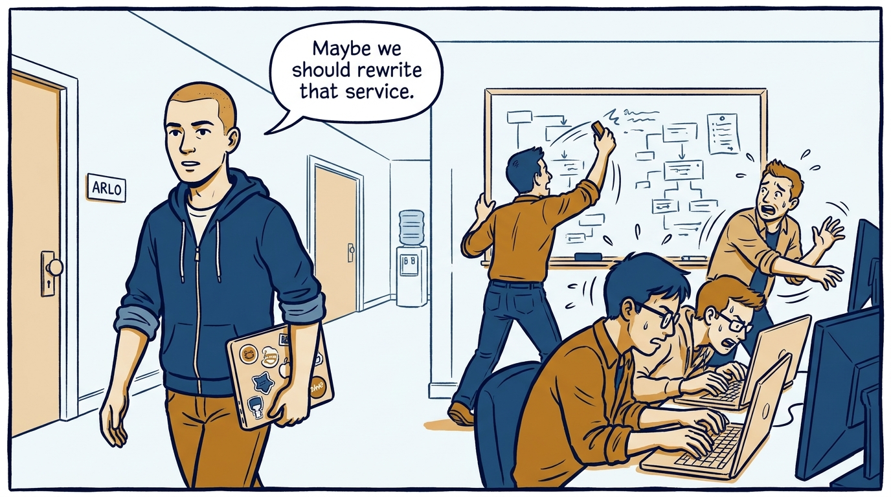
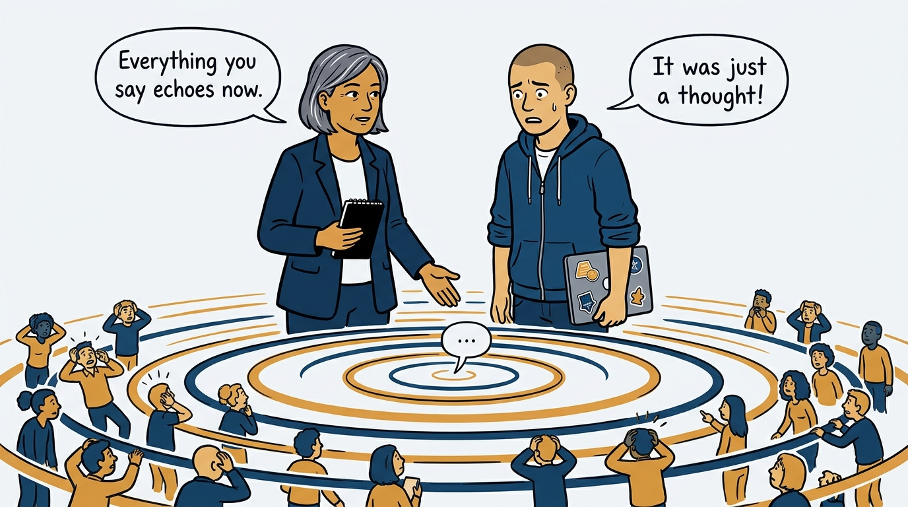
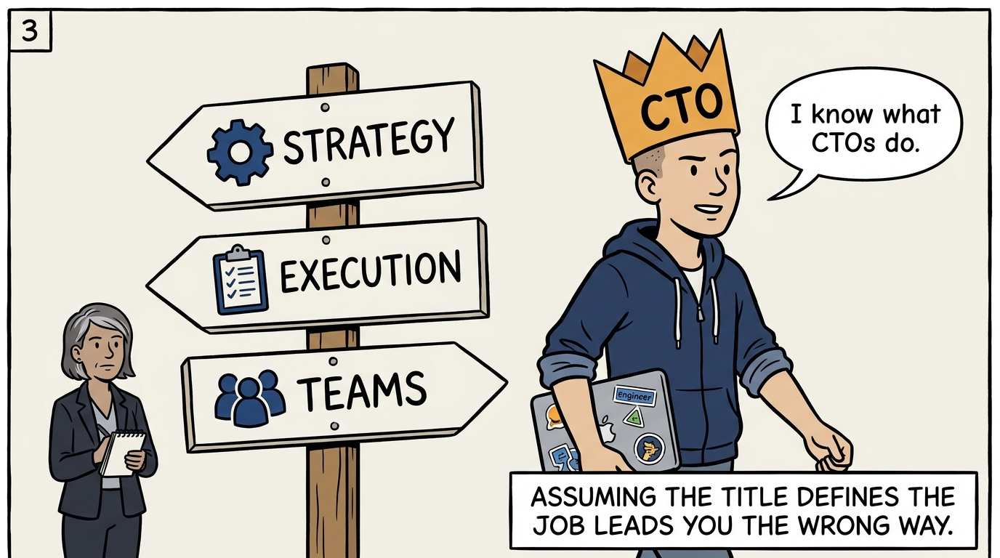
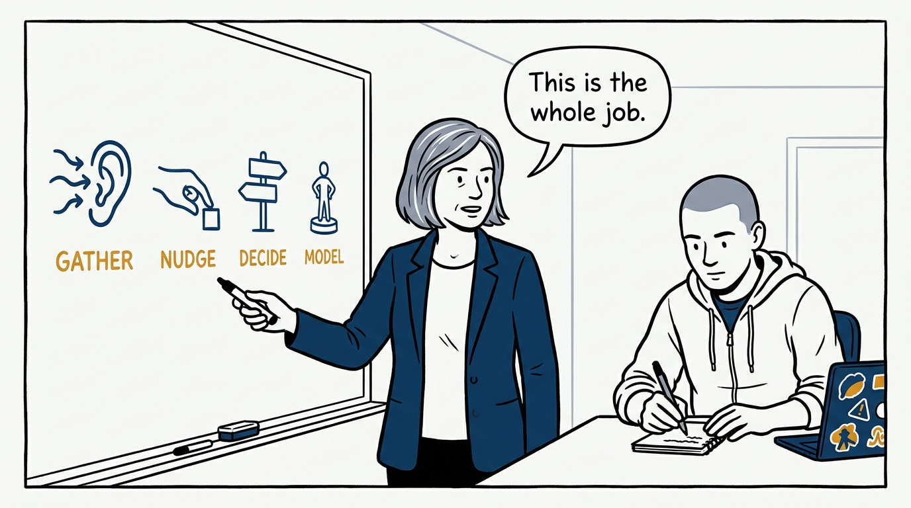
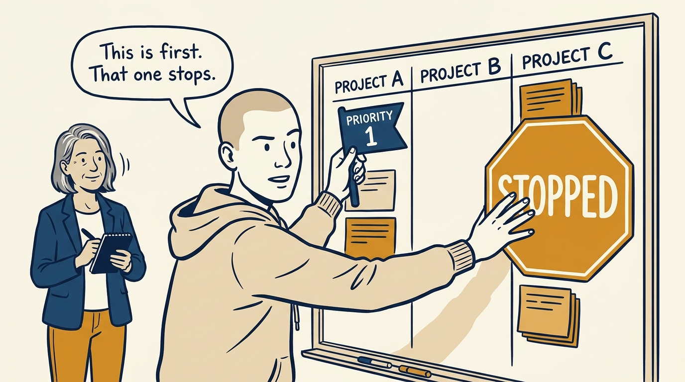
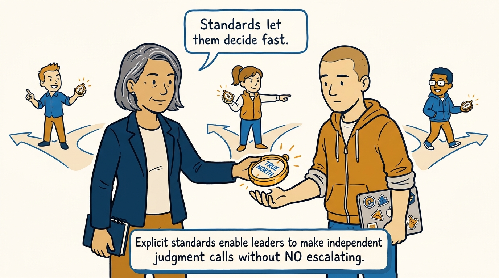
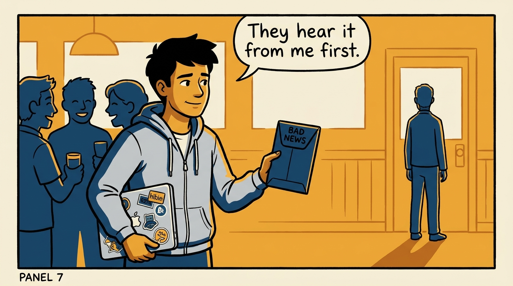
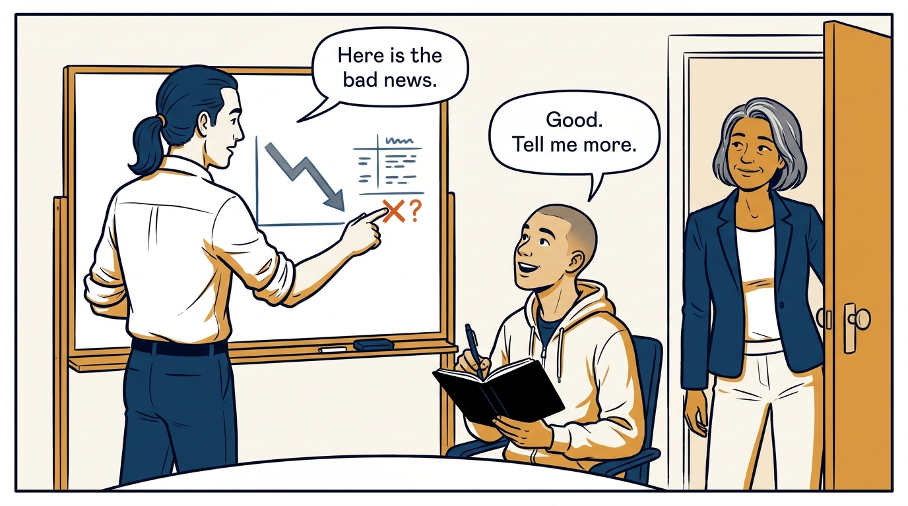

Why everything a senior leader says and does echoes — and why discipline in words, priorities, and trust is the job itself — in eight panels.

<!-- comic-style
{
  "cast": "VERA: a calm, seasoned engineering executive, short gray-streaked hair, dark blazer over a plain t-shirt, carries a small black notebook. ARLO: an eager early-career engineer climbing the ladder — in some strips a new lead or manager, in others the engineer being coached — buzz-cut hair, zip-up hoodie with rolled sleeves, sticker-covered laptop under one arm.",
  "style": "Clean two-tone explainer comic, thick ink outlines, flat colors with deep blue and amber accents on a light background, generous white space, hand-lettered speech bubbles with SHORT readable text, no photorealism."
}
-->

**Panel 1:** *The hook: at the top, a casual hallway comment redirects a team's week.*

**Panel 2:** *The problem: everything a senior leader says carries extra weight — a vented anxiety becomes the organization's anxiety by Friday.*

**Panel 3:** *The wrong way: assuming the title is the job — doing what it meant at the last company instead of what this company needs.*

**Panel 4:** *The principle: the job reduces to four tasks — gather and synthesize, nudge rather than command, decide on incomplete inputs, model the values.*

**Panel 5:** *How it runs: change priorities cleanly — confirm the shift, decide out loud what stops, and repeat the message until it lands.*

**Panel 6:** *The mechanic: a written True North — explicit standards and risk analysis — lets leaders decide fast without escalating everything upward.*

**Panel 7:** *The cost: bad news is delivered personally — never by broadcast, never a message you cannot stand behind.*

**Panel 8:** *The closer: build trust, not fear — when people can safely tell you the truth, the four tasks finally work.*
