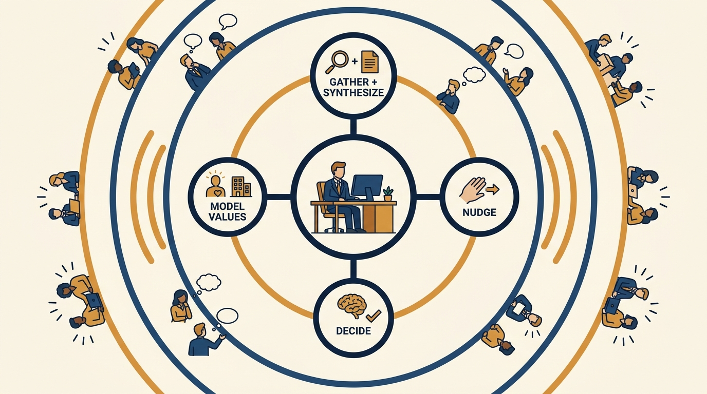
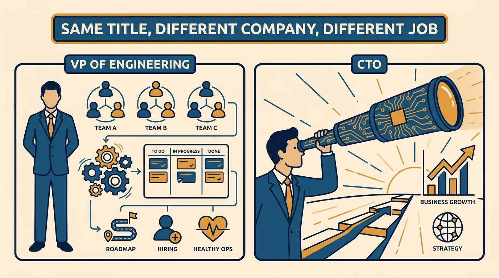
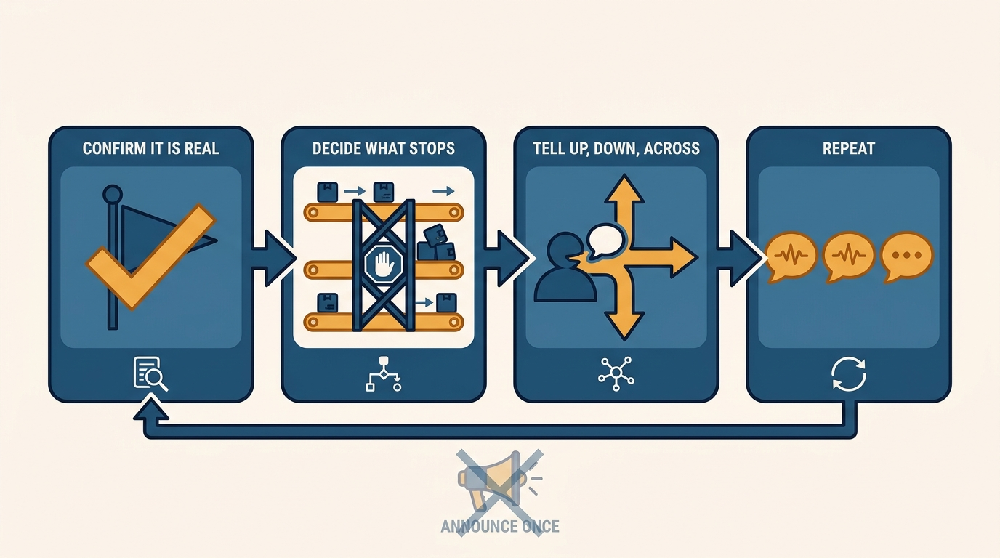

> **Status**: DRAFT
>
> **Principle**: At the top of the engineering ladder the job reduces to four core tasks — gathering and synthesizing information, nudging instead of over-commanding, deciding from conflicting and incomplete inputs, and role-modeling the company's values — and all four run through an echo: everything a senior leader says and does carries extra weight. A casual comment redirects work; a dumped anxiety multiplies through the organization; an undefined standard becomes whatever each team improvises. So I treat discipline in communication, priorities, and trust not as executive polish but as the work itself, and I never assume my title tells me what my job is — I clarify the role, match my time to the company's actual stage, and reassess as it grows.

## Statement

My commitments as a senior engineering leader — and what I hold anyone in a VP-of-Engineering or CTO seat accountable for:

- **Lead first.** I set the tone for how people act, think, and work together; I am explicit about what the organization should value; I make hard decisions without waiting for perfect information; and I hold people and teams accountable for outcomes. I disagree when needed, then commit once a decision is made.
- **Do the four core tasks deliberately.** I gather information from meetings, docs, 1:1s, and stakeholders; synthesize it quickly; share the right information with the right people in a usable form; nudge instead of over-commanding; decide from conflicting and incomplete inputs; and role-model the company's values and commitments.
- **Know which job I actually have.** I clarify whether the role is primarily R&D, strategy, organization, execution, external-facing, infrastructure, or business-oriented — titles do not mean the same thing at every company — and I match my time to the real needs of the company's stage, reassessing as it grows.
- **Change priorities without chaos.** Before demanding a shift I confirm the true top priority, explicitly decide what will stop, slip, or be deprioritized, communicate up, down, and across, and repeat the key messages more than once.
- **Set strategy from evidence and judgment.** I research the team, systems, bottlenecks, and business direction; talk to executives, peers, and engineers before drafting; think about architecture, team structure, and future business needs together; and make strategy forward-looking, not just reactive.
- **Deliver bad news personally and honestly.** No impersonal mass messages for sensitive news; key individuals hear it first; and I never deliver a message I fundamentally cannot stand behind alone.
- **Respect the echo.** Everything I say and do at this level carries extra weight, so I model the behavior I want copied, keep casual comments and vented anxieties out of circulation, and detach enough to lead clearly and fairly — without stopping being human.
- **Build trust, not fear.** I get curious before reacting, treat disagreement as information rather than disloyalty, apologize honestly when I mess up, and hold people accountable without humiliating them — because people who fear me tell me what is safe, not what is true.
- **Define my function's True North.** I am explicit about what excellence means, use risk analysis instead of absolutism, protect quality, readiness, and operational standards, and teach my leaders to make fast decisions using these principles.

## How to Read This

This journal is **my engineering-management operating model**, each record grounded in one source. This record distills the "Big Leagues" chapter of Camille Fournier's *The Manager's Path* (O'Reilly, 2017) — the senior-leadership rung: the four core tasks, the VP-of-Engineering and CTO role shapes, changing priorities, strategy, bad news, the nontechnical boss, senior peers, the echo of leadership, trust, and True North. I write it as an executive who occupies this rung and holds others to it. The runnable version lives in the **Checklist** tab.

## Rationale

**The job compresses into four tasks because everything else is delegated.** By this level I no longer write the code, run the projects, or manage most of the people directly. What remains is **what cannot be delegated**: gathering and synthesizing large amounts of information, moving it to the right people in a usable form, making decisions from conflicting and incomplete inputs, and being the living example of what the company says it values. Fournier's point is that this is the whole job — and each task done badly **fails silently**, because nobody reviews an executive's synthesis or grades their nudges.

**Figure 1:** *The four core tasks are the whole job — and all four run through an echo that amplifies everything the leader says and does.*

**Titles are not job descriptions, so I clarify the role instead of assuming it.** A CTO at one company is a hands-on architect; at another, a business strategist with no reports. A VP of Engineering owns day-to-day execution and operational health, tracks multiple initiatives without losing the details, aligns roadmap, hiring plan, and team structure, and coaches managers — a job of **management strength backed by technical credibility**. A CTO's job is **business strategy seen through the lens of technology**: focused on the company's current stage, keeping enough management influence to move the organization, and protecting the tech team from becoming a feature factory for others. Taking either seat without clarifying which shape the company actually needs — and reassessing as it grows — is how senior leaders fail while working hard.

**Figure 2:** *VP and CTO are different jobs: one owns day-to-day execution and operational health, the other sees business strategy through technology — and neither title means the same thing at every company.*

**Priority changes and bad news are where senior communication is really tested.** Anyone can communicate good news and stable plans. When priorities shift, I confirm the shift is real, **decide explicitly what stops or slips**, push for clarity on tradeoffs and in-flight work, and repeat the message until everyone shares the same understanding of reality — because a priority change communicated once is a priority change most of the organization never heard. When the news is bad, it goes to key individuals first, personally, honestly about likely outcomes, through trusted lieutenants or HR where appropriate — and I ask myself how I would want to hear it. A message I fundamentally cannot stand behind alone is a message I do not deliver. The same discipline runs upward and sideways: with a nontechnical boss I arrive with a clear agenda, bring solutions rather than problems, and repeat important issues until they land; with senior peers I disagree directly and kindly in the room, then present **a united front** once the decision is made.

**Figure 3:** *A priority change is a pipeline, not an announcement: confirm it, decide explicitly what stops, communicate in every direction, and repeat until everyone shares the same reality.*

**Everything I say echoes, so detachment is a kindness, not a coldness.** My words carry extra weight now: a casual comment in a hallway redirects a team's week; over-socializing with a few reports reads as favoritism to everyone else; an anxiety I vent becomes the organization's anxiety by Friday. The echo does not mean going silent — it means **modeling the behavior I want copied**, staying human and caring without slipping back into "buddy" mode, and detaching enough to lead clearly and fairly.

**Trust, not fear, is what makes the rest work — and True North is what makes it fast.** If people are afraid to take risks around me, my information-gathering is already broken: I hear **what is safe, not what is true**. So I get curious before reacting, treat disagreement as information rather than disloyalty, apologize honestly and briefly when I mess up, and hold people accountable without humiliating them. On top of that trust I define a True North for my function — explicit standards for judgment calls, risk analysis instead of absolutism, a clear line on which risks are acceptable and when — so my leaders can make **fast decisions using shared principles** instead of escalating everything to me.

## What This Means in Practice

| What this record says | What it does **not** say |
| --- | --- |
| The senior job is the four core tasks: gather, synthesize, nudge, decide, model. | The senior leader stays the best engineer in the room — technical depth serves credibility, not day-to-day output. |
| Clarify the real shape of the role; titles differ across companies. | VP and CTO are interchangeable — **they are different jobs**, and a company may need one, both, or a different split. |
| Nudge instead of over-commanding. | Never decide — I make hard calls without waiting for perfect information, and hold people accountable for outcomes. |
| Repeat priority changes until everyone shares the same reality. | Announce once and assume alignment — **repetition is the mechanism**, not a failure of the first message. |
| Deliver bad news personally, key individuals first. | Carry every message alone — trusted lieutenants, managers, and HR are legitimate channels when appropriate. |
| Detach enough to lead clearly and fairly. | Stop being human — I stay caring and connected without slipping into buddy mode or favoritism. |
| Define a True North and teach leaders to decide with it. | Absolutism — the standards run on risk analysis, and they are revisited as the company and systems evolve. |

Concretely: I can **name which shape my current role is** and how I spend my time against it; my last priority shift came with an explicit list of what stopped and a message repeated in more than one forum; my function has a **written True North my leaders actually use** in judgment calls; and I get coaching and a peer network outside the company, because at this level nobody inside it will fully play that role.

## Anti-Patterns

- **Assuming the title is the job.** Taking a CTO or VP seat and doing what that title meant at the last company, instead of clarifying what this company at this stage needs.
- **Commanding instead of nudging.** Issuing detailed orders into organizations I no longer see clearly, instead of setting direction and letting the people closest to the work decide.
- **The silent priority shift.** Demanding a new top priority without deciding what stops, slips, or gets deprioritized — so teams quietly keep everything and deliver nothing.
- **The mass-email bad news.** Delivering sensitive news through impersonal broadcast, so key people learn about their own situation at the same moment as everyone else.
- **Jargon at the nontechnical boss.** Burying the CEO in technical detail instead of arriving with a clear agenda, solutions rather than problems, and issues repeated until they land.
- **Undermining peers after the meeting.** Relitigating a senior peer's decision in front of the wider org instead of disagreeing directly and kindly, then presenting a united front.
- **Dumping executive anxieties on the team.** Venting the pressures of the seat downward, forgetting the echo — my worry becomes the organization's crisis.
- **Leading by fear.** Reacting before getting curious, treating disagreement as disloyalty, humiliating people in the name of accountability — and then wondering why nobody takes risks or tells me the truth.

## Related Records

- [[managing-managers]] — the rung below this one; the discipline of managing through managers is what the VP-of-Engineering shape scales up.
- [[management-101]] — the base contract with every report; the echo of leadership makes the same contract heavier, not different.
- [[operational-excellence]] — the concrete operational bar behind this record's True North commitment to quality, readiness, and operational standards.
- [[first-90-days]] (executive journal) — the ramp into a senior seat is where "know your role" is first tested against reality.

## Scope and Revisiting

This record is `draft`. It governs how I operate in senior engineering leadership roles — VP of Engineering, CTO, or equivalent — and what I hold others in those seats accountable for. I revisit it when the company's stage shifts enough that **my role shape should change and hasn't**, when a priority shift or bad-news moment goes badly enough to expose a gap in these commitments, or when the self-assessment in the Checklist tab shows I no longer understand the company's future and bottlenecks.

## Authoritative References

- Camille Fournier, *The Manager's Path: A Guide for Tech Leaders Navigating Growth and Change* (O'Reilly, 2017) — Chapter 9, "The Big Leagues," which this record's checklist distills.
