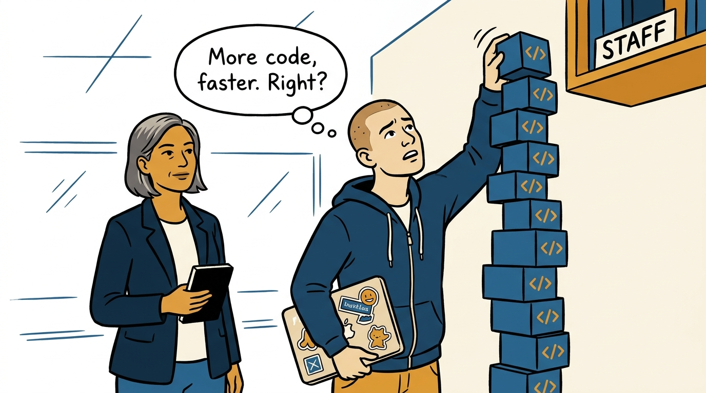
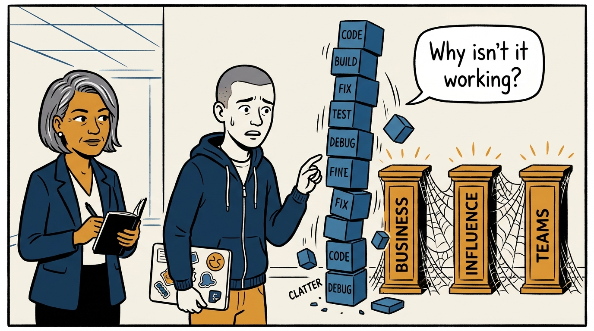
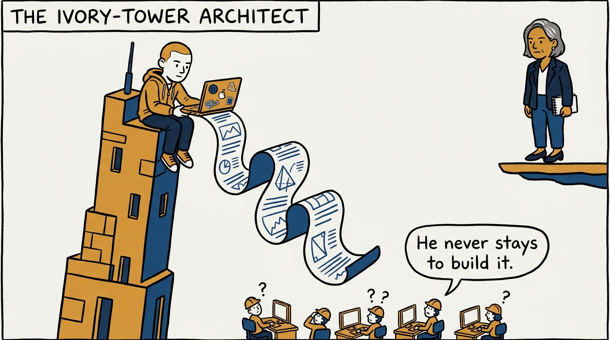
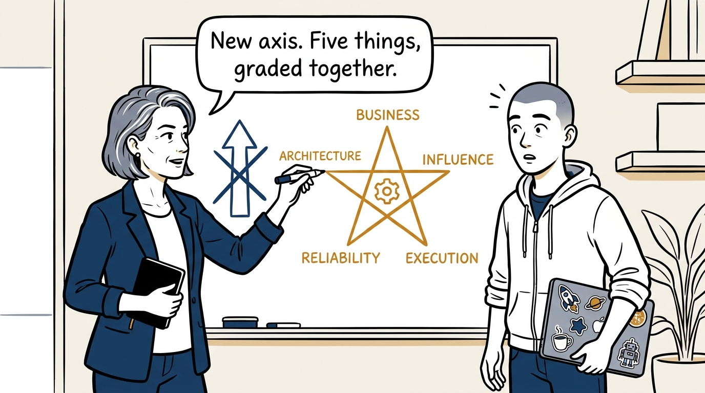
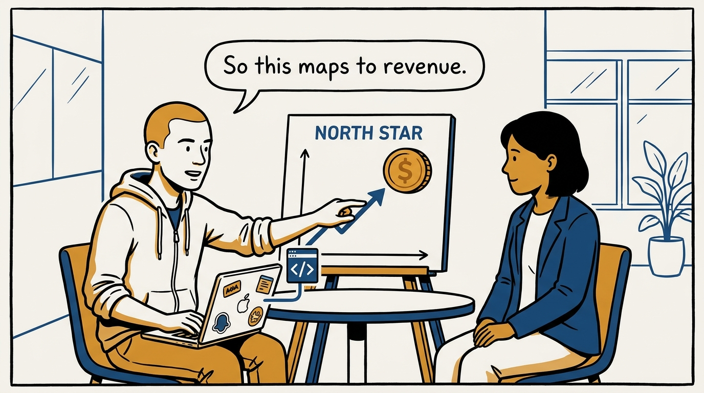
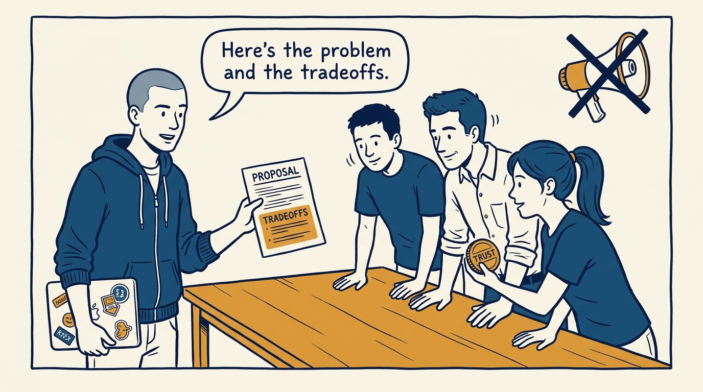
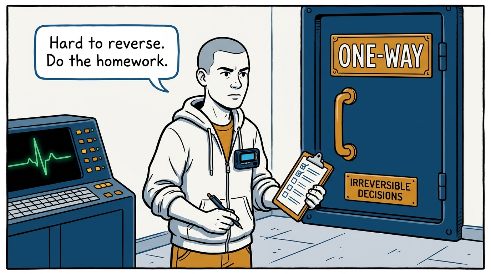
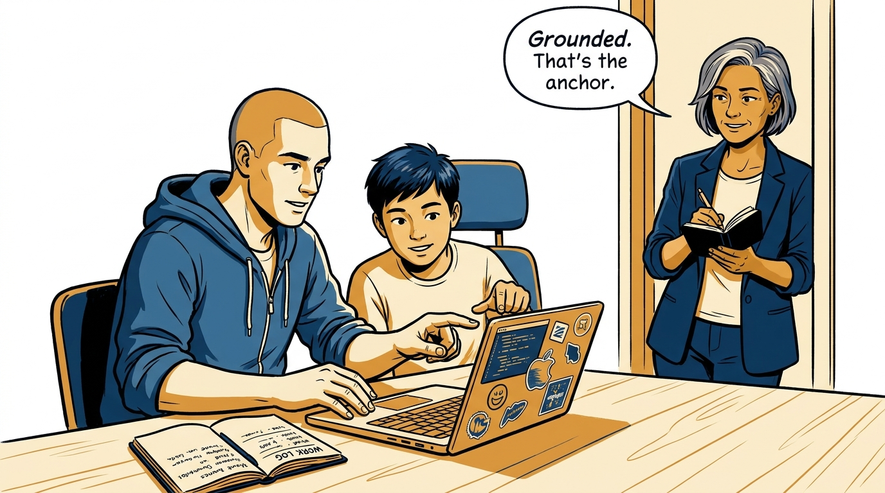

Why staff and principal is a change of axis, not a bigger senior role — in eight panels.

<!-- comic-style
{
  "cast": "VERA: a calm, seasoned engineering executive, short gray-streaked hair, dark blazer over a plain t-shirt, carries a small black notebook. ARLO: an eager early-career engineer climbing the ladder — in some strips a new lead or manager, in others the engineer being coached — buzz-cut hair, zip-up hoodie with rolled sleeves, sticker-covered laptop under one arm.",
  "style": "Clean two-tone explainer comic, thick ink outlines, flat colors with deep blue and amber accents on a light background, generous white space, hand-lettered speech bubbles with SHORT readable text, no photorealism."
}
-->

**Panel 1:** *The hook: the obvious route to staff — more senior work, done harder — is the wrong one.*

**Panel 2:** *The problem: the volume of personal output grows, but business understanding, influence, and cross-team scope stay untouched.*

**Panel 3:** *The wrong way: the ivory-tower architect — painfully precise, detached from the work, gone before implementation.*

**Panel 4:** *The principle: beyond senior, the grade changes axis — five dimensions together, anchored by staying hands-on.*

**Panel 5:** *How it runs: know the North Star, the customers, and the money — so technical judgment picks problems worth solving.*

**Panel 6:** *The mechanic: influence and execution across teams both run on trust capital — proposals with problem, options, tradeoffs — never bulldozed through a title.*

**Panel 7:** *The discipline: reliability owned end to end, and homework scaled to blast radius — two-way doors move fast, one-way doors do not.*

**Panel 8:** *The closer: stay hands-on enough that every decision is grounded in the actual work — the anchor that keeps all five dimensions honest.*
