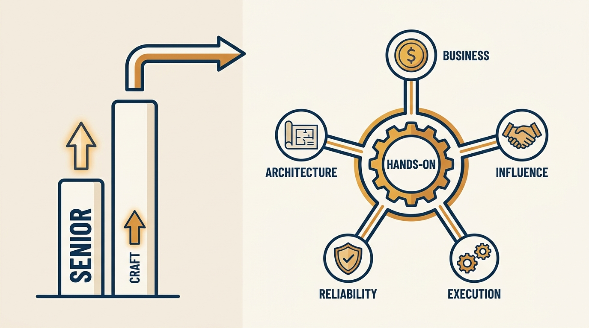
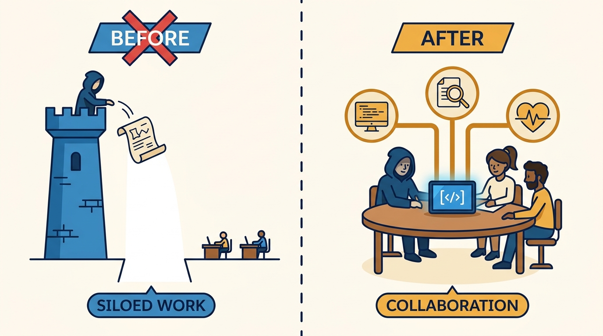
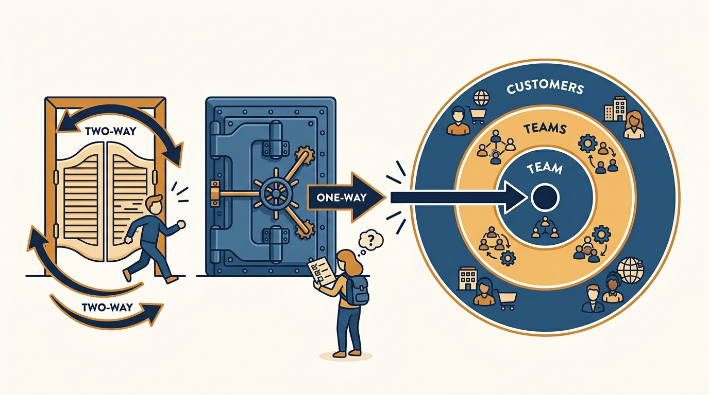

> **Status**: DRAFT
>
> **Principle**: Staff and principal is a change of axis, not a change of degree. A senior engineer is graded on the quality of their own work; a staff+ engineer on my teams is graded on five things together: whether they understand the business well enough to choose the right problems, whether they influence through earned trust rather than authority, whether they raise engineering execution across teams and not just their own output, whether they own reliability end to end, and whether their architecture judgment scales with the blast radius of their decisions. All five are anchored by one non-negotiable: staying hands-on enough that their decisions are grounded in the actual work.

## Statement

What I expect from staff and principal engineers, and what I coach senior engineers toward:

- **Know the role before playing it.** I expect a staff+ engineer to clarify what the title means here — scope, blast radius, and whether they operate at team, group, org, or company level — and to treat the role as a partnership with engineering managers, product managers, business stakeholders, and senior engineers, with responsibilities explicitly clarified so no one steps on anyone's toes.
- **Understand the business, not just the system.** North Star, KPIs, the OKRs the team supports, who the customers are and why they choose or churn, how the company makes money, and how their team's work maps to revenue, cost, reliability, or retention. I also expect them to question whether the right things are being measured and to add countermetrics where a target could cause harm.
- **Influence through trust, not authority.** Trust capital is built through credibility, reliability, authenticity, and low self-interest. I expect staff+ engineers to get good proposals accepted, push back on damaging initiatives, support teammates' good ideas, choose the best solution even when it is not their own — and to roll up their sleeves and help execute.
- **Raise execution across teams.** Keep coding — less than before, in focused high-impact bursts — and spend the freed capacity on what compounds: definitions of done, code review quality, CI/CD speed, trunk health and feature-flag hygiene, codebase structure, developer productivity tooling, and compliance, privacy, and security.
- **Own reliability end to end.** Logging, monitoring, alerting, healthy on-call, incident management run as a learning system, and resilience designed and tested — not delegated to "the ops side." I expect them to bring data to reliability conversations and advocate for engineering bandwidth when systems are unreliable.
- **Exercise architecture judgment scaled to blast radius.** Start with the simplest architecture that could work, classify decisions as one-way or two-way doors and spend homework accordingly, estimate how many teams and customers a decision affects, and build scalability the business roadmap justifies — not scalability for hypothetical needs.
- **Stay hands-on and make the work visible.** Enough connection to code, reviews, and operational reality to make practical decisions; a work log or regular written updates so the business impact of quiet work is seen; and deliberate sponsorship of engineers who are being overlooked.

## How to Read This

This journal is my engineering-management operating model. This record is grounded in the "Role-Model Staff and Principal Engineers" chapter material from Gergely Orosz's *The Software Engineer's Guidebook* (Pragmatic Engineer, 2023), **read from the manager's side**: the expectations I hold staff+ engineers to, and the shape I coach senior engineers toward. The runnable version — the full checklist I hand the engineer, covering role, business, influence, execution, reliability, and architecture — lives in the **Checklist** tab of this post.

## Rationale

**The jump beyond senior changes the axis, not the volume.** Every failed staff transition I have seen came from **doing more senior-engineer work harder**: more code, more reviews, more designs. The Guidebook's checklist makes the real change visible — the sections on business understanding, influence, and cross-team execution outnumber the sections on personal craft. A staff+ engineer's calendar splits across building software, strategy and alignment, collaboration, mentoring, and business understanding, and I coach people to **accept that split deliberately** rather than resent it.

**Figure 1:** *The change of axis: senior deepens one bar — craft; staff+ is five dimensions graded together, anchored by a hands-on core.*

**Business understanding is what makes technical judgment worth paying for.** A senior engineer can solve the problem in front of them; a staff+ engineer has to **choose which problems are worth solving**. That choice is impossible without knowing the North Star, the unit economics, the competitors, and whether the product is a profit center, a platform, or a strategic enabler. So I expect staff+ engineers to have 1:1s with product and business people, read the planning documents and — at a public company — the quarterly reports, and translate business goals into engineering goals the team understands. An engineer who cannot say how their work connects to revenue, cost, or risk is **operating at senior scope**, whatever their title says.

**Politics at this level is unavoidable; the only choice is whether it is constructive.** Staff+ decisions cross team boundaries, so **perception matters even when intent is good**. The failure modes are precise: appearing self-serving or credit-grabbing, bulldozing decisions through authority, or being "all talk, no action." The constructive alternative is trust capital — **earned by helping others succeed** rather than controlling decisions, spent by starting proposals with the problem, the preferred solution, the known unknowns, and the tradeoffs. I watch for both patterns and name them early.

**Hands-on connection is the anchor that keeps everything else honest.** The ivory-tower architect — painfully precise at the expense of progress, relying on theory without practical context, a walk-away advisor who never stays for implementation — is the canonical staff+ failure, and the Guidebook is blunt about it. The antidote is structural: **keep architecture close to where implementation happens**, stay involved in code and reviews and operational reality, and coach others to make better architectural decisions rather than becoming the bottleneck through which every decision must pass.

**Figure 2:** *The anchor: architecture stays close to where implementation happens — the ivory tower is the canonical staff+ failure mode.*

**Reliability and blast radius are where staff+ judgment compounds — or fails publicly.** A wrong library choice costs a sprint; a wrong database model, protocol choice, or major rewrite costs quarters, because two-way doors **quietly become one-way over time**. I therefore expect **decision discipline proportional to reversibility**, deliberate shrinking of blast radius through adapters, migrations, and gradual rollouts — and reliability owned as a first-class responsibility, including the uncomfortable case where infrastructure metrics look healthy while business metrics show failure.

**Figure 3:** *Decision discipline is proportional: two-way doors move fast, one-way doors earn homework — and the homework scales with the blast radius.*

## What This Means in Practice

| What this record says | What it does **not** say |
| --- | --- |
| Staff+ engineers are graded on five dimensions together. | Craft stops mattering — hands-on excellence remains the anchor, not the whole grade. |
| Business understanding is mandatory at this level. | Engineers become product managers — they translate business goals into engineering goals, not the reverse. |
| Influence is earned through trust capital and helping others succeed. | Staff+ engineers get decision authority — bulldozing through title is a named failure mode. |
| Keep coding, in focused, high-impact bursts. | Staff+ engineers code as much as before — they code less, and choose what for. |
| Reliability is owned end to end by the staff+ engineer. | They run on-call alone — they design the system: ownership, rotations, runbooks, postmortems. |
| Architecture homework scales with blast radius and reversibility. | Every decision deserves deep analysis — **reversible decisions should not be over-analyzed**. |
| Good-enough architecture that can evolve beats perfect architecture. | Quality is negotiable — the bar is **business-justified, not maximal**. |

Concretely: every staff+ engineer on my teams can state their scope and archetype, show how their current work **maps to a business metric**, point to a proposal they got accepted through **trust rather than title**, name the engineering process they improved this quarter, show the reliability posture of the systems they own, and defend their last hard-to-reverse decision in terms of blast radius and tradeoffs.

## Anti-Patterns

- **Senior-plus-plus.** Treating staff as "more senior work, faster" — more personal output, no change in business understanding, influence, or cross-team scope.
- **The ivory-tower architect.** Precise at the expense of progress, theory without practical context, jargon that excludes, endless philosophical debate — and a walk-away advisor who never stays for implementation.
- **Bulldozing through authority.** Using the title to force decisions instead of earning acceptance through problems, tradeoffs, and trust — influence spent is not influence earned.
- **All talk, no action.** Strategy documents and design opinions detached from delivery; no focused coding bursts, no unblocking of struggling projects, no rolled-up sleeves.
- **Scalability for hypothetical needs.** Building extensible, sharded, multi-region architecture the business roadmap does not justify, instead of good-enough architecture that can evolve.
- **The invisible staff engineer.** High-leverage glue work that no one sees because there is no work log, no written updates, and no communication of business impact — invisibility at this level is a planning failure, not modesty.
- **Metrics theater.** Watching infrastructure dashboards stay green while customers churn — owning system health without owning the business metrics that define health.

## Related Records

- [[well-rounded-senior-engineer]] — the senior bar this record builds beyond; staff+ starts where that record's expectations become table stakes.
- [[pragmatic-tech-lead]] — project leadership of one team; the staff+ role spans teams and pairs with tech leads rather than replacing them.
- [[engineering-career-paths]] — whether to pursue staff+ at all, and on which track; this record assumes the role and states its bar.
- [[promotions]] — how the evidence of staff-level work turns into a staff-level title; the work log and visibility habits here feed that case.
- [[operational-excellence]] — the operational bar behind the reliability dimension; this record assigns the ownership, that one details the standard.

## Scope and Revisiting

This record is `draft`. It governs the expectations I hold staff and principal engineers to and how I coach senior engineers toward the transition. I revisit it when our career ladder redefines staff+ scope or archetypes, when a staff+ engineer succeeds or fails in a way **the five dimensions do not explain**, or when AI-assisted development shifts how much hands-on connection is enough to keep decisions grounded.

## Authoritative References

- Gergely Orosz, *The Software Engineer's Guidebook* (Pragmatic Engineer, 2023) — the staff and principal engineer chapters this record distills, via the "Role-Model Staff and Principal Engineers" checklist.
