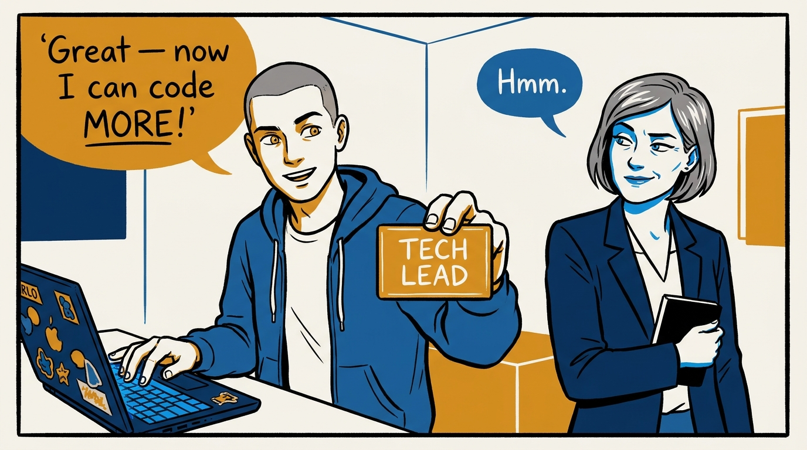
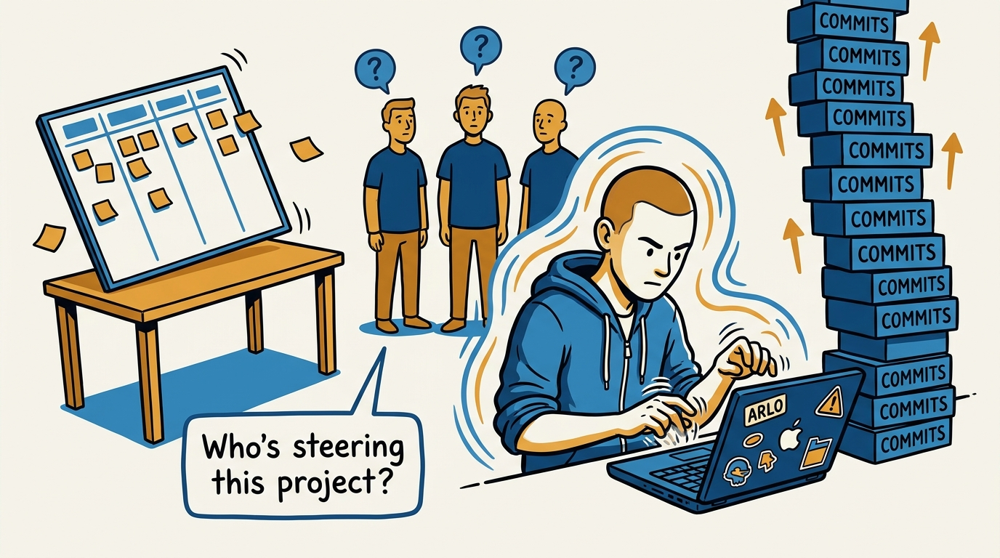
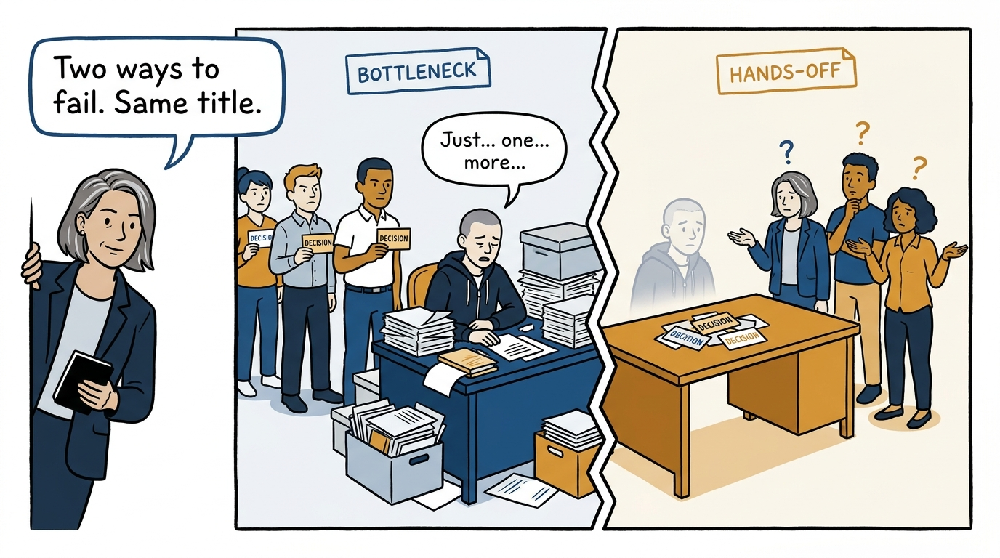
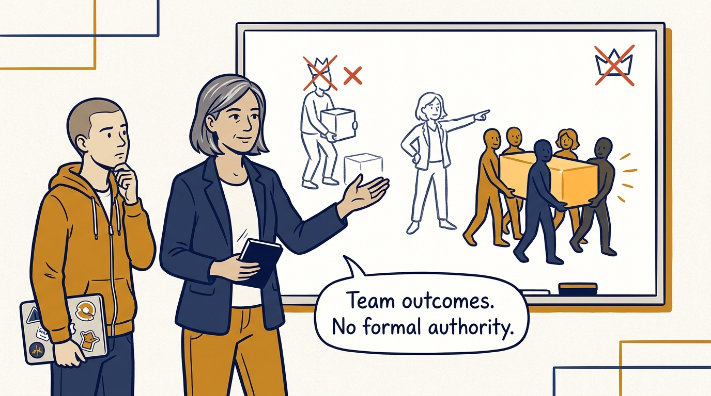
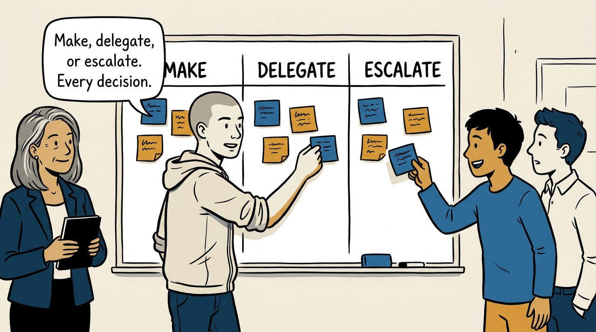
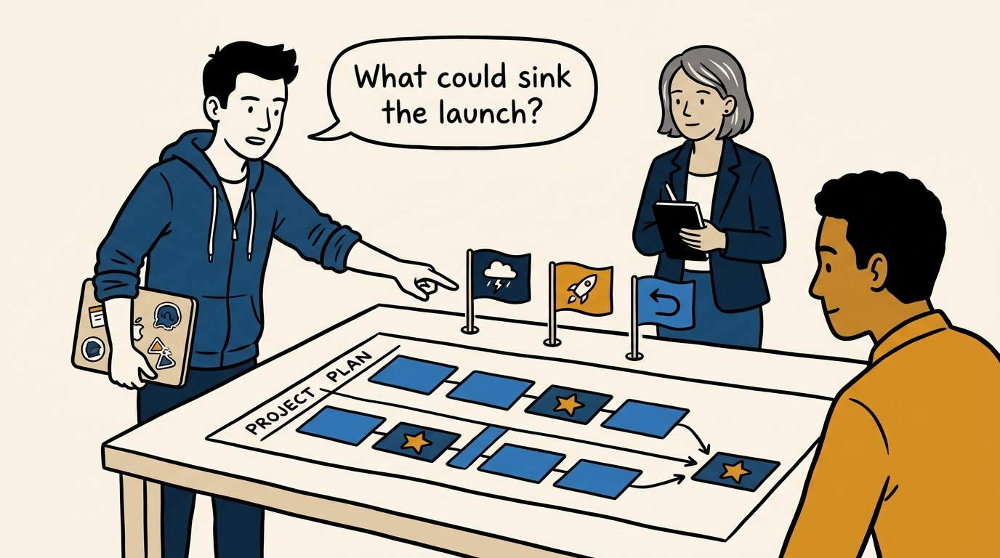
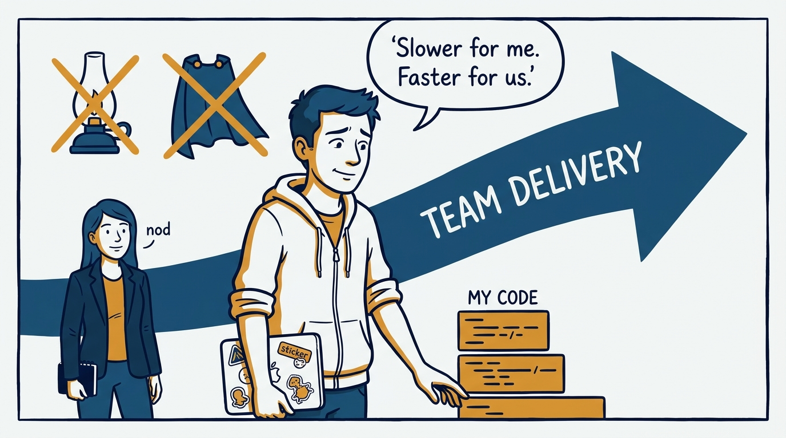
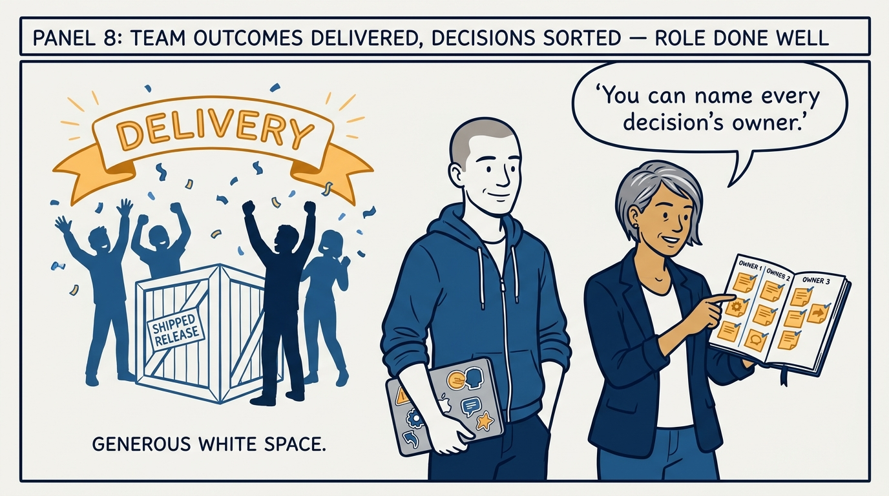

Why the tech lead is measured by team outcomes, not personal output — in eight panels.

<!-- comic-style
{
  "cast": "VERA: a calm, seasoned engineering executive, short gray-streaked hair, dark blazer over a plain t-shirt, carries a small black notebook. ARLO: an eager early-career engineer climbing the ladder — in some strips a new lead or manager, in others the engineer being coached — buzz-cut hair, zip-up hoodie with rolled sleeves, sticker-covered laptop under one arm.",
  "style": "Clean two-tone explainer comic, thick ink outlines, flat colors with deep blue and amber accents on a light background, generous white space, hand-lettered speech bubbles with SHORT readable text, no photorealism."
}
-->

**Panel 1:** *The hook: the title arrives — and the first instinct is to keep doing the old job, harder.*

**Panel 2:** *The problem: his output has never been higher — and the project has never been more adrift.*

**Panel 3:** *The wrong way, twice: own every decision and become the queue — or own none and leave the team leaderless.*

**Panel 4:** *The principle: the job stops being 'write code' and becomes 'help the team deliver' — held on influence, not authority.*

**Panel 5:** *How it runs: every technical decision gets sorted — made where his knowledge is load-bearing, delegated to grow people, escalated when above the project.*

**Panel 6:** *The mechanic: convert ambiguity into sequence — critical path marked, premortem before, launch plan during, rollback plan in case.*

**Panel 7:** *The cost: slower personal technical progress and no heroic saves — sustainable team leverage is the trade.*

**Panel 8:** *The closer: the team ships, and the tech lead can say without preparation which decisions they made, delegated, and escalated — that is leading.*
