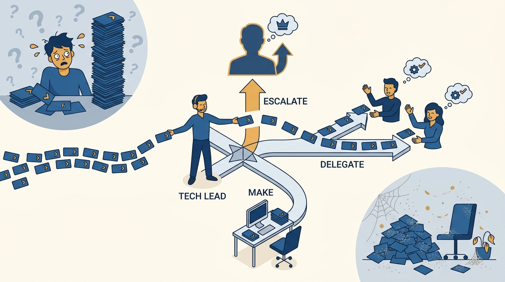
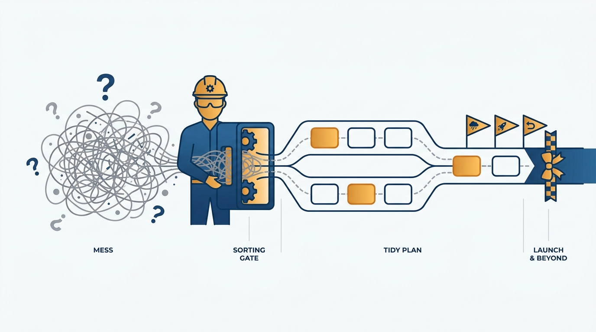

> **Status**: DRAFT
>
> **Principle**: The tech lead is the first role where the job stops being "write code" and becomes "help the team deliver" — and it is held without formal authority, on influence alone. I expect a tech lead to balance technical work with leadership, communication, and planning; to sort every technical decision into make, delegate, or escalate; to push projects through ambiguity with real plans, premortems, and rollback plans rather than waiting for certainty; and to protect the team's focus while representing it clearly outward. A tech lead is measured by team outcomes, not personal output — and the two ways to fail are symmetric: becoming the bottleneck every decision waits on, or becoming so hands-off that nobody is leading at all.

## Statement

My operating model for the tech lead role has six parts:

- **The job is team delivery, not personal output.** A tech lead balances technical work with leadership, communication, and project planning, focuses on team outcomes, influences without formal authority, and knows when to step in directly and when to delegate. Holding the rung is also how an engineer finds out, honestly, whether they want to stay on the technical track, grow as a tech lead, or move into management.
- **Technical decisions are sorted, not hoarded.** The tech lead understands the architecture well enough to confidently lead changes, knows the critical systems, dependencies, and risks, gathers input from the team before major decisions, and explicitly sorts each decision into make, delegate, or escalate.
- **Planning is pushed through ambiguity, not avoided.** Large projects get broken into deliverables and tasks; parallel work is separated from sequential; critical items from optional ones. The plan reduces uncertainty rather than pretending it away, gets revisited as new information appears, and delivery is prepared with a premortem, a launch plan, and a rollback plan. Status, risks, and tradeoffs are communicated early.
- **The team is grown, not mined.** The tech lead helps teammates unblock themselves instead of hoarding the interesting work, delegates in ways that grow people, mentors without being anyone's manager, keeps the team focused on what matters most, and avoids heroics that hide problems instead of solving them.
- **The team's attention is defended and represented.** Focus time is protected from unnecessary meetings and interruptions; stakeholders are helped to respect deep work; obstacles are removed; sustainable productivity beats constant urgency. Outward, the tech lead represents the team clearly, translates technical issues into language others understand, and raises concerns early instead of waiting for a crisis.
- **Process is a tool, never a substitute for judgment.** There is no one perfect process; the tech lead adapts process to the team and the work, optimizes for people and interactions over rules and tools, and looks for self-regulating systems instead of policing people.

## How to Read This

This journal is my engineering-management operating model, one record per source checklist. This record is grounded in the "Tech Lead" chapter of Camille Fournier's *The Manager's Path* (O'Reilly, 2017) — the rung where an engineer first **trades some coding time for the responsibility** of getting a whole project delivered. I write it as the executive who appoints tech leads and holds them to these expectations; the engineer-side view of the same role, from Gergely Orosz's *Software Engineer's Guidebook*, lives in [[pragmatic-tech-lead]]. The runnable version — role and mindset, technical leadership, planning, project management, team duties, communication, process judgment, and the reflection questions — lives in the **Checklist** tab of this post.

## Rationale

**The mindset shift is the hard part, and it is non-negotiable.** Every failing tech lead I have seen was failing at the same thing: still optimizing for their own output while the project drifted. Fournier's chapter opens with exactly this — the job is not to write the most code, **it is to help the team deliver**. Accepting that means accepting slower personal technical progress in exchange for team leverage, and accepting that planning, communication, and coordination are now **first-class work, not interruptions** to the real work.

**Figure 1:** *The rung's one non-negotiable shift: the job stops being maximizing your own output and becomes multiplying the team's.*

**Make, delegate, or escalate is the discipline that prevents both failure modes.** The bottleneck tech lead makes every decision and becomes **the queue the whole team waits in**; the hands-off tech lead makes none and leaves the team leaderless while holding the title. Explicitly sorting decisions breaks both patterns: the tech lead personally makes the decisions where their architectural knowledge is genuinely load-bearing, delegates the ones that grow teammates, and escalates the ones above the project's pay grade — and gathers team input before the major ones, because influence without authority runs on being trusted, and **trust runs on being consulted**.

**Figure 2:** *Every technical decision gets sorted — make, delegate, or escalate — which is exactly what the bottleneck and the absentee both fail to do.*

**Planning is the work of converting ambiguity into sequence, and avoiding it is abdication.** Engineers promoted for technical excellence often treat project planning as beneath them or as someone else's job. Fournier's counter is that the tech lead is precisely the person who can see which tasks are critical versus optional, which can run in parallel versus in sequence — and that this structure is what estimates, prioritization, and honest status all hang from. The plan is not a pretense of certainty; it is **the tool for shrinking uncertainty**, revised as reality reports in. And delivery is planned like part of the project, because it is: **premortem before, launch plan during, rollback plan in case**.

**Figure 3:** *The plan is not a pretense of certainty — it is the machine that turns ambiguity into sequence, with delivery planned as part of the project.*

**Heroics are a debt instrument, and the tech lead is positioned to refuse them.** The all-nighter that saves the launch **hides the planning failure that caused it**, sets an unsustainable bar for the team, and guarantees the same crisis next quarter. I expect tech leads to prioritize sustainable productivity over constant urgency, to raise concerns early — when they are cheap to address — rather than performing rescues later, and to protect the team's focus time so that deep work does not have to happen at midnight.

**Process is judgment's tool, and self-regulating beats policed.** A tech lead reaching for a heavier process to fix a leadership gap is treating the symptom. There is no perfect process; there is a team, its work, and whatever structure genuinely helps them coordinate. The best structures are self-regulating — visible boards, working agreements, automated checks — because a process that requires the tech lead to police it **consumes the exact leadership attention it was meant to save**.

## What This Means in Practice

| What this record says | What it does **not** say |
| --- | --- |
| The tech lead is measured by team outcomes. | Personal technical output stops mattering — the role still writes code, just not at the old volume. |
| Decisions are sorted into make, delegate, or escalate. | The tech lead decides everything — **that is the bottleneck failure, not leadership**. |
| The tech lead plans, estimates, and sequences the project. | The tech lead becomes a full-time project manager who no longer touches the system. |
| Influence runs without formal authority. | The tech lead is the team's boss — performance management stays with the manager. |
| Focus time is protected and meeting load is watched. | The tech lead shields the team from all context — **outward representation is half the job**. |
| Process is adapted to the team and the work. | Some process framework, applied hard enough, will substitute for judgment. |

Concretely: every project with a tech lead in my organization has **a visible plan with critical-path items marked**, a premortem and rollback plan before launch, and a tech lead who can tell me — without preparation — which decisions they are making, which they have delegated, and which they are escalating. And both the tech lead and their manager can state what each expects from the role, because misaligned expectations are **the quietest way this rung fails**.

## Anti-Patterns

- **The bottleneck.** Every technical decision routes through one person; the team's throughput becomes one person's review queue.
- **The absentee architect.** Fully hands-off "empowerment" — no decisions made, no plan owned, a title with nobody behind it.
- **The code-hoarding lead.** Keeping the interesting work and delegating the drudgery, which burns trust and stunts the team in one move.
- **Planning avoidance.** Treating ambiguity as a reason not to plan, rather than the reason planning exists — then discovering the critical path in the last month.
- **The heroic save.** All-nighters and personal rescues that hide systemic problems, set unsustainable norms, and schedule the next crisis.
- **Process as leadership substitute.** Adopting a heavier framework to avoid making judgment calls, then policing compliance instead of leading.
- **Status silence.** Sitting on risks and slippage until they become a crisis, instead of communicating tradeoffs while options still exist.

## Related Records

- [[pragmatic-tech-lead]] — the engineer-side view of the same role from Gergely Orosz's *Software Engineer's Guidebook*; this record defines the rung, that one is the practitioner's playbook on it.
- [[mentoring]] — the previous rung; the tech lead keeps mentoring, now for a whole team rather than one person.
- [[management-101]] — the manager–report contract the tech lead operates alongside but does not own: guidance yes, performance management no.
- [[managing-a-team]] — the next rung, where formal authority and people responsibility arrive and this role's influence-only constraint lifts.

## Scope and Revisiting

This record is `draft`. It governs what I expect of anyone holding a tech lead role in my organization, how managers set expectations with their tech leads, and the honest conversation about whether a person wants to grow on the technical track, as a tech lead, or into management. I revisit it if projects with named tech leads keep missing because nobody owned the plan (**the role is decorative**), if tech leads keep burning out or reverting to pure coding (the balance is miscalibrated), or if tech leads and their managers give conflicting answers about what the role requires.

## Authoritative References

- Camille Fournier, *The Manager's Path: A Guide for Tech Leaders Navigating Growth and Change* (O'Reilly, 2017) — Chapter 3, "Tech Lead", whose checklist this record distills.
