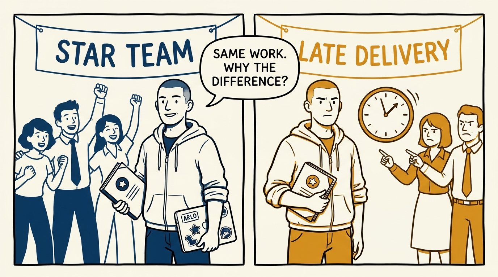
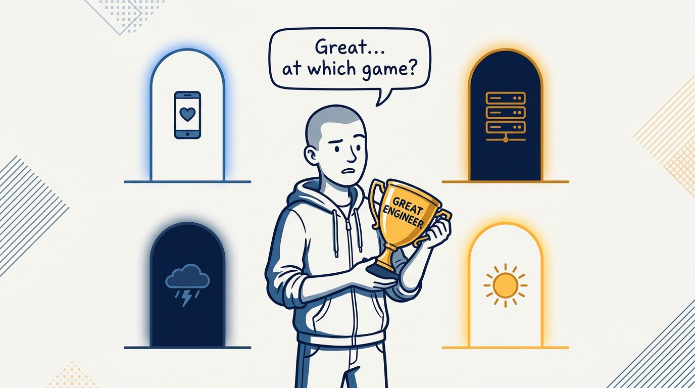
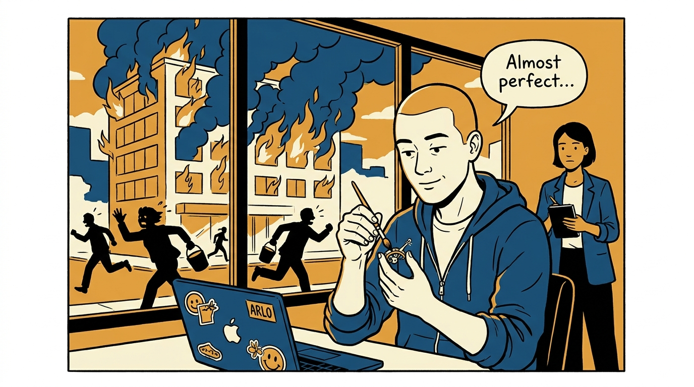
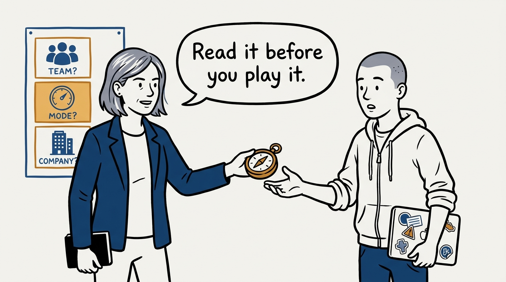
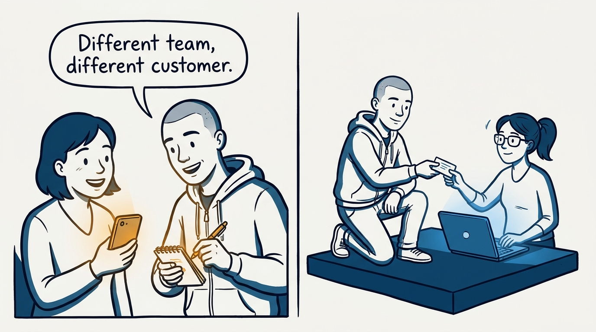
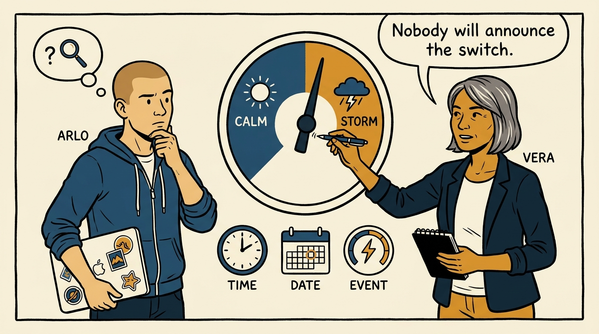
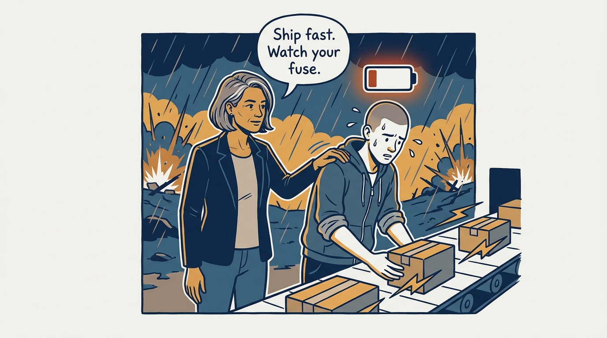
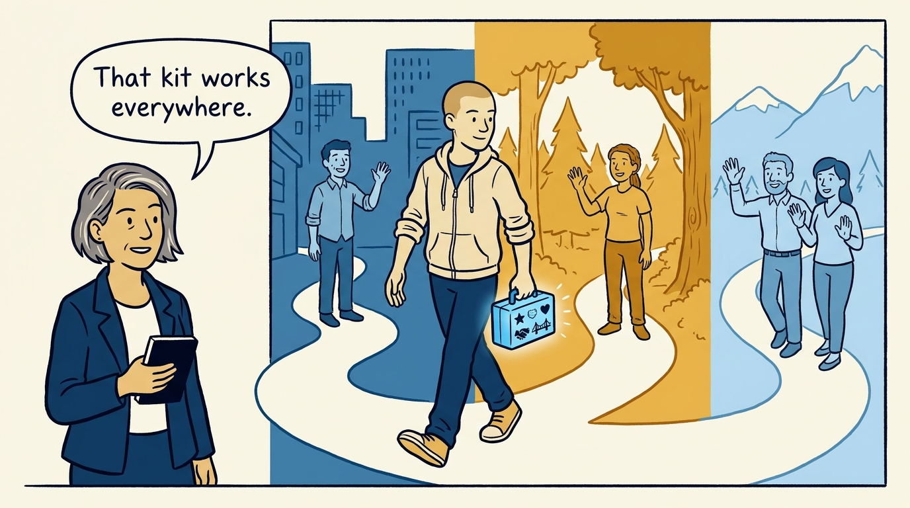

Why there is no context-free "great engineer" — and how to read the environment you're in — in eight panels.

<!-- comic-style
{
  "cast": "VERA: a calm, seasoned engineering executive, short gray-streaked hair, dark blazer over a plain t-shirt, carries a small black notebook. ARLO: an eager early-career engineer climbing the ladder — in some strips a new lead or manager, in others the engineer being coached — buzz-cut hair, zip-up hoodie with rolled sleeves, sticker-covered laptop under one arm.",
  "style": "Clean two-tone explainer comic, thick ink outlines, flat colors with deep blue and amber accents on a light background, generous white space, hand-lettered speech bubbles with SHORT readable text, no photorealism."
}
-->

**Panel 1:** *The hook: the same behavior earns applause in one environment and a frown in another.*

**Panel 2:** *The problem: there is no context-free 'great engineer' — each environment defines standout work differently.*

**Panel 3:** *The wrong way: playing the previous game — polishing in wartime, or bulldozing in peace — after a silent mode change.*

**Panel 4:** *The principle: reading the environment — team type, company mode, company type — is a core engineering skill.*

**Panel 5:** *How it runs: on a product team the customer is an end user; on a platform team the customer is another engineer.*

**Panel 6:** *The mechanic: diagnose the mode from the instruments — deadlines, meetings, conflict tolerance — because the transition is silent.*

**Panel 7:** *The cost: wartime pace is real and so is the burn — manage stress actively and treat stability as uncertain.*

**Panel 8:** *The closer: environments are temporary — standout work, helping others, kept relationships, and unburned bridges pay everywhere.*
