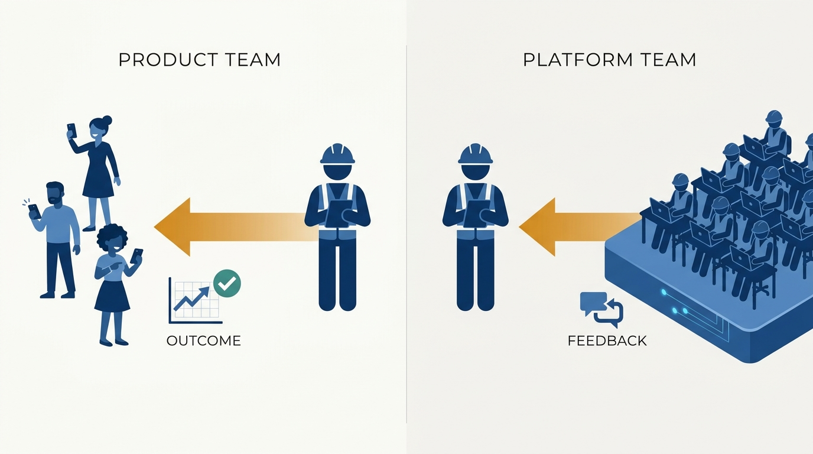
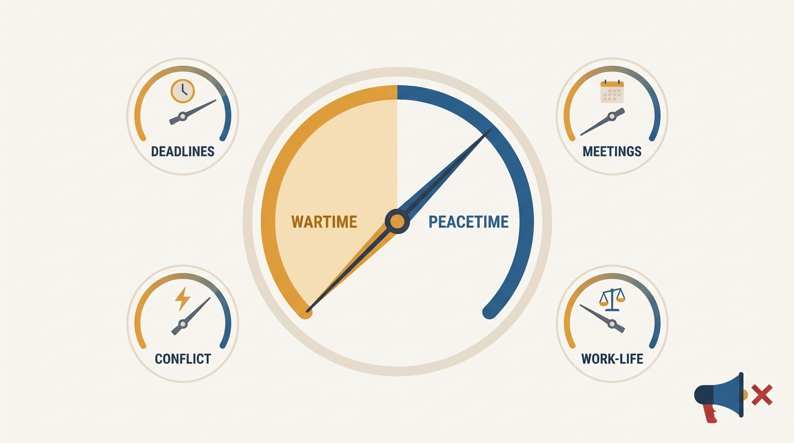
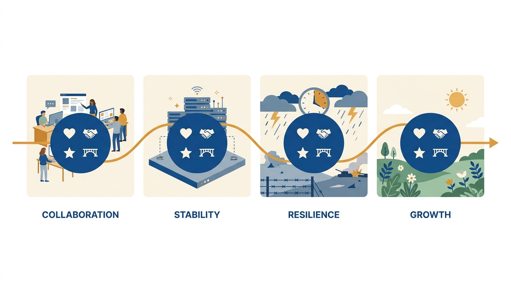

> **Status**: DRAFT
>
> **Principle**: There is no context-free "great engineer." A product team, a platform team, a company at war, a company at peace, Big Tech, a scaleup, and a startup each define standout work differently — and the exact behavior that earns a promotion in one environment stalls a career in another. So I treat reading the environment as a core engineering skill, on par with technical skill: I expect engineers to identify their team type, recognize the company's mode, know what kind of company they are at, and adjust — while holding the universal set that works everywhere: know what the company values, do standout work by its standards, help others succeed, and never burn bridges.

## Statement

What I expect engineers to read, and how I expect them to adapt:

- **Know your team type and play it.** On a product team: understand the user problem, talk regularly with PMs, designers, and users, suggest improvements rather than just implementing specs, think through edge cases, and validate whether a feature actually worked after launch — building product intuition from outcomes. On a platform team: know who your customers are — usually other engineers — make feedback easy, communicate proactively with teams building on the platform, and spend time with product teams to understand downstream impact.
- **Recognize the company's mode.** Wartime looks like existential pressure, mandatory deadlines, fewer meetings, tolerated conflict, bypassed process, and weak work-life balance. Peacetime looks like low immediate pressure, quality over speed, alignment meetings, discouraged conflict, and visible work-life priority. I expect engineers to diagnose the mode before judging the behavior around them.
- **Adjust behavior to the mode.** In wartime: ship the important things fast, accept good-enough, don't take blunt feedback personally, stay aligned with the leadership chain, treat job stability as uncertain, and manage stress actively. In peacetime: execute at high quality, build alliances across teams, manage in every direction, invest in longer-term initiatives — and avoid getting comfortable or bored.
- **Play the company type you are actually at.** Big Tech rewards tracked individual impact, evidence kept for reviews, and relationships across the organization. A scaleup rewards applied tenure — company knowledge turned into impact — plus awareness of whether your team is a cost or profit center, and alertness during slowing growth. A startup rewards work that moves the company toward product-market fit, autonomy used to take initiative, and making sure founders see impactful work.
- **Hold the universal set everywhere.** Know what the company values most; adapt your working style to the current environment; do standout work by the company's standards; help people around you succeed; maintain relationships with peers and former colleagues; resolve conflict professionally; avoid burning bridges.
- **Reassess, because environments shift.** Companies change modes and phases without announcements. I expect engineers to regularly re-check whether the environment has shifted — and to adapt when it has, rather than keep playing the previous game.

## How to Read This

This journal is my engineering-management operating model. This record is grounded in the Thriving in Different Environments chapter of Gergely Orosz's *The Software Engineer's Guidebook* (2023), read from the manager's side of the table: the book tells engineers how to read and adapt to their environment; this record states why I treat that reading as a coachable, expected skill — and how I use it to explain why expectations differ across teams and company phases. The runnable version — the checklist I hand an engineer landing in a new team, or watching their company change around them — lives in the **Checklist** tab of this post.

## Rationale

**Most "underperformance" I've seen was a context mismatch, not a skill gap.** The careful engineer who polishes in wartime reads as slow; the fast-shipping pragmatist in peacetime reads as sloppy; the platform engineer who goes heads-down for a quarter without talking to customers reads as absent. In each case the skills were fine — the behavior was tuned to a different environment. That is why I coach environment-reading explicitly instead of letting engineers discover the local rules through failed review cycles.

**Product and platform teams reward different instincts, and engineers switch between them blind.** A product engineer's standout move is judgment about users: suggesting improvements, thinking through edge cases, validating outcomes after launch. A platform engineer's standout move is customer empathy pointed inward: knowing who builds on the platform, making feedback easy, understanding downstream impact. An engineer moving between the two while keeping the same habits will do honest work that lands as mediocre — so the first question I ask anyone joining a team is which type of team they think they've joined.

**Figure 1:** *Same engineer, different instincts: product teams reward judgment about users; platform teams reward customer empathy pointed inward.*

**Wartime and peacetime invert the scoreboard, and the transition is silent.** In wartime, bypassed process and blunt conflict are features; in peacetime the same behavior is a liability. The danger is the transition: companies rarely announce the mode change, and engineers keep optimizing for the previous game — polishing during a fight for survival, or bulldozing through process long after peace returned. The source's recognition signs (deadlines, meetings, conflict tolerance, work-life posture) are precisely the instruments I point engineers at — and in wartime I add its warning explicitly: manage stress and burnout actively, and treat job stability as uncertain.

**Figure 2:** *The mode is read off instruments, not announcements: deadlines, meetings, conflict tolerance, and work-life posture tell you which game the company is playing.*

**Company type sets who must see your work.** In Big Tech, the system sees you: reviews and promotion committees run on tracked evidence and relationships across a big organization. At a scaleup, your accumulated knowledge is the asset — tenure pays only when it's converted into impact and shared through onboarding and documentation. At a startup, only outcomes matter, and it is on you to find the high-impact work by talking to founders and customers — and to make sure the people steering the company know what landed. Same engineer, three different visibility games; I coach whichever one my company is currently playing.

**The universal set is what survives every environment — and it's mostly about other people.** Under all the contingency, the source ends on invariants: know what the company values, do standout work by its standards, help others succeed, keep relationships alive, resolve conflict professionally, never burn bridges. Careers are long and environments are temporary; the colleagues you helped and the bridges you kept follow you across every team type, mode, and company. That is the part I hold engineers to unconditionally.

**Figure 3:** *Environments are temporary; the universal set travels: standout work by local standards, helping others, kept relationships, and no burned bridges.*

## What This Means in Practice

| What this record says | What it does **not** say |
| --- | --- |
| Read the environment — team type, mode, company type — before optimizing behavior. | Environments excuse everything — the universal set holds everywhere, in every mode. |
| In wartime, ship fast, accept good-enough, and don't take bluntness personally. | Wartime is permanent or free — it burns people, so stress is managed and options stay open. |
| In peacetime, invest in quality, alliances, and longer-term initiatives. | Peacetime means coasting — comfort and boredom are named failure modes. |
| Adapt your working style when the company shifts modes or phases. | Chameleon opportunism — adapting style is not abandoning standards or integrity. |
| Different company types reward different visibility games — play the one you're in. | Visibility replaces substance — the work must be standout by the company's own standards. |
| Help others succeed and keep every bridge intact. | Nice-to-have — it is the invariant that pays across every environment for decades. |

Concretely: an engineer joining one of my teams hears, in their first weeks, what type of team this is, what mode the company is in, and what standout work looks like here specifically — and when the environment shifts, we name the shift in 1:1s and adjust expectations explicitly, instead of letting people fail against rules that changed silently.

## Anti-Patterns

- **Judging behavior without reading context.** Calling the wartime pragmatist sloppy or the peacetime quality-investor slow, when each is playing their environment correctly.
- **Playing the previous game.** Keeping peacetime habits after the company has gone to war — or wartime habits long after peace — because nobody announced the mode change.
- **The heads-down platform team.** Building a platform for a quarter without talking to the engineers who use it, then discovering the downstream impact was imaginary.
- **Spec-implementing on a product team.** Shipping exactly what was written, never suggesting improvements or validating outcomes — honest work that never becomes standout.
- **Startup work nobody steering the company sees.** Creating real value at a startup while founders remain unaware — at that company type, unseen impact effectively didn't happen.
- **Wartime heroics without a fuse.** Running wartime pace indefinitely without managing stress and burnout, or noticing that job stability is uncertain either way.
- **Comfortable peacetime drift.** Using stability to stagnate — no longer-term initiatives, no new alliances, just maintenance until boredom curdles into disengagement.
- **Burning bridges on exit or in conflict.** Winning a local fight at the cost of relationships that would have paid across the next twenty years of the same industry.

## Related Records

- [[engineering-career-paths]] — choosing and evaluating environments; this record is thriving inside the one you're in.
- [[changing-jobs]] — when engineer and environment are truly mismatched, the move — done well — is the answer.
- [[own-your-career]] — the ownership contract; reading the environment is part of owning the career.
- [[promotions]] — the promotion case is always judged by an environment's standards; this record explains why those standards differ.
- [[managing-downturn]] — the manager's-side companion for the hardest wartime: leading a team through a downturn.

## Scope and Revisiting

This record is `draft`. It governs how I set expectations across different teams and company phases, and how I coach engineers to read team type, company mode, and company type — while holding the universal set everywhere. I revisit it when the company visibly changes mode or growth phase (the expectations conversation must be rerun, not assumed), when a strong engineer's work stops landing after a team change — the signal of a context mismatch, not a skill loss — or if I catch myself judging behavior without first naming the environment it was tuned for.

## Authoritative References

- Gergely Orosz, *The Software Engineer's Guidebook* (2023) — the Thriving in Different Environments chapter this record distills, via its companion checklist.
